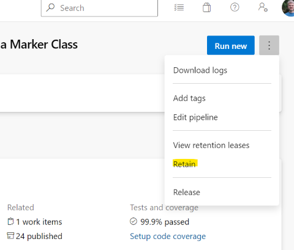

# WinUI 3 Release Processes

This document describes steps that WinUI3 takes as part of the general WinAppSDK release process. 

## Table of Contents

- [Preparing for a release](#preparing-for-a-release)
- [Testing a release](#testing-a-release)
- [Completing a release](#completing-a-release)
  - [Tag and retain the build pipeline](#tag-and-retain-the-build-pipeline)
  - [Tag the final commit](#tag-the-final-commit)
  - [Release source code to the public](#release-source-code-to-the-public)

## Preparing for a release

Create a release branch for all releases except for servicing.
For example, experimental1, preview1, preview2, stable are branches.
But the stable branch (such as `release/1.0-stable`) is used for 1.0.1, 1.0.2, etc.

Release branches are named "release/[version]-[channel][count]".
Examples:
* `release/1.0-experimental1`
* `release/1.0-preview1`
* `release/1.0-preview2`
* `release/1.0-stable`

After calculating the name,
create the branch (see documentation for branch creation steps).

Tag the commit at the base of the branch (the commit that's in `main`) with a ".start" tag,
for example `release/1.0-preview2.start`.
This makes it easer to look at the repo history and understand the structure.

## Testing a release

We have a lot of automated testing, but not everything is automated yet, and so gets manually validated.
For WinUI this is done using Visual Studio (for app building) and WinUI Gallery (ad hoc user testing).

WinUI Gallery lives in the xaml-lift repo and builds by default using the WinUI bits that are built there.
But for validation we build it against the actual WinAppSDK bits instead.
See [here](../building/building-sample-apps.md) for instructions on how to build XCG against WinAppSDK bits.

For non-experimental builds (preview and stable) we also run the `WinUI-Nightly` pipeline,
even though it's the `WinUI-Xaml-Release` pipeline that builds the bits which are pushed up to WinAppSDK and shipped.
That's because the Nightly pipeline runs additional tests (those that require UWP) that aren't currently run by Release.

## Completing a release

After the WinAppSDK is released ...

### Tag and retain the build pipeline

The final build pipeline must be *explicitly* retained or it will be automatically deleted.

> Builds say they're retained by the branch, but my understanding is that they're not
*actually* retained forever. You need to explicitly retain it.

Retain the build using the more-actions menu:

### Tag the final commit

Tag the final commit similar to the branch name.
(Tagging isn't required, but helpful when looking at branch  histories.)
Put a '.final' on the end of the tag name so as to avoid conflict with the branch name.

For example:
* release/1.0-experimental1.final
* release/1.0.0.final
* release/1.0.1.final

Tag the _pipeline_ too, using the same menu as is used to retain the build, using the full name (including patch).
For example `release/1.0.0`.

### Release source code to the public

Refer to the document  for information on how to release WinUI 3's source code to the public.
