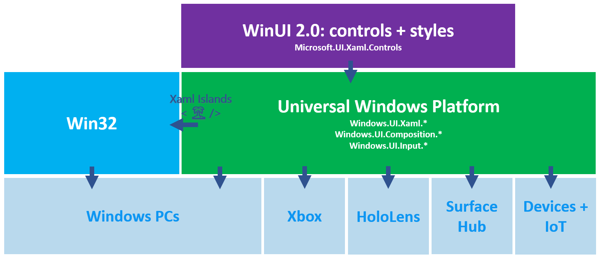
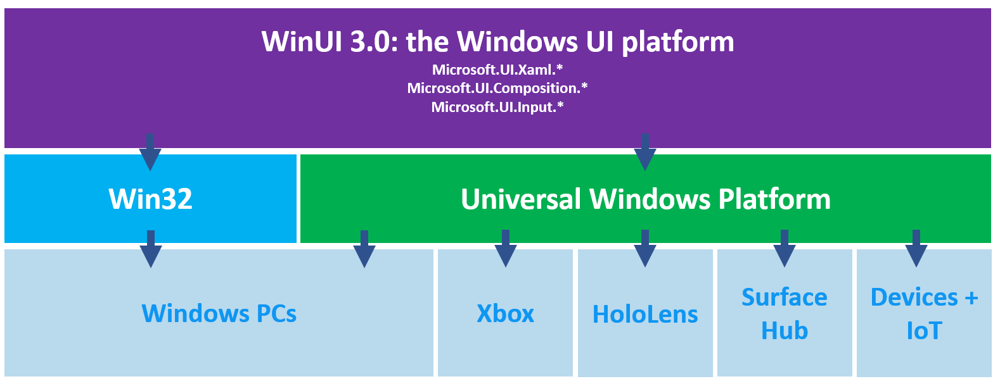

# Windows UI Library Roadmap

WinUI is the native UI platform for Windows 10. This document outlines the prospective roadmap for WinUI through 2019 and into 2020. WinUI is under active development by the Microsoft developer platform team and the roadmap will continue to evolve based on market changes and customer feedback, so please note that the plans outlined here aren't exhaustive or guaranteed. We're also [working with the Uno platform](https://platform.uno/WinUI-on-Windows7-via-UnoPlatform/) so that developers can bring their WinUI code anywhere WebAssembly runs – including Windows 7. We welcome your feedback on the roadmap: please feel free to contribute to existing issues or [file a new issue](https://github.com/microsoft/microsoft-ui-xaml/issues).

The WinUI team has two major efforts underway:

1. **WinUI 2**: new and updated controls and features for UWP apps

2. **WinUI 3**: a major update to the Windows 10 UI platform

## WinUI 2

The next release of WinUI 2 will be **WinUI 2.4**, ETA Q1 2020.

2.4 will be an incremental release that includes new WinUI Xaml features and fixes for UWP apps on Windows 10. You can find a list of currently planned work in the [WinUI 2.3 milestone](https://github.com/microsoft/microsoft-ui-xaml/milestone/8).

For installation instructions see [Getting started with the Windows UI Library](https://docs.microsoft.com/uwp/toolkits/winui/getting-started).

Conceptual overview of WinUI 2 for UWP apps:

WinUI 2 will eventually be superseded by WinUI 3. WinUI 3 will include all the controls and features in WinUI 2.

## WinUI 3

**WinUI 3** will greatly expand the scope of WinUI to include the full Windows 10 native UI platform, which will now be fully decoupled from the UWP SDK.

We're focused on enabling three main use cases:

1. **Modernizing existing Win32 apps**
    * Enabling you to extend existing Win32 (WPF, WinForms, MFC..) apps with modern Windows 10 UI at your own pace using the upcoming latest version of [Xaml Islands](https://docs.microsoft.com/windows/apps/desktop/modernize/xaml-islands)
2. **Creating new Windows apps**
    * Enabling you to easily create new modern Windows apps "à la carte" with your choice of app model (Win32 or UWP) and language (.NET Core or C++)
3. **Enabling other frameworks**
    * Providing the native implementation for other frameworks like [React Native](https://github.com/Microsoft/react-native-windows) when running on Windows

You can download an early build of WinUI 3.0 Alpha to try out - we'd love feedback on it, although please note it's a very early build with lots of missing features. For installation info and known issues see:

[WinUI 3.0 Alpha (November 2019)](https://docs.microsoft.com/uwp/toolkits/winui3/)

Conceptual overview of WinUI 3:

> You can watch the Build 2019 conference session *State of the Union: The Windows Presentation Platform* for more details:
https://mybuild.techcommunity.microsoft.com/sessions/77008

The existing UWP Xaml APIs that ship as part of the OS will no longer receive new feature updates. They will still receive security updates and critical fixes according to the Windows 10 support lifecycle.

The Universal Windows Platform contains more than just the Xaml framework (e.g. application and security model, media pipeline, Xbox and Windows 10 shell integrations, broad device support) and will continue to evolve. All new Xaml features will just be developed and ship as part of WinUI instead.

### Benefits of WinUI 3

WinUI 3 will provide a number of benefits compared to the current UWP Xaml framework, WPF, WinForms and MFC which will make WinUI the best way to create Windows app UI:

1. **The native UI platform of Windows**  
WinUI is the highly-optimized native UI platform used to create Windows itself, now made more broadly available for all developers to use to reach Windows. It's a thoroughly tested and proven UI platform that powers the operating system environment and essential experiences of 800+ million Windows 10 PC, XBox One, HoloLens, Surface Hub and other devices.

2. **The latest Fluent Design**  
WinUI is Microsoft's main focus for native, accessible Windows UI and controls and is the definitive source for the [Fluent Design System](https://www.microsoft.com/design/fluent/) on Windows.  
It will also support the latest lower-level composition and rendering innovations like vector animations, effects, shadows and lighting.

3. **Easier "à la carte" desktop development**  
WinUI 3 will let you more easily mix and match the right combination of:
    * **Language**: C# (.NET), C++
    * **App model**: UWP, Win32
    * **Packaging**: [MSIX](https://docs.microsoft.com/windows/msix/), AppX for the Microsoft Store, unpackaged  
    * **Interop**: use WinUI 3 to extend existing WPF, WinForms and MFC apps with modern Fluent UI

4. **Backward compatibility for new features**  
New WinUI features will continue to be backward-compatible with a wide range of Windows versions: you can start building and shipping apps with new features immediately as soon as they're released, without having to wait for your users to update Windows.

5. **Native development support**  
WinUI can be used with .NET, but doesn't depend on .NET: WinUI is 100% C++ and can be used in unmanaged Windows apps, for example using standard C++17 via [C++/WinRT](https://docs.microsoft.com/windows/uwp/cpp-and-winrt-apis/).

6. **More frequent updates**  
WinUI will continue to ship new stable versions 3x per year, with monthly prerelease builds.

7. **Open source development and community engagement**  
WinUI will continue to be developed as an open source project on GitHub. WinUI 2 is already open source in this repo, and we plan to add the full WinUI 3 Xaml framework.  
You can engage directly with Microsoft's core engineering team and contribute bug reports, feature ideas, and even code: see the [Contribution Guide](../CONTRIBUTING.md) for more info.  
You can also try out the monthly prerelease builds to see new in-development features and help shape their final form.  

8. **A native Windows target for web and cross-platform frameworks**  
WinUI 3 is better optimized for libraries and frameworks to build on.  
For example, we're planning to base the new high-performance C++ [React Native Windows](https://github.com/Microsoft/react-native-windows) implementation on WinUI 3.

### New Features in WinUI 3.0

Our primary focus for WinUI 3.0 is to decouple the UWP UI framework (Xaml, composition and input) while maintaining high compatibility with existing UWP APIs and behaviors to help make the update to WinUI 3.0 easy for existing UWP apps.

This means we won't be adding many new features in the first WinUI 3.0 release.

However, we are planning at least a few new features, including:

1. Downlevel support (backward compatibility) for all existing features: new Xaml and Composition features that were added in the Windows May 2019 Update will now work on Creators Update and newer!
2. A new [Microsoft Edge (Chromium) WebView](https://docs.microsoft.com/microsoft-edge/hosting/webview2) Xaml control
3. [Input validation support](https://github.com/microsoft/microsoft-ui-xaml/issues/179)
4. New Visual Studio 2019 app templates for different combinations of app type (Win32, UWP) and language (.NET, C++)

### Updating your apps to use WinUI 3.0

Creating a new WinUI app will be easy using the new Visual Studio 2019 project templates.

It should also be straightforward to add WinUI views to existing Win32 apps using Xaml Islands.

For existing UWP Xaml apps there will be some updates required when migrating to WinUI 3.0.

We'd love to hear your thoughts on the developer experience in the [WinUI 3.0 tooling discussion issue](https://github.com/microsoft/microsoft-ui-xaml/issues/1045).

### WinUI 3.0 Timelines and Milestones

We're planning to release WinUI 3.0 in 2020.

You can download an early build of WinUI 3.0 Alpha to try out - we'd love feedback on it, although please note it's a very early build with lots of missing features. For installation info and known issues see the [discussion issue #1531](https://github.com/microsoft/microsoft-ui-xaml/issues/1531) and the 3.0 Alpha installation info:

[WinUI 3.0 Alpha (November 2019)](https://docs.microsoft.com/uwp/toolkits/winui3/)

The next major milestones we're currently working toward are:

1. **Open sourcing**: our next main focus area is getting the full WinUI 3 Xaml platform migrated to open source development on GitHub in this repo

2. **Preview release**: we're planning to release a more complete preview in the first half of 2020

