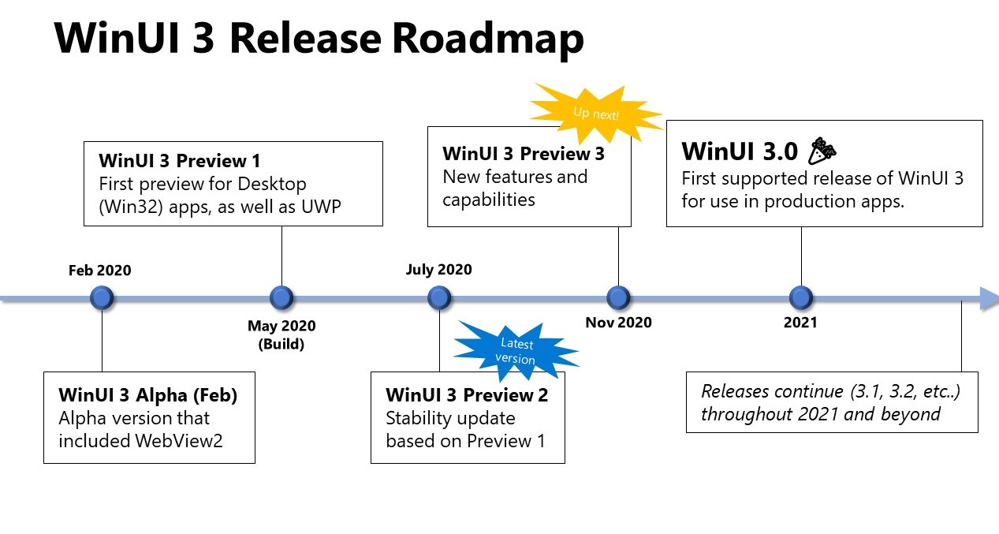

# Windows UI Library Roadmap

WinUI is the native UI platform for Windows 10. This document outlines the prospective roadmap for WinUI through 2020 and into 2021. WinUI is under active development by the Windows developer platform team and the roadmap will continue to evolve based on market changes and customer feedback, so please note that the plans outlined here aren't exhaustive or guaranteed. We welcome your feedback on the roadmap: please feel free to contribute to existing issues or [file a new issue](https://github.com/microsoft/microsoft-ui-xaml/issues).

**Note: For a detailed look at the target availability dates for certain features in WinUI 3, see [our feature roadmap](#winui-30-feature-roadmap).**

WinUI continues to advance and improve across both generations of the technology: 

1. **WinUI 2**: The 2nd generation of the WinUI stack for UWP apps, consisting of a XAML and Visual Layer built directly into the Windows 10 operating system, and a controls library built on top of the OS, delivered via NuGet, and hosted at this repository. 

2. **WinUI 3**: A new, 3rd generation of WinUI that ships the entire WinUI stack decoupled from the operating system and usable in either Win32 or UWP apps.

### Benefits of WinUI 

WinUI provides a number of benefits which makes it the best way to create user interfaces for Windows apps:

1. **The native UI platform of Windows**  
WinUI is the highly-optimized native UI platform used to create Windows itself, now made more broadly available for all developers to use to reach Windows. It's a thoroughly tested and proven UI platform that powers the operating system environment and essential experiences of 1 billion+ Windows 10 PC, XBox One, HoloLens, Surface Hub and other devices.

2. **The latest advancements in Fluent Design**  
WinUI is Microsoft's main focus for native, accessible Windows UI and controls and is the definitive source for the [Fluent Design System](https://www.microsoft.com/design/fluent/) on Windows.  
It will also support the latest composition and rendering innovations like vector animations, effects, shadows and lighting.

3. **Backward compatibility for new features**  
New WinUI features will continue to be backward-compatible with a wide range of Windows 10 versions. Once WinUI 3.0 is available, you can start building and shipping apps with new features immediately as soon as they're released, without having to wait for your users to be running the latest update of Windows 10.

4. **Native development support**  
WinUI can be used with .NET, but doesn't depend on .NET: WinUI is 100% C++ and can be used in unmanaged Windows apps, for example using standard C++17 via [C++/WinRT](https://docs.microsoft.com/windows/uwp/cpp-and-winrt-apis/).

5. **More frequent updates**  
WinUI is planned to ship roughly every 4 months, with monthly pre-release builds.  This is more of a guideline than a rule, but that is what the team strives for.

6. **Open source development and community engagement**  
 The WinUI 2 Controls Library is already open source on GitHub, and we plan to add the full WinUI 3 XAML framework into this repo in the coming months. You can engage directly with Microsoft's core engineering team and contribute bug reports, feature ideas, and even code: see the [Contribution Guide](../CONTRIBUTING.md) for more info.  You can also try out the monthly pre-release builds to see new in-development features and help shape their final form.  
 
## WinUI 2 Controls Library

The next release of the **WinUI 2 Controls Library** will be v2.5, ETA late 2020. 

WinUI 2.5 will include new Xaml features and fixes for UWP apps on Windows 10.  You can find a list of currently planned work in the [WinUI 2.5 milestone](https://github.com/microsoft/microsoft-ui-xaml/milestone/10).

For installation instructions see [Getting started with the Windows UI Library](https://docs.microsoft.com/en-us/windows/apps/winui/winui2/getting-started).

## WinUI 3

**WinUI 3** is the next generation of native Windows UI, consisting of all the major UX layers of Windows 10 decoupled and shipping as a standalone solution for you to use. 

It focuses on enabling three main use cases:

1. **Modernizing existing apps**
    * Enabling you to extend existing Win32 (WPF, WinForms, MFC..) apps with modern Windows 10 UI at your own pace using the upcoming latest version of [Xaml Islands](https://docs.microsoft.com/windows/apps/desktop/modernize/xaml-islands). Developers who currently use WinUI 2 will be able to easily move to WinUI 3, and take advantage of everything the 3rd generation has to offer
2. **Creating new Windows apps**
    * Enabling you to easily create new modern Windows apps with your choice of app model (Win32 or UWP) and language (.NET or C++)
3. **Enabling other frameworks**
    * Providing the native implementation for other frameworks like [React Native](https://github.com/Microsoft/react-native-windows) when running on Windows

WinUI 3 is currently in development, and the team recently released WinUI 3 Preview 2, which is a pre-release version that works with Win32 and UWP apps. Preview 2 is available for anyone to try, but note that it has limitations and known issues, so it is not equipped for production apps. Get started or read more about Preview 2 here: 

[WinUI 3.0 Preview 2 (July 2020)](https://docs.microsoft.com/windows/apps/winui/winui3/)

The 3rd generation of WinUI has some key benefits over the 2nd generation, including:

- **Flexible desktop development**  
WinUI 3 will let you more easily mix and match the right combination of:
    * **Language**: C# (.NET 5), C++ 17
    * **App model**: UWP, Win32
    * **Packaging**: [MSIX](https://docs.microsoft.com/windows/msix/) (AppX for the Microsoft Store), unpackaged  (xcopy, MSI, etc.)
    * **Interop**: use WinUI 3 to extend existing WPF, WinForms, and MFC apps with modern Fluent UI

- **A native Windows target for web and cross-platform frameworks**  
WinUI 3 is better optimized for libraries and frameworks to build on.  
For example, the new high-performance C++ [React Native Windows](https://github.com/Microsoft/react-native-windows) implementation is [currently working on using WinUI 3 as its base](https://microsoft.github.io/react-native-windows/docs/next/winui3).

**Conceptual overview on how WinUI 3 relates to WinUI 2 and other technologies:**

WinUI 3 is a UI layer that takes the decoupled UWP XAML Visual Layer, the WinUI 2 library, and combines it with more modern features and capabilities. This layer can be used in any Desktop app or UWP app. 

> You can watch Ryan Demopoulos’ guest keynote at UnoConf 2020, entitled *WinUI and Project Reunion: The Present and the Future*, for more details:
https://youtu.be/nbqe9uHWT_c?t=2056

The existing UWP XAML APIs that ship as part of the OS will no longer receive new feature updates. They will still receive security updates and critical fixes according to the Windows 10 support lifecycle.

The Universal Windows Platform contains more than just the XAML framework (e.g. application and security model, media pipeline, Xbox and Windows 10 shell integrations, broad device support) and will continue to evolve.

[**Project Reunion**](https://github.com/microsoft/ProjectReunion) is a set of libraries, frameworks, components, and tools that you can use in your apps to access powerful Windows platform functionality from all kinds of apps on many versions of Windows. **WinUI 3 will be a component of Project Reunion** as it brings modern UI to a variety of Windows app types. 

### Updating your apps to use WinUI 3

Creating a new WinUI 3 app will be easy using new [Visual Studio 2019 project templates](https://docs.microsoft.com/windows/apps/winui/winui3/#project-templates-for-winui-3). 

For existing UWP XAML apps there will be some updates required when migrating to WinUI 3. These updates will require little effort, with the bulk of most project changes involving find-and-replace namespace changes. We'd love to hear your thoughts on the developer experience in the [WinUI 3.0 tooling discussion issue](https://github.com/microsoft/microsoft-ui-xaml/issues/1045).

### WinUI 3.0 Timelines and Milestones

WinUI 3 will release as a series of preview releases throughout 2020, culminating with v3.0 shipping in 2021. 

See the image below for a more detailed look at our plans for getting WinUI 3.0 to market:

## WinUI 3.0 Feature Roadmap
We know that for many of our developers, the choice to adopt WinUI 3 is dependent on certain features and capabilities. The table below outlines the status on WinUI 3 features, and the expected date they'll be available to you. 

**Please note: This is a living document, and the information below can and likely will change as the project continues development. The feature availability dates listed here are the team's current goals and expectations, but are not promises or guarantees.**

For questions or status updates on either features listed here, or features not on this list, you can file an issue on [our repo](https://github.com/microsoft/microsoft-ui-xaml/issues/new?assignees=&labels=question&template=question.md&title=Question%3A+%5Byour+question+here%5D) or ask during our [monthly community calls](communitycalls/WinUICommunityCall.ics). 

### Legend
&#128994; - Included, or planned to be included

&#128311; - Partial capability 

&#129002; - Stretch goal 

Blank -  Not included, or not planned to be included

**Preview 2** is our latest release. 

| Customer Capability                                                         | Preview 2 (July 2020) | Preview 3 (Nov 2020) | WinUI 3.0 (2021) | Post-3.0 (3.x releases)        |
|-----------------------------------------------------------------------------|-----------------------|----------------------|------------------|------------------|
| WinUI in Desktop (Win32) apps                                               | &#128994;              | &#128994;             | &#128994; | &#128994; |
| Supports MSIX Deployment                                                    | &#128994;              | &#128994;             | &#128994; | &#128994; |
| WinUI works downlevel to Windows 10 version 1803 and above                  | &#128994;              | &#128994;             | &#128994; | &#128994; |
| .NET 5 Support for Desktop apps                                             | &#128994;              | &#128994;             | &#128994; | &#128994; |
| `<SwapChainPanel>`                                                              | &#128994;              | &#128994;             | &#128994; | &#128994; |
|  Chromium-based WebView2                                                    | &#128994;              | &#128994;             | &#128994; | &#128994; |
| Title Bar customization for Desktop apps                                    | &#128311;                  | &#128311;                 | &#128994; | &#128994; |
| Fluent Shadows                                                              | &#128311;                  | &#128311;                 | &#128311;             | &#128994; |
| Input validation for data fields                                            | &#128311;                  | &#128311;                 | &#129002;     | &#128994; |
| Multi-window support for Desktop apps                                       | &#128311;                  | &#128994;             | &#128994; | &#128994; |
| ARM64 support                                                               |            | &#128994;             | &#128994; | &#128994; |
| Drag and drop                                                               |            | &#128994;             | &#128994; | &#128994; |
| [RenderTargetBitmap](https://docs.microsoft.com/uwp/api/windows.ui.xaml.media.imaging.rendertargetbitmap?view=winrt-19041)                                                          |            |    &#128311;       | &#128311;   | &#128994; |
| Ready for production apps                                                   |            |           | &#128994; | &#128994; |
| Off-thread input for SwapChainPanels                                        |            |           | &#129002;     | &#128994; |
| Supports non-MSIX deployment                                                |            |           |       | &#128994; |
| .NET 5 Support for UWP apps                                                 |            |           |       | &#128994; |
| XAML Islands                                                                |            |           |       | &#128994; |
| Works on Windows 10X                                                        |            |           |       | &#128994; |
| Works on additional Windows form factors (Xbox, HoloLens, IoT, Surface Hub) |            |           |       | &#128994; |
| Title Bar customization for UWP apps                                        |            |           |       | &#128994; |
| Acrylic material                                                            |            |           |       | &#128994; |
| Reveal Highlight                                                            |            |           |       | &#128994; |
| Rounded corners for top level windows and popups                                                          |            |           |       | &#128994; |
| Media Controls                                                              |            |           |       | &#128994; |
| `<InkCanvas>`                                                                 |            |           |       | &#128994; |
| `<Map Control>`                                                                |            |           |       | &#129002;     |
\* For Preview 2: Single  content tree-only.  Supports C# or C++.  Includes VSIX-based project templates, XAML Win32 app model support, etc.  This will no longer be a restriction in Preview 3.
