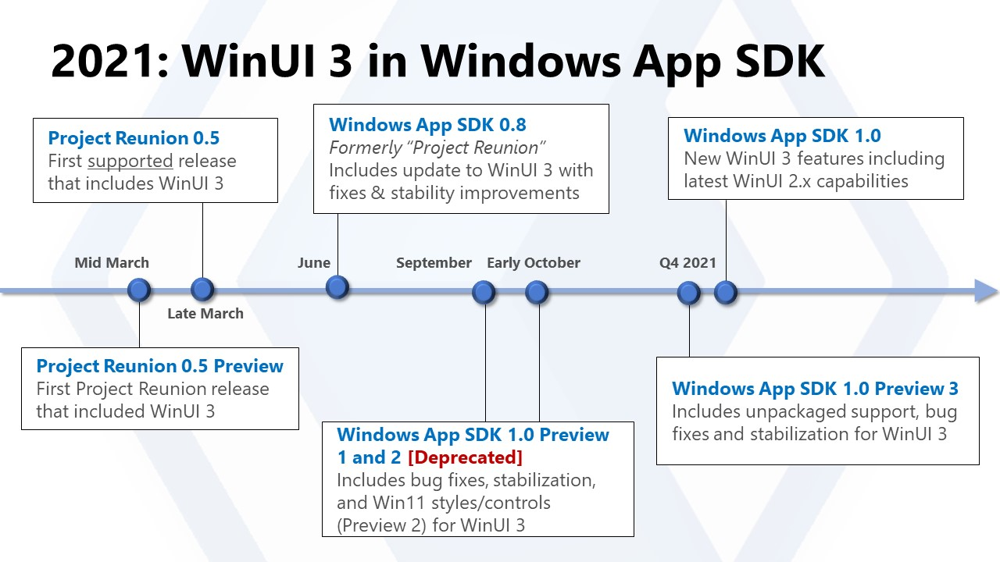
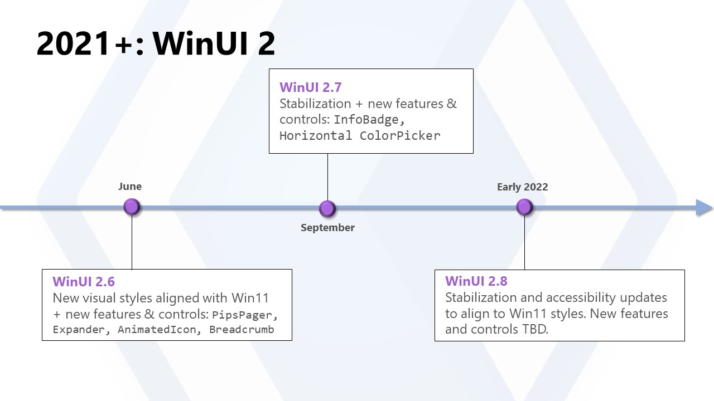

# Windows UI Library Roadmap

WinUI is the modern native UI platform for Windows. This document outlines the prospective roadmap for WinUI through 2021. WinUI is under active development by the Windows developer platform team and the roadmap will continue to evolve based on market changes and customer feedback, so please note that the plans outlined here aren't exhaustive or guaranteed. We welcome your feedback on the roadmap: please feel free to contribute to existing issues or [file a new issue](https://github.com/microsoft/microsoft-ui-xaml/issues).

**Note: For a detailed look at the target availability dates for certain features in WinUI 3, see [our feature roadmap](#winui-3-feature-roadmap).**

WinUI continues to advance and improve across both generations of the technology: 

1. **WinUI 2**: The 2nd generation of the WinUI stack for UWP apps, consisting of a XAML and Visual Layer built directly into the Windows 10 operating system, and a controls library built on top of the OS, delivered via NuGet, and hosted at this repository. 

2. **WinUI 3**: A new, 3rd generation of WinUI that ships the entire WinUI stack decoupled from the operating system as a part of the [Windows App SDK](https://docs.microsoft.com/windows/apps/windows-app-sdk/). 

### Benefits of WinUI 

WinUI provides a number of benefits which makes it the best way to create user interfaces for Windows apps:

1. **The native UI platform of Windows**  
WinUI is the highly-optimized native UI platform used to create Windows itself, now made more broadly available for all developers to use to reach Windows. It's a thoroughly tested and proven UI platform that powers the operating system environment and essential experiences of 1 billion+ Windows 10 PC, XBox One, HoloLens, Surface Hub and other devices.

2. **The latest advancements in Fluent Design**  
WinUI is Microsoft's main focus for native, accessible Windows UI and controls and is the definitive source for the [Fluent Design System](https://www.microsoft.com/design/fluent/) on Windows.  
It will also support the latest composition and rendering innovations like vector animations, effects, shadows and lighting.

3. **Backward compatibility for new features**  
New WinUI features will continue to be backward-compatible with a wide range of Windows 10 and 11 versions. With WinUI 3, you can start building and shipping apps with new features immediately as soon as they're released, without having to wait for your users to be running the latest update of Windows.

4. **Native development support**  
WinUI can be used with .NET, but doesn't depend on .NET: WinUI is 100% C++ and can be used in unmanaged Windows apps, for example using standard C++17 via [C++/WinRT](https://docs.microsoft.com/windows/uwp/cpp-and-winrt-apis/).

5. **More frequent updates**  
WinUI is planned to ship roughly every 4 months, with monthly pre-release builds.  This is more of a guideline than a rule, but that is what the team strives for.

6. **Open source development and community engagement**  
 The WinUI 2 Controls Library is already open source on GitHub, and we're planning to add the full WinUI 3 framework into this repo as well. You can engage directly with Microsoft's core engineering team and contribute bug reports, feature ideas, and even code: see the [Contribution Guide](../CONTRIBUTING.md) for more info.  You can also try out the monthly pre-release builds to see new in-development features and help shape their final form.  
 
## WinUI 2 Controls Library

The next release of the **WinUI 2 Controls Library** will be v2.8, aiming to release in early 2022. 

WinUI 2.8 will include new Xaml features and fixes for UWP apps.  You can find a list of currently planned work in the [WinUI 2.8 milestone](https://github.com/microsoft/microsoft-ui-xaml/milestone/14).

For installation instructions see [Getting started with the Windows UI Library](https://docs.microsoft.com/en-us/windows/apps/winui/winui2/getting-started).

## WinUI 3

**WinUI 3** is the next generation of native Windows UI, consisting of all the major UX layers of Windows decoupled and shipping as a standalone solution for you to use. 

It focuses on enabling three main use cases:

1. **Modernizing existing apps**
    * Enabling you to extend existing Win32 (WPF, WinForms, MFC...) apps with modern Windows UI at your own pace using the upcoming release of [Xaml Islands](https://docs.microsoft.com/windows/apps/desktop/modernize/xaml-islands). Developers who currently use WinUI 2 for their app UX will be able to easily move to WinUI 3, as their syntax and capabilities are very similar
2. **Creating new Windows apps**
    * Enabling you to easily create new modern Windows apps with the flexibility offered by the Windows App SDK
3. **Enabling other frameworks**
    * Providing the native implementation for other frameworks like [React Native](https://github.com/Microsoft/react-native-windows) when running on Windows

WinUI 3 is available as a part of the [Windows App SDK](https://docs.microsoft.com/windows/apps/windows-app-sdk) for building stable and supported desktop/Win32 apps for production scenarios. The latest release is the Windows App SDK 1.0, which you can download and read more about at the documentation linked below:

[Stable release channel for the Windows App SDK](https://docs.microsoft.com/windows/apps/windows-app-sdk/stable-channel)

There's also a version of WinUI 3 available that includes experimental features. You can read more about the Windows App SDK Preview at the following documentation. Note that preview releases have limitations and known issues, so they are not equipped for production apps. 

[Experimental release channel for the Windows App SDK](https://docs.microsoft.com/windows/apps/windows-app-sdk/experimental-channel).
 

## WinUI 3 Feature Roadmap
The images below list out what the WinUI team has shipped in 2021. Stay tuned for an updated visual roadmap for 2022.

The Windows App SDK ships experimental, preview, and stable builds (with WinUI 3 as a component). You can read more about the shipping schedule and cadence in our [Release Channels doc](https://docs.microsoft.com/windows/apps/windows-app-sdk/release-channels). For more details on when specific features will become available, see the feature roadmap table below. 

**Note: We have deprecated Windows App SDK 1.0 Preview 1 and 2 from NuGet due to a critical bug affecting the system PATH variable. Please view these [notes](https://docs.microsoft.com/en-us/windows/apps/windows-app-sdk/preview-channel#important-issue-impacting-10-preview-1-and-preview-2) for the specific issue and mitigation.**

For WinUI 2, you can plan to see frequent pre-releases (see our [Releases](https://github.com/microsoft/microsoft-ui-xaml/releases) page for more info), along with two stable releases this year.

We know that for many of our developers, the choice to adopt WinUI 3 is dependent on certain features and capabilities. The table below outlines the status on WinUI 3 features, and the expected date they'll be available to you. 

In the feature roadmap table below, some features remain "experimental" features during stable releases. This means that the feature is not stable/bug-free enough to be included in the stable release, but will be available in the corresponding experimental build. 

**Please note: This is a living document, and the information below can and likely will change as the project continues development. The feature availability dates listed here are the team's current goals and expectations, but are not promises or guarantees.**

For questions or status updates on either features listed here, or features not on this list, you can file an issue on [our repo](https://github.com/microsoft/microsoft-ui-xaml/issues/new?assignees=&labels=question&template=question.md&title=Question%3A+%5Byour+question+here%5D) or ask during our [monthly community calls](https://aka.ms/winuicall). 

### Legend
&#128994; - Available as supported feature

&#128311; - Available as experimental feature 

&#129002; -  Stretch goal 

Blank -  Not available

**WinUI 3 - Windows App SDK 1.0** is our latest release. 

| Customer Capability                                    | Project Reunion 0.5  (March 2021) | Windows App SDK 0.8  (June 2021) | Windows App SDK 1.0   (November 2021) | Planned for Windows App SDK 1.1 | Planned for a future update |
| ------------------------------------------------------ | -------------------------------- | ------------------------------- | ----------------------------- | --------------------------- | --------------------------- |
| Supported in any app using the Windows App SDK         | &#128994;          | &#128994;          | &#128994;                       | &#128994;          | &#128994;     |
| Contains new Windows 11 controls/styles from WinUI 2.6 |            |            | &#128994;                       | &#128994;          | &#128994;     |
| Supports MSIX Deployment                               | &#128994;          | &#128994;          | &#128994;                       | &#128994;          | &#128994;     |
| Supports Unpackaged (non-MSIX) Deployment              |            |            | &#128994;                       | &#128994;          | &#128994;     |
| Works downlevel to Windows 10 version 1809 and above   | &#128994;          | &#128994;          | &#128994;                       | &#128994;          | &#128994;     |
| Supports the latest .NET                               | &#128994;          | &#128994;          | &#128994;                       | &#128994;          | &#128994;     |
| ARM64 support                                          | &#128994;          | &#128994;          | &#128994;                       | &#128994;          | &#128994;     |
| `<SwapChainPanel> `                                    | &#128994;          | &#128994;          | &#128994;                       | &#128994;          | &#128994;     |
| Intellisense, Hot Reload, Live Visual Tree             | &#128311; | &#128311; | &#128994;[^1]  | &#128994;          | &#128994;     |
| Chromium-based WebView2                                | &#128994;          | &#128994;          | &#128994;                       | &#128994;          | &#128994;     |
| Title bar customization                                | &#128994;          | &#128994;          | &#128994;                       | &#128994;          | &#128994;     |
| Fluent Shadows                                         | &#128994;                              | &#128994;                             | &#128994;                           | &#128994;
| Input validation for data fields                       | &#128311; | &#128311; | &#128311;              | &#128311; | &#128994;     |
| Supports multiple top-level windows on the same thread | &#128311; | &#128311; | &#128311;              | &#128994;          | &#128994;     |
| Support multiple top-level windows on separate threads | &#128311; | &#128311; | &#128311;              | &#128311; | &#128994;     |
| Drag and drop                                          | &#128994;          | &#128994;          | &#128994;                       | &#128994;          | &#128994;     |
| RenderTargetBitmap                                     | &#128994;          | &#128994;          | &#128994;                       | &#128994;          | &#128994;     |
| Mouse cursor customization                             | &#128994;          | &#128994;          | &#128994;                       | &#128994;          | &#128994;     |
| Animated Gif support                                   | &#128994;          | &#128994;          | &#128994;                       | &#128994;          | &#128994;     |
| VirtualSurfaceImageSource (VSIS) support               | &#128994;          | &#128994;          | &#128994;                       | &#128994;          | &#128994;     |
| In-app acrylic                                         | &#128994;          | &#128994;          | &#128994;                       | &#128994;          | &#128994;     |
| Background acrylic                                     |            |            |                         | &#128994;          | &#128994;     |
| Mica                                                   |            |            |                         | &#128994;          | &#128994;     |
| XAML Islands                                           |            | &#128311;           |    &#128311;                     | &#128311; | &#128994;     |
| Media Controls (e.g. `<MediaPlayerElement>`)           |            |            |                         |            | &#128994;     |
| `<InkCanvas>`                                          |            |            |                         |            | &#128994;     |
| `<MapControl>`                                         |            |            |                         |            | &#129002; |

[^1]: Supported in packaged apps only
