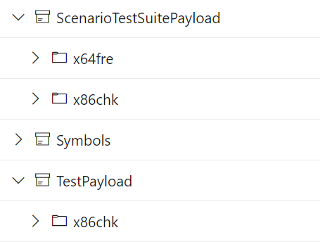
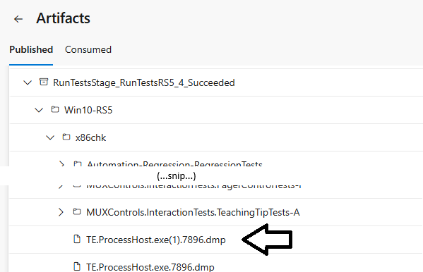

# Testing in WinUI - FAQ

## Table of Contents

- [Workflow](#workflow)
  - [How do I validate my changes?](#how-do-i-validate-my-changes)
  - [I am not ready to create a PR just yet, but still want to run a test pass.](#i-am-not-ready-to-create-a-pr-just-yet-but-still-want-to-run-a-test-pass)
  - [I want to do a lab test run, but I only need to run a subset of the tests.](#i-want-to-do-a-lab-test-run-but-i-only-need-to-run-a-subset-of-the-tests)
  - [I don't want the Pipeline to run a build. I want it to use my locally built binaries from my dev machine.](#i-dont-want-the-pipeline-to-run-a-build-i-want-it-to-use-my-locally-built-binaries-from-my-dev-machine)
  - [What OS versions are we running on? What build flavor?](#what-os-versions-are-we-running-on-what-build-flavor)
  - [How many tests do we have? How long do they take to run?](#how-many-tests-do-we-have-how-long-do-they-take-to-run)
  - [How to disable a test?](#how-to-disable-a-test)
- [Running Tests Locally](#running-tests-locally)
  - [How do I run tests locally?](#how-do-i-run-tests-locally)
  - [Can I run the tests on my dev machine?](#can-i-run-the-tests-on-my-dev-machine)
  - [What test environments are currently supported?](#what-test-environments-are-currently-supported)
  - [How do I create a test VM?](#how-do-i-create-a-test-vm)
  - [How do I connect to the test machine? Can I use Remote Desktop? What about Enhanced connection in Hyper-V?](#how-do-i-connect-to-the-test-machine-can-i-use-remote-desktop-what-about-enhanced-connection-in-hyper-v)
- [Using TAEF](#using-taef)
  - [How do I use TAEF?](#how-do-i-use-taef)
  - [RunTests.cmd](#runtestscmd)
  - [TE.exe](#teexe)
  - [How do I take a time travel trace of a test?](#how-do-i-take-a-time-travel-trace-of-a-test)
    - [The Time Travel Trace still isn't working!](#the-time-travel-trace-still-isnt-working)
  - [How do I debug a unit test?](#how-do-i-debug-a-unit-test)
  - [My local test pass it hitting errors like "Error: COM_END WindowHelper::VerifyTestCleanup: Error: Caught Platform::Exception^: Unspecified error"](#my-local-test-pass-it-hitting-errors-like-error-com_end-windowhelperverifytestcleanup-error-caught-platformexception-unspecified-error)
- [Tests in CI/PR builds](#tests-in-cipr-builds)
  - [How do I locally run tests using a build from Azure Pipelines?](#how-do-i-locally-run-tests-using-a-build-from-azure-pipelines)
  - [My PR/CI build failed due to failed tests. How can I get more info?](#my-prci-build-failed-due-to-failed-tests-how-can-i-get-more-info)
  - [How do I understand and debug a pipeline test failure?](#how-do-i-understand-and-debug-a-pipeline-test-failure)
  - [How do I get complete logs for a test that passed?](#how-do-i-get-complete-logs-for-a-test-that-passed)
  - [My Pipeline failed with: "Error: The process 'C:\Program Files\dotnet\dotnet.exe' failed with exit code 1. Dotnet command failed with non-zero exit code on the following projects : d:\a\1\s\Helix\RunTestsInHelix.proj".](#my-pipeline-failed-with-error-the-process-cprogram-filesdotnetdotnetexe-failed-with-exit-code-1-dotnet-command-failed-with-non-zero-exit-code-on-the-following-projects--da1shelixruntestsinhelixproj)
  - [How do I get to crash dumps?](#how-do-i-get-to-crash-dumps)
  - [Can I log in to one of the ADO VMs where my test failed?](#can-i-log-in-to-one-of-the-ado-vms-where-my-test-failed)
  - [On the 'Tests' tab of a build, I see tests marked as Passed, Failed or Other. What is 'Other'?](#on-the-tests-tab-of-a-build-i-see-tests-marked-as-passed-failed-or-other-what-is-other)
  - [I see a failing test with a name like "External.Controls.CheckBox Work Item". This is not the name of a test. What is it?](#i-see-a-failing-test-with-a-name-like-externalcontrolscheckbox-work-item-this-is-not-the-name-of-a-test-what-is-it)
  - [My PR Build failed due to a test failure unrelated to my change. What do I do?](#my-pr-build-failed-due-to-a-test-failure-unrelated-to-my-change-what-do-i-do)
  - [How do I run tests on for my changes on RS5 in a Pipeline?](#how-do-i-run-tests-on-for-my-changes-on-rs5-in-a-pipeline)
  - [How do I disable a test on a particular version of the OS?](#how-do-i-disable-a-test-on-a-particular-version-of-the-os)
  - [How should I investigate tests that were disabled due to stability issues?](#how-should-i-investigate-tests-that-were-disabled-due-to-stability-issues)
  - [Opening a test run log file gives the error: "This XML file does not appear to have any style information associated with it"](#opening-a-test-run-log-file-gives-the-error-this-xml-file-does-not-appear-to-have-any-style-information-associated-with-it)
- [Sample App Tests](#sample-app-tests)
  - [What are the Sample App Tests? Why do we need them?](#what-are-the-sample-app-tests-why-do-we-need-them)
  - [How do I build the Sample Apps?](#how-do-i-build-the-sample-apps)
  - [What scenarios are covered by these Sample Apps?](#what-scenarios-are-covered-by-these-sample-apps)
  - [When do these tests run?](#when-do-these-tests-run)
  - [How do the Sample App Test Automation tests work?](#how-do-the-sample-app-test-automation-tests-work)
  - [How do I run the Sample App Tests?](#how-do-i-run-the-sample-app-tests)
- [Static tests](#static-tests)
  - [How do I run static tests locally?](#how-do-i-run-static-tests-locally)
- [Experimental](#experimental)
  - [Running a Helix test pass against locally built binaries.](#running-a-helix-test-pass-against-locally-built-binaries)
    - [Limitations](#limitations)

## Workflow

### How do I validate my changes?
Once your changes are ready, create a Pull Request. As part of the PR gates, your changes will be built and a test pass
will be run.

You will need to trigger the build to run. On the PR page, under 'Policies' click the '...' next to the build and select
'Queue build'.

If the build fails or there are test failures, the gate will fail and your PR will be blocked. In the case
of a failure, resolve any issues and push fixes to your branch. Once you are ready to run the validation again, queue
the build as before.

### I am not ready to create a PR just yet, but still want to run a test pass.
You can manually run a pipeline without creating a PR. Push your branch and then queue the pipeline against it.
Navigate to the WinUI-BuildAndTest pipeline in Azure DevOps.
Click 'Run Pipeline' and select your branch.
This will build x86chk and run the tests against the build.

### I want to do a lab test run, but I only need to run a subset of the tests.
When you click 'Run Pipeline', select 'Variables' and then enter a value for `taefQuery`. For example:
```
@Name='*CommandBar*'
```

This will run all tests with 'CommandBar' in the name. Make sure to enter the `taefQuery` that you desire correctly or
the results that you get might not be as expected.

Note that unit tests will always run regardless of the value of taefQuery.

### I don't want the Pipeline to run a build. I want it to use my locally built binaries from my dev machine.
(DISABLED).
This scenario is not officially supported, but see the [Experimental](#experimental) section of this document below for
more info.

### What OS versions are we running on? What build flavor?
Currently we are running x86chk test binaries on Windows Client 20H2 (amd64).
In the Nightly build, we also run x86chk tests on RS5 and 19H1.


### How many tests do we have? How long do they take to run?
We have about 8000 tests. There are two types of tests, native written in C++ and managed in C# (.net 5 with cs/winrt).
Native tests run in both HostingModes UWP and WPF.
However managed tests can only be ran in WPF mode. Reason being managed tests built on .net 5 and there is no official
support for .net 5 in UWP.
End-to-end, these tests take about 8 hours to run in total. Including machine creation and
configuration time, deployment time, re-try time, etc. the amount of actual machine time is higher than this. Because
we distribute the work items across multiple machines in parallel the total wall-clock time is less than this.
The average wall-clock time to execute the test pass is about an hour.

### How to disable a test?
You need to set the ignore property of the test to `true`.

Native
Add the following line to the test declaration.
`TEST_METHOD_PROPERTY(L"Ignore", L"TRUE") // Bug ????: Foo`

Example:
```cpp
  BEGIN_TEST_METHOD(VerifyRangeFromPointWithHiDPI)
      TEST_METHOD_PROPERTY(L"Description", L"Validates that RangeFromPoint takes the DPI setting into account.")
      TEST_METHOD_PROPERTY(L"Hosting:Mode", L"UAP")
      TEST_METHOD_PROPERTY(L"Ignore", L"TRUE")
  END_TEST_METHOD()
```

Managed
Add the following line before the test implementation.
`[TestProperty("Ignore", "TRUE")] // Bug ?????: Foo `

 Example:
```cpp
  [TestMethod]
  [TestProperty("TestPass:ExcludeOn", "WindowsCore")]
  [TestProperty("Hosting:Mode", "UAP")]
  [TestProperty("Ignore", "TRUE")]
  public void MenuFlyout()
  {
    ...
  }
```

## Running Tests Locally

### How do I run tests locally?
Follow these steps:
1. Build the product and tests as normal using **build.cmd**
2. Run **test\CreateTestPayload.ps1** This will produce a TestPayload directory at the repo root.
3. Connect to a to the machine you wish to run tests on (recommendation: an amd64 VM running Windows 20H2). DO NOT
connect via an Enhanced connection (use a basic connection instead). An Enhanced connection will cause some test
failures. In VM connect you can change this setting from the View menu.
4. Copy this TestPayload directory to the machine you wish to run tests on.
5. On the test machine, launch an admin cmd prompt. Run **testmachine-prerun.cmd** in the TestPayload directory
(one-time setup).
6. In the cmd prompt, type `runtests *MyTestName` to run tests.  (note the `runtests.cmd` script wraps te.exe, you can
   also use te.exe directly if you wish)

### Can I run the tests on my dev machine?
Yes, but be aware that most tests involve launching apps and sending input to them (etc.) and so your machine will not
be usable while the tests execute. It is recommended that you run the tests on a separate physical machine or on a VM.

### What test environments are currently supported?
Windows Client RS5, 19H1 or 20H2 amd64 (x86 should work also but is not tested)

### How do I create a test VM?
You can create a test VM however you like. Some options are:
1. Create a VM on your dev machine using Hyper-V
2. Use a VM provisioning tool to create test VMs.

Creating a 20H2 machine is recommended.

### How do I connect to the test machine? Can I use Remote Desktop? What about Enhanced connection in Hyper-V?
Many of our tests do not work well over remote desktop. To connect to VMs use the standard "Virtual Machine Connection"
(vmconnect.exe) instead of "Enhanced Session". In "Virtual Machine Connection" check under the "View" menu to see if
you are using a basic or an "Enhanced" session. If you want to avoid making this mistake entirely, you can disable
Enhanced Mode completely in Hyper-V Settings (uncheck "Allow enhanced session mode").

## Using TAEF

### How do I use TAEF?
All of our tests are written using TAEF. The tests are run by executing te.exe with the appropriate arguments:

`te.exe [path to test binaries] /select:"[testQuery]"`

You can choose to run tests with the simpler [runtests.cmd](#runtests.cmd) syntax, or with more options via the
[te.exe](#te.exe) syntax.

### RunTests.cmd
We have a simple wrapper to run tests: `runtests.cmd`. By default this will run tests in UWP HostingMode. Only native
C++ tests can be run in UWP mode. If you run managed C# tests in UWP mode, it will fail on launch with reason "blocked".
The syntax for using this command is:

`runtests.cmd <partial_test_name> [<optional_parameters>]`

The script will automatically assume a wildcard before the given test name. It also runs with the `/p:SkipConsoleWindowMinimize` flag.
There are more details on these flags below.

**Examples:**

This will run all tests that end with the name "ResizeTest". Default HostingMode is UWP:

`runtests.cmd ResizeTest`

This will run all tests that end with the name "ResizeTest" in WPF hosting mode:

`runtests.cmd -wpfMode ResizeTest`

There's also a "win32Explicit" hosting mode:

`runtests.cmd -win32explicit TwoIslandsInSameWindow`

Run `runtests.cmd -?` for the current list of arguments runtests supports.

### TE.exe

Full documentation of TAEF is available here: https://learn.microsoft.com/en-us/windows-hardware/drivers/taef/
The command line arguments available is described here: https://learn.microsoft.com/en-us/windows-hardware/drivers/taef/te-exe-command-line-parameters

**TAEF Commands**

To get a list of nifty te.exe commands (opens browser):

`te.exe -!`

Some highlights include:
* `/runIgnoredTests` <- executes/lists disabled tests that have "Ignore" metadata set
* `/stackTraceOnError`
* `/miniDumpOnError`, `/miniDumpOnCrash` <- dumps @ TestPayload\Test\WexLogFileOutput
* `/testmode:Loop /LoopTest:4 /Loop:3` <- runs tests in a loop ([details](#testmodeloop))

We also have custom properties used by our test infra
* `/p:WaitForDebugger` <- waits to run until a debugger is attached ([details](#pwaitfordebugger))
* `/p:WaitForAppDebugger` <- waits to run until a debugger is attached to the test application ([details](#pwaitforappdebugger))
* `/p:HostingMode=WPF` <- runs in WPF hosting mode ([details](#phostingmodewpf))
* `/p:SkipConsoleWindowMinimize`  <- prevents command window from minimizing during test run ([details](#pskipconsolewindowminimize))
* `/p:GoSlow` <- slow down test execution so you can watch it run ([details](#pgoslow))

> Note:
> * `/foo` is an argument to te.exe
> * `/p:foo` sets a property which can be queried by test code at test execution time

**`/testmode:Loop`**
To run a test multiple times in a row, add these arguments: `/testmode:Loop /LoopTest:4 /Loop:3`
This will run the test 4 times in a row, in 3 runs (for a total of 12 times).
https://learn.microsoft.com/en-us/windows-hardware/drivers/taef/test-modes#loop-test-mode

**`/p:WaitForDebugger`**
For managed tests, you must attached with a managed debugger, and so must use Visual Studio. WinDbg does not work with
managed tests today, because it doesn’t tickle the runtime bits that make .NET code think a debugger is attached.

**`/p:WaitForAppDebugger`**
For managed, UIA-based tests, like the ones in MUXControls.Test.dll, use this to pause until a debugger is attached to
the test application.

**`/p:HostingMode=WPF`**
If you need to run a suite of tests in WPF mode where some have been filtered out of the WPF suite,
then you need to use /select: like this (and not use /name)
`/select:"((@Hosting:Mode='*WPF*')AND(@Name='*WhateverYouWouldPutInTheNameParameter*'))"`.
It's important that there are no spaces.

**`/p:SkipConsoleWindowMinimize`**
Arghh! Every time I run a test, the command window minimizes!
This behavior is useful during lab runs, but can be annoying when running locally.
To turn off this behavior add this argument: `/p:SkipConsoleWindowMinimize`

**`/p:GoSlow`**
This tells WaitForIdle calls to end with a sleep call. This long pause can help to watch
the individual steps of a test run.

**Examples:**

This will run all tests that are defined in a given test dll:

`te.exe test\Microsoft.UI.Xaml.Tests.External.Controls.CommandBar.dll`

This will run all tests from that dll in the 'CommandBarAutomationIntegrationTests' test class:

`te.exe test\Microsoft.UI.Xaml.Tests.External.Controls.CommandBar.dll /select:"@Name='*::CommandBarAutomationIntegrationTests::*'"`

or equivalently:

`te.exe test\Microsoft.UI.Xaml.Tests.External.Controls.CommandBar.dll /name:*::CommandBarAutomationIntegrationTests::*`

You can construct a query based on any of the metadata defined in the test dll (e.g. TEST_METHOD_PROPERTY,
TEST_CLASS_PROPERTY or [TestProperty]).
This example specifies the [TestProperty] "Hosting:Mode":

` /select:"((@Hosting:Mode='*WPF*')AND(@Name='*WhateverYouWouldPutInTheNameParameter*'))" `

### How do I take a time travel trace of a test?
`/p:WaitForDebugger` doesn't work for attaching TTD. For a time travel trace of a UWP test, see
https://learn.microsoft.com/en-us/windows-hardware/drivers/debuggercmds/time-travel-debugging-ttd-exe-command-line-util.

In one cmd window:
```
tttracer.exe /out c:\data -parent * -onlaunch taefhostapp.exe
```
(for managed tests, specify taefhostappmanaged.exe)

In another:
```
te.exe test\Microsoft.UI.Xaml.*.dll /name:...
tttracer.exe -delete *
```

> You must use the TTTracer you get by installing Windows Debugging Tools.
The default version of TTTracer.exe in `System32` isn't sufficient.

> You must match bitness/arch.
If you're running x86 tests (the default for PR pipeline), you must use the wow64 version of TTTracer
from the Windows Debugging Tools installation directory.

#### The Time Travel Trace still isn't working!
Some WPF-hosted tests and win32explicit tests run through `te.processhost.exe` instead of `taefhostapp.exe` or
`taefhostappmanager.exe`, which is difficult to get `tttracer.exe` to only trace the process that is hosting the test
and not the test infrastructure itself.

1. In the command window running the test, run the test with "`/p:WaitForDebugger`".
2. Look for the PID that needs to be debugged.
3. If the log text mentions tttracer support ("Waiting for a debugger or tttracer to attach"), just run `tttracer.exe
   /out c:\data /attach [PID]` and then let the test run.  You're done!

If the wait _doesn't_ support tttracer, you need to attach a debugger to trigger the test to continue:
1. Attach a normal debugger to the requested PID.  (ex: `cdb -p [PID]`)
2. While the debugger is attached and broken in, then in another command window run `tttracer.exe /out c:\data /attach
   [PID]`.
3. Go back to your debugger and detach it.  (ex: `qd` in windbg/cdb)
4. The test should now run and capture a trace of just the failing process.

### How do I debug a unit test?
Unit tests can't be debugged with `/p:WaitForDebugger`. Instead, install the TAEF explorer extension for Visual Studio.
Open the unit test dll in TAEF explorer, and you'll be able to debug and step through unit tests.

### My local test pass it hitting errors like "Error: COM_END WindowHelper::VerifyTestCleanup: Error: Caught Platform::Exception^: Unspecified error"
Are you connecting to a test VM using Remote Desktop or Hyper-V Enhanced Session? See the entry above about these
connection modes.


## Tests in CI/PR builds

### How do I locally run tests using a build from Azure Pipelines?
The steps are the same as for local builds, except instead of running `build.cmd` and `CreateTestPayload.ps1`, you can
download the TestPayload from the build. Go to the build report page. Click 'published' and download the 'TestPayload'
folder or the 'ScenarioTestSuitePayload' folder (for Tests or Scenario App Tests). Unzip this file and use it the same
way as described above (`testmachine-setup.cmd` and the `runtests.cmd`).



Note that these payloads do not contain symbols. If you want test failures to produce meaningful stacks from IFC
failures, download Microsoft.UI.Xaml.pdb from the Symbols folder and put it alongside the test binaries inside the Test
folder.

### My PR/CI build failed due to failed tests. How can I get more info?
The 'Tests' tab on the build pipeline will show the details of tests that executed for the build. You can see what
tests passed and failed. For a failing test, you can see the error message. However, usually an error message in
isolation does include sufficient details to understand the failure, so you will want to read the full log.

### How do I understand and debug a pipeline test failure?
(Test logs and crash dump files)

To find the error message for a failed test:
* On the Pipeline page, the failures will be listed under the Tests tab, grouped by test configuration (version, arch,
  etc).
* Expand a failed test to see the different run attempts.
* Click on an attempt and the error message shows up in a Result Details pane.

The test output can be seen in the "Run Tests Stage". The tricky part is that Xaml breaks tests into multiple parallel
jobs, and it can be difficult to find the job that's running your test. Alternatively, you can download the log file
along with the test output - see the section below.

To see the test output directly in the pipeline run:
* On the Pipeline page, click on the Summary tab, then click on a failed job.

* On the Jobs page, click on the "Run Tests" step. Then click on the output pane and Ctrl+F for the test you're looking
  for.

* Note that your test may be in a different job. Alternatively you can download the test output for the test you're
  interested in.

To download the test output for a particular test:
* On the Pipeline page, click on the "## published" link in the Summary tab, under the "Related" section.

* On the Artifact page, go to TestOutput > Win10-22H2 > x86chk.

* Scroll down to the test that you're interested in, and download the entire folder.

* In that folder will be the test log of the entire job (look for the name of your test or the `[Failed]` tag) as well
  as screenshots and baseline files if the test failed.

When looking at the test logs also note:
* If a test succeeds but then crashes during test cleanup, you can usually find it by searching for "error:"
* Test output for a test starts with a "StartGroup" line and ends with an "EndGroup" line. So look backwards from the
  "[failed]" to see the test output.

If the test crashed, the dump file is currently not available. If the crashing stack logged by the test output doesn't
give enough information (or is missing), try running the test locally to reproduce the crash.

### How do I get complete logs for a test that passed?
See the section above - the test output is available in the Pipelines page, or can be downloaded via Artifacts.

### My Pipeline failed with: "Error: The process 'C:\Program Files\dotnet\dotnet.exe' failed with exit code 1. Dotnet command failed with non-zero exit code on the following projects : d:\a\1\s\Helix\RunTestsInHelix.proj".
This is the error that is raised when the *Run Test in Helix* task hits an error.
It usually is the result of one or more test failures. In this case, the error will be accompanied
by error output from *OutputTestResults* that looks like:
```
Failing tests:
chk.x86.UAP.Microsoft::UI::Xaml::Tests::Foundation::Text::TextBoxPointerTests::CheckTextBoxPointerOver
```
You can get more information about the 'dotnet.exe failed with exit code 1' error by clicking on it
in on the Summary page which will take you to the full log. The most common error is of the form:
```
error : Test run 124075266 has one or more failing tests.
```
But we have also seen cases where something other than a failing test causes an error here, such as
transient networking errors:
```
RestApiException: The response contained an invalid status code 502 Bad Gateway
```

### How do I get to crash dumps?
When a test job runs, we collect up to three dumps in the c:\dumps folder on the test machine, and then upload
them to the "artifacts" for that job.  Look for ".dmp" files in the artifacts:



Note that sometimes you may see crashes for jobs that passed.  This can be because either (a) the test was automatically
re-run, and the re-run passed, or (b) the crash happened after a test reported a "pass".

If you expect a dump file, and it's not there, you might need to enable dump collection for that exe specifically.
See `$namesOfProcessesForDumpCollection` in the file `TestPass-OneTimeMachineSetup.ps1`.

Note, to make the dump collection work, we needed to configure our Azure VMs to disable the existing agent that
handles crashes.  Adding this json to the Azure image script does the trick:

```
        {
            "name": "windows-updateregistry",
            "parameters": {
                "RegistryPath": "HKEY_LOCAL_MACHINE\\System\\CurrentControlSet\\Control\\Session Manager\\Environment",
                "RegistryKey": "DISABLE_1ES_AGENT_CRASH_DUMP_COLLECTION",
                "DataType": "REG_SZ",
                "Value": "true"
            }
        }
```

### Can I log in to one of the ADO VMs where my test failed?
Yes, but it's a bit involved.

Refer to the internal documentation on holding a machine for debugging.

As the instructions say, you'll need to set the debug profile in the Azure Portal for the WinUI test pool.

 > Note: Remember to un-set the debug profile after you're done!

The instructions also say you'll need to set a "HoldMachine" demand.  I did this by changing WinUI-RunTestPassOnPipeline-Job.yml in a topic branch like this:

``` yml
# file: WinUI-RunTestPassOnPipeline-Job.yml
jobs:
- job: ${{ parameters.runTestJobName }} #...
#...
  pool:
    type: windows
#...
      name: WinDevPool-Test
      ${{ if eq( parameters.testOS, 'Win10-RS5' ) }}:
        demands: ImageOverride -equals Win10-RS5
      ${{ if eq( parameters.testOS, 'Win10-22H2' ) }}:
        demands: 
          - ImageOverride -equals Win10-22H2
          - HoldMachine -equals true  # <<< Hold this VM
      ${{ if eq( parameters.testOS, 'Win11-23H2') }}:
        demands: ImageOverride -equals Win11-23H2
  timeoutInMinutes: 100
  strategy:
    ${{ if eq( parameters.testSuite, 'DevTestSuite') }}:
      parallel: 1 # <<< Changed to 1 so that we don't hold lots of VMs
    ${{ if eq( parameters.testSuite, 'ScenarioTestSuite') }}:
      parallel: 1 # <<< Changed to 1 so that we don't hold lots of VMs
```

Then I ran the PR pipeline on that topic branch.  Now, the 22H2 VM gets held after running some tests.  (note it will timeout because it's trying to
run the whole suite with the above changes.  I'm sure you could make other modifications so that it just times out right away and you don't
need to wait for it.)

Now that the machine is held, consult the above "Hold Machine For Debugging" link for how to connect.

### On the 'Tests' tab of a build, I see tests marked as Passed, Failed or Other. What is 'Other'?
Our test pass re-runs tests that fail initially. If they pass enough times on re-run they are considered 'unreliable'
rather than as outright failures. These tests show up as 'Other' in the test report and do not cause the overall build
to be marked as Failed. Only tests that fail multiple times on re-run are marked as 'Fail' and cause the overall build
to be marked as Failed.

### I see a failing test with a name like "External.Controls.CheckBox Work Item". This is not the name of a test. What is it?
Our test pass is split up into a set of Helix Work Items. If a test within a work item fails, the failing test will be
reported. However, if something goes wrong with the work item itself, it will not report any test results and the
entire work item will be reported as failed. The most common cause of this is the work item taking too long and timing
out. In most cases the most appropriate fix is to break the work item down into multiple smaller work items. See the
section [Generating Helix Work Items](test-system-overview.md#generating-helix-work-items%3A-generatetestprojfile.ps1)
in the [Test System Overview](test-system-overview.md) for more info on this.

### My PR Build failed due to a test failure unrelated to my change. What do I do?
It is simply a fact that our tests are not reliable 100% of the time. We have some re-try logic to help mitigate the
problem, but sometimes random test failures happen anyway. If this happens:
First, make sure that the test failure truly is not related to your change. Sometimes changes in the runtime can have
unexpected consequences. If you are certain that this test failure is the result of pre-existing unreliability
unrelated to your change, you have a number of options:
1. **Fix the test, even though your change is not at fault.**
  Our test suite is a valuable asset and it is currently the only way we have of validating the framework. We do not
  yet have real-world applications built on this framework that would catch issues introduced to the product. We also
  do not have a separate test team. So we alone are responsible for keeping the test suite in good condition. So
  consider fixing the test if you hit a failure.
2. **Disable the test and file a bug.**
  Add the "Ignore=True" test metadata property to the test and refer to the bug id in a comment.
3. **Re-run the test job.**
  In Azure Pipelines, you can click "Re-run failed jobs" to re-try. If it is the test jobs that failed, only they will
  re-run, you will not need to run the build stage again.

### How do I run tests on for my changes on RS5 in a Pipeline?
By default the WinUI-BuildAndTest Pipeline runs
tests on 20H2. But when you queue it, you can override this default. Under **Variables** change **testOS** from '20H2'
to 'rs5' and queue the build against your user branch. If you only want to run a subset of tests, also set the
**taefQuery** variable to the query that you want to run.

### How do I disable a test on a particular version of the OS?
By default all tests will be enabled for any version of the OS. But this can be controlled by specifying test metadata,
"TestPass:MinOSVer" and "TestPass:MaxOSVer" which control the minimum and maximum version of the OS that the test is
enabled for. For example, to ensure that a particular test only runs on 19H1 or higher,
you can specify:

In C: `[TestProperty("TestPass:MinOSVer", WindowsOSVersion._19H1)]`

or C++: `TEST_METHOD_PROPERTY(L"TestPass:MinOSVer", WINDOWS_OS_VERSION_19H1)`


### How should I investigate tests that were disabled due to stability issues?
Investigating failures for tests that have been disabled can be tricky, especially in the case where the test failures
do not consistently repro locally and you want to try running them in the lab. You can schedule a Pipeline to run tests
including those that have been disabled by setting queue-time variables when you manually run the Pipeline.

For example, set `taefQuery` to `@Name='*MenuBarTests*'` and set `runIgnoredTests` to `1`. This will schedule a Pipeline
and run all MenuBar tests, even those that have been disabled, without you having to manually update the test code to
remove [TestProperty("Ignore", "True")] from the test cases.

If a test is not failing consistently, set `testExecutionMultiplier` to the number of times that you want the selected
tests to run in a single Pipeline run.

### Opening a test run log file gives the error: "This XML file does not appear to have any style information associated with it"

Some of the links out of Helix contain an unnecessary access_token URL parameter. For example

```
https://helixri8s23ayyeko0k025g8.blob.core.windows.net/[...]x1s%3D?access_token=0a1b2c3d4e5f6g7h8i9j0a1b2c3d4e5f6g7h8i9j
```

Remove the parameter at the end and the link should work (in the above example remove `?access_token=0a1b2c3d4e5f6g7h8i9j0a1b2c3d4e5f6g7h8i9j`).

## Sample App Tests

### What are the Sample App Tests? Why do we need them?
In addition to our set of functional tests, we also have a set of Sample App Tests. These Sample Apps are apps that look
similar to what one of our customers would build, since they are built against the nuget package and use VS project files
that are based on the project templates that we ship. Our functional tests look quite different to this, which is why it
is important that we include this kind of coverage.

For more details on these apps see [building-sample-apps.md](../building/building-sample-apps.md).

### How do I build the Sample Apps?
When calling build.cmd you can pass `samples` to also build the sample apps. You can also invoke msbuild directly
against the .sln files under the 'Samples' dir.

### What scenarios are covered by these Sample Apps?
WinUI Gallery is one of the Sample Apps. In addition we have a set of simple scenario apps that each covers one
of the four basic scenarios that we support:
* C# UWP
* C++/WinRT UWP
* C# Desktop (.net 5 with cs/winrt)
* C++/WinRT Desktop

### When do these tests run?
In order to validate changes to the xaml compiler and build system changes, these tests run in PR, CI, and Nightly
pipelines.

### How do the Sample App Test Automation tests work?
The Sample App Tests install, launch and interact with the Sample Apps via UI Automation. They use the same test
libraries as the MUXControls tests. The source code is under `controls\test\MUXControls.Test\ScenarioAppTests`. For now,
these tests are compiled into MUXControls.Test.dll.

### How do I run the Sample App Tests?
First you need to build the sample apps. They do not build by default. Run "build.cmd samples" from the root of the repo.

The tests get run the same way as the functional tests. The only difference is when you call `CreateTestPayload.ps1`,
you pass `-Mode ScenarioTestSuite`. This will create a test payload to run the Sample App Tests. From there, the
workflow is the same as running the functional tests.

You can run all the sample app tests by running `runsampleapptests.cmd` from the root of the TestPayload.

## Static tests

Our pipeline also includes a static test stage that verifies the WinMD compatibility of
Microsoft.UI.Xaml/Microsoft.UI.Xaml.Controls. You may encounter failures when adding/removing APIs.

### How do I run static tests locally?

See the
RunStaticTests section in the [build pipelines doc](../publishing/build-pipelines.md). TL;DR is to run build\PipelineScripts\VerifyWinMDCompat.ps1.

## Experimental

### Running a Helix test pass against locally built binaries.

> **DISABLED.** In 2023 we started running our test passes on ADO agents instead of Helix.
> We'll need to update this pipeline with similar changes if we want it to work again.  It is a helpful pipeline.

The primary validation workflow is to have the lab build your branch and schedule the test pass. But there is an
experimental workflow to run tests against your locally built binaries. You will need to create a Personal Access Token
from Azure DevOps (navigate to User Settings > Personal Access Tokens).

The steps are:
1. Build the product and test binaries as normal (build.cmd without args is generally sufficient)
2. Create and push your test payload as a nuget package using this script:
`test\experimental\CreateAndPushTestPayloadPackages.cmd -AzureDevOpsToken YOUR-ACCESS-TOKEN`

This script will push the nuget packages created from your local build and queue the Pipeline. If you don't specify an
access token, you can still use this workflow but will need to manually queue the Pipeline. The script will output
instructions on how to do this.

The token will be locally cached in AppData, so you only need to explicitly specify the token the first time you run the
script. To update the cached token (e.g. because the token has expired), just run the script again with a new token.

If you get an error about the payload being too large, please file an issue on the [WinUI GitHub Issues page](https://github.com/microsoft/microsoft-ui-xaml/issues).

#### Limitations
The nuget packages created by this script are quite large. Pushing to a Azure DevOps nuget will timeout unless you have
a fast network connection. This works best when run from a network-connected machine rather than a vpn-connected machine.


>Problem?  Please file an issue on the [WinUI GitHub Issues page](https://github.com/microsoft/microsoft-ui-xaml/issues) for help.
>
>Found a bug?  Please file a task and we'll triage it.
