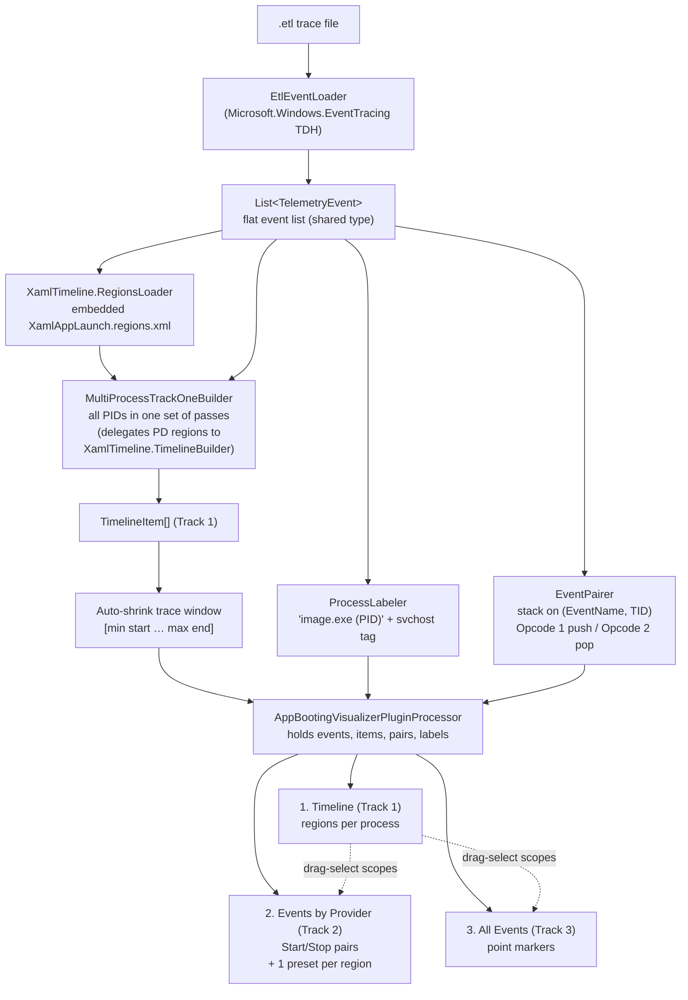

# App Booting Visualizer Plugin — WPA Plugin

A [Windows Performance Analyzer](https://learn.microsoft.com/en-us/windows-hardware/test/wpt/windows-performance-analyzer) (WPA) plugin that turns a raw ETL trace of a **WinUI 3 / packaged app launch** into a 3-track Gantt view: high-level launch regions, ETW Start/Stop phases grouped by provider, and the full raw event stream.

It is the WPA counterpart to the standalone [`XamlTelemetryViewerWInui3`](../XamlTelemtryViewerWInui3/) viewer — same regions, same pairing logic, same labels — but rendered inside WPA so you get its zoom, pivoting, and time-axis tools for free.

---

## Features

- **Track 1 — Launch Timeline (`1. Timeline (Track 1)`)**
  - One expandable Gantt row per process in the trace.
  - Detects launch *regions* (markers + phases) declared in the shared [`XamlTimeline/Regions/XamlAppLaunch.regions.xml`](../XamlTimeline/Regions/XamlAppLaunch.regions.xml): `UserClick`, `Pre-Process`, `ProcessStart`, `Packaged App Init`, `Native Bring-up`, `XAML`, `App ready to interact`, etc.
  - Display window auto-shrinks to `[first region start … last region end]` so the chart isn't dominated by empty pre/post-launch time.
  - Process column is a pivot key — WPA shows one collapsible row group per process.

- **Track 2 — Events by Provider (`2. Events by Provider (Track 2)`)**
  - Every ETW `Opcode=1`/`Opcode=2` pair on the same `(EventName, ThreadId)` rendered as a real Gantt bar with a real duration.
  - Pivoted **Provider → Process → EventName**.
  - One **TableConfiguration preset per Track 1 region** — auto-filtered to that region's `SpecialProviders` (and to the PIDs that actually fired the region for `ProcessDependent` regions).
  - Shares Track 1's x-axis: drag-select on Track 1 auto-scopes Track 2.

- **Track 3 — All Events (`3. All Events (Track 3)`)**
  - Every raw event inside the Track 1 window, drawn as point markers (`Start == End`).
  - Catches `Opcode=0` info events and unmatched starts/stops that Track 2 drops.
  - Pivoted **Provider → Process → Event**, shares the global time axis.

- **WinUI-viewer-equivalent rendering** — events are loaded with `Microsoft.Windows.EventTracing` (TDH), and the event model, region parsing, Track 1 detection, and the event-pairing rules are **shared** with the viewer via the [`XamlTimeline`](../XamlTimeline/) library, so the same trace produces the same values in both tools.

- **Smart process labelling** — labels are `"<ImageName> (<PID>)"`, with the `svchost.exe` service tag appended automatically from `Microsoft-Windows-Kernel-Process/ProcessStart`.

---

## Install

The plugin is built from source — no pre-built `.ptix` ships in the repo (source-only policy: no binary artifacts checked in).

1. **Build the `.ptix`** — see the [Creating the `.ptix` file](#creating-the-ptix-file) section below. The result is `AppBootingVisualizerPlugin-<version>.ptix` (≈ 19 MB) written next to `Pack.ps1`.
2. Open **WPA → Manage → Plugins → Install Plugin…** and pick the freshly built `.ptix`.
3. Restart WPA, then **File → Open** an `.etl` trace.
4. The three tables appear under the **"App Booting Visualizer Plugin"** category in the Graph Explorer.

> **Dev / hot-reload alternative:** instead of installing the `.ptix`, build the project (`dotnet publish -o PluginPackage`) and launch WPA with `wpa.exe -addsearchdir <full-path-to>\PluginPackage`. WPA will load the plugin DLLs directly from that folder.

---

## How it works



> `TelemetryEvent`, `PhaseDefinition`, `EventMatcher`, `PayloadFilter`, `TimelineItem`,
> `RegionsLoader`, and `TimelineBuilder` come from the shared
> **[XamlTimeline](../XamlTimeline/)** `netstandard2.0` library (referenced via
> `ProjectReference`). `EtlEventLoader`, `EventPairer`, `ProcessLabeler`,
> `RegionProviderSummarizer`, `MultiProcessTrackOneBuilder`, and the WPA `Tables/` are
> plugin-specific.

### Per-track flow

1. **Parse** — `EtlEventLoader` opens the ETL with `TraceProcessor.Create(...).UseGenericEvents()` and projects every `IGenericEvent` to a `TelemetryEvent` — the shared `XamlTimeline` event type (timestamp, provider GUID + name, event name, opcode, PID, TID, formatted payload).
2. **Region detection** — `RegionsLoader.LoadEmbeddedDefault()` (from `XamlTimeline`) deserialises the **canonical** `XamlAppLaunch.regions.xml` embedded in the shared library into `PhaseDefinition`s (Markers + Phases, per-track, with optional payload matchers using `${ProcessName}` substitution). It is a standard **WPA Regions of Interest** file with tool metadata in the standard `<Metadata>` node. The viewer app loads the exact same file.
3. **Track 1 build** — `MultiProcessTrackOneBuilder` builds Track 1 for **all** candidate PIDs in a single set of passes over the events (instead of one full scan per process), matching each `PhaseDefinition`'s Start/Stop (or single Marker) using `EventMatcher` + `PayloadFilter`. `ProcessDependent` regions (incl. the XAML end-heuristic) are bucketed by PID and routed through the shared `XamlTimeline.TimelineBuilder.BuildTrackOne`; the rest run trace-wide with per-process `${ProcessName}` payload routing. This drops the cost from O(processes × events × regions) to ≈ O(events × regions).
4. **Display window shrink** — the global trace window is clamped to `[min Track 1 item start … max Track 1 item end]`, so WPA's x-axis frames the launch.
5. **Track 2 build** — `EventPairer` walks events once, stacks `Opcode=1` on `(baseEventName, ThreadId)`, pops on `Opcode=2`, emits a `PairedEvent` (a plugin-local row model). `EventsByProviderTable` renders them as a Gantt and registers one `TableConfiguration` per Track 1 region, pre-filtered to that region's `SpecialProviders`.
6. **Track 3** — renders the raw `TelemetryEvent` list directly as point markers.

All three Gantt tables share the same `DataSourceInfo` window (set in `GetDataSourceInfo`), so a time-range selection on Track 1 propagates to Track 2 / Track 3 automatically.

---

## Project layout

```
AppBootingVisualizerPlugin/                          ← plugin folder (the solution is ../Tooling.sln)
├── README.md                                  ← you are here
├── .gitignore                                 ← excludes build outputs + generated .ptix
└── AppBootingVisualizerPlugin/                      ← project root
    ├── AppBootingVisualizerPlugin.csproj            ← netstandard2.0; SDK + EventTracing refs
    │                                          ←   + ProjectReference ../../XamlTimeline
    ├── pluginManifest.json                    ← .ptix identity / owner / description
    ├── Pack.ps1                               ← publish + strip + plugintool pack
    ├── AppBootingVisualizerPluginDataSource.cs      ← [ProcessingSource] + [FileDataSource(".etl")]
    ├── AppBootingVisualizerPluginProcessor.cs       ← ICustomDataProcessor orchestrator
    ├── Models/
    │   └── PairedEvent.cs                     ← Start/Stop pair (Track 2 Gantt row) — plugin-local
    ├── Services/
    │   ├── EtlEventLoader.cs                  ← ETL → TelemetryEvent[]
    │   ├── EventPairer.cs                     ← TelemetryEvent[] → PairedEvent[]
    │   ├── MultiProcessTrackOneBuilder.cs     ← all-PID Track 1 in one pass (O(events×regions))
    │   ├── ProcessLabeler.cs                  ← PID → "image.exe (PID) [svchost: …]"
    │   ├── RegionProviderSummarizer.cs        ← provider lists for Track 2 presets
    │   └── Diag.cs                            ← lightweight in-process trace log
    └── Tables/
        ├── TimelineTrack1Table.cs             ← "1. Timeline (Track 1)"
        ├── EventsByProviderTable.cs           ← "2. Events by Provider (Track 2)"
        └── AllEventsMarkersTable.cs           ← "3. All Events (Track 3)"

# Shared core (referenced via ProjectReference, not part of this project):
../../XamlTimeline/                            ← netstandard2.0 library
    TelemetryEvent, PhaseDefinition, EventMatcher, PayloadFilter, TimelineItem,
    RegionsLoader, TimelineBuilder, Regions/XamlAppLaunch.regions.xml (embedded)
```

> The event model, region types, region parser, and Track 1 builder moved to the shared
> [`XamlTimeline`](../XamlTimeline/) library. `dotnet publish` (run by `Pack.ps1`)
> automatically bundles `XamlTimeline.dll` into the plugin package, so the `.ptix` is
> self-contained.

---

## Building from source

### Prerequisites

- **.NET SDK** (the project targets `netstandard2.0`; any current SDK works). The build also
  compiles the referenced [`XamlTimeline`](../XamlTimeline/) project automatically.
- **`plugintool`** (only needed to repackage the `.ptix`):
  ```powershell
  dotnet tool install --global Microsoft.Performance.Toolkit.Plugins.Cli --version 0.1.77-preview
  ```
  > Why a pinned preview version? `Microsoft.Performance.Toolkit.Plugins.Cli` only ships preview builds on nuget.org (no stable release exists — it has been "preview in name, production in practice" for years). We pin to `0.1.77-preview` because that is the version this repo has been built and verified against; `--version` is required because `dotnet tool install` skips prerelease packages by default.

### Build the plugin DLLs (no `.ptix`)

```powershell
cd perf\tooling\AppBootingVisualizerPlugin\AppBootingVisualizerPlugin
dotnet publish -c Debug -o PluginPackage
```

Then point WPA at the publish folder for a hot-reload-style dev loop:
```powershell
wpa.exe -addsearchdir (Resolve-Path .\PluginPackage)
```

---

## Creating the `.ptix` file

The `.ptix` is the single-file artifact you hand to **WPA → Manage → Plugins → Install Plugin…**. Build it with [`Pack.ps1`](AppBootingVisualizerPlugin/Pack.ps1):

```powershell
cd perf\tooling\AppBootingVisualizerPlugin\AppBootingVisualizerPlugin
.\Pack.ps1                            # Debug build → AppBootingVisualizerPlugin-1.0.0.ptix
.\Pack.ps1 -Configuration Release     # Release build
```

The script writes `AppBootingVisualizerPlugin-<version>.ptix` next to itself (≈ 19 MB). `<version>` is read from [`pluginManifest.json`](AppBootingVisualizerPlugin/pluginManifest.json).

### What `Pack.ps1` does (3 steps)

| # | Step | Why |
|---|------|-----|
| 1 | `dotnet publish -c <cfg> -o PluginPackage` | Compiles + collects every runtime dependency in one folder. |
| 2 | Mirror `PluginPackage` → `PtixSource`, **stripping** `Microsoft.Performance.SDK*.dll`, `*.pdb`, and `pluginManifest.json` | `plugintool` fails silently with *"SDK should not present"* if the SDK runtime is bundled — WPA loads its own copy. |
| 3 | `plugintool pack -s PtixSource -m pluginManifest.json -o <id>-<version>.ptix -w` | Produces the final `.ptix`. The `-w` flag treats warnings as informational. |

### Doing it manually (no `Pack.ps1`)

```powershell
cd perf\tooling\AppBootingVisualizerPlugin\AppBootingVisualizerPlugin

# 1. Publish
dotnet publish -c Release -o PluginPackage --nologo

# 2. Stage (strip SDK runtime + pdbs + manifest)
Copy-Item PluginPackage PtixSource -Recurse -Force
Get-ChildItem PtixSource -Filter 'Microsoft.Performance.SDK*.dll' | Remove-Item
Get-ChildItem PtixSource -Filter '*.pdb'                          | Remove-Item
Get-ChildItem PtixSource -Filter 'pluginManifest.json'            | Remove-Item

# 3. Pack
plugintool pack -s PtixSource -m pluginManifest.json `
                -o AppBootingVisualizerPlugin-1.0.0.ptix -w
```

### Reusing `Pack.ps1` for another plugin

`Pack.ps1` is **plugin-agnostic** — it reads the plugin id and version from `pluginManifest.json`, so the same script works for any Performance Toolkit plugin in this repo. Drop it next to a sibling plugin's `.csproj` + `pluginManifest.json` and run it:

```powershell
cd perf\tooling\SomeOtherPlugin\SomeOtherPlugin
..\..\AppBootingVisualizerPlugin\AppBootingVisualizerPlugin\Pack.ps1 -Configuration Release
# → SomeOtherPlugin-<version>.ptix
```

Or override every path explicitly (useful from CI or a different working dir):

```powershell
.\Pack.ps1 `
    -Configuration Release `
    -Manifest    .\pluginManifest.json `
    -PublishDir  .\out\publish `
    -StagingDir  .\out\staging `
    -OutputDir   .\out
```

Bumping the version is a one-line edit in [`pluginManifest.json`](AppBootingVisualizerPlugin/pluginManifest.json):

```json
"identity": { "id": "AppBootingVisualizerPlugin", "version": "1.0.1" }
```

---

## Customising the regions

The region detection is fully data-driven by a **single shared file**. To add / tweak a region, edit [`XamlTimeline/Regions/XamlAppLaunch.regions.xml`](../XamlTimeline/Regions/XamlAppLaunch.regions.xml) — the same file the WinUI viewer uses, so both tools stay in sync. It is a standard **WPA Regions of Interest** file (so it also opens directly in WPA via *Trace > Trace Properties > Add*); tool-only data WPA doesn't act on is carried in the standard `<Metadata>` node, which WPA ignores for processing:

```xml
<Region Guid="{...}" Name="XamlAppLaunch-MyPhase" FriendlyName="MyPhase">
  <Start>
    <Event Provider="{531a35ab-63ce-4bcf-aa98-f88c7a89e455}" Id="31" Version="0" Name="InitializeCore" />
  </Start>
  <Stop>
    <Event Provider="{531a35ab-63ce-4bcf-aa98-f88c7a89e455}" Name="Frame" />
  </Stop>
  <Metadata>
    <Track>1</Track>
    <Kind>Phase</Kind>
    <Color>#56B4E9</Color>
    <ProcessDependent>true</ProcessDependent>
    <XamlEndHeuristic>true</XamlEndHeuristic>
    <SpecialProviders>Microsoft-Windows-XAML</SpecialProviders>
  </Metadata>
</Region>
```

- `Guid` (required by WPA) + `Name` (unique id); `FriendlyName` is the display label the tools show.
- `<Track>1</Track>` → render on Track 1 (trace-level); omit for trace-wide regions that don't appear on the chart.
- `<Kind>Marker</Kind>` for point events (only `<Start>`), `<Kind>Phase</Kind>` for Start/Stop pairs.
- `<ProcessDependent>true</ProcessDependent>` scopes the region to the selected PID.
- `${ProcessName}` inside a `<PayloadIdentifier FieldName="..." FieldValue="..." />` (under `<Start>` or `<Stop>`) is substituted with the candidate process's image name (case-insensitive contains match).
- `<SpecialProviders>` (a `;`-separated provider list) drives the Track 2 preset for this region.

The XML is an **embedded resource of `XamlTimeline`**, so any change requires a rebuild (`dotnet publish` or `Pack.ps1`).

---

## Related tools

| Tool | Location | Purpose |
|------|----------|---------|
| **XamlTelemetryViewerWInui3** | [`perf/tooling/XamlTelemtryViewerWInui3`](../XamlTelemtryViewerWInui3/) | Standalone WinUI 3 viewer — same parser, same regions, same pairing. Use it for ad-hoc browsing without WPA. |
| **App Booting Visualizer Plugin** | *here* | WPA plugin — use it inside WPA when you want WPA's zoom / pivot / multi-graph tooling on top of the same data. |

