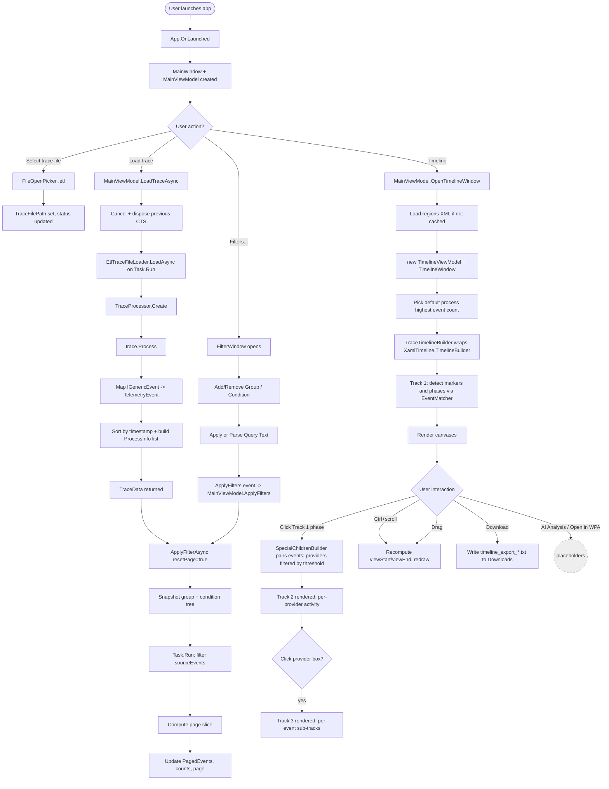

# XamlTelemetryViewerWInui3

A WinUI 3 desktop tool for inspecting **ETW (Event Tracing for Windows) `.etl` traces** of XAML/WinUI applications. It lets you browse millions of events in a paginated, filterable grid and visualises the boot lifecycle of one or more traces (one process per trace) on a zoomable, multi-track timeline driven by an embedded region definition file.

The viewer is designed for **WinUI 3 / Windows App SDK launch-perf investigations**: turning a raw kernel-level ETL into a navigable picture of what happened from `UserClick` to "App ready to interact".

---

## Table of contents

1. [Screenshots / windows](#windows)
2. [Feature reference](#features)
3. [How to use — step by step](#how-to-use)
4. [Region definition XML](#regions-xml)
5. [Architecture & flow chart](#flow-chart)
6. [Project layout](#project-layout)
7. [Dependencies](#dependencies)
8. [Building & running](#build)
9. [Troubleshooting](#troubleshooting)

---

<a id="windows"></a>
## 1. The three windows

| Window | Purpose |
|---|---|
| **MainWindow** | File picker (multi-select), **one tab per loaded trace**, paginated event grid, filter panel toggle, light/dark theme toggle, status bar. The "home" view. |
| **FilterWindow** | Group/condition filter editor with an equivalent text-query form. Opens as a separate top-level window. |
| **TimelineWindow** | Visualises the loaded traces' launch lifecycle as zoomable tracks. Stacks **one Track 1 lane per loaded trace** on a shared time scale (each lane has its own process picker); Track 2 = per-provider activity (multi-trace: one sub-lane per trace), Track 3 = per-event sub-tracks. Includes Download (text export) and AI-Analysis / Open-in-WPA placeholders. |

All three are standard WinUI 3 `Window`s; child windows are closed automatically when `MainWindow` closes. All windows register with `ThemeManager`, so the light/dark toggle switches every window at once.

---

<a id="features"></a>
## 2. Feature reference

### Trace loading

* **Select trace file…** — opens a `FileOpenPicker` filtered to `.etl` and accepts **multiple files**. Each chosen file becomes a tab; nothing is parsed yet.
* **Load trace** — runs `EtlTraceFileLoader.LoadAsync` on a worker thread (per file) using the `Microsoft.Windows.EventTracing.Processing.All` SDK. Each load returns a `TraceData` object containing:
  * `Events` — `IReadOnlyList<TelemetryEvent>` (sorted by timestamp)
  * `Processes` — process inventory with event counts, ordered by event count descending
  * `TraceStart` / `TraceEnd` — bounds for the timeline x-axis
* **Multiple traces** — loaded traces appear as **tabs**; selecting a tab repoints the grid/filter to that trace, and the timeline stacks one lane per trace. Close a tab to drop a trace.
* Load is **cancellable** — clicking Load again cancels the in-flight parse before starting a new one.

### Paginated event grid

* Columns: `Timestamp`, `ProviderGuid`, `Process`, `PID`, `Provider`, `Event`, `Level`, `Opcode`, `TID`, `Payload`.
* Columns are **resizable** at the header via the `ColumnResizer` helper; widths are stored in `ColumnWidths` and applied uniformly to header + all realised rows.
* **Pagination** controls (Previous / Next / Page X of Y) with selectable page sizes (100, 200, 500, 1000). Re-filtering snaps you back to page 1.
* **Filtered / Total** counts on the right of the status bar.

### Filtering

* Filters are organised as **groups of conditions**:
  * Conditions inside a group are joined by `And` / `Or` (per-condition).
  * Groups themselves are joined by `And` / `Or` (per-group).
  * Each group and each condition has an **Enabled** checkbox; disabled rows are ignored entirely (effectively `true`).
* Supported fields: `ProcessName`, `ProcessId`, `ProviderName`, `EventName`, `Level`, `Opcode`, `ThreadId`, `Payload`.
* Supported operators: `Contains`, `Equals`, `StartsWith`, `EndsWith`.
* String comparison is **case-insensitive** (`OrdinalIgnoreCase`).
* The **Query Text** box mirrors the grid in a parseable form; click **Parse Query Text** to push edits back into the grid, or **Refresh Text** to regenerate the text from the current grid state.
* Filtering runs off the UI thread on snapshots of the filter tree (thread-safe even if the user edits while a filter is in-flight), and is also cancellable.

### Timeline view

* Click **📊 Timeline** to open `TimelineWindow` for the loaded trace(s).
* **One Track 1 lane per loaded trace**, stacked top-to-bottom on a **shared time scale** so launches line up; each lane has its own process picker (sorted by event count, defaulting to the busiest XAML process). A single trace shows a single lane.
* The window has the stacked Track 1 lanes plus Track 2/3 and a Hover panel:

  | Track | What it shows |
  |---|---|
  | **Track 1** | Per-trace launch phases & markers detected from the embedded regions XML (e.g. `UserClick` → `ProcessStart` → `Packaged App Init` → `Native Bring-up` → `XAML` → `App ready to interact`). One lane per trace. |
  | **Track 2** | Provider-level activity *inside* a selected Track 1 region — opens when you click a phase. Pivoted **provider → trace** (one sub-lane per trace, each on its own region window). Shows top providers by event count; **Show Remaining Providers** reveals the long tail. |
  | **Track 3** | Per-event sub-tracks under a selected Track 2 provider, with toggleable event names. |

* **Zoom & pan**: `Ctrl + scroll` zooms the x-axis, `Left-drag` pans, **Reset Zoom** restores the 0..1 view (per sub-lane on Track 2/3).
* **Hover** any bar to see a detail panel (Event, Provider, Start/End **in ms from trace start** + duration, Level, Process, Thread, Payload) — on Track 1, 2, and 3.
* **Download** — exports the Track 1 items (name, kind, start/end/duration, start & end event metadata) to `%USERPROFILE%\Downloads\timeline_export_<yyyyMMdd_HHmmss>.txt`.
* **AI Analysis** and **Open in WPA** buttons are visible when a Track 2 region is selected (currently placeholders for future integrations).
* **Light/dark theme** — the toolbar toggle flips all windows; code-built canvases resolve colours via `ThemeBrush`/`ThemeManager`.

### Performance behaviour

* Trace parsing, event-to-`TelemetryEvent` conversion, filter evaluation, and pagination are all on `Task.Run`; the UI thread only renders.
* `CancellationTokenSource` is used for both load and filter; the prior token is cancelled and disposed before a new operation starts.
* Filter evaluation operates on **immutable snapshots** of the group/condition tree so user edits don't race the worker.

---

<a id="how-to-use"></a>
## 3. How to use — step by step

### Capture an ETL trace first

This viewer doesn't capture traces; use `xperf`, `wpr`, or `tracelog` to capture one. Typical capture for a packaged WinUI 3 app:

```cmd
wpr -start GeneralProfile -filemode
:: launch your app, exercise it
wpr -stop trace.etl
```

The viewer expects a regular merged `.etl` produced by ETW.

### Workflow inside the viewer

1. **Launch the app** (`dotnet run` from the project folder, or run the built MSIX).
2. Click **Select trace file…** and pick one or more `.etl` files (each opens as a tab). The status bar will read *"Trace file selected. Click Load trace to process."*
3. Click **Load trace**. A progress message shows total events and how many remain after the current filter (initially all).
4. *(optional)* Click **Filters…** to open the filter editor:
   * **Add Group** → **Add Condition** → choose Field/Op/Value → tick **On**.
   * Press **Apply** to re-filter the grid. Counts update at the bottom right of MainWindow.
   * Or type a query in the Query Text box, e.g.
     ```
     ProviderName Contains "XAML" And Level Equals "Informational"
     ```
     and click **Parse Query Text**.
5. Use **Previous / Next** to page through the filtered results; change **Page size** for denser screens.
6. Click **📊 Timeline** to open the timeline visualisation.
   * Each trace gets its own lane with a process picker (defaults to the busiest XAML process); switch processes per lane.
   * Click any Track 1 phase to expand it into Track 2 (per-provider activity).
   * Click a provider box to drill into Track 3.
   * **Ctrl-scroll** to zoom; **left-drag** to pan; **Reset Zoom** to recenter.
7. Click **⬇ Download** to dump Track 1 as a text report to your Downloads folder.

---

<a id="regions-xml"></a>
## 4. Region definition XML

The timeline knows nothing about XAML or WinUI hard-coded — it discovers regions from the **canonical** `XamlAppLaunch.regions.xml` embedded in the shared `XamlTimeline` library, loaded via `RegionsLoader.LoadEmbeddedDefault()` (the same file the WPA plugin uses).

### Schema

It is a standard **WPA "Regions of Interest"** file, so the same file opens directly in WPA (*Trace > Trace Properties > Add*). Metadata WPA has no concept of (track, marker-vs-phase, colour, special-provider allow-lists, heuristics) is carried in the standard WPA `<Metadata>` node, which WPA ignores for processing and merely surfaces in its UI:

```xml
<InstrumentationManifest>
  <Instrumentation><Regions>
    <RegionRoot Guid="{...}" Name="XamlAppLaunch" FriendlyName="XAML App Launch">
      <Region Guid="{...}" Name="XamlAppLaunch-MyPhase" FriendlyName="...">
        <Start>
          <Event Provider="{guid}" Id="N" Version="0" Name="EventName" />
          <PayloadIdentifier FieldName="appId" FieldValue="${ProcessName}" />   <!-- optional -->
        </Start>
        <Stop>                                                                  <!-- Phase only -->
          <Event Provider="{guid}" Name="EventName" />
          <PayloadIdentifier FieldName="ImageName" FieldValue="${ProcessName}" />
        </Stop>
        <Metadata>
          <Track>1</Track> <Kind>Marker|Phase</Kind> <Color>#RRGGBB</Color>
          <ProcessDependent>true|false</ProcessDependent>
          <SpecialProviders>ProviderA;ProviderB</SpecialProviders>
        </Metadata>
      </Region>
    </RegionRoot>
  </Regions></Instrumentation>
</InstrumentationManifest>
```

* `Guid` (required by WPA) + `Name` (unique id); `FriendlyName` is the display label the tools show.
* **`<Kind>Marker</Kind>`** = point-in-time (only `<Start>` is required).
* **`<Kind>Phase</Kind>`** = a duration (both `<Start>` and `<Stop>` required).
* `${ProcessName}` in any `PayloadIdentifier` `FieldValue` is substituted at runtime with the selected process's image name (case-insensitive contains match) — that's how a single XML works for every process.
* `<ProcessDependent>true</ProcessDependent>` scopes the match to events emitted by the selected process.
* Tool data rides in the standard WPA `<Metadata>` node.

### Built-in provider IDs referenced by the bundled XML

| GUID | Name |
|---|---|
| `ee97cdc4-b095-5c70-6e37-a541eb74c2b5` | Microsoft.Windows.AppLifeCycle.UI |
| `382b5e24-181e-417f-a8d6-2155f749e724` | Microsoft.Windows.ShellExecute |
| `5526aed1-f6e5-5896-cbf0-27d9f59b6be7` | Microsoft.Windows.ApplicationModel.DesktopAppx |
| `22fb2cd6-0e7b-422b-a0c7-2fad1fd0e716` | Microsoft-Windows-Kernel-Process |
| `a9da4dcc-e78e-5ce7-4078-411a9928f082` | Microsoft.Windows.CoreApplication |
| `531a35ab-63ce-4bcf-aa98-f88c7a89e455` | Microsoft-Windows-XAML |

You can add your own regions by editing the **canonical** [`../XamlTimeline/Regions/XamlAppLaunch.regions.xml`](../XamlTimeline/Regions/XamlAppLaunch.regions.xml) and rebuilding (it's an embedded resource of the shared library).

---

<a id="flow-chart"></a>
## 5. Architecture & data flow

### MVVM layering

```
+------------------+        +-------------------+        +--------------------------+
|   Views (XAML)   |  <-->  |    ViewModels     |  -->   |   Services (parsing/IO)  |
|                  |        |                   |        |                          |
| MainWindow       |        | MainViewModel     |        | EtlTraceFileLoader       |
| FilterWindow     |        | FilterWindowVM    |        | TraceTimelineBuilder     |
| TimelineWindow   |        | TimelineVM        |        | SpecialChildrenBuilder   |
+------------------+        +-------------------+        +-----------+--------------+
        ^                           |                                | uses
        | bindings                  v                                v
        |                  +-------------------+        +--------------------------+
        |                  |     Models        |        |  XamlTimeline (shared)   |
        |                  | TraceData         |        |  netstandard2.0 library  |
        |                  | ProcessInfo       |        |  TelemetryEvent          |
        |                  | EventFilter /     |        |  PhaseDefinition         |
        |                  | FilterGroup /     |        |  EventMatcher            |
        |                  | FilterCondition   |        |  TimelineItem            |
        |                  | SpecialChild*     |        |  PayloadFilter           |
        |                  |                   |        |  RegionsLoader           |
        |                  | Timeline/{TraceTimelineModel, TimelineLane}  TimelineBuilder         |
        |                  +-------------------+        |  + embedded regions.xml  |
        |                                               +--------------------------+
   Converters & Helpers (DistinctColorProvider, ColumnResizer,
                         TimestampConverter, GuidToLowercaseConverter, Filter*Converter,
                         TimelineMath / TimelineLayout / TimelineColorHelper)
```

The event model (`TelemetryEvent`), region types (`PhaseDefinition`, `EventMatcher`,
`TimelineItem`, `PayloadFilter`), region parsing (`RegionsLoader`), and Track 1 detection
(`TimelineBuilder`) live in the shared **[XamlTimeline](../XamlTimeline/)** library
(referenced via `ProjectReference`, imported globally in `GlobalUsings.cs`). The viewer's
`TraceTimelineBuilder` is a thin wrapper that calls
`XamlTimeline.TimelineBuilder.BuildTrackOne(...)` and packages the result into a
`TraceTimelineModel`.

### End-to-end flow chart (Mermaid)



### Sequence: a typical "load + filter" turn

```
User                MainWindow             MainViewModel           EtlTraceFileLoader
 |  click Load          |                       |                        |
 |--------------------> |                       |                        |
 |                      | Click handler         |                        |
 |                      | (async void)          |                        |
 |                      |---------------------->| LoadTraceAsync         |
 |                      |                       |---- Task.Run --------->|
 |                      |                       |                        | TraceProcessor.Create
 |                      |                       |                        | trace.Process()
 |                      |                       |                        | map -> TelemetryEvent[]
 |                      |                       |<-----------------------|
 |                      |                       | ApplyFilterAsync()     |
 |                      |                       |---- Task.Run --------->|
 |                      |                       |  evaluate snapshot     |
 |                      |                       |<-----------------------|
 |                      |   OnPropertyChanged(PagedEvents/Counts/Status)
 |                      |<--- INPC -------------|
 |   grid refreshes     |                       |                        |
 |<---------------------|                       |                        |
```

---

<a id="project-layout"></a>
## 6. Project layout

```
XamlTelemtryViewerWInui3/                # app folder (open ..\Tooling.sln in VS; app is startup)
└── XamlTelemtryViewerWInui3/            # the WinUI app project
    ├── App.xaml / App.xaml.cs           # Application entry point; owns the main Window
    ├── MainWindow.xaml(.cs)             # Tabs (one per trace), paginated grid, theme toggle, status bar
    ├── FilterWindow.xaml(.cs)           # Group/condition editor + query text
    ├── TimelineWindow.xaml(.cs)         # Multi-track timeline (partials: .Track1/.Track2/.Track2Multi/.Track3)
    ├── GlobalUsings.cs                  # `global using XamlTimeline;`
    │
    ├── ViewModels/
    │   ├── MainViewModel.cs             # Multi-trace load, tabs, filtering, pagination
    │   ├── FilterWindowViewModel.cs     # Add/Remove/Parse/Apply commands
    │   └── TimelineViewModel.cs         # One TimelineLane per trace, process selection, rebuild, hover
    │
    ├── Services/
    │   ├── EtlTraceFileLoader.cs        # TraceProcessor-based trace parsing
    │   ├── TraceTimelineBuilder.cs      # Wraps XamlTimeline.TimelineBuilder -> TraceTimelineModel
    │   └── SpecialChildrenBuilder.cs    # Track 2/3 per-provider event pairing
    │
    ├── Models/
    │   ├── TraceData.cs                         # One parsed trace + its label/path
    │   ├── ProcessInfo.cs                       # Process metadata + event count
    │   ├── EventFilter.cs / FilterGroup.cs / FilterCondition.cs   # Filter tree
    │   ├── SpecialChild*.cs                                       # Track 2/3 inputs
    │   ├── ColumnWidths.cs                                        # UI-state models
    │   └── Timeline/{TraceTimelineModel, TimelineLane}.cs         # Per-trace items + stacked lane
    │
    ├── Converters/                      # Timestamp, GuidToLowercase, FilterField/Operator/Join
    ├── Helpers/                         # ColumnResizer, DistinctColorProvider,
    │                                    #   ThemeManager / ThemeBrush, TimelineMath/Layout/ColorHelper
    │
    ├── Package.appxmanifest             # Single-project MSIX manifest
    ├── Properties/                      # launchSettings.json + win-x86/x64/arm64 publish profiles
    ├── app.manifest / Assets/           # Win32 + tile assets
    └── XamlTelemtryViewerWInui3.csproj  # ProjectReference -> ../../XamlTimeline/XamlTimeline.csproj

# Shared core (referenced, not part of this project):
../XamlTimeline/                          # netstandard2.0 library
    TelemetryEvent, PhaseDefinition, EventMatcher, TimelineItem, PayloadFilter,
    RegionsLoader, TimelineBuilder, Regions/XamlAppLaunch.regions.xml (embedded)
```

> `TelemetryEvent`, `PhaseDefinition`, `EventMatcher`, `TimelineItem`, `PayloadFilter`,
> `RegionsLoader`, and `TimelineBuilder` are **not** in this project — they moved to the
> shared [`XamlTimeline`](../XamlTimeline/) library. The canonical
> `XamlAppLaunch.regions.xml` is embedded there and loaded via `LoadEmbeddedDefault()`.

---

<a id="dependencies"></a>
## 7. Dependencies

### Runtime / language

| Item | Version |
|---|---|
| Target framework | `net8.0-windows10.0.19041.0` |
| TargetPlatformMinVersion | `10.0.17763.0` |
| Platforms | `x86`, `x64`, `ARM64` |
| C# LangVersion | `preview` (required for the modern `[ObservableProperty]` partial-property syntax) |
| Single-project MSIX | enabled (`EnableMsixTooling=true`, `UseWinUI=true`) |

### NuGet packages (`PackageReference` in `.csproj`)

| Package | Version | Why |
|---|---|---|
| `Microsoft.Windows.SDK.BuildTools` | 10.0.28000.1839 | Win10/11 SDK build tools |
| `Microsoft.WindowsAppSDK` | 2.1.3 | WinUI 3 / Windows App SDK runtime |
| `Microsoft.Windows.EventTracing.Processing.All` | 1.12.10 | ETL parsing (TraceProcessor) |
| `CommunityToolkit.Mvvm` | 8.4.0 | `ObservableObject`, `[ObservableProperty]`, `[RelayCommand]` |

### Project references

| Reference | Kind | Why |
|---|---|---|
| [`../XamlTimeline/XamlTimeline.csproj`](../XamlTimeline/) | `ProjectReference` | Shared `netstandard2.0` core: `TelemetryEvent`, `PhaseDefinition`, `EventMatcher`, `TimelineItem`, `PayloadFilter`, `RegionsLoader`, `TimelineBuilder`, and the embedded canonical `XamlAppLaunch.regions.xml`. |

### System prerequisites

* Windows 10 version 1809 (build 17763) or later — Windows 11 recommended
* Windows App SDK 2.1.3 runtime (installed automatically when you build the MSIX, or via the WinAppSDK runtime installer)
* .NET 8 SDK (or .NET 10 SDK; the `LangVersion=preview` setting needs the .NET 10 SDK on the build machine)
* Visual Studio 2022 17.10+ with the "Windows application development" workload — or just the .NET SDK if you build with `dotnet`

### Region definitions at runtime

The app loads its launch regions from the **embedded** `XamlAppLaunch.regions.xml` inside the
shared `XamlTimeline` assembly via `RegionsLoader.LoadEmbeddedDefault()` — no file needs to be
copied to the output folder. That file is a standard WPA Regions of Interest file, so it can
also be opened directly in WPA.

---

<a id="build"></a>
## 8. Building & running

### Visual Studio (recommended)

1. Open **`Tooling.sln`** (in the parent `perf\tooling` folder). It contains the app, its
   `XamlTimeline` dependency, and the WPA plugin; the app is already the startup project with Deploy enabled.
2. Pick a platform on the toolbar — **x64** (or x86 to match your machine).
3. Press **F5**. VS builds `XamlTimeline`, then the app, deploys the MSIX package, and launches it.

> Open the **`.sln`**, not the bare `.csproj` — the solution pulls in `XamlTimeline` so the
> project reference resolves on a fresh clone.

### Command line

```powershell
cd perf\tooling
dotnet build .\Tooling.sln -p:Platform=x64
```

For a packaged MSIX, use the **Package and Publish** entry in Visual Studio (the project has
`HasPackageAndPublishMenu=true`).

---

<a id="troubleshooting"></a>
## 9. Troubleshooting

| Symptom | Cause | Fix |
|---|---|---|
| `Unable to find project information for ...XamlTimeline.csproj` | Fresh clone hasn't restored the project reference yet | Open **`Tooling.sln`** (not the bare project) and build once, or run `dotnet build .\Tooling.sln` from the command line. Do not delete `XamlTimeline/Directory.Build.props` or `.targets`. |
| `A project with an Output Type of Class Library cannot be started directly` | `XamlTimeline` (a library) is set as the startup project | In Solution Explorer, right-click **XamlTelemtryViewerWInui3** → **Set as Startup Project** (the committed `.sln` already does this). |
| `The project needs to be deployed before we can debug. Please enable Deploy in the Configuration Manager.` | Deploy isn't enabled for the packaged app | **Build → Configuration Manager** → tick **Deploy** for `XamlTelemtryViewerWInui3` (the committed `.sln` already enables it). |
| `Failed to process trace file. The file may be corrupted or in an unsupported format.` | TraceProcessor can't open the ETL | Verify the file with `wpa.exe`. ETL must be a *merged* trace (use `xperf -merge` or `wpr -stop`). |
| Timeline picker shows wrong default process | The default is the one with the highest event count that matches the XAML provider GUID in the regions XML | Use the dropdown to pick the correct process, or tighten the regions XML's `ProcessDependent`/payload matches. |
| Filtering feels slow on huge traces | Filter runs on a snapshot per call | Reduce page size or narrow filters; consider adding a `Contains` on `ProviderName` first to cut the working set. |
| CS9248 "Partial property must have an implementation part" after editing models | The C# language version reverted | Ensure `<LangVersion>preview</LangVersion>` is still present in `XamlTelemtryViewerWInui3.csproj`. |

---

## License

Part of this repository under `perf/tooling/`. Refer to the repository's root license for terms.
