# Background

The XAML [CalendarView](https://docs.microsoft.com/uwp/api/Windows.UI.Xaml.Controls.CalendarView)
control shows the user a calendar and lets them pick a date (range).

A new set of CalendarView styling properties are introduced to allow greater customization of the
control's rendering in upcoming Windows OS releases.
These properties will be used in WinUI to align the CalendarView's styling with the rest of the
standard controls.

The CalendarView control only ships in the OS (Windows namespace),
and thus there is no version in  
[WinUI2](https://github.com/microsoft/microsoft-ui-xaml)
(Microsoft namespace).
Because a large part of the CalendarView rendering is achieved through
custom OS code,
the desired look cannot be achieved solely via XAML markup in the WinUI2 package.
New properties, used by those WinUI 2.6+ packages, are required to drive the custom OS
rendering code.

# Conceptual content

## Today styling

The following properties of type
[Brush](https://docs.microsoft.com/uwp/api/Windows.UI.Xaml.Media.Brush)
are used to customize the current day's rendering when `CalendarView.IsTodayHighlighted` is True:
`TodayBackground`, `TodayBlackoutBackground`, `TodayBlackoutForeground`,
`TodayHoverBackground`, `TodayPressedBackground`, `TodaySelectedInnerBorderBrush`.

### Showcasing the TodayBackground property in the month, year and decade views

The value of the `TodayBackground` property is used in the month, year and decade display modes
of the `CalendarView`:

```xml
<CalendarView TodayBackground='{StaticResource AccentFillColorDefaultBrush}'/>
```

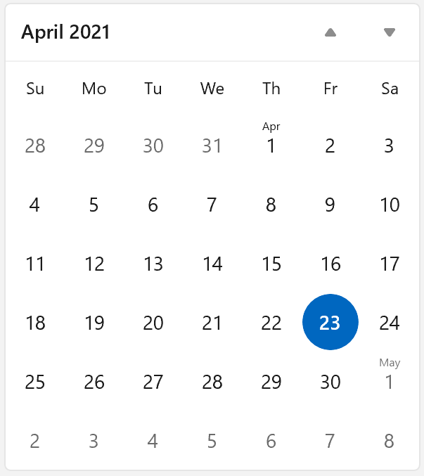
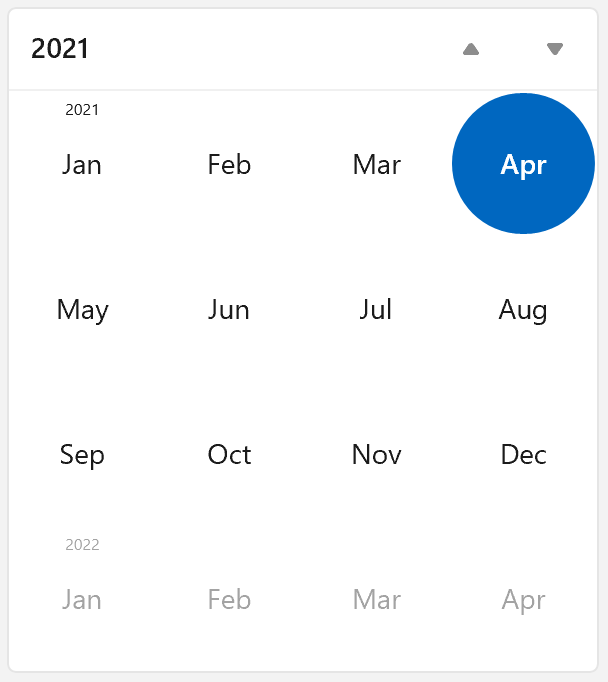
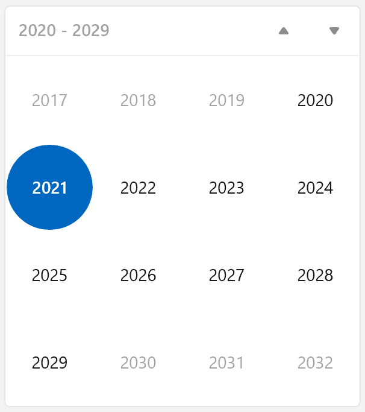

### Showcasing the TodayHoverBackground property - current date is hovered

The value of the `TodayHoverBackground` property is used when the user
hovers a pointer over the current date:

```xml
<CalendarView TodayHoverBackground='{StaticResource AccentFillColorSecondaryBrush}'/>
```


### Showcasing the TodayPressedBackground property - current date is pressed

The value of the `TodayPressedBackground` property is used when the user
clicks/taps the current date:

```xml
<CalendarView TodayPressedBackground='{StaticResource AccentFillColorTertiaryBrush}'/>
```

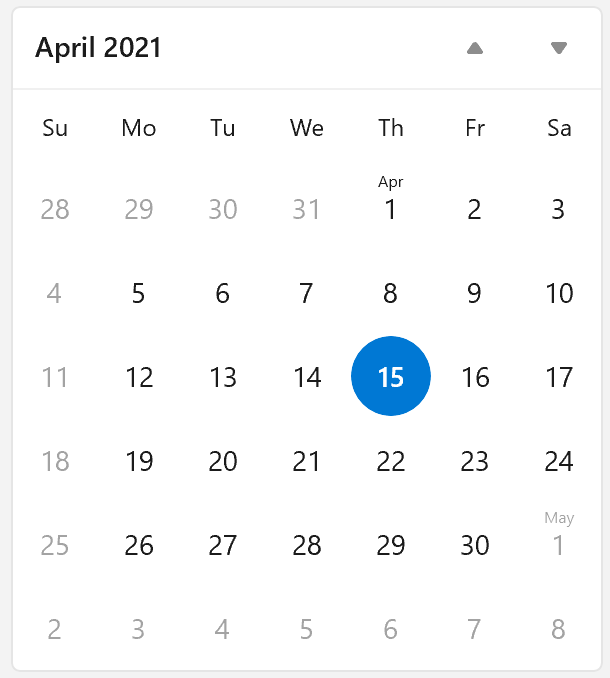

### Showcasing the TodayBlackoutBackground and TodayBlackoutForeground properties - the old property `CalendarView.IsTodayBlackedOut` is True


### Showcasing the `TodaySelectedInnerBorderBrush` property - current date is selected


## Blacked Out styling

The following properties of type Windows.UI.Xaml.Media.Brush are used to customize the calendar items that are blacked out in the month view:
TodayBlackoutBackground, TodayBlackoutForeground, BlackoutStrikethroughBrush.

### Showcasing the BlackoutStrikethroughBrush property - all Sundays are blacked out


## Out Of Scope styling

Out-of-scope calendar items are the items that are visible but not part
of the selection. For example in month view if April is selected, days
from the end of March and/or the beginning of May may be seen.

The following properties of type
[Brush](https://docs.microsoft.com/uwp/api/Windows.UI.Xaml.Media.Brush)
are used to customize the calendar items that are outside the current scope
(month, year, or decade):
`OutOfScopeHoverForeground`, `OutOfScopePressedForeground`.

### Showcasing the `OutOfScopeHoverForeground` property

This example shows the month of April and the beginning of May. Since
`IsOutOfScopeEnabled` is set, the May days are out-of-scope, use different brushes than in-scope days,
but are still selectable.

```xml
<CalendarView IsOutOfScopeEnabled='true' OutOfScopeHoverForeground='{StaticResource TextFillColorPrimaryBrush}'/>
```

In this screenshot the mouse is hovered over the out-of-scope 4th of May,
so the `OutOfScopeHoverForeground` color is displayed.

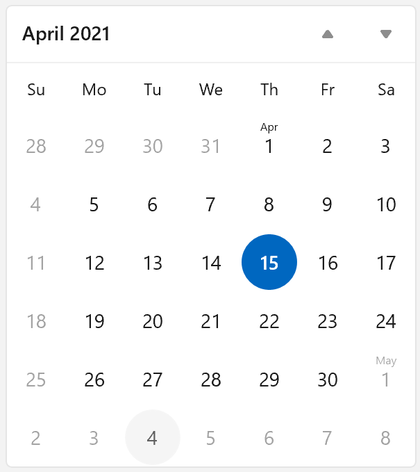

### Showcasing the OutOfScopePressedForeground property

This example shows the month of April and the beginning of May. Since
`IsOutOfScopeEnabled` is set, the May days are out-of-scope, use different brushes than in-scope days,
but are still selectable.

```xml
<CalendarView IsOutOfScopeEnabled='true' OutOfScopePressedForeground='{StaticResource TextFillColorTertiaryBrush}'/>
```

In this screenshot the 4th of May is being pressed,
so the `OutOfScopePressedForeground` color is displayed.

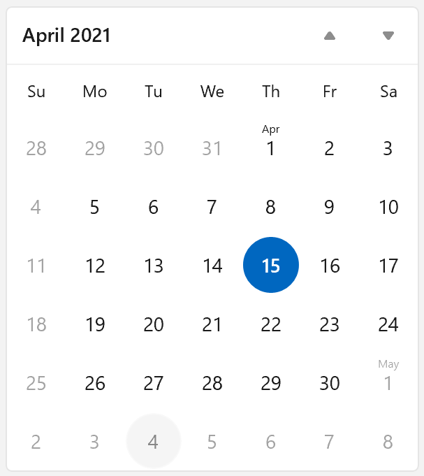

## Item background styling

The `CalendarItemHoverBackground`, `CalendarItemPressedBackground` properties of type
[Brush](https://docs.microsoft.com/uwp/api/Windows.UI.Xaml.Media.Brush)
are used to customize the background rendering of items in any of the `CalendarView's`
[DisplayModes](https://docs.microsoft.com/uwp/api/Windows.UI.Xaml.Controls.CalendarDatePicker.DisplayMode).

### Showcasing the CalendarItemHoverBackground property - February is hovered

This example sets the
[Brush](https://docs.microsoft.com/uwp/api/Windows.UI.Xaml.Media.Brush)
to use as the background when a pointer moves over any calendar item.

```xml
<CalendarView CalendarItemHoverBackground='{StaticResource SubtleFillColorSecondaryBrush}'/>
```

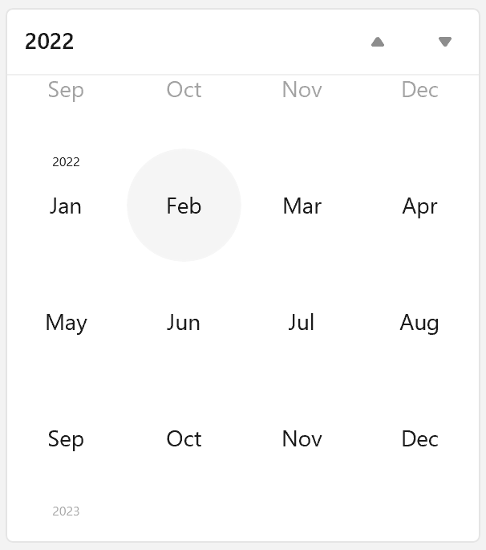

### Showcasing the CalendarItemPressedBackground property - 2034 is pressed

This example sets the
[Brush](https://docs.microsoft.com/uwp/api/Windows.UI.Xaml.Media.Brush)
to use as the background when a calendar item is pressed.

```xml
<CalendarView CalendarItemPressedBackground='{StaticResource SubtleFillColorTertiaryBrush}'/>
```

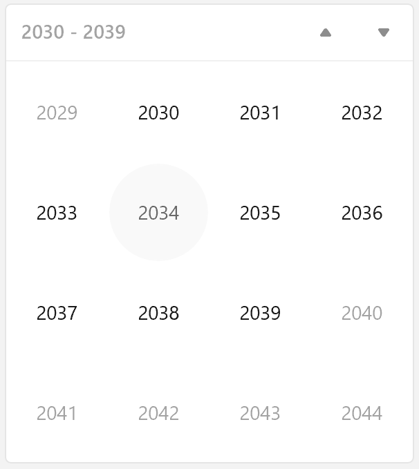

## Disabled styling

The following properties of type 
[Brush](https://docs.microsoft.com/uwp/api/Windows.UI.Xaml.Media.Brush)
are used to customize the rendering of a disabled CalendarView
(when the `CalendarView`
[Control.IsEnabled](https://docs.microsoft.com/uwp/api/Windows.UI.Xaml.Controls.Control.IsEnabled)
is False):
`DisabledForeground`, `SelectedDisabledBorderBrush`, `CalendarItemDisabledBackground`,
`TodayDisabledBackground`.

### Showcasing a disabled month view

In this example the 12th and 20th of April are selected:

``` csharp
calendarView1.SelectedDates.Add(new DateTime(2021, 4, 12));
calendarView1.SelectedDates.Add(new DateTime(2021, 4, 20));

calendarView1.IsEnabled = false;
```

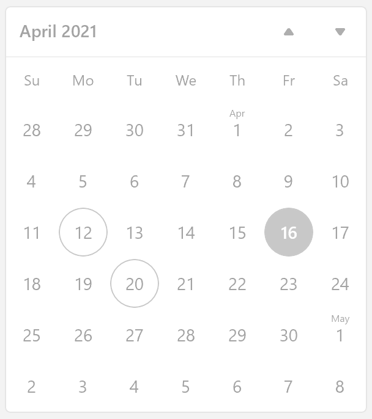

## Day item positioning

The `CalendarView`'s `DayItemMargin`, `MonthYearMargin`, `FirstOfMonthLabelMargin`,
and `FirstOfYearDecadeLabelMargin` properties of type
[Thickness](https://docs.microsoft.com/uwp/api/Windows.UI.Xaml.Thickness)
allow positioning the day, month, year, first-of-month and first-of-year labels within a calendar item.

### Showcasing the DayItemMargin and FirstOfMonthLabelMargin properties

Here the Month view has
[CalendarView.IsGroupLabelVisible](https://docs.microsoft.com/uwp/api/Windows.UI.Xaml.Controls.CalendarView.IsGroupLabelVisible)
set to True and the group and main labels do not overlap because 
`CalendarView.DayItemMargin.Top` is set to 6 pixels.

``` csharp
calendarView1.DayItemMargin = new Thickness(0, 6, 0, 0);

calendarView1.IsGroupLabelVisible = true;
```

April 1st is selected and May 1st is hovered.


### Showcasing the MonthYearMargin and FirstOfYearDecadeLabelMargin properties

A Year view has
[CalendarView.IsGroupLabelVisible](https://docs.microsoft.com/uwp/api/Windows.UI.Xaml.Controls.CalendarView.IsGroupLabelVisible) 
set to True with `CalendarView.MonthYearItemMargin.Top` and
`CalendarView.FirstOfYearDecadeLabelMargin.Top` set to 6 and 2 pixels respectively.

``` csharp
calendarView1.MonthYearItemMargin = new Thickness(0, 6, 0, 0);
calendarView1.FirstOfYearDecadeLabelMargin = new Thickness(0, 2, 0, 0);

calendarView1.IsGroupLabelVisible = true;
```

January 2021 is hovered.

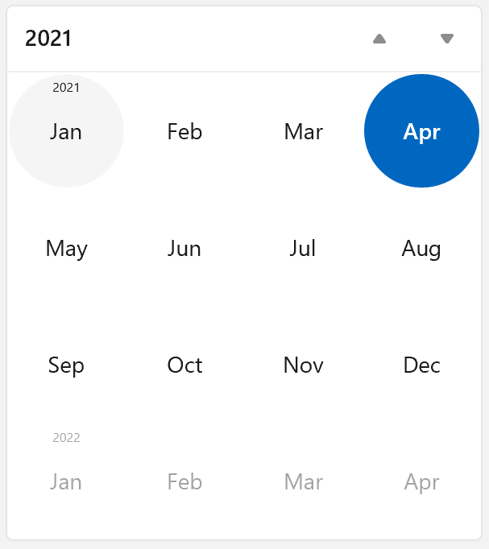

## CalendarView theme resources

You can modify the look of a CalendarView by specifying Xaml resources in your app.
For more info, see the
[lightweight styling guide](https://docs.microsoft.com/en-us/windows/uwp/design/controls-and-patterns/xaml-styles#lightweight-styling).

The new properties in this spec have default values according to new resources:

| Property | Resource key
| - | - |
| BlackoutBackground | CalendarViewBlackoutBackground |
| BlackoutStrikethroughBrush | CalendarViewBlackoutStrikethroughBrush |
| CalendarItemDisabledBackground | CalendarViewCalendarItemDisabledBackground |
| CalendarItemHoverBackground | CalendarViewCalendarItemHoverBackground |
| CalendarItemPressedBackground | CalendarViewCalendarItemPressedBackground |
| DayItemMargin | CalendarViewDayItemMargin |
| DisabledForeground | CalendarViewDisabledForeground |
| FirstOfMonthLabelMargin | CalendarViewFirstOfMonthLabelMargin |
| FirstOfYearDecadeLabelMargin | CalendarViewFirstOfYearDecadeLabelMargin |
| MonthYearItemMargin | CalendarViewMonthYearItemMargin |
| OutOfScopeHoverForeground | CalendarViewOutOfScopeHoverForeground |
| OutOfScopePressedForeground | CalendarViewOutOfScopePressedForeground |
| SelectedDisabledBorderBrush | CalendarViewSelectedDisabledBorderBrush |
| SelectedDisabledForeground | CalendarViewSelectedDisabledForeground |
| SelectedHoverForeground | CalendarViewSelectedHoverForeground |
| SelectedPressedForeground | CalendarViewSelectedPressedForeground |
| TodayBackground | CalendarViewTodayBackground |
| TodayBlackoutBackground | CalendarViewTodayBlackoutBackground |
| TodayBlackoutForeground | CalendarViewTodayBlackoutForeground |
| TodayDisabledBackground | CalendarViewTodayDisabledBackground |
| TodayHoverBackground | CalendarViewTodayHoverBackground |
| TodayPressedBackground | CalendarViewTodayPressedBackground |
| TodaySelectedInnerBorderBrush | CalendarViewTodaySelectedInnerBorderBrush |

# Remarks

The Windows OS code switches to the new rendering, capable of showing calendar items with rounded corners, when there is a boolean theme resource named `CalendarViewBaseItemRoundedChromeEnabled` set to True.
WinUI will set that resource to True for applications that use 'Version2' for ControlsResourcesVersion (<controls:XamlControlsResources ControlsResourcesVersion="Version2"/>).

```xml
    <x:Boolean x:Key="CalendarViewBaseItemRoundedChromeEnabled">True</x:Boolean>
```

# API Notes

These properties are added to the CalendarView control:

`public Windows.UI.Xaml.Thickness DayItemMargin { get; set; }`

Gets or sets the margin applied to the main label inside a calendar day item.

This property is only used by the CalendarView control when a boolean theme resource named `CalendarViewBaseItemRoundedChromeEnabled` is set to True.

```xml
    <x:Boolean x:Key="CalendarViewBaseItemRoundedChromeEnabled">True</x:Boolean>
```

`public Windows.UI.Xaml.Thickness MonthYearItemMargin { get; set; }`

Gets or sets the margin applied to the main label inside a calendar month or year item.

This property is only used by the CalendarView control when a boolean theme resource named `CalendarViewBaseItemRoundedChromeEnabled` is set to True.

```xml
    <x:Boolean x:Key="CalendarViewBaseItemRoundedChromeEnabled">True</x:Boolean>
```

`public Windows.UI.Xaml.Thickness FirstOfMonthLabelMargin { get; set; }`

Gets or sets the margin used to display the first-of-month banner in the calendar.

This property is only used by the CalendarView control when a boolean theme resource named `CalendarViewBaseItemRoundedChromeEnabled` is set to True.

```xml
    <x:Boolean x:Key="CalendarViewBaseItemRoundedChromeEnabled">True</x:Boolean>
```

`public Windows.UI.Xaml.Thickness FirstOfYearDecadeLabelMargin { get; set; }`

Gets or sets the margin used to display the first-of-year banner in the calendar.

This property is only used by the CalendarView control when a boolean theme resource named `CalendarViewBaseItemRoundedChromeEnabled` is set to True.

```xml
    <x:Boolean x:Key="CalendarViewBaseItemRoundedChromeEnabled">True</x:Boolean>
```

`public Windows.UI.Xaml.CornerRadius CalendarItemCornerRadius { get; set; }`

Gets or sets the corner radius for a calendar item's visuals.

The visuals affected are the background of the current date, the border around selected items, the density bars as well as the focus cue.

When this property is left unset, the CalendarView automatically uses a corner radius that is half the item size so that the various visuals appear circular.

In this example, because the items size is 40x40px, the automatic corner radius is 20px:

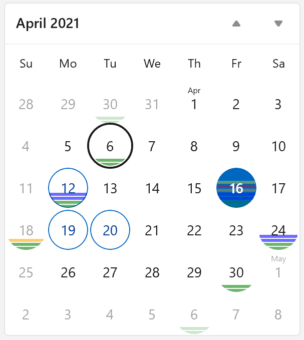

When set, the CalendarView instead adopts the property value for the various visuals.

In this example, the CalendarItemCornerRadius property is set to 4px:

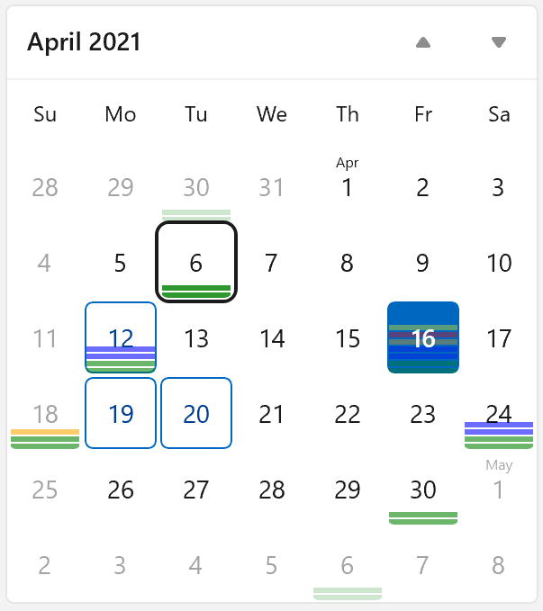

This property is only used by the CalendarView control when a boolean theme resource named `CalendarViewBaseItemRoundedChromeEnabled` is set to True.

```xml
    <x:Boolean x:Key="CalendarViewBaseItemRoundedChromeEnabled">True</x:Boolean>
```

`public Windows.UI.Xaml.Media.Brush DisabledForeground { get; set; }`

Gets or sets a brush that provides the foreground of a calendar item while it's disabled.

This property is only used by the CalendarView control when a boolean theme resource named `CalendarViewBaseItemRoundedChromeEnabled` is set to True.

```xml
    <x:Boolean x:Key="CalendarViewBaseItemRoundedChromeEnabled">True</x:Boolean>
```

`public Windows.UI.Xaml.Media.Brush BlackoutStrikethroughBrush { get; set; }`

Gets or sets a brush for the strikethrough line over calendar items while they are blacked out.

This property is only used by the CalendarView control when a boolean theme resource named `CalendarViewBaseItemRoundedChromeEnabled` is set to True.

```xml
    <x:Boolean x:Key="CalendarViewBaseItemRoundedChromeEnabled">True</x:Boolean>
```

`public Windows.UI.Xaml.Media.Brush SelectedDisabledBorderBrush { get; set; }`

Gets or sets a brush that provides the border of a selected calendar item while it's disabled.

This property is only used by the CalendarView control when a boolean theme resource named `CalendarViewBaseItemRoundedChromeEnabled` is set to True.

```xml
    <x:Boolean x:Key="CalendarViewBaseItemRoundedChromeEnabled">True</x:Boolean>
```

`public Windows.UI.Xaml.Media.Brush SelectedDisabledForeground { get; set; }`

Gets or sets a brush that provides the foreground of a selected calendar item while it's disabled.

This property is only used by the CalendarView control when a boolean theme resource named `CalendarViewBaseItemRoundedChromeEnabled` is set to True.

```xml
    <x:Boolean x:Key="CalendarViewBaseItemRoundedChromeEnabled">True</x:Boolean>
```

`public Windows.UI.Xaml.Media.Brush SelectedHoverForeground { get; set; }`

Gets or sets a brush that provides the foreground of a selected calendar item while the pointer is over it.

This property is only used by the CalendarView control when a boolean theme resource named `CalendarViewBaseItemRoundedChromeEnabled` is set to True.

```xml
    <x:Boolean x:Key="CalendarViewBaseItemRoundedChromeEnabled">True</x:Boolean>
```

`public Windows.UI.Xaml.Media.Brush SelectedPressedForeground { get; set; }`

Gets or sets a brush that provides the foreground of a selected calendar item while it's pressed.

This property is only used by the CalendarView control when a boolean theme resource named `CalendarViewBaseItemRoundedChromeEnabled` is set to True.

```xml
    <x:Boolean x:Key="CalendarViewBaseItemRoundedChromeEnabled">True</x:Boolean>
```

`public Windows.UI.Xaml.Media.Brush CalendarItemHoverBackground { get; set; }`

Gets or sets a brush that provides the background of a calendar item while the pointer is over it.

This property is only used by the CalendarView control when a boolean theme resource named `CalendarViewBaseItemRoundedChromeEnabled` is set to True.

```xml
    <x:Boolean x:Key="CalendarViewBaseItemRoundedChromeEnabled">True</x:Boolean>
```

`public Windows.UI.Xaml.Media.Brush CalendarItemPressedBackground { get; set; }`

Gets or sets a brush that provides the background of a calendar item while it's pressed.

This property is only used by the CalendarView control when a boolean theme resource named `CalendarViewBaseItemRoundedChromeEnabled` is set to True.

```xml
    <x:Boolean x:Key="CalendarViewBaseItemRoundedChromeEnabled">True</x:Boolean>
```

`public Windows.UI.Xaml.Media.Brush CalendarItemDisabledBackground { get; set; }`

Gets or sets a brush that provides the background of a calendar item while it's disabled.

This property is only used by the CalendarView control when a boolean theme resource named `CalendarViewBaseItemRoundedChromeEnabled` is set to True.

```xml
    <x:Boolean x:Key="CalendarViewBaseItemRoundedChromeEnabled">True</x:Boolean>
```

`public Windows.UI.Xaml.Media.Brush OutOfScopeHoverForeground { get; set; }`

Gets or sets a brush that provides the foreground of calendar items that are outside the current scope (month, year, or decade) while the pointer is over them.

This property is only used by the CalendarView control when a boolean theme resource named `CalendarViewBaseItemRoundedChromeEnabled` is set to True.

```xml
    <x:Boolean x:Key="CalendarViewBaseItemRoundedChromeEnabled">True</x:Boolean>
```

`public Windows.UI.Xaml.Media.Brush OutOfScopePressedForeground { get; set; }`

Gets or sets a brush that provides the foreground of calendar items that are outside the current scope (month, year, or decade) while they are pressed.

This property is only used by the CalendarView control when a boolean theme resource named `CalendarViewBaseItemRoundedChromeEnabled` is set to True.

```xml
    <x:Boolean x:Key="CalendarViewBaseItemRoundedChromeEnabled">True</x:Boolean>
```

`public Windows.UI.Xaml.Media.Brush TodayBackground { get; set; }`

Gets or sets a brush that provides the background of the calendar item for the current date.

This property is only used by the CalendarView control when a boolean theme resource named `CalendarViewBaseItemRoundedChromeEnabled` is set to True.

```xml
    <x:Boolean x:Key="CalendarViewBaseItemRoundedChromeEnabled">True</x:Boolean>
```

`public Windows.UI.Xaml.Media.Brush BlackoutBackground { get; set; }`

Gets or sets a brush that provides the background of calendar items while they are blacked out.

This property is only used by the CalendarView control when a boolean theme resource named `CalendarViewBaseItemRoundedChromeEnabled` is set to True.

```xml
    <x:Boolean x:Key="CalendarViewBaseItemRoundedChromeEnabled">True</x:Boolean>
```

`public Windows.UI.Xaml.Media.Brush TodayBlackoutBackground { get; set; }`

Gets or sets a brush that provides the background of the calendar item for the current date while it's blacked out.

This property is only used by the CalendarView control when a boolean theme resource named `CalendarViewBaseItemRoundedChromeEnabled` is set to True.

```xml
    <x:Boolean x:Key="CalendarViewBaseItemRoundedChromeEnabled">True</x:Boolean>
```

`public Windows.UI.Xaml.Media.Brush TodayBlackoutForeground { get; set; }`

Gets or sets a brush that provides the foreground of the calendar item for the current date while it's blacked out.

This property is only used by the CalendarView control when a boolean theme resource named `CalendarViewBaseItemRoundedChromeEnabled` is set to True.

```xml
    <x:Boolean x:Key="CalendarViewBaseItemRoundedChromeEnabled">True</x:Boolean>
```

`public Windows.UI.Xaml.Media.Brush TodayHoverBackground { get; set; }`

Gets or sets a brush that provides the background of the calendar item for the current date while the pointer is over it.

This property is only used by the CalendarView control when a boolean theme resource named `CalendarViewBaseItemRoundedChromeEnabled` is set to True.

```xml
    <x:Boolean x:Key="CalendarViewBaseItemRoundedChromeEnabled">True</x:Boolean>
```

`public Windows.UI.Xaml.Media.Brush TodayPressedBackground { get; set; }`

Gets or sets a brush that provides the background of the calendar item for the current date while it's pressed.

This property is only used by the CalendarView control when a boolean theme resource named `CalendarViewBaseItemRoundedChromeEnabled` is set to True.

```xml
    <x:Boolean x:Key="CalendarViewBaseItemRoundedChromeEnabled">True</x:Boolean>
```

`public Windows.UI.Xaml.Media.Brush TodayDisabledBackground { get; set; }`

Gets or sets a brush that provides the background of the calendar item for the current date while it's disabled.

This property is only used by the CalendarView control when a boolean theme resource named `CalendarViewBaseItemRoundedChromeEnabled` is set to True.

```xml
    <x:Boolean x:Key="CalendarViewBaseItemRoundedChromeEnabled">True</x:Boolean>
```

`public Windows.UI.Xaml.Media.Brush TodaySelectedInnerBorderBrush { get; set; }`

Gets or sets a brush that provides the border of the calendar item for the current date while it's selected.

This property is only used by the CalendarView control when a boolean theme resource named `CalendarViewBaseItemRoundedChromeEnabled` is set to True.

```xml
    <x:Boolean x:Key="CalendarViewBaseItemRoundedChromeEnabled">True</x:Boolean>
```

# API Details

    [contract(Windows.Foundation.UniversalApiContract, 1)]
    [webhosthidden]
    [static_name("Windows.UI.Xaml.Controls.ICalendarViewStatics", 7260f1c4-2f5d-41bd-99bb-4571b20b79a8)]
    [constructor_name("Windows.UI.Xaml.Controls.ICalendarViewFactory", 3d8f82e3-6cc6-423e-8d7c-7014d954ddef)]
    [interface_name("Windows.UI.Xaml.Controls.ICalendarView", cd639203-dfb5-4312-ac07-c0391824607b)]
    unsealed runtimeclass CalendarView
        : Windows.UI.Xaml.Controls.Control
    {
        // Existing CalendarView APIs not shown here.

        [contract(Windows.Foundation.UniversalApiContract, 14)]
        {
            Windows.UI.Xaml.Thickness DayItemMargin;
            Windows.UI.Xaml.Thickness MonthYearItemMargin;
            Windows.UI.Xaml.Thickness FirstOfMonthLabelMargin;
            Windows.UI.Xaml.Thickness FirstOfYearDecadeLabelMargin;

            Windows.UI.Xaml.CornerRadius CalendarItemCornerRadius;

            Windows.UI.Xaml.Media.Brush DisabledForeground;
            Windows.UI.Xaml.Media.Brush BlackoutStrikethroughBrush;
            Windows.UI.Xaml.Media.Brush SelectedDisabledBorderBrush;
            Windows.UI.Xaml.Media.Brush SelectedDisabledForeground;
            Windows.UI.Xaml.Media.Brush SelectedHoverForeground;
            Windows.UI.Xaml.Media.Brush SelectedPressedForeground;
            Windows.UI.Xaml.Media.Brush CalendarItemHoverBackground;
            Windows.UI.Xaml.Media.Brush CalendarItemPressedBackground;
            Windows.UI.Xaml.Media.Brush CalendarItemDisabledBackground;
            Windows.UI.Xaml.Media.Brush OutOfScopeHoverForeground;
            Windows.UI.Xaml.Media.Brush OutOfScopePressedForeground;
            Windows.UI.Xaml.Media.Brush BlackoutBackground;
            Windows.UI.Xaml.Media.Brush TodayBackground;
            Windows.UI.Xaml.Media.Brush TodayBlackoutBackground;
            Windows.UI.Xaml.Media.Brush TodayBlackoutForeground;
            Windows.UI.Xaml.Media.Brush TodayHoverBackground;
            Windows.UI.Xaml.Media.Brush TodayPressedBackground;
            Windows.UI.Xaml.Media.Brush TodayDisabledBackground;
            Windows.UI.Xaml.Media.Brush TodaySelectedInnerBorderBrush;

            static Windows.UI.Xaml.DependencyProperty DayItemMarginProperty{ get; };
            static Windows.UI.Xaml.DependencyProperty MonthYearItemMarginProperty{ get; };
            static Windows.UI.Xaml.DependencyProperty FirstOfMonthLabelMargin{ get; };
            static Windows.UI.Xaml.DependencyProperty FirstOfYearDecadeLabelMargin{ get; };

            static Windows.UI.Xaml.DependencyProperty CalendarItemCornerRadiusProperty{ get; };

            static Windows.UI.Xaml.DependencyProperty DisabledForegroundProperty{ get; };
            static Windows.UI.Xaml.DependencyProperty BlackoutStrikethroughBrushProperty{ get; };
            static Windows.UI.Xaml.DependencyProperty SelectedDisabledBorderBrushProperty{ get; };
            static Windows.UI.Xaml.DependencyProperty SelectedDisabledForegroundProperty{ get; };
            static Windows.UI.Xaml.DependencyProperty SelectedHoverForegroundProperty{ get; };
            static Windows.UI.Xaml.DependencyProperty SelectedPressedForegroundProperty{ get; };
            static Windows.UI.Xaml.DependencyProperty CalendarItemHoverBackgroundProperty{ get; };
            static Windows.UI.Xaml.DependencyProperty CalendarItemPressedBackgroundProperty{ get; };
            static Windows.UI.Xaml.DependencyProperty CalendarItemDisabledBackgroundProperty{ get; };
            static Windows.UI.Xaml.DependencyProperty OutOfScopeHoverForegroundProperty{ get; };
            static Windows.UI.Xaml.DependencyProperty OutOfScopePressedForegroundProperty{ get; };
            static Windows.UI.Xaml.DependencyProperty BlackoutBackgroundProperty{ get; };
            static Windows.UI.Xaml.DependencyProperty TodayBackgroundProperty{ get; };
            static Windows.UI.Xaml.DependencyProperty TodayBlackoutBackgroundProperty{ get; };
            static Windows.UI.Xaml.DependencyProperty TodayBlackoutForegroundProperty{ get; };
            static Windows.UI.Xaml.DependencyProperty TodayHoverBackgroundProperty{ get; };
            static Windows.UI.Xaml.DependencyProperty TodayPressedBackgroundProperty{ get; };
            static Windows.UI.Xaml.DependencyProperty TodayDisabledBackgroundProperty{ get; };
            static Windows.UI.Xaml.DependencyProperty TodaySelectedInnerBorderBrushProperty{ get; };
        }
    };

# Appendix

## New CalendarViewBaseItemRoundedChromeEnabled resource

The new `CalendarViewBaseItemRoundedChromeEnabled` boolean resource is similar to other ones
introduced recently:

```xml
    <x:Boolean x:Key="CalendarViewBaseItemRoundedChromeEnabled">False</x:Boolean>

    <x:Boolean x:Key="HyperlinkUnderlineVisible">True</x:Boolean>
    <x:Boolean x:Key="ListViewBaseItemRoundedChromeEnabled">False</x:Boolean>
    <x:Boolean x:Key="ThemeShadowIsUsingDropShadows">False</x:Boolean>
```

## Fitting the new property names among the old ones

The new properties were named to fit well with the CalendarView existing properties:

New property name | Similar old property names
------ | ------
BlackoutBackground | BlackoutForeground, OutOfScopeBackground
BlackoutStrikethroughBrush | HoverBorderBrush, FocusBorderBrush
CalendarItemCornerRadius | CalendarItemBorderThickness, CalendarItemBorderBrush, CalendarItemForeground
CalendarItemDisabledBackground | CalendarItemBackground, CalendarItemForeground
CalendarItemHoverBackground | CalendarItemBackground, CalendarItemForeground
CalendarItemPressedBackground | CalendarItemBackground, CalendarItemForeground
DayItemMargin | DayItemFontFamily, DayItemFontSize, DayItemFontStyle
DisabledForeground | PressedForeground, SelectedForeground, BlackoutForeground
FirstOfMonthLabelMargin | FirstOfMonthLabelFontFamily, FirstOfMonthLabelFontSize, FirstOfMonthLabelFontStyle
FirstOfYearDecadeLabelMargin | FirstOfYearDecadeLabelFontFamily, FirstOfYearDecadeLabelFontSize, FirstOfYearDecadeLabelFontStyle
MonthYearItemMargin | MonthYearItemFontFamily, MonthYearItemFontSize, MonthYearItemFontStyle
OutOfScopeHoverForeground | OutOfScopeForeground, OutOfScopeBackground
OutOfScopePressedForeground | OutOfScopeForeground, OutOfScopeBackground
SelectedDisabledBorderBrush | SelectedHoverBorderBrush, SelectedPressedBorderBrush
SelectedDisabledForeground | SelectedForeground
SelectedHoverForeground | SelectedForeground, SelectedHoverBorderBrush
SelectedPressedForeground | SelectedForeground, SelectedPressedBorderBrush
TodayBackground | TodayForeground, OutOfScopeBackground
TodayBlackoutBackground | TodayForeground, OutOfScopeBackground
TodayBlackoutForeground | TodayForeground, OutOfScopeForeground
TodayDisabledBackground | OutOfScopeBackground, TodayForeground
TodayHoverBackground | TodayHoverBorderBrush, TodayForeground
TodayPressedBackground | OutOfScopeBackground, TodayForeground
TodaySelectedInnerBorderBrush | TodayHoverBorderBrush, TodayPressedBorderBrush

## Example ResourceDictionary for CalendarView

```xml
<ResourceDictionary 
    xmlns="http://schemas.microsoft.com/winfx/2006/xaml/presentation"
    xmlns:x="http://schemas.microsoft.com/winfx/2006/xaml">
    <ResourceDictionary.ThemeDictionaries>
        <ResourceDictionary x:Key="Default">
            <StaticResource x:Key="CalendarViewFocusVisualPrimaryBrush" ResourceKey="FocusStrokeColorOuterBrush" />
            <StaticResource x:Key="CalendarViewFocusVisualSecondaryBrush" ResourceKey="FocusStrokeColorInnerBrush" />
            <StaticResource x:Key="CalendarViewFocusBorderBrush" ResourceKey="AccentFillColorSecondaryBrush" />
            <StaticResource x:Key="CalendarViewBlackoutStrikethroughBrush" ResourceKey="ControlStrongStrokeColorDefaultBrush" />
            <StaticResource x:Key="CalendarViewSelectedHoverBorderBrush" ResourceKey="AccentFillColorSecondaryBrush" />
            <StaticResource x:Key="CalendarViewSelectedPressedBorderBrush" ResourceKey="SubtleFillColorTertiaryBrush" />
            <StaticResource x:Key="CalendarViewSelectedDisabledBorderBrush" ResourceKey="AccentFillColorDisabledBrush" />
            <StaticResource x:Key="CalendarViewSelectedBorderBrush" ResourceKey="AccentFillColorDefaultBrush" />
            <StaticResource x:Key="CalendarViewHoverBorderBrush" ResourceKey="SubtleFillColorSecondaryBrush" />
            <StaticResource x:Key="CalendarViewPressedBorderBrush" ResourceKey="SubtleFillColorTertiaryBrush" />
            <StaticResource x:Key="CalendarViewTodaySelectedInnerBorderBrush" ResourceKey="TextOnAccentFillColorPrimaryBrush" />
            <StaticResource x:Key="CalendarViewTodayForeground" ResourceKey="TextOnAccentFillColorPrimaryBrush" />
            <StaticResource x:Key="CalendarViewDisabledForeground" ResourceKey="TextFillColorDisabledBrush" />
            <StaticResource x:Key="CalendarViewBlackoutForeground" ResourceKey="TextFillColorPrimaryBrush" />
            <StaticResource x:Key="CalendarViewSelectedForeground" ResourceKey="AccentTextFillColorPrimaryBrush" />
            <StaticResource x:Key="CalendarViewSelectedHoverForeground" ResourceKey="AccentTextFillColorPrimaryBrush" />
            <StaticResource x:Key="CalendarViewSelectedPressedForeground" ResourceKey="AccentTextFillColorTertiaryBrush" />
            <StaticResource x:Key="CalendarViewSelectedDisabledForeground" ResourceKey="AccentTextFillColorDisabledBrush" />
            <StaticResource x:Key="CalendarViewPressedForeground" ResourceKey="TextFillColorSecondaryBrush" />
            <StaticResource x:Key="CalendarViewOutOfScopeForeground" ResourceKey="TextFillColorSecondaryBrush" />
            <StaticResource x:Key="CalendarViewOutOfScopeHoverForeground" ResourceKey="TextFillColorPrimaryBrush" />
            <StaticResource x:Key="CalendarViewOutOfScopePressedForeground" ResourceKey="TextFillColorTertiaryBrush" />
            <StaticResource x:Key="CalendarViewCalendarItemBackground" ResourceKey="SubtleFillColorTransparentBrush" />
            <StaticResource x:Key="CalendarViewCalendarItemHoverBackground" ResourceKey="SubtleFillColorSecondaryBrush" />
            <StaticResource x:Key="CalendarViewCalendarItemPressedBackground" ResourceKey="SubtleFillColorTertiaryBrush" />
            <StaticResource x:Key="CalendarViewCalendarItemDisabledBackground" ResourceKey="SubtleFillColorTransparentBrush" />
            <StaticResource x:Key="CalendarViewCalendarItemBorderBrush" ResourceKey="SubtleFillColorTransparentBrush" />
            <StaticResource x:Key="CalendarViewCalendarItemForeground" ResourceKey="TextFillColorPrimaryBrush" />
            <StaticResource x:Key="CalendarViewTodayBackground" ResourceKey="AccentFillColorDefaultBrush" />
            <StaticResource x:Key="CalendarViewTodayBlackoutBackground" ResourceKey="AccentFillColorTertiaryBrush" />
            <StaticResource x:Key="CalendarViewTodayBlackoutForeground" ResourceKey="TextOnAccentFillColorPrimaryBrush" />
            <StaticResource x:Key="CalendarViewTodayHoverBackground" ResourceKey="AccentFillColorSecondaryBrush" />
            <StaticResource x:Key="CalendarViewTodayPressedBackground" ResourceKey="AccentFillColorTertiaryBrush" />
            <StaticResource x:Key="CalendarViewTodayDisabledBackground" ResourceKey="AccentFillColorDisabledBrush" />
            <StaticResource x:Key="CalendarViewBlackoutBackground" ResourceKey="SubtleFillColorTransparentBrush" />
            <StaticResource x:Key="CalendarViewOutOfScopeBackground" ResourceKey="SubtleFillColorTransparentBrush" />
            <StaticResource x:Key="CalendarViewForeground" ResourceKey="TextFillColorPrimaryBrush" />
            <StaticResource x:Key="CalendarViewBackground" ResourceKey="ControlFillColorInputActiveBrush" />
            <StaticResource x:Key="CalendarViewBorderBrush" ResourceKey="ControlStrokeColorDefaultBrush" />
            <StaticResource x:Key="CalendarViewWeekDayForegroundDisabled" ResourceKey="TextFillColorDisabledBrush" />
            <StaticResource x:Key="CalendarViewNavigationButtonBackground" ResourceKey="SubtleFillColorTransparentBrush" />
            <StaticResource x:Key="CalendarViewNavigationButtonBackgroundPointerOver" ResourceKey="SubtleFillColorSecondaryBrush" />
            <StaticResource x:Key="CalendarViewNavigationButtonBackgroundPressed" ResourceKey="SubtleFillColorTertiaryBrush" />
            <StaticResource x:Key="CalendarViewNavigationButtonForeground" ResourceKey="ControlStrongFillColorDefaultBrush" />
            <StaticResource x:Key="CalendarViewNavigationButtonForegroundPointerOver" ResourceKey="ControlStrongFillColorDefaultBrush" />
            <StaticResource x:Key="CalendarViewNavigationButtonForegroundPressed" ResourceKey="ControlStrongFillColorDefaultBrush" />
            <StaticResource x:Key="CalendarViewNavigationButtonForegroundDisabled" ResourceKey="ControlStrongFillColorDisabledBrush" />
            <StaticResource x:Key="CalendarViewHeaderNavigationButtonForegroundPointerOver" ResourceKey="TextFillColorPrimaryBrush" />
            <StaticResource x:Key="CalendarViewHeaderNavigationButtonForegroundPressed" ResourceKey="TextFillColorSecondaryBrush" />
            <StaticResource x:Key="CalendarViewHeaderNavigationButtonForegroundDisabled" ResourceKey="TextFillColorDisabledBrush" />
            <StaticResource x:Key="CalendarViewNavigationButtonBorderBrushPointerOver" ResourceKey="SubtleFillColorTransparentBrush" />
            <StaticResource x:Key="CalendarViewNavigationButtonBorderBrush" ResourceKey="SubtleFillColorTransparentBrush" />
        </ResourceDictionary>
        <ResourceDictionary x:Key="HighContrast">
            ...
        </ResourceDictionary>
        <ResourceDictionary x:Key="Light">
            ...
        </ResourceDictionary>
    </ResourceDictionary.ThemeDictionaries>

    <x:Boolean x:Key="CalendarViewBaseItemRoundedChromeEnabled">True</x:Boolean>
    <Thickness x:Key="CalendarViewDayItemMargin">0,6,0,0</Thickness>
    <Thickness x:Key="CalendarViewMonthYearItemMargin">0,6,0,0</Thickness>
    <Thickness x:Key="CalendarViewFirstOfMonthLabelMargin">0,1,0,0</Thickness>
    <Thickness x:Key="CalendarViewFirstOfYearDecadeLabelMargin">0,2,0,0</Thickness>

    <Style x:Key="CalendarViewDefaultStyle" TargetType="CalendarView">
        <Setter Property="BlackoutStrikethroughBrush" Value="{ThemeResource CalendarViewBlackoutStrikethroughBrush}" /> *
        <Setter Property="SelectedHoverBorderBrush" Value="{ThemeResource CalendarViewSelectedHoverBorderBrush}" />
        <Setter Property="SelectedPressedBorderBrush" Value="{ThemeResource CalendarViewSelectedPressedBorderBrush}" />
        <Setter Property="SelectedDisabledBorderBrush" Value="{ThemeResource CalendarViewSelectedDisabledBorderBrush}" /> *
        <Setter Property="SelectedBorderBrush" Value="{ThemeResource CalendarViewSelectedBorderBrush}" />
        <Setter Property="HoverBorderBrush" Value="{ThemeResource CalendarViewHoverBorderBrush}" />
        <Setter Property="PressedBorderBrush" Value="{ThemeResource CalendarViewPressedBorderBrush}" />
        <Setter Property="CalendarItemBorderBrush" Value="{ThemeResource  CalendarViewCalendarItemBorderBrush}" />
        <Setter Property="TodaySelectedInnerBorderBrush" Value="{ThemeResource  CalendarViewTodaySelectedInnerBorderBrush}" /> *
        <Setter Property="TodayForeground" Value="{ThemeResource CalendarViewTodayForeground}" />
        <Setter Property="DisabledForeground" Value="{ThemeResource CalendarViewDisabledForeground}" /> *
        <Setter Property="BlackoutForeground" Value="{ThemeResource CalendarViewBlackoutForeground}" />
        <Setter Property="SelectedForeground" Value="{ThemeResource CalendarViewSelectedForeground}" />
        <Setter Property="SelectedHoverForeground" Value="{ThemeResource CalendarViewSelectedHoverForeground}" /> *
        <Setter Property="SelectedPressedForeground" Value="{ThemeResource CalendarViewSelectedPressedForeground}" /> *
        <Setter Property="SelectedDisabledForeground" Value="{ThemeResource CalendarViewSelectedDisabledForeground}" /> *
        <Setter Property="PressedForeground" Value="{ThemeResource CalendarViewPressedForeground}" />
        <Setter Property="OutOfScopeForeground" Value="{ThemeResource CalendarViewOutOfScopeForeground}" />
        <Setter Property="OutOfScopeHoverForeground" Value="{ThemeResource CalendarViewOutOfScopeHoverForeground}" /> *
        <Setter Property="OutOfScopePressedForeground" Value="{ThemeResource CalendarViewOutOfScopePressedForeground}" /> *
        <Setter Property="CalendarItemForeground" Value="{ThemeResource CalendarViewCalendarItemForeground}" />
        <Setter Property="TodayBackground" Value="{ThemeResource CalendarViewTodayBackground}" /> *
        <Setter Property="TodayBlackoutBackground" Value="{ThemeResource CalendarViewTodayBlackoutBackground}" /> *
        <Setter Property="TodayBlackoutForeground" Value="{ThemeResource CalendarViewTodayBlackoutForeground}" /> *
        <Setter Property="TodayHoverBackground" Value="{ThemeResource CalendarViewTodayHoverBackground}" /> *
        <Setter Property="TodayPressedBackground" Value="{ThemeResource CalendarViewTodayPressedBackground}" /> *
        <Setter Property="TodayDisabledBackground" Value="{ThemeResource CalendarViewTodayDisabledBackground}" /> *
        <Setter Property="BlackoutBackground" Value="{ThemeResource CalendarViewBlackoutBackground}" /> *
        <Setter Property="OutOfScopeBackground" Value="{ThemeResource CalendarViewOutOfScopeBackground}" />
        <Setter Property="CalendarItemBackground" Value="{ThemeResource CalendarViewCalendarItemBackground}" />
        <Setter Property="CalendarItemHoverBackground" Value="{ThemeResource CalendarViewCalendarItemHoverBackground}" /> *
        <Setter Property="CalendarItemPressedBackground" Value="{ThemeResource CalendarViewCalendarItemPressedBackground}" /> *
        <Setter Property="CalendarItemDisabledBackground" Value="{ThemeResource CalendarViewCalendarItemDisabledBackground}" /> *
        <Setter Property="Foreground" Value="{ThemeResource CalendarViewForeground}" />
        <Setter Property="Background" Value="{ThemeResource CalendarViewBackground}" />
        <Setter Property="BorderBrush" Value="{ThemeResource CalendarViewBorderBrush}" />
        <Setter Property="DayItemFontFamily" Value="XamlAutoFontFamily" />
        <Setter Property="DayItemFontSize" Value="{ThemeResource CalendarViewDayItemFontSize}" />
        <Setter Property="DayItemMargin" Value="{ThemeResource CalendarViewDayItemMargin}" /> *
        <Setter Property="FirstOfMonthLabelFontFamily" Value="XamlAutoFontFamily" />
        <Setter Property="FirstOfMonthLabelFontSize" Value="{ThemeResource CalendarViewFirstOfMonthLabelFontSize}" />
        <Setter Property="FirstOfMonthLabelMargin" Value="{ThemeResource CalendarViewFirstOfMonthLabelMargin}" /> *
        <Setter Property="MonthYearItemFontFamily" Value="XamlAutoFontFamily" />
        <Setter Property="MonthYearItemFontSize" Value="{ThemeResource CalendarViewMonthYearItemFontSize}" />
        <Setter Property="MonthYearItemMargin" Value="{ThemeResource CalendarViewMonthYearItemMargin}" /> *
        <Setter Property="FirstOfYearDecadeLabelFontFamily" Value="XamlAutoFontFamily" />
        <Setter Property="FirstOfYearDecadeLabelFontSize" Value="{ThemeResource CalendarViewFirstOfYearDecadeLabelFontSize}" />
        <Setter Property="FirstOfYearDecadeLabelMargin" Value="{ThemeResource CalendarViewFirstOfYearDecadeLabelMargin}" /> *
        <Setter Property="CalendarItemBorderThickness" Value="1" />
        <Setter Property="BorderThickness" Value="1" />
        <Setter Property="HorizontalAlignment" Value="Left" />
        <Setter Property="VerticalAlignment" Value="Center" />
        <Setter Property="HorizontalContentAlignment" Value="Stretch" />
        <Setter Property="VerticalContentAlignment" Value="Stretch" />
        <Setter Property="IsTabStop" Value="False" />
        <Setter Property="UseSystemFocusVisuals" Value="{StaticResource UseSystemFocusVisuals}" />
        <Setter Property="CornerRadius" Value="{ThemeResource ControlCornerRadius}" />
        <Setter Property="Template">
          ...
        </Setter>
    </Style>
</ResourceDictionary>
```