Charts
===

# Background

WinUI has no first-party charting control. `Microsoft.UI.Xaml.Controls.Charts` adds one. The
namespace ships in its own API contract, `WinUIChartingContract`, to track when Charts APIs
become available while remaining aligned with Windows App SDK releases.

The public surface has three parts:

- **A control.** `Chart` derives from `Control` and hosts the plot surface, the axes, and an
  optional legend.
- **Series.** `CartesianSeries` is the non-activatable base for the plotted marks. `LineSeries`,
  `AreaSeries`, and `BarSeries` are the concrete types in this release.
- **Axes.** `Axis` is the non-activatable base for scales. `CartesianAxis` adds the tick and
  grid-line presentation that Cartesian scales share, and `LinearAxis`, `CategoryAxis`, and
  `DateTimeAxis` are the concrete scales.

Two decisions in the shape of the API are worth stating up front, because the rest of the document
depends on them.

**Data is dimensional, and each dimension is addressed through a handle.** A series does not take
a collection of point objects. It takes two `Samples` objects — one for the X dimension and one
for the Y dimension. A `Samples` object is not a collection: it is a `DependencyObject` *handle*
whose `ItemsSource` points at the collection that supplies the values. The word *samples* here
means *the data samples plotted by a chart series*; it has nothing to do with sample apps or
sample code. A series references a handle by object identity, so one handle can feed several
series. Replacing a null or successfully bound collection re-plots every series that names the
handle.

**Presentation that belongs to an axis lives on the axis.** Grid lines, tick marks, tick labels,
and the axis line are properties of `CartesianAxis`, not of `Chart` and not of `CartesianSeries`.
Two series that share an axis therefore share one set of values, with no merge policy needed, and
a chart can carry independently configured axes.

This spec covers the whole public surface of the namespace: 14 runtime classes, 7 enumerations,
and the API contract, including every constructor and every static dependency property accessor.

# Conceptual pages (How To)

_(This is conceptual documentation that will go to learn.microsoft.com "how to" page)_

## How to use Chart

A chart is assembled from three collections on `Chart`:

| Collection     | Type                                 | Holds                                  |
|----------------|--------------------------------------|----------------------------------------|
| `Chart.Data`   | `IObservableVector<Samples>`         | The data-source handles.               |
| `Chart.Axes`   | `IObservableVector<Axis>`            | The axes the series may bind to.       |
| `Chart.Series` | `IObservableVector<CartesianSeries>` | The plotted series.                    |

`Series` is the content property, so series can be written as direct children of `<Chart>`. `Data`
and `Axes` use explicit property-element syntax.

The smallest useful chart is one handle for categories, one for values, and one series:

```xaml
xmlns:charts="using:Microsoft.UI.Xaml.Controls.Charts"

<charts:Chart>
    <charts:Chart.Data>
        <charts:Samples x:Name="Month"  ItemsSource="{x:Bind Months, Mode=OneTime}" />
        <charts:Samples x:Name="Profit" ItemsSource="{x:Bind Profits, Mode=OneTime}" />
    </charts:Chart.Data>

    <charts:LineSeries Title="Profit"
                       XValues="{x:Bind Month, Mode=OneTime}"
                       YValues="{x:Bind Profit, Mode=OneTime}" />
</charts:Chart>
```

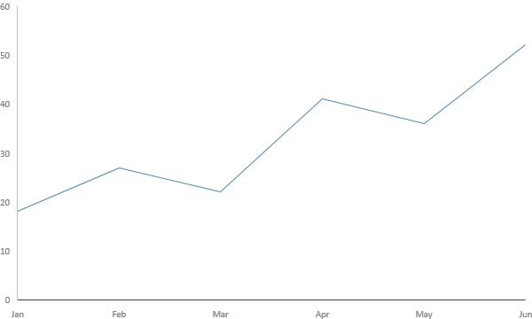

A series names a handle by reference. In markup that reference is `{x:Bind}` or `{x:Reference}` to
the handle's `x:Name`; in code it is the `Samples` object itself. There is no string-keyed lookup.

Axes are optional. When a series leaves `XAxis` and `YAxis` null, the chart supplies the axes it
needs. Declare axes when you want to control range, sorting, ticks, grid lines, or colors, or when
several series must share one scale.

## How to supply data

A `Samples` handle holds no data. Point its `ItemsSource` at a collection, and the chart reads the
values from there. `ItemsSource` accepts the standard WinRT collection interfaces, and resolves
the collection by *element type first*, then by collection interface within that element type:

| Order | Element type                   | Interfaces tried, in this order                                                    | Data type                         |
|-------|--------------------------------|-------------------------------------------------------------------------------------|-----------------------------------|
| 1     | `Double`                       | `IObservableVector<Double>`, `IVector<Double>`, `IVectorView<Double>`, `IIterable<Double>` | Numeric                     |
| 2     | `Windows.Foundation.DateTime`  | the same four                                                                        | Numeric (dates are converted)     |
| 3     | `String`                       | the same four                                                                        | String                            |
| 4     | `Object`                       | the same four                                                                        | Taken from the first element      |
| 5     | *(non-generic)*                | `IBindableObservableVector`, `IBindableVector`, `IBindableIterable`                  | Taken from the first element      |

In C# a `double[]`, a `List<double>`, an `ObservableCollection<double>`, a `string[]`, and a
`List<DateTimeOffset>` all work without an adapter.

Because element type is the outer key, a collection that implements more than one element type
binds as the *first* element type in the list. A type implementing both `IVector<Double>` and
`IObservableVector<Object>`, for example, binds as a non-observable `Double` vector and will not
raise live updates.

What each collection interface gives you:

| Interface                   | Behavior                                                              |
|-----------------------------|-----------------------------------------------------------------------|
| `IObservableVector<T>`      | Random access, and the chart follows `VectorChanged` for live updates. |
| `IVector<T>`                | Random access, read on demand; no change notification.                 |
| `IVectorView<T>`            | Read-only random access, read on demand; no change notification.       |
| `IIterable<T>`              | Forward-only; read once into a snapshot when the handle is bound.      |
| `IBindableObservableVector` | The non-generic equivalent of `IObservableVector<Object>`.              |
| `IBindableVector`           | The non-generic equivalent of `IVector<Object>`.                        |
| `IBindableIterable`         | The non-generic equivalent of `IIterable<Object>`.                      |

For an `Object` or non-generic source, the first element decides the data type. Such an element
may be a `Double`, a `Windows.Foundation.DateTime`, or a `String`, boxed either directly or as an
`IReference<Double>`, `IReference<DateTime>`, or `IReference<String>`. An empty source is treated
as numeric.

Which dimension a handle can serve follows from its data type. Remember that x is the category
dimension and y is the value dimension, whatever the series orientation:

| Data type  | `XValues` — category dimension            | `YValues` — value dimension |
|------------|-------------------------------------------|-----------------------------|
| Numeric    | Yes, as numeric category values.           | Yes.                        |
| Date-time  | Yes; use a `DateTimeAxis` to label dates.  | Accepted — dates are numeric — but not usually meaningful. |
| String     | Yes, as named category values.             | No.                         |

Use dimensions of equal length. The chart otherwise uses the longest bound dimension and treats
absent entries in shorter numeric dimensions as missing values. `LineSeries` and `BarSeries` do
not plot a point whose required numeric value is missing. `AreaSeries` plots a missing y/value
entry as zero, but does not plot a point whose numeric x/category entry is missing. With string
categories, ordinal category positions can continue beyond the available names, producing
unlabelled trailing points.

```csharp
// Live updates: appending to the source redraws the chart.
var readings = new ObservableCollection<double>();
var profit = new Samples { ItemsSource = readings };
series.YValues = profit;
readings.Add(42.0);
```

```cpp
auto profit = Samples();
profit.ItemsSource(winrt::single_threaded_observable_vector<double>({ 12.0, 38.0, 21.0 }));
series.YValues(profit);
```

Unsupported data does not make assignment to `XValues`, `YValues`, or `ItemsSource` throw. If the
collection cannot be used, or the first element of an object-valued source cannot establish a
supported type, that dimension is left unbound, a diagnostic is written to the debug output, and
the property keeps the value you assigned. Later incompatible elements are represented as missing
numeric values or empty strings rather than unbinding the dimension.

A null or successfully bound `ItemsSource` is observed for replacement. If binding fails, setting
the dimension to null and then back to the corrected handle retries the bind; assigning a new
`Samples` handle also retries it.

## How to use axes

Declare axes in `Chart.Axes` and point a series at them with `XAxis` and `YAxis`. The reference is
by object identity, so two series that name the same axis object share one scale and one set of
presentation values.

```xaml
<charts:Chart>
    <charts:Chart.Axes>
        <charts:CategoryAxis x:Name="MonthX" Label="Month" />
        <charts:LinearAxis   x:Name="PriceY"
                             Label="Profit"
                             Minimum="0"
                             Maximum="100"
                             Spacing="25"
                             GridLines="Major" />
    </charts:Chart.Axes>

    <charts:LineSeries XAxis="{x:Bind MonthX, Mode=OneTime}"
                       YAxis="{x:Bind PriceY, Mode=OneTime}"
                       XValues="{x:Bind Month, Mode=OneTime}"
                       YValues="{x:Bind Profit, Mode=OneTime}" />
</charts:Chart>
```

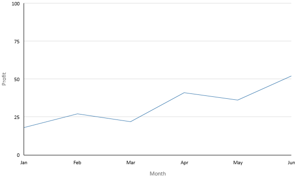

`XAxis` and `YAxis` name *data slots*, not screen edges. A horizontal `BarSeries` binds its
categories through `XAxis`, even though those categories are laid out vertically.

For every series type in this release, the x slot takes categories and the y slot takes values:

| Slot | Scale needed | Axis types that provide it |
|------|--------------|----------------------------|
| X    | Categories   | `CategoryAxis`, `DateTimeAxis` |
| Y    | Values       | `LinearAxis`               |

Axis assignment always validates scale compatibility with the data slot. If the series is already
attached to a chart, the axis must also be in that chart's `Axes` collection and must belong to
that chart. These ownership and membership rules are validated later, when a detached series
joins a chart. An axis may be shared only where every use needs the same data dimension and the
same physical layout. A rejected relationship throws `E_INVALIDARG`.

An axis belongs to one chart at a time. Removing an axis that a series still references is
rejected. Removing an axis no series references detaches it with all of its property values
intact, so it can be added to another chart.

## How to change how a series looks

Every series shares a set of presentation properties on `CartesianSeries`: `Stroke`,
`StrokeThickness`, `StrokeDashStyle`, `ShowDataLabels`, `ShowDataMarkers`, `MarkerShape`,
`DataLabelBrush`, and `DataMarkerBrush`. The concrete series add what is specific to them:
`AreaSeries.Fill`, and `BarSeries.Fill` and `BarSeries.Orientation`.

Leave a stroke, fill, or marker brush null to use the chart palette. A null data-label brush
instead falls back to `Chart.Foreground`; see [How brushes are used](#how-brushes-are-used) and
[How the palette works](#how-the-palette-works).

```xaml
<charts:LineSeries Title="Profit"
                   XValues="{x:Bind Month, Mode=OneTime}"
                   YValues="{x:Bind Profit, Mode=OneTime}"
                   Stroke="SteelBlue"
                   StrokeThickness="2"
                   StrokeDashStyle="Dash"
                   ShowDataMarkers="True"
                   MarkerShape="Diamond" />
```

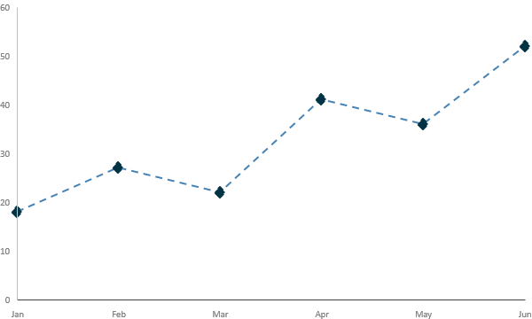

## How brushes are used

Every `Brush` property in this namespace is a **color source, not a paint**. The renderer reads
one color from the brush and draws with it. Nothing else about the brush — a gradient's stops, an
image's content, an opacity mask — reaches the plot.

`SolidColorBrush` is the only brush type a color can be read from. What happens when a property
holds a brush of any other type depends on which property it is, and the two behaviors are
different:

| Property                                                                  | Null                                  | Non-`SolidColorBrush`                       |
|---------------------------------------------------------------------------|---------------------------------------|----------------------------------------------|
| `CartesianAxis.GridLineMajorBrush`, `GridLineMinorBrush`, `TickBrush`, `TickLabelBrush`, `AxisLineBrush` | Resolves the keyed theme resource.    | Retains the value, writes a diagnostic, and resolves the keyed theme resource. |
| `CartesianSeries.Stroke`, `DataMarkerBrush`, `AreaSeries.Fill`, `BarSeries.Fill` | Takes the series' palette color for that role. | Takes the series' palette color for that role. |
| `DataMarkerOverride.Brush`                                                 | Inherits `DataMarkerBrush`, then the marker palette color. | Inherits `DataMarkerBrush`, then the marker palette color. |
| `CartesianSeries.DataLabelBrush`                                           | Falls back to `Chart.Foreground`.      | Falls back to `Chart.Foreground`.             |
| `DataLabelOverride.Brush`                                                  | Inherits `DataLabelBrush`, then `Chart.Foreground`. | Inherits `DataLabelBrush`, then `Chart.Foreground`. |
| `Chart.Background`                                                          | Renders transparent.                   | Renders transparent.                           |
| `Chart.Foreground`                                                          | Uses the renderer's default text color. | Uses the renderer's default text color.       |

Set `SolidColorBrush` values throughout. An unsupported axis brush falls back to its keyed theme
resource, whereas an unsupported series brush falls back to the corresponding palette or
foreground color.

Series and per-point override brushes stay live after assignment: changing the `Color` of a
`SolidColorBrush` updates the rendered elements that reference it. Axis brush properties are
re-applied when the property value changes; changing the `Color` inside an already assigned axis
brush does not itself notify the axis.

## How the palette works

Leave a brush null to let the chart assign a palette slot. A series takes at most three slots —
one for its stroke, one for its fill, and one for its data markers. Each slot is taken only once
the series is connected to a chart, that role is actually needed for what is drawn, and no
supported explicit brush supplies a color. The slot index stays with the series object for its
lifetime, including across brush changes and across removal from and re-addition to a chart. Its
resolved color is refreshed from the active palette bank on theme or system-palette changes.
Arbitrary runtime edits to palette resources are not observed by themselves.

Data labels never take a palette color; their fallback is `Chart.Foreground`.

## How to override a single point

`DataLabelOverrides` and `DataMarkerOverrides` are get-only observable maps on `CartesianSeries`,
keyed by the zero-based index of the data point. Use them to annotate individual points. They are
code-only; being maps rather than dependency properties, they cannot be populated from markup.

```csharp
// Call out the peak with red text and a red diamond.
series.DataLabelOverrides[7]  = new DataLabelOverride("Peak", redBrush);
series.DataMarkerOverrides[7] = new DataMarkerOverride(MarkerShape.Diamond, redBrush);

// Hide the marker on one point only.
series.DataMarkerOverrides[3] = new DataMarkerOverride(MarkerShape.None, null);
```

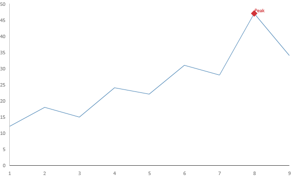

Keys are absolute indices into the series and are never renumbered when data is inserted or
removed. An entry for an index beyond the current data is kept and takes effect if the data grows
to reach it. Overrides are active only through the length of the y dimension, limited by the x
dimension when one is bound, even when a series layout can render additional missing-data points.

Overrides are independent of `ShowDataLabels` and `ShowDataMarkers`: those switches control the
*default* labels and markers, and an override stays visible when the corresponding default is off.
An override object is immutable — replace the map entry to change it. A brush it holds is not:
changing the `Color` of a `SolidColorBrush` updates every point that references it.

## How to theme a chart

`Chart` is a `Control`, and its default style takes `Background` from
`ChartsControlBackgroundBrush`, `Foreground` from `ChartsControlForegroundBrush`, and sets
`MinWidth` to 160 and `MinHeight` to 96. The renderer consumes only solid colors: a non-solid
`Background` renders transparent, and a non-solid `Foreground` leaves text at the renderer's
default color. `FontFamily` and `FontSize` are applied to chart text.

Merge `XamlChartsResources` into your application resources to bring the chart theme resources
into scope, then override any of them:

```xaml
<Application.Resources>
    <ResourceDictionary>
        <ResourceDictionary.MergedDictionaries>
            <XamlControlsResources xmlns="using:Microsoft.UI.Xaml.Controls" />
            <XamlChartsResources xmlns="using:Microsoft.UI.Xaml.Controls.Charts" />
        </ResourceDictionary.MergedDictionaries>

        <SolidColorBrush x:Key="ChartsGridLineMajorBrush" Color="SlateGray" />
    </ResourceDictionary>
</Application.Resources>
```

The keys are listed under [XamlChartsResources class](#xamlchartsresources-class). To change one
axis only, set the brush property on that axis instead.

> Set axis brushes to `SolidColorBrush` values. An axis brush of any other type retains its
> property value, writes a diagnostic, and falls back to the corresponding theme resource.

# Examples

## The same chart in XAML, C#, and C++/WinRT

<table>
  <tr>
    <th>Language</th>
    <th>Code Sample</th>
    <th>Rendered Output</th>
  </tr>
  <tr>
    <td><b>XAML</b></td>
    <td>
<pre lang="xml">&lt;charts:Chart ShowLegend="True" LegendTitle="Revenue"&gt;
    &lt;charts:Chart.Data&gt;
        &lt;charts:Samples x:Name="Month"
            ItemsSource="{x:Bind Months, Mode=OneTime}" /&gt;
        &lt;charts:Samples x:Name="Profit"
            ItemsSource="{x:Bind Profits, Mode=OneTime}" /&gt;
    &lt;/charts:Chart.Data&gt;

    &lt;charts:Chart.Axes&gt;
        &lt;charts:CategoryAxis x:Name="MonthX" Label="Month" /&gt;
        &lt;charts:LinearAxis   x:Name="ProfitY"
                             Label="Profit"
                             Minimum="0"
                             GridLines="Major" /&gt;
    &lt;/charts:Chart.Axes&gt;

    &lt;charts:LineSeries Title="2025"
        XAxis="{x:Bind MonthX, Mode=OneTime}"
        YAxis="{x:Bind ProfitY, Mode=OneTime}"
        XValues="{x:Bind Month, Mode=OneTime}"
        YValues="{x:Bind Profit, Mode=OneTime}" /&gt;
&lt;/charts:Chart&gt;</pre>
    </td>
    <td>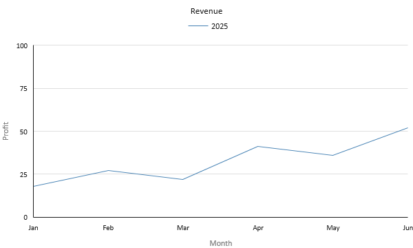</td>
  </tr>
  <tr>
    <td><b>C#</b></td>
    <td>
<pre lang="csharp">var month  = new Samples { ItemsSource = Months };
var profit = new Samples { ItemsSource = Profits };

var monthX  = new CategoryAxis { Label = "Month" };
var profitY = new LinearAxis
{
    Label = "Profit",
    Minimum = 0,
    GridLines = GridLines.Major
};

var chart = new Chart
{
    ShowLegend = true,
    LegendTitle = "Revenue"
};
chart.Data.Add(month);
chart.Data.Add(profit);
chart.Axes.Add(monthX);
chart.Axes.Add(profitY);

chart.Series.Add(new LineSeries
{
    Title = "2025",
    XAxis = monthX,
    YAxis = profitY,
    XValues = month,
    YValues = profit
});</pre>
    </td>
    <td></td>
  </tr>
  <tr>
    <td><b>C++/WinRT</b></td>
    <td>
<pre lang="cpp">
#include &lt;winrt/Microsoft.UI.Xaml.Controls.Charts.h&gt;

using namespace winrt::Microsoft::UI::Xaml::Controls::Charts;
using winrt::Windows::Foundation::IReference;<br>

auto month = Samples();
month.ItemsSource(months);

auto profit = Samples();
profit.ItemsSource(profits);

auto monthX = CategoryAxis();
monthX.Label(L"Month");

auto profitY = LinearAxis();
profitY.Label(L"Profit");
profitY.Minimum(
    winrt::box_value(0.0).as&lt;IReference&lt;double&gt;&gt;());
profitY.GridLines(GridLines::Major);

auto chart = Chart();
chart.ShowLegend(true);
chart.LegendTitle(L"Revenue");
chart.Data().Append(month);
chart.Data().Append(profit);
chart.Axes().Append(monthX);
chart.Axes().Append(profitY);

auto series = LineSeries();
series.Title(L"2025");
series.XAxis(monthX);
series.YAxis(profitY);
series.XValues(month);
series.YValues(profit);
chart.Series().Append(series);</pre>
    </td>
    <td></td>
  </tr>
</table>

## Style all three series

The stroke, label, and marker properties inherited from `CartesianSeries` apply consistently to
Line, Area, and Bar series. Area and Bar series additionally provide `Fill`; Bar provides
`Orientation`.

```xaml
<charts:Chart ShowLegend="True" LegendTitle="Monthly results">
    <charts:Chart.Data>
        <charts:Samples x:Name="Month"    ItemsSource="{x:Bind Months, Mode=OneTime}" />
        <charts:Samples x:Name="Actual"   ItemsSource="{x:Bind Actuals, Mode=OneTime}" />
        <charts:Samples x:Name="Forecast" ItemsSource="{x:Bind Forecasts, Mode=OneTime}" />
        <charts:Samples x:Name="Target"   ItemsSource="{x:Bind Targets, Mode=OneTime}" />
    </charts:Chart.Data>

    <charts:AreaSeries Title="Forecast"
                       XValues="{x:Bind Month, Mode=OneTime}"
                       YValues="{x:Bind Forecast, Mode=OneTime}"
                       Fill="LightSteelBlue"
                       Stroke="SteelBlue"
                       StrokeThickness="2"
                       StrokeDashStyle="Dot"
                       ShowDataMarkers="True"
                       MarkerShape="Square"
                       DataMarkerBrush="SteelBlue" />

    <charts:BarSeries Title="Actual"
                      Orientation="Vertical"
                      XValues="{x:Bind Month, Mode=OneTime}"
                      YValues="{x:Bind Actual, Mode=OneTime}"
                      Fill="SeaGreen"
                      Stroke="DarkGreen"
                      StrokeThickness="1"
                      ShowDataLabels="True"
                      DataLabelBrush="DarkGreen" />

    <charts:LineSeries x:Name="TargetSeries"
                       Title="Target"
                       XValues="{x:Bind Month, Mode=OneTime}"
                       YValues="{x:Bind Target, Mode=OneTime}"
                       Stroke="Firebrick"
                       StrokeThickness="2"
                       StrokeDashStyle="Dash"
                       ShowDataMarkers="True"
                       MarkerShape="Diamond"
                       DataMarkerBrush="Firebrick" />
</charts:Chart>
```

Per-point overrides are populated in code because the override maps are not dependency
properties:

```csharp
var highlight = new SolidColorBrush(Colors.Gold);
TargetSeries.DataLabelOverrides[2] =
    new DataLabelOverride("Peak", highlight);
TargetSeries.DataMarkerOverrides[2] =
    new DataMarkerOverride(MarkerShape.Diamond, highlight);
```

## A bar chart

```xaml
<charts:Chart>
    <charts:Chart.Data>
        <charts:Samples x:Name="Region" ItemsSource="{x:Bind Regions, Mode=OneTime}" />
        <charts:Samples x:Name="Units"  ItemsSource="{x:Bind Units, Mode=OneTime}" />
    </charts:Chart.Data>

    <charts:BarSeries Title="Units sold"
                      Orientation="Vertical"
                      Fill="SeaGreen"
                      XValues="{x:Bind Region, Mode=OneTime}"
                      YValues="{x:Bind Units, Mode=OneTime}" />
</charts:Chart>
```

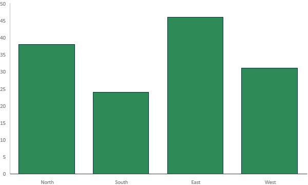

## A time series

A date-time source can be supplied with `x:Bind` from XAML. The following code example constructs
the source and axis together; literal `Windows.Foundation.DateTime` bounds have no XAML text
syntax.

```csharp
var day = new Samples { ItemsSource = dates };       // IList<DateTimeOffset>
var reading = new Samples { ItemsSource = readings };

var dayX = new DateTimeAxis
{
    Label = "Date",
    IntervalType = DateTimeIntervalType.Week,
    LabelFormat = "month day"
};

chart.Data.Add(day);
chart.Data.Add(reading);
chart.Axes.Add(dayX);
chart.Series.Add(new AreaSeries
{
    XAxis = dayX,
    XValues = day,
    YValues = reading
});
```

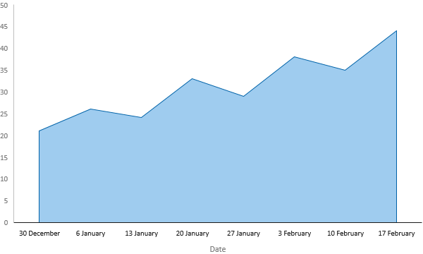

# API Pages

_(Each of the following L2 sections correspond to a page that will be on learn.microsoft.com)_

## Chart class

Displays one or more Cartesian data series with configurable axes and a legend.

```csharp
public class Chart : Control
{
    public Chart();
    public IList<Samples> Data { get; }
    public IList<Axis> Axes { get; }
    public IList<CartesianSeries> Series { get; }
    public bool ShowLegend { get; set; }
    public string LegendTitle { get; set; }
}
```

`Chart` owns three collections. `Data` holds the `Samples` handles. `Axes` holds the axes its
series may bind to. `Series` holds the series themselves and is the content property, so series
may be written as direct children in markup.

```xaml
<charts:Chart ShowLegend="True" LegendTitle="Revenue">
    <charts:Chart.Data>
        <charts:Samples x:Name="Month"  ItemsSource="{x:Bind Months, Mode=OneTime}" />
        <charts:Samples x:Name="Profit" ItemsSource="{x:Bind Profits, Mode=OneTime}" />
    </charts:Chart.Data>

    <charts:LineSeries Title="2025"
                       XValues="{x:Bind Month, Mode=OneTime}"
                       YValues="{x:Bind Profit, Mode=OneTime}" />
</charts:Chart>
```

**Remarks**

`Axes` and `Series` are validating collections. They reject a null element and reject the same
object appearing twice, both with `E_INVALIDARG`, and they apply changes transactionally: if a
change cannot be carried through, the collection is left as it was. The membership rules they
enforce are:

- An axis or a series belongs to at most one chart at a time.
- An axis cannot be removed while a series still references it.
- An axis a series names must be present in the same chart's `Axes`.

`Data` is an ordinary observable vector and performs none of this validation.

A chart draws through the GPU. If the graphics device is lost, the chart's presentation is
detached and re-established; the model and the property values you set are not rebuilt.

## Chart.Data property

Gets the collection of data-sample objects retained by the chart for use by its series.

`Data` is where a chart keeps its handles alive, and where markup declares them so they can be
given an `x:Name`:

```xaml
<charts:Chart.Data>
    <charts:Samples x:Name="Month"   ItemsSource="{x:Bind Months, Mode=OneTime}" />
    <charts:Samples x:Name="Revenue" ItemsSource="{x:Bind Revenues, Mode=OneTime}" />
    <charts:Samples x:Name="Cost"    ItemsSource="{x:Bind Costs, Mode=OneTime}" />
</charts:Chart.Data>
```

**Remarks**

Membership in `Data` does not bind anything, and it is not required in order to bind. What plots a
handle's data is a series referencing that handle through `XValues` or `YValues`. In code you may
assign a `Samples` object to a series without ever adding it to `Data`, and you may add it to
`Data` before or after assigning it — the order does not matter:

```csharp
var yValues = new Samples();
var line = new LineSeries();
line.YValues = yValues;            // Bound here, before the chart exists.

var chart = new Chart();
chart.Series.Add(line);
chart.Data.Add(yValues);           // Added afterwards, to organize it with the chart.
yValues.ItemsSource = values;      // Data arrives last; the series picks it up.
```

Adding a handle to `Data` associates its lifetime with the chart and provides the collection
property used to declare named handles in markup. A series also retains any handle assigned to
`XValues` or `YValues`.

## Chart.Axes property

Gets the collection of axes available to the chart's series.

```xaml
<charts:Chart.Axes>
    <charts:CategoryAxis x:Name="MonthX" Label="Month" />
    <charts:LinearAxis   x:Name="ProfitY" Label="Profit" Minimum="0" />
</charts:Chart.Axes>
```

The collection is typed as `Axis`, the root of the axis hierarchy. Every axis a series can bind to
derives from `CartesianAxis`, which is why `CartesianSeries.XAxis` and `YAxis` are typed
`CartesianAxis` rather than `Axis`.

**Remarks**

Adding an axis that already belongs to a different chart throws `E_INVALIDARG`, as does removing
an axis a series in this chart still references. Removing an unreferenced axis detaches it with
all of its property values intact.

## Chart.Series property

Gets the collection of series displayed by the chart.

This is the content property of `Chart`, so in markup series can be written as direct children:

```xaml
<charts:Chart>
    <charts:LineSeries XValues="{x:Bind Month, Mode=OneTime}"
                       YValues="{x:Bind Revenue, Mode=OneTime}" />
    <charts:LineSeries XValues="{x:Bind Month, Mode=OneTime}"
                       YValues="{x:Bind Cost, Mode=OneTime}" />
</charts:Chart>
```

## Chart.ShowLegend property

Gets or sets whether the chart displays a legend. The default is **false**.

The legend identifies series by their `CartesianSeries.Title`. Set `LegendTitle` to give the
legend a heading.

```xaml
<charts:Chart ShowLegend="True" LegendTitle="Regions">
    <charts:BarSeries Title="North" />
    <charts:BarSeries Title="South" />
</charts:Chart>
```

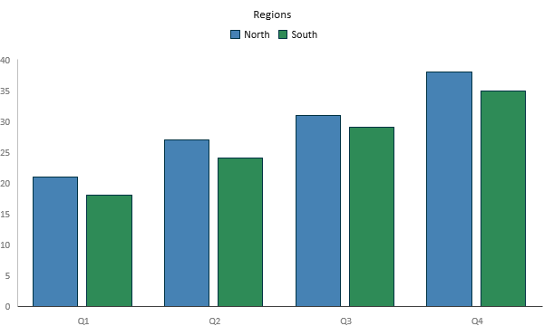

## Chart.LegendTitle property

Gets or sets the title displayed by the legend. The default is the empty string, which shows the
legend without a heading. Setting `LegendTitle` has no visible effect while `ShowLegend` is false.

## Other Chart members

| Name                  | Description                                            |
|-----------------------|--------------------------------------------------------|
| `Chart()`             | Initializes a new instance of the Chart class.          |
| `ShowLegendProperty`  | Identifies the ShowLegend dependency property.          |
| `LegendTitleProperty` | Identifies the LegendTitle dependency property.         |

## Samples class

Provides a replaceable data-source handle for one chart-series dimension.

```csharp
public sealed class Samples : DependencyObject
{
    public Samples();
    public object ItemsSource { get; set; }
}
```

A `Samples` object is a *handle*, not a collection. It holds no data of its own and exposes no
count, no indexer, and no enumeration; all it carries is `ItemsSource`, a reference to the
collection that supplies the values. A series consumes two handles — one through `XValues` and one
through `YValues`.

The indirection is what makes the handle worth having: several series can name the same handle and
draw from one collection, and the collection behind a handle can be replaced without touching any
series that uses it.

```xaml
<charts:Chart.Data>
    <charts:Samples x:Name="Month"   ItemsSource="{x:Bind Months, Mode=OneTime}" />
    <charts:Samples x:Name="Revenue" ItemsSource="{x:Bind Revenues, Mode=OneTime}" />
</charts:Chart.Data>
```

```csharp
var revenue = new Samples { ItemsSource = revenues };
chart.Data.Add(revenue);
lineSeries.YValues = revenue;
barSeries.YValues  = revenue;   // Both series draw from one handle.

revenue.ItemsSource = updatedRevenues;   // Both series follow the swap.
```

**Remarks**

`Samples` has no `Name` property. In markup, give it an `x:Name` and reference it with `{x:Bind}`
or `{x:Reference}`; in code, keep the object. A series never identifies a handle by string.

## Samples.ItemsSource property

Gets or sets the collection that supplies values to a chart-series dimension. The default is
**null**, which leaves a series bound to this handle without data for that dimension.

The collection is resolved by element type first and then by collection interface. Accepted
element types are `Double`, `Windows.Foundation.DateTime`, `String`, and `Object`; for each, the
interfaces tried in order are `IObservableVector<T>`, `IVector<T>`, `IVectorView<T>`, and
`IIterable<T>`. If none matches, the non-generic `IBindableObservableVector`, `IBindableVector`,
and `IBindableIterable` are tried. See
[How to supply data](#how-to-supply-data) for the full resolution table.

An `IIterable<T>` that implements nothing more capable is read once into a snapshot when the
handle is bound. An `IObservableVector<T>` additionally keeps the chart up to date as the
collection changes. Replacing a null or successfully bound `ItemsSource` rebinds it and redraws
every series using the handle.

```csharp
// Live updates: appending to the source redraws the chart.
var readings = new ObservableCollection<double>();
samples.ItemsSource = readings;
readings.Add(42.0);
```

**Remarks**

For an `Object` or non-generic source, the first element determines the data type; an empty source
is treated as numeric. Elements may be `Double`, `Windows.Foundation.DateTime`, or `String`
values, boxed directly or as `IReference<Double>`, `IReference<DateTime>`, or
`IReference<String>`. If a later element cannot be converted to the established type, it is
reported to the renderer as a missing numeric value or an empty string. Changing the type of the
first element after binding is not supported — assign a fresh, correctly typed collection
instead.

Unsupported data does not make `ItemsSource` assignment throw. If the collection or its first
element cannot establish a supported type, the affected dimension is left unbound, a diagnostic
is written to the debug output, and the property keeps the value you assigned. Because a failed
bind does not retain the replacement callback, correct the source and then set the series
dimension to null and back to this handle, or assign a new `Samples` handle, to retry.

`ItemsSource` is the XAML content property of `Samples`, although attribute syntax is generally
clearer.

## Other Samples members

| Name                  | Description                                            |
|-----------------------|--------------------------------------------------------|
| `Samples()`           | Initializes a new instance of the Samples class.        |
| `ItemsSourceProperty` | Identifies the ItemsSource dependency property.         |

## Axis class

Provides common visibility and labeling properties for chart axes.

```csharp
public class Axis : DependencyObject
{
    protected Axis();
    public bool IsVisible { get; set; }
    public string Label { get; set; }
}
```

`Axis` is the root of the axis hierarchy and is not activatable — its constructor is protected.
Create a `LinearAxis`, `CategoryAxis`, or `DateTimeAxis` instead. `Axis` exists so that
`Chart.Axes` can be typed once for present and future axis kinds.

## Axis.IsVisible property

Gets or sets whether the axis line, title, tick marks, and tick labels are displayed. The default
is **true**.

Setting it to false hides all four of those elements together. **Grid lines are not affected** and
remain governed by `CartesianAxis.GridLines`, so an invisible axis can still rule its plot area.

```xaml
<!-- Grid lines only: no axis line, title, ticks, or tick labels. -->
<charts:LinearAxis x:Name="ProfitY" IsVisible="False" GridLines="Major" />
```

## Axis.Label property

Gets or sets the axis title. The default is the empty string, which shows no title.

```xaml
<charts:LinearAxis Label="Profit (USD)" />
```

## Other Axis members

| Name                | Description                                               |
|---------------------|-----------------------------------------------------------|
| `Axis()`            | Initializes a new instance of an Axis-derived class. Protected. |
| `IsVisible`         | Gets or sets whether the axis line, title, tick marks, and tick labels are displayed. Defaults to `true`. |
| `IsVisibleProperty` | Identifies the IsVisible dependency property.              |
| `LabelProperty`     | Identifies the Label dependency property.                  |

## CartesianAxis class

Provides tick, grid-line, and brush properties for Cartesian axes.

```csharp
public class CartesianAxis : Axis
{
    protected CartesianAxis();
    public bool ShowTickLabels { get; set; }
    public bool ShowTickMarks { get; set; }
    public GridLines GridLines { get; set; }
    public Brush GridLineMajorBrush { get; set; }
    public Brush GridLineMinorBrush { get; set; }
    public Brush TickBrush { get; set; }
    public Brush TickLabelBrush { get; set; }
    public Brush AxisLineBrush { get; set; }
}
```

`CartesianAxis` is not activatable. It collects the presentation every Cartesian scale shares, so
that `LinearAxis`, `CategoryAxis`, and `DateTimeAxis` differ only in how they map values.

```xaml
<charts:LinearAxis Label="Profit"
                   ShowTickMarks="True"
                   GridLines="Minor"
                   GridLineMajorBrush="DimGray"
                   GridLineMinorBrush="#20808080" />
```

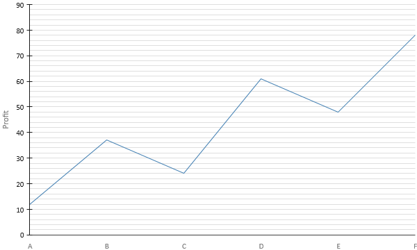

**Remarks**

The five brush properties default to null, which means "use the theme". A null brush resolves to
the corresponding keyed resource — `ChartsGridLineMajorBrush`, `ChartsGridLineMinorBrush`,
`ChartsTickBrush`, `ChartsTickLabelBrush`, or `ChartsAxisLineBrush` — looked up first in the
chart's own `Resources` dictionary and then in `Application.Current.Resources`.

`SolidColorBrush` is the only brush type the renderer reads a color from. If the property is null,
cannot be read, or contains another brush type, its value is retained and the corresponding theme
resource is used instead. An unsupported property brush also writes a diagnostic.

This differs from the series brushes. `CartesianSeries.Stroke`, `AreaSeries.Fill`, `BarSeries.Fill`,
`DataMarkerBrush`, and `DataLabelBrush` do fall back — to the series' palette color, or to
`Chart.Foreground` for labels — rather than to a keyed axis resource.

If neither the property nor the theme resource supplies a color, the local renderer color is
cleared and the renderer's own default applies.

Axis brush colors are re-applied when the brush property changes or the axis reconnects. They are
not currently refreshed when `ActualTheme` changes, and changing `SolidColorBrush.Color` in place
does not notify the axis.

`CartesianAxis` derives from `DependencyObject`, not `FrameworkElement`, so implicit styles do not
apply to it. Set the brushes per instance, or redefine the keyed resources application-wide.

## Other CartesianAxis members

| Name                         | Description                                                                     |
|------------------------------|----------------------------------------------------------------------------------|
| `CartesianAxis()`            | Initializes a new instance of a CartesianAxis-derived class. Protected.          |
| `ShowTickLabels`             | Gets or sets whether tick labels are displayed. Defaults to `true`.               |
| `ShowTickMarks`              | Gets or sets whether major tick marks are displayed. Defaults to `false`.         |
| `GridLines`                  | Gets or sets which set of grid lines is displayed. Defaults to `GridLines.None`.  |
| `GridLineMajorBrush`         | Gets or sets the brush from which the major grid-line color is resolved. Defaults to `null`. |
| `GridLineMinorBrush`         | Gets or sets the brush from which the minor grid-line color is resolved. Defaults to `null`. |
| `TickBrush`                  | Gets or sets the brush from which the tick-mark color is resolved. Defaults to `null`.       |
| `TickLabelBrush`             | Gets or sets the brush from which the tick-label color is resolved. Defaults to `null`.      |
| `AxisLineBrush`              | Gets or sets the brush from which the axis-line color is resolved. Defaults to `null`.       |
| `ShowTickLabelsProperty`     | Identifies the ShowTickLabels dependency property.                                |
| `ShowTickMarksProperty`      | Identifies the ShowTickMarks dependency property.                                 |
| `GridLinesProperty`          | Identifies the GridLines dependency property.                                     |
| `GridLineMajorBrushProperty` | Identifies the GridLineMajorBrush dependency property.                            |
| `GridLineMinorBrushProperty` | Identifies the GridLineMinorBrush dependency property.                            |
| `TickBrushProperty`          | Identifies the TickBrush dependency property.                                     |
| `TickLabelBrushProperty`     | Identifies the TickLabelBrush dependency property.                                |
| `AxisLineBrushProperty`      | Identifies the AxisLineBrush dependency property.                                 |

## LinearAxis class

Represents a Cartesian axis that plots numeric values on a linear scale.

```csharp
public sealed class LinearAxis : CartesianAxis
{
    public LinearAxis();
    public double? Minimum { get; set; }
    public double? Maximum { get; set; }
    public double? Spacing { get; set; }
}
```

`LinearAxis` is the value axis: use it for the `YAxis` of a line, area, or bar series. All three of
its properties are nullable, and null means "choose this from the data".

```xaml
<charts:LinearAxis x:Name="ProfitY"
                   Label="Profit"
                   Minimum="0"
                   Maximum="100"
                   Spacing="25"
                   GridLines="Major" />
```


```csharp
var axis = new LinearAxis { Minimum = 0, Maximum = 100, Spacing = 25 };
axis.Maximum = null;   // Back to automatic.
```

```cpp
using winrt::Windows::Foundation::IReference;

auto axis = LinearAxis();
axis.Minimum(winrt::box_value(0.0).as<IReference<double>>());
axis.Maximum(winrt::box_value(100.0).as<IReference<double>>());
axis.Maximum(nullptr);   // Back to automatic.
```

**Remarks**

`Minimum`, `Maximum`, and `Spacing` are validated when set. An invalid value throws
`E_INVALIDARG` and leaves the axis unchanged:

- `Minimum` and `Maximum`, when not null, must be finite.
- `Minimum` must be less than `Maximum` when both are set. An inverted range is rejected, not
  reordered.
- `Spacing`, when not null, must be finite and greater than zero.
- `Spacing` must not be greater than `Maximum - Minimum` when all three are set.

These three properties are ordinary WinRT properties, not dependency properties, so they support
`{x:Bind}`, XAML attribute syntax, and code assignment, but not `{Binding}`, `Style` setters, or
animation. See [Which properties are dependency properties](#which-properties-are-dependency-properties).

## Other LinearAxis members

| Name           | Description                                            |
|----------------|--------------------------------------------------------|
| `LinearAxis()` | Initializes a new instance of the LinearAxis class.     |

`LinearAxis` declares no static dependency property accessors, because `Minimum`, `Maximum`, and
`Spacing` are not dependency properties. It inherits the accessors declared by `CartesianAxis` and
`Axis`.

## CategoryAxis class

Represents a Cartesian axis that plots and optionally sorts category values.

```csharp
public sealed class CategoryAxis : CartesianAxis
{
    public CategoryAxis();
    public CategorySortKey SortKey { get; set; }
    public SortOrder SortOrder { get; set; }
}
```

`CategoryAxis` serves the category slot: use it for the `XAxis` of a series. A category value may
be a **string** or a **number** — a `CategoryAxis` handles both, so it suits an x dimension of
month names just as well as one of numeric bin identifiers. Without a `CategoryAxis`, categories
keep the order of the source collection.

```xaml
<charts:CategoryAxis x:Name="RegionX"
                     Label="Region"
                     SortKey="Value"
                     SortOrder="Descending" />
```

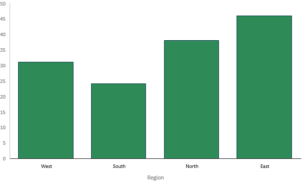

**Remarks**

`SortKey` decides *what* is sorted on and `SortOrder` decides the direction. With
`CategorySortKey.Value`, sorting is by the category value itself — ordinal and case-sensitive for
strings, and numeric for numeric categories.

## Other CategoryAxis members

| Name                | Description                                                                                     |
|---------------------|--------------------------------------------------------------------------------------------------|
| `CategoryAxis()`    | Initializes a new instance of the CategoryAxis class.                                             |
| `SortKey`           | Gets or sets whether categories are sorted by source index or category value. Defaults to `Index`. |
| `SortOrder`         | Gets or sets the category sort direction. Defaults to `Ascending`.                                |
| `SortKeyProperty`   | Identifies the SortKey dependency property.                                                       |
| `SortOrderProperty` | Identifies the SortOrder dependency property.                                                     |

`SortKey` of `Index` with `SortOrder` of `Ascending` — the default pair — preserves the order of
the source collection.

## DateTimeAxis class

Represents a Cartesian axis that plots date and time values.

```csharp
public sealed class DateTimeAxis : CartesianAxis
{
    public DateTimeAxis();
    public DateTimeOffset? Minimum { get; set; }
    public DateTimeOffset? Maximum { get; set; }
    public DateTimeIntervalType IntervalType { get; set; }
    public string LabelFormat { get; set; }
}
```

`DateTimeAxis` is the time axis: use it for the `XAxis` of a series whose x dimension holds
date-time values. `Minimum` and `Maximum` are nullable, and null means the bound is chosen from
the data.

```csharp
var axis = new DateTimeAxis
{
    Label = "Date",
    IntervalType = DateTimeIntervalType.Month,
    LabelFormat = "month year"
};
```

```cpp
using winrt::Windows::Foundation::DateTime;
using winrt::Windows::Foundation::IReference;

auto axis = DateTimeAxis();
axis.Minimum(winrt::box_value(start).as<IReference<DateTime>>());
axis.Maximum(nullptr);   // Back to automatic.
```

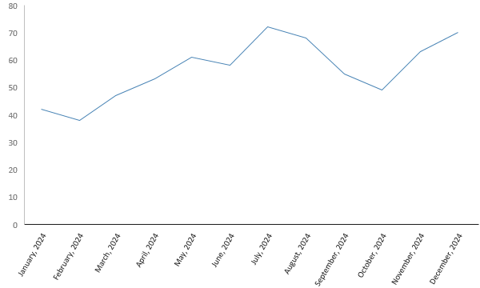

**Remarks**

`IntervalType` and `LabelFormat` can be set from markup. `Minimum` and `Maximum` are typed
`Windows.Foundation.DateTime`, for which XAML has no text syntax, so set them from code.

Setting `Minimum` to a value that is not less than `Maximum`, or `Maximum` to a value that is not
greater than `Minimum`, throws `E_INVALIDARG` and leaves the axis unchanged. Like
`LinearAxis.Minimum` and `Maximum`, these two are ordinary WinRT properties, not dependency
properties.

## DateTimeAxis.IntervalType property

Gets or sets the interval used for major ticks. The default is `DateTimeIntervalType.Auto`.

`Auto` selects the interval from the axis range and the length available along the physical axis,
and re-selects it as either changes. Any other value fixes the interval.

```csharp
axis.IntervalType = DateTimeIntervalType.Week;
```

## DateTimeAxis.LabelFormat property

Gets or sets the `DateTimeFormatter` format template used for tick labels. The default is the
empty string, which formats labels as `"shortdate"`.

The value is a `Windows.Globalization.DateTimeFormatting.DateTimeFormatter` format template, so
`"shortdate"`, `"longdate"`, `"month year"`, `"month day"`, and `"hour minute"` are all valid.

```xaml
<charts:DateTimeAxis IntervalType="Month" LabelFormat="month year" />
```

## Other DateTimeAxis members

| Name                   | Description                                                                     |
|------------------------|----------------------------------------------------------------------------------|
| `DateTimeAxis()`       | Initializes a new instance of the DateTimeAxis class.                             |
| `Minimum`              | Gets or sets the optional earliest date and time on the axis; null selects the bound automatically. |
| `Maximum`              | Gets or sets the optional latest date and time on the axis; null selects the bound automatically.   |
| `IntervalTypeProperty` | Identifies the IntervalType dependency property.                                  |
| `LabelFormatProperty`  | Identifies the LabelFormat dependency property.                                   |

`Minimum` and `Maximum` have no static dependency property accessors; they are not dependency
properties.

## CartesianSeries class

Provides the common data, axis, stroke, label, and marker properties for Cartesian series.

```csharp
public class CartesianSeries : DependencyObject
{
    protected CartesianSeries();
    public string Title { get; set; }
    public bool IsVisible { get; set; }
    public Samples XValues { get; set; }
    public Samples YValues { get; set; }
    public Brush Stroke { get; set; }
    public double StrokeThickness { get; set; }
    public StrokeDashStyle StrokeDashStyle { get; set; }
    public bool ShowDataLabels { get; set; }
    public bool ShowDataMarkers { get; set; }
    public MarkerShape MarkerShape { get; set; }
    public Brush DataLabelBrush { get; set; }
    public Brush DataMarkerBrush { get; set; }
    public IDictionary<uint, DataLabelOverride> DataLabelOverrides { get; }
    public IDictionary<uint, DataMarkerOverride> DataMarkerOverrides { get; }
    public CartesianAxis XAxis { get; set; }
    public CartesianAxis YAxis { get; set; }
}
```

`CartesianSeries` is the base for everything a chart plots and is not activatable. Create a
`LineSeries`, `AreaSeries`, or `BarSeries` instead.

```xaml
<charts:LineSeries Title="Profit"
                   XValues="{x:Bind Month, Mode=OneTime}"
                   YValues="{x:Bind Profit, Mode=OneTime}"
                   Stroke="SteelBlue"
                   StrokeThickness="2"
                   ShowDataMarkers="True"
                   MarkerShape="Circle" />
```

**Remarks**

Values set before the series joins a chart are applied when it joins. Values set on a series
already in a chart take effect in place.

`XValues` and `YValues` name **data dimensions**, not screen axes: x is always the category slot
and y is always the value slot, whatever the series type or its orientation. `XAxis` and `YAxis`
follow the same convention.

`ShowDataLabels` and `ShowDataMarkers` govern only the **default** label and marker drawn for a
point that has no override. Entries in `DataLabelOverrides` and `DataMarkerOverrides` are drawn
regardless, so a series with both switches off can still show labels and markers on the individual
points you have overridden.

Brush properties supply a color, not a paint, and their fallbacks differ from the axis brushes —
see [How brushes are used](#how-brushes-are-used) and
[How the palette works](#how-the-palette-works).

## CartesianSeries.StrokeDashStyle property

Gets or sets the dash pattern used to draw the series outline. The default is
`StrokeDashStyle.Solid`.

## CartesianSeries.XValues property

Gets or sets the samples for the x data dimension, which is the category slot. The default is
**null**.

`XValues` names a *data dimension*, not a screen axis. The x dimension is the series' **category**
slot in every series type and every orientation: a horizontal `BarSeries` still takes its
categories from `XValues`, even though they run down the side of the plot.

Category values may be strings, numbers, or date-times. Strings are plotted as named categories;
numbers as numeric categories; date-times against a `DateTimeAxis`.

```xaml
<charts:LineSeries XValues="{x:Bind Month, Mode=OneTime}"
                   YValues="{x:Bind Profit, Mode=OneTime}" />
```

Setting `XValues` to null removes the x dimension from the series. If the assigned handle's
`ItemsSource` is null, the series stays unbound and binds when a collection is assigned.

## CartesianSeries.YValues property

Gets or sets the samples for the y data dimension, which is the value slot. The default is
**null**.

Like `XValues`, `YValues` names a data dimension rather than a screen axis. The y dimension is the
series' **value** slot in every series type and every orientation, so a horizontal `BarSeries`
takes its bar lengths from `YValues` even though they run across the plot.

Values may be numeric or date-time values, which are converted to numeric chart values. A string
handle leaves the dimension unbound and writes a diagnostic to the debug output; the property
keeps the value you assigned.

## CartesianSeries.XAxis property

Gets or sets the axis used for the x dimension; the axis must belong to the same chart. The
default is **null**, which lets the chart supply an axis.

```csharp
var monthX = new CategoryAxis();
chart.Axes.Add(monthX);
series.XAxis = monthX;
```

**Remarks**

`XAxis` and `YAxis` name data slots, not screen edges. A horizontal `BarSeries` binds its
categories through `XAxis` even though they are laid out vertically.

For a series already attached to a chart, assignment throws `E_INVALIDARG`, leaving the series
unchanged, when:

- the axis belongs to a different chart, or is not present in this chart's `Axes`;
- the axis scale does not suit the slot — for example a `LinearAxis` in the x slot;
- the same axis object is used for both `XAxis` and `YAxis` and the two slots need different
  physical layouts, which for every series type in this release they always do; or
- the axis is already used by another series in a way that needs a different data dimension or a
  different physical layout.

For a detached series, assignment validates the axis type and slot only. Chart ownership and
membership are validated when that series later joins a chart.

`XAxis` and `YAxis` are ordinary WinRT properties, not dependency properties, so they support
`{x:Bind}`, `{x:Reference}`, and code assignment, but not `{Binding}`, `Style` setters, or
animation.

## CartesianSeries.YAxis property

Gets or sets the axis used for the y dimension; the axis must belong to the same chart. The
default is **null**, which lets the chart supply an axis. The validation and binding rules match
`XAxis`.

## CartesianSeries.DataLabelOverrides property

Gets the zero-based data-point label overrides, keyed by data-point index.

Use this map to replace the text, and optionally the brush, of individual data labels.

```csharp
series.DataLabelOverrides[0] = new DataLabelOverride("Start", null);
series.DataLabelOverrides[7] = new DataLabelOverride("Peak", redBrush);
series.DataLabelOverrides.Remove(0);
```

**Remarks**

The map is get-only and is not a dependency property, so it cannot be populated from markup.

Keys are absolute indices into the series and are never renumbered when data is inserted or
removed. An entry beyond the current data is kept and takes effect if the data grows to reach it.

An override is shown whether or not `ShowDataLabels` is true; that property controls only the
default labels. An override whose text is the empty string is an explicit empty label.

`DataLabelOverride` is immutable — to change an entry, replace it. Label brushes resolve in the
order: the override's brush, then `DataLabelBrush`, then `Chart.Foreground`.

## CartesianSeries.DataMarkerOverrides property

Gets the zero-based data-point marker overrides, keyed by data-point index.

Use this map to replace the shape, and optionally the brush, of individual data markers.

```csharp
series.DataMarkerOverrides[7] = new DataMarkerOverride(MarkerShape.Diamond, redBrush);
series.DataMarkerOverrides[3] = new DataMarkerOverride(MarkerShape.None, null);
```

**Remarks**

The keying, indexing, and immutability rules match `DataLabelOverrides`. `MarkerShape.None` hides
the marker for that one point.

A marker brush applies to both the marker fill and its outline, and resolves in the order: the
override's brush, then `DataMarkerBrush`, then the series' palette color for markers. Marker color
is independent of `Stroke`.

## Other CartesianSeries members

| Name                        | Description                                                                                        |
|-----------------------------|------------------------------------------------------------------------------------------------------|
| `CartesianSeries()`         | Initializes a new instance of a CartesianSeries-derived class. Protected.                            |
| `Title`                     | Gets or sets the series title used by the chart legend. Defaults to the empty string.                 |
| `IsVisible`                 | Gets or sets whether the series is displayed. Defaults to `true`. A hidden series stays in `Chart.Series` and keeps its palette slots. |
| `Stroke`                    | Gets or sets the brush from which the series outline color is resolved. Defaults to `null`.           |
| `StrokeThickness`           | Gets or sets the thickness of the series outline. Defaults to `1.0`. See the remarks below.           |
| `StrokeDashStyle`           | Gets or sets the dash pattern used to draw the series outline. Defaults to `StrokeDashStyle.Solid`.    |
| `ShowDataLabels`            | Gets or sets whether a default label is displayed for each data point without an override. Defaults to `false`. |
| `ShowDataMarkers`           | Gets or sets whether a default marker is displayed for each data point without an override. Defaults to `false`. |
| `MarkerShape`               | Gets or sets the default marker shape for data points. Defaults to `MarkerShape.Circle`.              |
| `DataLabelBrush`            | Gets or sets the brush from which the default data-label color is resolved. Defaults to `null`.       |
| `DataMarkerBrush`           | Gets or sets the brush from which the default data-marker color is resolved. Defaults to `null`.      |
| `TitleProperty`             | Identifies the Title dependency property.                                                             |
| `IsVisibleProperty`         | Identifies the IsVisible dependency property.                                                         |
| `XValuesProperty`           | Identifies the XValues dependency property.                                                           |
| `YValuesProperty`           | Identifies the YValues dependency property.                                                           |
| `StrokeProperty`            | Identifies the Stroke dependency property.                                                            |
| `StrokeThicknessProperty`   | Identifies the StrokeThickness dependency property.                                                   |
| `StrokeDashStyleProperty`   | Identifies the StrokeDashStyle dependency property.                                                   |
| `ShowDataLabelsProperty`    | Identifies the ShowDataLabels dependency property.                                                    |
| `ShowDataMarkersProperty`   | Identifies the ShowDataMarkers dependency property.                                                   |
| `MarkerShapeProperty`       | Identifies the MarkerShape dependency property.                                                       |
| `DataLabelBrushProperty`    | Identifies the DataLabelBrush dependency property.                                                    |
| `DataMarkerBrushProperty`   | Identifies the DataMarkerBrush dependency property.                                                   |

`XAxis` and `YAxis` have no static dependency property accessors; they are not dependency
properties.

`StrokeThickness` is applied when it is finite, not negative, and within the range of a 32-bit
float. Otherwise the series' explicit thickness is cleared, the renderer's own thickness is used,
and a diagnostic is written to the debug output.

## LineSeries class

Represents a Cartesian series that connects data points with line segments.

```csharp
public class LineSeries : CartesianSeries
{
    public LineSeries();
}
```

```xaml
<charts:LineSeries Title="Forecast"
                   XValues="{x:Bind Month, Mode=OneTime}"
                   YValues="{x:Bind Forecast, Mode=OneTime}"
                   Stroke="SteelBlue"
                   StrokeThickness="2"
                   StrokeDashStyle="Dash" />
```

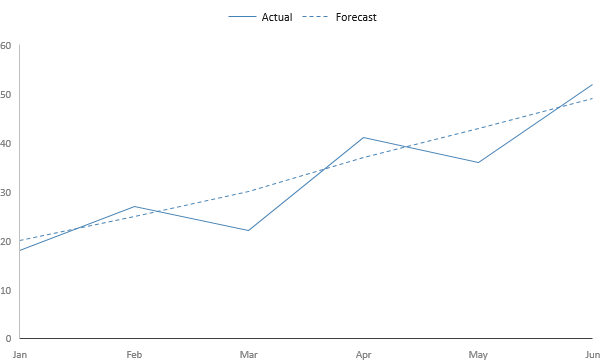

## Other LineSeries members

| Name           | Description                                        |
|----------------|----------------------------------------------------|
| `LineSeries()` | Initializes a new instance of the LineSeries class. |

## AreaSeries class

Represents a Cartesian series that displays data as a filled area.

```csharp
public class AreaSeries : CartesianSeries
{
    public AreaSeries();
    public Brush Fill { get; set; }
}
```

```xaml
<charts:AreaSeries Title="Traffic"
                   XValues="{x:Bind Day, Mode=OneTime}"
                   YValues="{x:Bind Hits, Mode=OneTime}"
                   Fill="#4000A0FF"
                   Stroke="#FF00A0FF" />
```

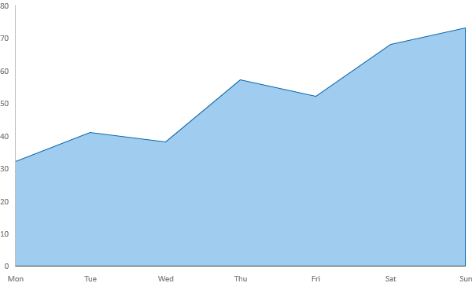

## AreaSeries.Fill property

Gets or sets the brush from which the area fill color is resolved. The default is **null**, in
which case the series takes a color from the chart palette.

`Fill` is independent of `Stroke`: an area series can outline and fill in different colors, and
setting one while leaving the other null is supported. Only the brush's color is used — see
[How brushes are used](#how-brushes-are-used).

## Other AreaSeries members

| Name             | Description                                            |
|------------------|--------------------------------------------------------|
| `AreaSeries()`   | Initializes a new instance of the AreaSeries class.     |
| `FillProperty`   | Identifies the Fill dependency property.                |

## BarSeries class

Represents a Cartesian series that displays values as horizontal bars or vertical columns.

```csharp
public class BarSeries : CartesianSeries
{
    public BarSeries();
    public Brush Fill { get; set; }
    public BarOrientation Orientation { get; set; }
}
```

```xaml
<charts:BarSeries Title="Units"
                  Orientation="Vertical"
                  XValues="{x:Bind Region, Mode=OneTime}"
                  YValues="{x:Bind Units, Mode=OneTime}"
                  Fill="SeaGreen" />
```


## BarSeries.Orientation property

Gets or sets whether the series requests horizontal bars or vertical columns. The default is
`BarOrientation.Horizontal`.

`Orientation` changes the physical layout only. It does not change which dimension is which:
`XValues` and `XAxis` remain the category slot and `YValues` and `YAxis` remain the value slot in
both orientations, and neither axis reference is swapped when the orientation changes.

```csharp
series.Orientation = BarOrientation.Vertical;   // XAxis is still the category axis.
```

**Remarks**

The property *requests* an orientation; it does not guarantee one is rendered. Changing
`Orientation` on a series already in a chart re-validates its existing axis assignments against
the new layout. Explicit axes are transposed to the new physical layout and any missing axis is
supplied by the chart.

If an axis this series shares with another cannot serve both layouts, the assignment is not
rolled back and no exception is raised: `Orientation` retains the value you requested, a
diagnostic is traced, and **the last usable rendered orientation stays active**. Reading
`Orientation` back therefore tells you what was requested, which is not necessarily what is on
screen. To recover, first make the axes compatible, then retrigger the orientation change by changing away
and back, or remove and re-add the series so it reconnects using the requested orientation.

## BarSeries.Fill property

Gets or sets the brush from which each bar's fill color is resolved. The default is **null**, in
which case the series takes a color from the chart palette.

## Other BarSeries members

| Name                  | Description                                            |
|-----------------------|--------------------------------------------------------|
| `BarSeries()`         | Initializes a new instance of the BarSeries class.      |
| `Orientation` | Gets or sets whether the series requests horizontal bars or vertical columns. Incompatible shared axes leave the last usable rendered orientation active. Defaults to `Horizontal`. |
| `FillProperty`        | Identifies the Fill dependency property.                |
| `OrientationProperty` | Identifies the Orientation dependency property.         |

## DataLabelOverride class

Overrides the text and brush of one data label.

```csharp
public sealed class DataLabelOverride
{
    public DataLabelOverride(string text, Brush brush);
    public string Text { get; }
    public Brush Brush { get; }
}
```

`DataLabelOverride` is immutable and is created only through its constructor, which takes both the
replacement text and the brush to draw it with. Pass null for `brush` to keep the series'
`DataLabelBrush`, or `Chart.Foreground` when that is also null.

```csharp
series.DataLabelOverrides[7] = new DataLabelOverride("Peak", redBrush);
series.DataLabelOverrides[9] = new DataLabelOverride("Projected", null);
```

`DataLabelOverride` has no parameterless constructor, so it cannot be created from markup. Add
entries to `CartesianSeries.DataLabelOverrides` in code.

## Other DataLabelOverride members

| Name                                | Description                                                        |
|-------------------------------------|---------------------------------------------------------------------|
| `DataLabelOverride(String, Brush)`  | Initializes an override with the specified label text and brush.     |
| `Text`                              | Gets the replacement label text.                                     |
| `Brush`                             | Gets the brush supplied for the replacement label color.             |

`DataLabelOverride` declares no dependency properties and no static accessors.

## DataMarkerOverride class

Overrides the shape and brush of one data marker.

```csharp
public sealed class DataMarkerOverride
{
    public DataMarkerOverride(MarkerShape shape, Brush brush);
    public MarkerShape Shape { get; }
    public Brush Brush { get; }
}
```

`DataMarkerOverride` is immutable and is created only through its constructor. Pass null for
`brush` to keep the series' `DataMarkerBrush`, or its palette marker color when that is also null.
Pass `MarkerShape.None` to hide the marker for that point.

```csharp
series.DataMarkerOverrides[7] = new DataMarkerOverride(MarkerShape.Diamond, redBrush);
series.DataMarkerOverrides[3] = new DataMarkerOverride(MarkerShape.None, null);
```

Like `DataLabelOverride`, this class has no parameterless constructor and cannot be created from
markup.

## Other DataMarkerOverride members

| Name                                      | Description                                                   |
|-------------------------------------------|----------------------------------------------------------------|
| `DataMarkerOverride(MarkerShape, Brush)`  | Initializes an override with the specified marker shape and brush. |
| `Shape`                                   | Gets the replacement marker shape.                             |
| `Brush`                                   | Gets the brush supplied for the replacement marker color.      |

`DataMarkerOverride` declares no dependency properties and no static accessors.

## XamlChartsResources class

Provides the default XAML resources used by chart controls.

```csharp
public sealed class XamlChartsResources : ResourceDictionary
{
    public XamlChartsResources();
}
```

Merge `XamlChartsResources` into your application resources to bring the chart theme resources
into scope where your own resources can override them.

```xaml
<Application.Resources>
    <ResourceDictionary>
        <ResourceDictionary.MergedDictionaries>
            <XamlControlsResources xmlns="using:Microsoft.UI.Xaml.Controls" />
            <XamlChartsResources xmlns="using:Microsoft.UI.Xaml.Controls.Charts" />
        </ResourceDictionary.MergedDictionaries>

        <SolidColorBrush x:Key="ChartsGridLineMajorBrush" Color="SlateGray" />
        <SolidColorBrush x:Key="ChartsTickLabelBrush"     Color="Gainsboro" />
    </ResourceDictionary>
</Application.Resources>
```

The control and axis brushes are defined in `Default`, `Light`, and `HighContrast` theme
dictionaries. The palette colors are root-level keys, not theme-dictionary entries.

`XamlChartsResources` sets its `Source` to the packaged `Themes/ThemeResources.xaml` in the
Charts component. It carries the keys listed above; it is not the source of the `Chart` control
template, which comes from the control's own default style.

| Key group | Keys                                                                                          |
|-----------|-------------------------------------------------------------------------------------------------|
| Control   | `ChartsControlBackgroundBrush`, `ChartsControlForegroundBrush`, `ChartsControlBorderBrush`        |
| Axis      | `ChartsGridLineMajorBrush`, `ChartsGridLineMinorBrush`, `ChartsTickBrush`, `ChartsTickLabelBrush`, `ChartsAxisLineBrush` |
| Palette   | `ChartColorLight1`–`ChartColorLight40`, `ChartColorDark1`–`ChartColorDark40`                      |

## Other XamlChartsResources members

| Name                    | Description                                                    |
|-------------------------|-----------------------------------------------------------------|
| `XamlChartsResources()` | Initializes a new instance of the XamlChartsResources class.     |

`XamlChartsResources` declares no dependency properties and no static accessors.

## StrokeDashStyle enum

Specifies the dash pattern used to draw a series stroke.

| Value        | Description                                     |
|--------------|-------------------------------------------------|
| `Solid`      | Draws a continuous stroke. The default.          |
| `Dash`       | Draws a dashed stroke.                           |
| `Dot`        | Draws a dotted stroke.                           |
| `DashDot`    | Draws an alternating dash-and-dot stroke.        |
| `DashDotDot` | Draws an alternating dash-and-two-dots stroke.   |

## MarkerShape enum

Specifies the shape used to mark a data point.

| Value       | Description                          |
|-------------|--------------------------------------|
| `None`      | Displays no marker.                   |
| `Square`    | Displays a square marker.             |
| `Diamond`   | Displays a diamond marker.            |
| `Triangle`  | Displays a triangular marker.         |
| `X`         | Displays an X-shaped marker.          |
| `Asterisk`  | Displays an asterisk-shaped marker.   |
| `ShortDash` | Displays a short horizontal dash.     |
| `LongDash`  | Displays a long horizontal dash.      |
| `Circle`    | Displays a circular marker. The default for `CartesianSeries.MarkerShape`. |
| `Plus`      | Displays a plus-shaped marker.        |

`None` is useful with `DataMarkerOverride` to suppress the marker on an individual point.

## BarOrientation enum

Specifies whether a bar series draws horizontal bars or vertical columns.

| Value        | Description                                            |
|--------------|--------------------------------------------------------|
| `Horizontal` | Draws bars that extend horizontally. The default.       |
| `Vertical`   | Draws columns that extend vertically.                   |

## SortOrder enum

Specifies the direction in which category-axis values are sorted.

| Value        | Description                                    |
|--------------|------------------------------------------------|
| `Ascending`  | Sorts values in ascending order. The default.   |
| `Descending` | Sorts values in descending order.               |

## CategorySortKey enum

Specifies the value used to sort a category axis.

| Value   | Description                                           |
|---------|-------------------------------------------------------|
| `Index` | Sorts categories by their source index. The default.   |
| `Value` | Sorts categories by their category value.              |

`Index` with `SortOrder.Ascending` preserves the order of the source collection.

## GridLines enum

Specifies which set of grid lines a Cartesian axis displays.

| Value   | Description                                              |
|---------|----------------------------------------------------------|
| `None`  | Displays no grid lines. The default.                     |
| `Major` | Displays grid lines at major tick positions.             |
| `Minor` | Displays grid lines at minor (and major) tick positions. |

Grid lines are not affected by `Axis.IsVisible`; hiding an axis does not hide its grid lines.

## DateTimeIntervalType enum

Specifies the interval used for major ticks on a date-time axis.

| Value   | Description                                                                    |
|---------|--------------------------------------------------------------------------------|
| `Auto`  | Selects an interval based on the axis range and available length. The default. |
| `Day`   | Uses day intervals.                                                            |
| `Week`  | Uses week intervals.                                                           |
| `Month` | Uses month intervals.                                                          |
| `Year`  | Uses year intervals.                                                           |

# API Details

```c# (but really MIDL3)
namespace Microsoft.UI.Xaml.Controls.Charts
{
    /// Identifies the API contract for the charting controls.
    [contractversion(3)]
    apicontract WinUIChartingContract {};

    /// Provides a replaceable data-source handle for one chart-series dimension.
    [contract(WinUIChartingContract, 3)]
    [webhosthidden]
    runtimeclass Samples : Microsoft.UI.Xaml.DependencyObject
    {
        /// Initializes a new instance of the Samples class.
        Samples();

        /// Gets or sets the collection that supplies values to a chart-series dimension.
        Object ItemsSource;

        /// Identifies the ItemsSource dependency property.
        static Microsoft.UI.Xaml.DependencyProperty ItemsSourceProperty{ get; };
    }

    /// Specifies the dash pattern used to draw a series stroke.
    [contract(WinUIChartingContract, 3)]
    [webhosthidden]
    enum StrokeDashStyle
    {
        /// Draws a continuous stroke.
        Solid,
        /// Draws a dashed stroke.
        Dash,
        /// Draws a dotted stroke.
        Dot,
        /// Draws an alternating dash-and-dot stroke.
        DashDot,
        /// Draws an alternating dash-and-two-dots stroke.
        DashDotDot
    };

    /// Specifies the shape used to mark a data point.
    [contract(WinUIChartingContract, 3)]
    [webhosthidden]
    enum MarkerShape
    {
        /// Displays no marker.
        None,
        /// Displays a square marker.
        Square,
        /// Displays a diamond marker.
        Diamond,
        /// Displays a triangular marker.
        Triangle,
        /// Displays an X-shaped marker.
        X,
        /// Displays an asterisk-shaped marker.
        Asterisk,
        /// Displays a short horizontal dash.
        ShortDash,
        /// Displays a long horizontal dash.
        LongDash,
        /// Displays a circular marker.
        Circle,
        /// Displays a plus-shaped marker.
        Plus
    };

    /// Specifies whether a bar series draws horizontal bars or vertical columns.
    [contract(WinUIChartingContract, 3)]
    [webhosthidden]
    enum BarOrientation
    {
        /// Draws bars that extend horizontally.
        Horizontal,
        /// Draws columns that extend vertically.
        Vertical
    };

    /// Overrides the text and brush of one data label.
    [contract(WinUIChartingContract, 3)]
    [webhosthidden]
    runtimeclass DataLabelOverride
    {
        /// Initializes an override with the specified label text and brush.
        DataLabelOverride(
            String text,
            Microsoft.UI.Xaml.Media.Brush brush);

        /// Gets the replacement label text.
        String Text{ get; };
        /// Gets the brush supplied for the replacement label color.
        Microsoft.UI.Xaml.Media.Brush Brush{ get; };
    };

    /// Overrides the shape and brush of one data marker.
    [contract(WinUIChartingContract, 3)]
    [webhosthidden]
    runtimeclass DataMarkerOverride
    {
        /// Initializes an override with the specified marker shape and brush.
        DataMarkerOverride(
            MarkerShape shape,
            Microsoft.UI.Xaml.Media.Brush brush);

        /// Gets the replacement marker shape.
        MarkerShape Shape{ get; };
        /// Gets the brush supplied for the replacement marker color.
        Microsoft.UI.Xaml.Media.Brush Brush{ get; };
    };

    /// Specifies the direction in which category-axis values are sorted.
    [contract(WinUIChartingContract, 3)]
    [webhosthidden]
    enum SortOrder
    {
        /// Sorts values in ascending order.
        Ascending,
        /// Sorts values in descending order.
        Descending
    };

    /// Specifies the value used to sort a category axis.
    [contract(WinUIChartingContract, 3)]
    [webhosthidden]
    enum CategorySortKey
    {
        /// Sorts categories by their source index.
        Index,
        /// Sorts categories by their category value.
        Value
    };

    /// Specifies which set of grid lines a Cartesian axis displays.
    [contract(WinUIChartingContract, 3)]
    [webhosthidden]
    enum GridLines
    {
        /// Displays no grid lines.
        None,
        /// Displays grid lines at major tick positions.
        Major,
        /// Displays grid lines at minor tick positions.
        Minor
    };

    unsealed runtimeclass Axis;
    unsealed runtimeclass CartesianAxis;
    unsealed runtimeclass CartesianSeries;

    /// Provides common visibility and labeling properties for chart axes.
    [contract(WinUIChartingContract, 3)]
    [webhosthidden]
    unsealed runtimeclass Axis : Microsoft.UI.Xaml.DependencyObject
    {
        /// Initializes a new instance of an Axis-derived class.
        protected Axis();

        /// Gets or sets whether the axis line, title, tick marks, and tick labels are displayed.
        Boolean IsVisible;
        /// Gets or sets the axis title.
        String Label;

        /// Identifies the IsVisible dependency property.
        static Microsoft.UI.Xaml.DependencyProperty IsVisibleProperty{ get; };
        /// Identifies the Label dependency property.
        static Microsoft.UI.Xaml.DependencyProperty LabelProperty{ get; };
    }

    /// Provides tick, grid-line, and brush properties for Cartesian axes.
    [contract(WinUIChartingContract, 3)]
    [webhosthidden]
    unsealed runtimeclass CartesianAxis : Axis
    {
        /// Initializes a new instance of a CartesianAxis-derived class.
        protected CartesianAxis();

        /// Gets or sets whether tick labels are displayed.
        Boolean ShowTickLabels;
        /// Gets or sets whether major tick marks are displayed.
        Boolean ShowTickMarks;
        /// Gets or sets which set of grid lines is displayed.
        GridLines GridLines;
        /// Gets or sets the brush from which the major grid-line color is resolved.
        Microsoft.UI.Xaml.Media.Brush GridLineMajorBrush;
        /// Gets or sets the brush from which the minor grid-line color is resolved.
        Microsoft.UI.Xaml.Media.Brush GridLineMinorBrush;
        /// Gets or sets the brush from which the tick-mark color is resolved.
        Microsoft.UI.Xaml.Media.Brush TickBrush;
        /// Gets or sets the brush from which the tick-label color is resolved.
        Microsoft.UI.Xaml.Media.Brush TickLabelBrush;
        /// Gets or sets the brush from which the axis-line color is resolved.
        Microsoft.UI.Xaml.Media.Brush AxisLineBrush;

        /// Identifies the ShowTickLabels dependency property.
        static Microsoft.UI.Xaml.DependencyProperty ShowTickLabelsProperty{ get; };
        /// Identifies the ShowTickMarks dependency property.
        static Microsoft.UI.Xaml.DependencyProperty ShowTickMarksProperty{ get; };
        /// Identifies the GridLines dependency property.
        static Microsoft.UI.Xaml.DependencyProperty GridLinesProperty{ get; };
        /// Identifies the GridLineMajorBrush dependency property.
        static Microsoft.UI.Xaml.DependencyProperty GridLineMajorBrushProperty{ get; };
        /// Identifies the GridLineMinorBrush dependency property.
        static Microsoft.UI.Xaml.DependencyProperty GridLineMinorBrushProperty{ get; };
        /// Identifies the TickBrush dependency property.
        static Microsoft.UI.Xaml.DependencyProperty TickBrushProperty{ get; };
        /// Identifies the TickLabelBrush dependency property.
        static Microsoft.UI.Xaml.DependencyProperty TickLabelBrushProperty{ get; };
        /// Identifies the AxisLineBrush dependency property.
        static Microsoft.UI.Xaml.DependencyProperty AxisLineBrushProperty{ get; };
    }

    /// Represents a Cartesian axis that plots numeric values on a linear scale.
    [contract(WinUIChartingContract, 3)]
    [webhosthidden]
    runtimeclass LinearAxis : CartesianAxis
    {
        /// Initializes a new instance of the LinearAxis class.
        LinearAxis();

        /// Gets or sets the optional lower bound of the axis; null selects the bound automatically.
        Windows.Foundation.IReference<Double> Minimum;
        /// Gets or sets the optional upper bound of the axis; null selects the bound automatically.
        Windows.Foundation.IReference<Double> Maximum;
        /// Gets or sets the optional interval between major ticks; null selects the interval automatically.
        Windows.Foundation.IReference<Double> Spacing;
    }

    /// Represents a Cartesian axis that plots and optionally sorts category values.
    [contract(WinUIChartingContract, 3)]
    [webhosthidden]
    runtimeclass CategoryAxis : CartesianAxis
    {
        /// Initializes a new instance of the CategoryAxis class.
        CategoryAxis();

        /// Gets or sets whether categories are sorted by source index or category value.
        CategorySortKey SortKey;
        /// Gets or sets the category sort direction.
        SortOrder SortOrder;

        /// Identifies the SortKey dependency property.
        static Microsoft.UI.Xaml.DependencyProperty SortKeyProperty{ get; };
        /// Identifies the SortOrder dependency property.
        static Microsoft.UI.Xaml.DependencyProperty SortOrderProperty{ get; };
    }

    /// Specifies the interval used for major ticks on a date-time axis.
    [contract(WinUIChartingContract, 3)]
    [webhosthidden]
    enum DateTimeIntervalType
    {
        /// Selects an interval based on the axis range and available axis length.
        Auto,
        /// Uses day intervals.
        Day,
        /// Uses week intervals.
        Week,
        /// Uses month intervals.
        Month,
        /// Uses year intervals.
        Year
    };

    /// Represents a Cartesian axis that plots date and time values.
    [contract(WinUIChartingContract, 3)]
    [webhosthidden]
    runtimeclass DateTimeAxis : CartesianAxis
    {
        /// Initializes a new instance of the DateTimeAxis class.
        DateTimeAxis();

        /// Gets or sets the optional earliest date and time on the axis; null selects the bound automatically.
        Windows.Foundation.IReference<Windows.Foundation.DateTime> Minimum;
        /// Gets or sets the optional latest date and time on the axis; null selects the bound automatically.
        Windows.Foundation.IReference<Windows.Foundation.DateTime> Maximum;

        /// Gets or sets the interval used for major ticks.
        DateTimeIntervalType IntervalType;

        /// Gets or sets the DateTimeFormatter format template used for tick labels; empty or null uses "shortdate".
        String LabelFormat;

        /// Identifies the IntervalType dependency property.
        static Microsoft.UI.Xaml.DependencyProperty IntervalTypeProperty { get; };
        /// Identifies the LabelFormat dependency property.
        static Microsoft.UI.Xaml.DependencyProperty LabelFormatProperty  { get; };
    }

    /// Displays one or more Cartesian data series with configurable axes and a legend.
    [contract(WinUIChartingContract, 3)]
    [webhosthidden]
    [contentproperty("Series")]
    unsealed runtimeclass Chart : Microsoft.UI.Xaml.Controls.Control
    {
        /// Initializes a new instance of the Chart class.
        Chart();

        /// Gets the collection of data-sample objects retained by the chart for use by its series.
        Windows.Foundation.Collections.IObservableVector<Samples> Data{ get; };
        /// Gets the collection of axes available to the chart's series.
        Windows.Foundation.Collections.IObservableVector<Axis> Axes{ get; };
        /// Gets the collection of series displayed by the chart.
        Windows.Foundation.Collections.IObservableVector<CartesianSeries> Series{ get; };

        /// Gets or sets whether the chart displays a legend.
        Boolean ShowLegend;
        /// Gets or sets the title displayed by the legend.
        String LegendTitle;

        /// Identifies the ShowLegend dependency property.
        static Microsoft.UI.Xaml.DependencyProperty ShowLegendProperty{ get; };
        /// Identifies the LegendTitle dependency property.
        static Microsoft.UI.Xaml.DependencyProperty LegendTitleProperty{ get; };
    }

    /// Provides the common data, axis, stroke, label, and marker properties for Cartesian series.
    [contract(WinUIChartingContract, 3)]
    [webhosthidden]
    unsealed runtimeclass CartesianSeries : Microsoft.UI.Xaml.DependencyObject
    {
        /// Initializes a new instance of a CartesianSeries-derived class.
        protected CartesianSeries();

        /// Gets or sets the series title used by the chart legend.
        String Title;
        /// Gets or sets whether the series is displayed.
        Boolean IsVisible;
        /// Gets or sets the samples for the x data dimension, which is the category slot.
        Samples XValues;
        /// Gets or sets the samples for the y data dimension, which is the value slot.
        Samples YValues;
        /// Gets or sets the brush from which the series outline color is resolved.
        Microsoft.UI.Xaml.Media.Brush Stroke;
        /// Gets or sets the thickness of the series outline.
        Double StrokeThickness;
        /// Gets or sets the dash pattern used to draw the series outline.
        StrokeDashStyle StrokeDashStyle;
        /// Gets or sets whether a default label is displayed for each data point without an override.
        Boolean ShowDataLabels;
        /// Gets or sets whether a default marker is displayed for each data point without an override.
        Boolean ShowDataMarkers;
        /// Gets or sets the default marker shape for data points.
        MarkerShape MarkerShape;
        /// Gets or sets the brush from which the default data-label color is resolved.
        Microsoft.UI.Xaml.Media.Brush DataLabelBrush;
        /// Gets or sets the brush from which the default data-marker color is resolved.
        Microsoft.UI.Xaml.Media.Brush DataMarkerBrush;

        /// Gets the zero-based data-point label overrides, keyed by data-point index.
        Windows.Foundation.Collections.IObservableMap<UInt32, DataLabelOverride> DataLabelOverrides{ get; };
        /// Gets the zero-based data-point marker overrides, keyed by data-point index.
        Windows.Foundation.Collections.IObservableMap<UInt32, DataMarkerOverride> DataMarkerOverrides{ get; };
        /// Gets or sets the axis used for the x dimension; the axis must belong to the same chart.
        CartesianAxis XAxis;
        /// Gets or sets the axis used for the y dimension; the axis must belong to the same chart.
        CartesianAxis YAxis;

        /// Identifies the Title dependency property.
        static Microsoft.UI.Xaml.DependencyProperty TitleProperty{ get; };
        /// Identifies the IsVisible dependency property.
        static Microsoft.UI.Xaml.DependencyProperty IsVisibleProperty{ get; };
        /// Identifies the XValues dependency property.
        static Microsoft.UI.Xaml.DependencyProperty XValuesProperty{ get; };
        /// Identifies the YValues dependency property.
        static Microsoft.UI.Xaml.DependencyProperty YValuesProperty{ get; };
        /// Identifies the Stroke dependency property.
        static Microsoft.UI.Xaml.DependencyProperty StrokeProperty{ get; };
        /// Identifies the StrokeThickness dependency property.
        static Microsoft.UI.Xaml.DependencyProperty StrokeThicknessProperty{ get; };
        /// Identifies the StrokeDashStyle dependency property.
        static Microsoft.UI.Xaml.DependencyProperty StrokeDashStyleProperty{ get; };
        /// Identifies the ShowDataLabels dependency property.
        static Microsoft.UI.Xaml.DependencyProperty ShowDataLabelsProperty{ get; };
        /// Identifies the ShowDataMarkers dependency property.
        static Microsoft.UI.Xaml.DependencyProperty ShowDataMarkersProperty{ get; };
        /// Identifies the MarkerShape dependency property.
        static Microsoft.UI.Xaml.DependencyProperty MarkerShapeProperty{ get; };
        /// Identifies the DataLabelBrush dependency property.
        static Microsoft.UI.Xaml.DependencyProperty DataLabelBrushProperty{ get; };
        /// Identifies the DataMarkerBrush dependency property.
        static Microsoft.UI.Xaml.DependencyProperty DataMarkerBrushProperty{ get; };
    }

    /// Represents a Cartesian series that connects data points with line segments.
    [contract(WinUIChartingContract, 3)]
    [webhosthidden]
    unsealed runtimeclass LineSeries : CartesianSeries
    {
        /// Initializes a new instance of the LineSeries class.
        LineSeries();
    }

    /// Represents a Cartesian series that displays data as a filled area.
    [contract(WinUIChartingContract, 3)]
    [webhosthidden]
    unsealed runtimeclass AreaSeries : CartesianSeries
    {
        /// Initializes a new instance of the AreaSeries class.
        AreaSeries();

        /// Gets or sets the brush from which the area fill color is resolved.
        Microsoft.UI.Xaml.Media.Brush Fill;

        /// Identifies the Fill dependency property.
        static Microsoft.UI.Xaml.DependencyProperty FillProperty{ get; };
    }

    /// Represents a Cartesian series that displays values as horizontal bars or vertical columns.
    [contract(WinUIChartingContract, 3)]
    [webhosthidden]
    unsealed runtimeclass BarSeries : CartesianSeries
    {
        /// Initializes a new instance of the BarSeries class.
        BarSeries();

        /// Gets or sets the brush from which each bar's fill color is resolved.
        Microsoft.UI.Xaml.Media.Brush Fill;
        /// Gets or sets whether the series requests horizontal bars or vertical columns.
        /// Incompatible shared axes leave the last usable rendered orientation active.
        BarOrientation Orientation;

        /// Identifies the Fill dependency property.
        static Microsoft.UI.Xaml.DependencyProperty FillProperty{ get; };
        /// Identifies the Orientation dependency property.
        static Microsoft.UI.Xaml.DependencyProperty OrientationProperty{ get; };
    }

    /// Provides the default XAML resources used by chart controls.
    [contract(WinUIChartingContract, 3)]
    [webhosthidden]
    [default_interface]
    runtimeclass XamlChartsResources : Microsoft.UI.Xaml.ResourceDictionary
    {
        /// Initializes a new instance of the XamlChartsResources class.
        XamlChartsResources();
    }
}
```

# Appendix

## Summary of defaults

Every default below is the value the property is registered with, or the value its getter falls
back to.

| Type              | Property                        | Default                                   |
|-------------------|---------------------------------|-------------------------------------------|
| `Samples`         | `ItemsSource`                   | `null`                                    |
| `Chart`           | `ShowLegend`                    | `false`                                   |
| `Chart`           | `LegendTitle`                   | `""`                                      |
| `Axis`            | `IsVisible`                     | `true`                                    |
| `Axis`            | `Label`                         | `""`                                      |
| `CartesianAxis`   | `ShowTickLabels`                | `true`                                    |
| `CartesianAxis`   | `ShowTickMarks`                 | `false`                                   |
| `CartesianAxis`   | `GridLines`                     | `GridLines.None`                          |
| `CartesianAxis`   | all five brushes                | `null` (resolved from the theme)          |
| `LinearAxis`      | `Minimum`, `Maximum`, `Spacing` | `null` (automatic)                        |
| `CategoryAxis`    | `SortKey`                       | `CategorySortKey.Index`                   |
| `CategoryAxis`    | `SortOrder`                     | `SortOrder.Ascending`                     |
| `DateTimeAxis`    | `Minimum`, `Maximum`            | `null` (automatic)                        |
| `DateTimeAxis`    | `IntervalType`                  | `DateTimeIntervalType.Auto`               |
| `DateTimeAxis`    | `LabelFormat`                   | `""` (formats as `"shortdate"`)           |
| `CartesianSeries` | `Title`                         | `""`                                      |
| `CartesianSeries` | `IsVisible`                     | `true`                                    |
| `CartesianSeries` | `XValues`, `YValues`            | `null`                                    |
| `CartesianSeries` | `Stroke`                        | `null` (palette)                          |
| `CartesianSeries` | `StrokeThickness`               | `1.0`                                     |
| `CartesianSeries` | `StrokeDashStyle`               | `StrokeDashStyle.Solid`                   |
| `CartesianSeries` | `ShowDataLabels`                | `false`                                   |
| `CartesianSeries` | `ShowDataMarkers`               | `false`                                   |
| `CartesianSeries` | `MarkerShape`                   | `MarkerShape.Circle`                      |
| `CartesianSeries` | `DataLabelBrush`                | `null` (falls back to `Chart.Foreground`) |
| `CartesianSeries` | `DataMarkerBrush`               | `null` (palette)                          |
| `CartesianSeries` | `XAxis`, `YAxis`                | `null` (automatic)                        |
| `AreaSeries`      | `Fill`                          | `null` (palette)                          |
| `BarSeries`       | `Fill`                          | `null` (palette)                          |
| `BarSeries`       | `Orientation`                   | `BarOrientation.Horizontal`               |

## Which properties are dependency properties

Every settable property in this namespace is a dependency property with a matching
`static DependencyProperty ...Property { get; }` accessor, except these seven:

| Property                | Type                   |
|-------------------------|------------------------|
| `LinearAxis.Minimum`    | `IReference<Double>`   |
| `LinearAxis.Maximum`    | `IReference<Double>`   |
| `LinearAxis.Spacing`    | `IReference<Double>`   |
| `DateTimeAxis.Minimum`  | `IReference<DateTime>` |
| `DateTimeAxis.Maximum`  | `IReference<DateTime>` |
| `CartesianSeries.XAxis` | `CartesianAxis`        |
| `CartesianSeries.YAxis` | `CartesianAxis`        |

The split follows the property-validation policy the implementation is written to:

- **A dependency property accepts whatever you set.** Reading it back returns what was written.
  When a value cannot be applied — an unusable `ItemsSource`, an out-of-range `StrokeThickness`, a
  `BarSeries` orientation change an established shared axis cannot serve — the property keeps the
  value, a diagnostic is traced, and rendering falls back.
- **These seven validate and reject invalid input.** Invalid ranges or axis relationships throw
  `E_INVALIDARG` before the public value changes. A separate model-application failure can throw
  `E_FAIL`; the implementation attempts to restore the prior rendering state.

The consequence for apps is that these seven support `{x:Bind}`, `{x:Reference}`, XAML attribute
syntax where the type has one, and code assignment, but **not** `{Binding}`, `Style` setters, or
animation.

Unlike `RangeBase.Minimum` and `Maximum`, `LinearAxis.Minimum` and `Maximum` are nullable, null
means automatic, and an inverted pair is rejected rather than coerced.

## Design decisions

These are the design decisions recorded for the current shape of the API.

**Axis presentation lives on the axis object.** Putting grid lines, ticks, and labels on
`CartesianSeries` would require a merge policy whenever two series shared an axis; putting them on
`Chart` would prevent independently configured secondary axes. Future non-Cartesian series have no
axis concept at all.

**Concrete scale types instead of a mutable `ScaleType` property.** A single `Axis` class with a
settable scale would be a smaller API, but changing the scale of an axis that series are already
bound to would invalidate all of them. Concrete types make the constraint a type constraint.

**`Chart.Axes` is a collection, not a code-only accessor.** A `Chart.GetAxes()` method was
considered and rejected, because axes declared in XAML and referenced by name are more natural for
app authors.

**`Samples.ItemsSource` takes standard WinRT collection interfaces.** A Charts-specific data-source
interface was rejected. An app implements from the right level for its store — `IVectorView<Double>`
for a circular buffer, `IObservableVector<Double>` when it also wants live updates — and the common
cases, such as a `List<double>` or an `ObservableCollection<double>`, need nothing at all.

**A data source is identified by object reference, not by name.** `Samples` has no `Name` property, and
`XValues`/`YValues` take the object. In markup the reference is `{x:Bind}` or `{x:Reference}` to an
`x:Name`.
