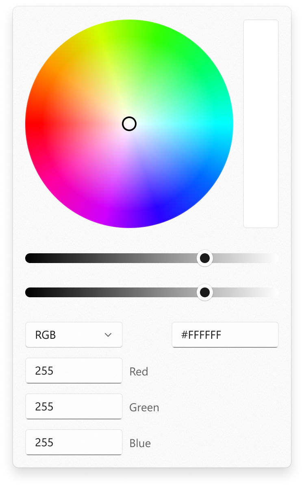

ColorPicker.Orientation
===

# Background

The Xaml [ColorPicker](https://docs.microsoft.com/uwp/api/Windows.UI.Xaml.Controls.ColorPicker)
control is a flyout that lets a user pick a color using a color spectrum, sliders, and text input.

This spec has an update to the existing `ColorPicker` control. 
The aim of this new API is, to make the ColorPicker more versatile to use and
provide different layouting ways to maximize the space available
by adding an `Orientation` property.


# Conceptual pages (How To)

#### Specify the layout direction  

Use the `Orientation` property to control whether the `ColorPicker` should take up
more vertical space or more horizontal space.

```xaml
<muxc:ColorPicker IsAlphaEnabled="True" Orientation="Vertical"/>
```


```xaml
<muxc:ColorPicker IsAlphaEnabled="True" Orientation="Horizontal"/>
```


# API Pages

## ColorPicker.Orientation property

Gets or sets the orientation in which the parts of the ColorPicker will be laid out.
Defaults to `Vertical`.

Using the orientation, you can specify whether the editing controls should be laid out underneath
the color area (vertical orientation) or to the side of it (horizontal orientation).

| Orientation | Meaning |
|-------------|---------|
| Horizontal  | The editing controls will be put to the side of the color spectrum.|
| Vertical    | The editing controls will be put underneath the color spectrum.|


# API Details

```c# (but really MIDL3)

namespace Microsoft.UI.Xaml.Controls
{
  [webhosthidden]
  unsealed runtimeclass ColorPicker
  {
      // Existing ...

      // Gets or sets the DisplayMode of the ColorPicker
      Windows.UI.Xaml.Controls.Orientation Orientation
  }
}
```
