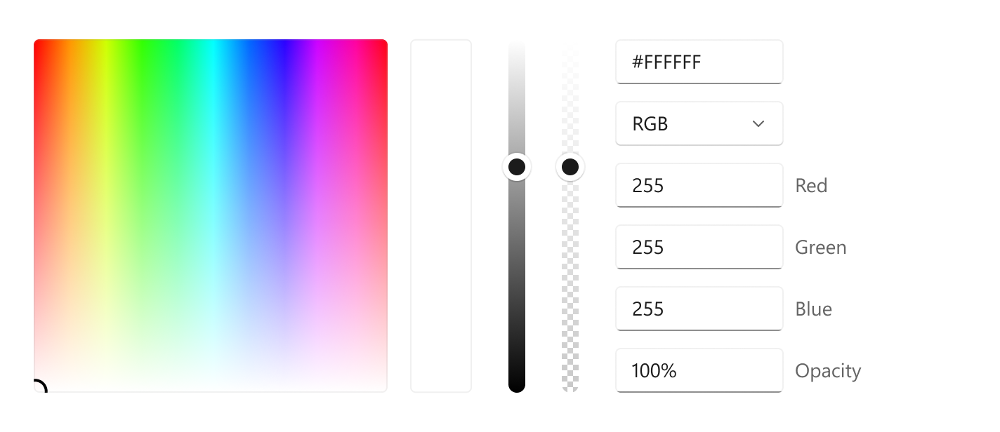

ColorPicker.Orientation
===

# Background

The Xaml [ColorPicker](https://docs.microsoft.com/uwp/api/Windows.UI.Xaml.Controls.ColorPicker)
control is a flyout that lets a user pick a color using a color spectrum, sliders, and text input.

This spec has an update to the existing `ColorPicker` control. 
The aim of this new API is, to make the ColorPicker more versatile to use and
provide different layouting ways to maximize the space available
by adding an `Orientation` property.


# Conceptual pages (How To)

#### Specify the layout direction  

Use the `Orientation` property to control whether the `ColorPicker` should take up
more vertical space or more horizontal space.

```xaml
<muxc:ColorPicker IsAlphaEnabled="True" Orientation="Vertical"/>
```


```xaml
<muxc:ColorPicker IsAlphaEnabled="True" Orientation="Horizontal"/>
```



# API Pages

## ColorPicker.Orientation property

Gets or sets the orientation in which the parts of the ColorPicker will be laid out.
Defaults to `Vertical`.

Using the orientation, you can specify whether the editing controls should be laid out underneath
the color area (vertical orientation) or to the side of it (horizontal orientation).

| Orientation | Meaning |
|-------------|---------|
| Horizontal  | The editing controls will be put to the side of the color spectrum.|
| Vertical    | The editing controls will be put underneath the color spectrum.|

### Note
When the `Orientation` property is set to `Horizontal`, the ColorPicker will NOT respect the IsMoreButton enabled property.
Instead, the text input fields will always be displayed to the side of the ColorPicker.
In addition to that, when in `Horizontal` mode, when the text input fields are being used, there will be a margin of `122px` to the right of the input fields.
This margin accounts for the different localizations of the different localizations of the labels of said fields and ensures that those labels will not be cut off.
This margin is determined by the `ColorPickerTextInputHorizontalOrientationMargin` lightweight styling resource.
If your app is only available in English, you can override this resource and set the margin to `74px` to improve the horizontal footprint of the control.
The resource does have not have any effect when the `Orientation` is set to `Vertical`.

# API Details

```c# (but really MIDL3)

namespace Microsoft.UI.Xaml.Controls
{
  [webhosthidden]
  unsealed runtimeclass ColorPicker
  {
      // Existing ...

      // Gets or sets the Orientation of the ColorPicker
      Windows.UI.Xaml.Controls.Orientation Orientation;
  }
}
```
