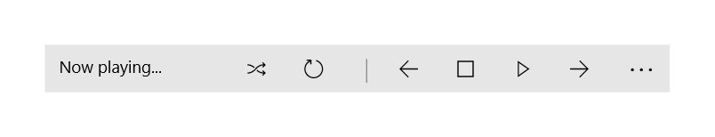
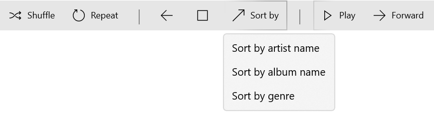
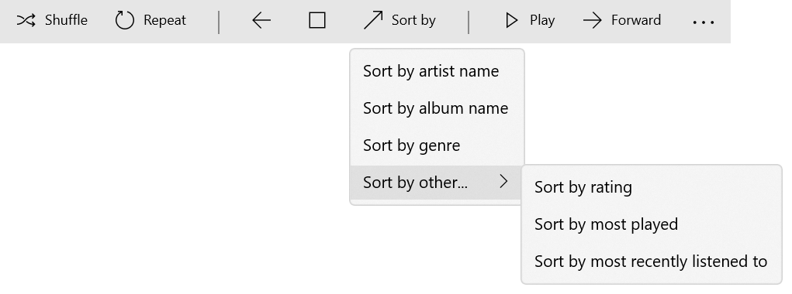
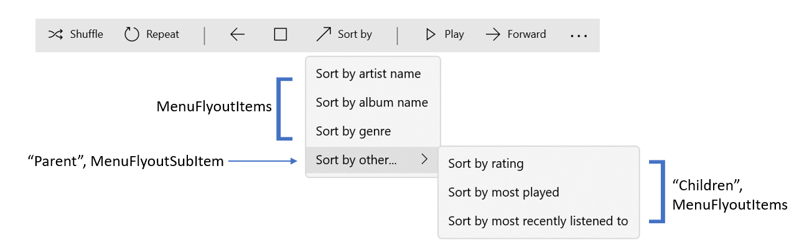
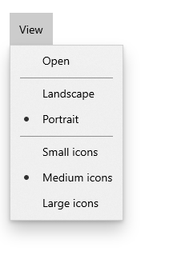
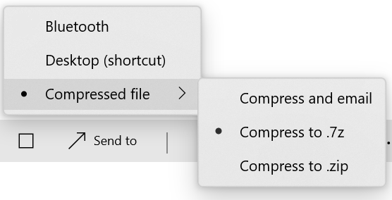
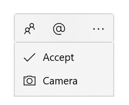
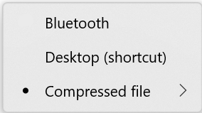
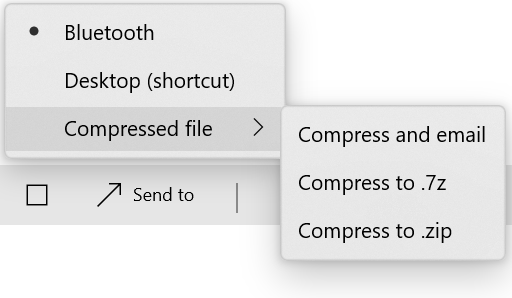

CommandBar/CommandBarFlyout updates
===

# Background

This spec will address three main shortcomings in the
[CommandBar](https://docs.microsoft.com/en-us/uwp/api/windows.ui.xaml.controls.commandbar?view=winrt-19041)
and [CommandBarFlyout](https://docs.microsoft.com/en-us/uwp/api/windows.ui.xaml.controls.commandbarflyout?view=winrt-19041)
space, and propose solutions to these shortcomings. All of these solutions will lead to a more customizable, flexible commanding experience. 

A `CommandBar` provides access to app-level or page-specific commands. 
A `CommandBarFlyout` is a `CommandBar` that appears in a `Flyout` menu, and must be invoked.

*CommandBar:*



*CommandBarFlyout* (invoked for example with a mouse right click):


### Issue #1: You can only use a select few object types inside of a CommandBar/CommandBarFlyout. 

When using the `CommandBar`or `CommandBarFlyout` controls today, the only supported types for items are 
[AppBarButton](https://docs.microsoft.com/en-us/uwp/api/windows.ui.xaml.controls.appbarbutton?view=winrt-19041), 
[AppBarToggleButton](https://docs.microsoft.com/en-us/uwp/api/windows.ui.xaml.controls.appbartogglebutton?view=winrt-19041), 
and [AppBarSeparator](https://docs.microsoft.com/en-us/uwp/api/windows.ui.xaml.controls.appbarseparator?view=winrt-19041). 
When you use an AppBarButton in a `CommandBar` or `CommandBarFlyout`, all of the interactions and styles needed to conform with
the parent control are provided automatically - height, width, the background color when hovered/pressed, the font size, etc. 

```xml
<CommandBar>
    <AppBarButton Label="Click" />
</CommandBar>
```

It is possible to add other types of objects into your `CommandBar` or `CommandBarFlyout`, 
using the wrapper class
[AppBarElementContainer](https://docs.microsoft.com/en-us/uwp/api/windows.ui.xaml.controls.appbarelementcontainer?view=winrt-19041).
This allows for objects of different types (such as `SplitButton` or `DropdownButton`) to be placed in a 
`CommandBar` or `CommandBarFlyout`, but it does not provide the proper styling to make these objects conform.
Visually, they won't blend in with the AppBarButton objects being displayed in the `CommandBar[Flyout]` without serious styling work.

```xml
<CommandBar>
    <AppBarElementContainer>
        <SplitButton Content="Click" />
    </AppBarElementContainer>
</CommandBar>
```

### Issue #2: RadioMenuFlyoutItems don't provide nested functionality.

`CommandBar` and `CommandBarFlyout` items often have their own attached
[MenuFlyout](https://docs.microsoft.com/en-us/uwp/api/windows.ui.xaml.controls.menuflyout?view=winrt-19041), 
via the `AppBarButton.Flyout` property. See a simple example of this below:


```xml
<AppBarButton Label="Sort by" Icon="...">
    <AppBarButton.Flyout>
        <MenuFlyout>
            <MenuFlyoutItem>Sort by artist name</MenuFlyoutItem>
            <MenuFlyoutItem>Sort by album name</MenuFlyoutItem>
            <MenuFlyoutItem>Sort by genre</MenuFlyoutItem>
        </MenuFlyout>
    </AppBarButton.Flyout>
</AppBarButton>
```



 Items within a `MenuFlyout` (such as "Sort by artist name") can also have their own MenuFlyouts, 
creating a  cascading or nested MenuFlyout. See an example of this below. 
 


In order to create this cascading/nested menu today, you can use a class called
[MenuFlyoutSubItem](https://docs.microsoft.com/en-us/uwp/api/windows.ui.xaml.controls.menuflyoutsubitem?view=winrt-19041) as an item in the menu. 

```xml
<MenuFlyout>
    <MenuFlyoutItem>Sort by artist name</MenuFlyoutItem>
    <MenuFlyoutItem>Sort by album name</MenuFlyoutItem>
    <MenuFlyoutItem>Sort by genre</MenuFlyoutItem>
    <MenuFlyoutSubItem Text="Sort by other...">
        <MenuFlyoutItem>Sort by rating</MenuFlyoutItem>
        <MenuFlyoutItem>Sort by most played</MenuFlyoutItem>
        <MenuFlyoutItem>Sort by most recently listened to</MenuFlyoutItem>
    </MenuFlyoutSubItem>
</MenuFlyout>
```

The `MenuFlyoutSubItem` class represents a "parent" MenuFlyout item. It has an
[Items](https://docs.microsoft.com/en-us/uwp/api/windows.ui.xaml.controls.menuflyout.items?view=winrt-19041) 
property, where you can assign all of its child items.  Here's the above example with labels showing which item is which type:



You also have the option of using 
[RadioMenuFlyoutItem](https://docs.microsoft.com/en-us/windows/winui/api/microsoft.ui.xaml.controls.radiomenuflyoutitem?view=winui-2.5), 
which has a [GroupName](https://docs.microsoft.com/en-us/windows/winui/api/microsoft.ui.xaml.controls.radiomenuflyoutitem.groupname?view=winui-2.5#Microsoft_UI_Xaml_Controls_RadioMenuFlyoutItem_GroupName) 
property. Items with the same GroupName will be a part of the same selection model - only one of the items in a Group can be "selected" and display the selection indicator at a time:

```xml
<AppBarButton>
    <AppBarButton.Flyout>
        <MenuFlyout>
            <MenuFlyoutItem>Open</MenuFlyoutItem>
            <MenuFlyoutSeparator/>
            <RadioMenuFlyoutItem GroupName="Orientation">Landscape</RadioMenuFlyoutItem>
            <RadioMenuFlyoutItem GroupName="Orientation" IsChecked="True">Portrait</RadioMenuFlyoutItem>
            <MenuFlyoutSeparator/>
            <RadioMenuFlyoutItem GroupName="IconSize">Small icons</RadioMenuFlyoutItem>
            <RadioMenuFlyoutItem GroupName="IconSize" IsChecked="True">Medium icons</RadioMenuFlyoutItem>
            <RadioMenuFlyoutItem GroupName="IconSize">Large icons</RadioMenuFlyoutItem>
        </MenuFlyout>
    </AppBarButton.Flyout>
</AppBarButton>
```



The issue arises when you want to combine these two concepts. It would be useful to have child items of type `RadioMenuFlyoutItem` that participate in the same selection group as their parent. This would allow for cleaner UIs by decreasing the size of `MenuFlyouts` that have a long list of `RadioMenuFlyoutItems`. 
See an example below:



### Issue #3: CommandBarFlyout does not have an "always expanded" state.

Currently, a `CommandBarFlyout` with secondary commands always shows a […] "more" button that
allows the user to collapse the `CommandBarFlyout` into just the top bar (primary commands). 
There's currently no way to have a `CommandBarFlyout` with secondary commands that is always expanded when invoked. 



When the `CommandBarFlyout` is invoked via touch, only the primary commands are shown (with the option for the user to
expand the list of secondary commands). The developer is currently not able to control how the `CommandBarFlyout` appears when invoked, 
and cannot control whether it can be collapsed or not. 

# Description

### Feature #1. Built-in styles to support adding `SplitButton` to `CommandBar` and `CommandBarFlyout`

WinUI will provide built in styles for SplitButton that will allow them to conform with the look and feel of an `AppBarButton`. 
These styles will change properties such as the `SplitButton`'s height/width, font size, color, interactions (color changes), and more. 

There will be two styles provided: `CommandBarSplitButtonStyle` and `CommandBarFlyoutSplitButtonStyle`. 
These styles will automatically be applied to any SplitButton object that's placed in a CommandBar or CommandBarFlyout - the only thing other thing that's required is to put the SplitButton element into an AppBarElementContainer, which has always been required to place a SplitButton inside of a CommandBar or CommandBarFlyout. These styles can also be accessed as ThemeResources in any WinUI app. 

Note: if a SplitButton item inside of a CommandBar enters the CommandBar's overflow menu, it will pick up the `CommandBarFlyoutSplitButtonStyle`.

For example:

```xml
<CommandBarFlyout x:Name="ImageCommandsFlyout" >  
    <AppBarButton Icon="Copy" ToolTipService.ToolTip="Copy" Label="Copy"/>

    <CommandBarFlyout.SecondaryCommands>
        <AppBarElementContainer>
            <SplitButton ToolTipService.ToolTip="Insert">
                <SplitButton.Content>
                    <StackPanel Orientation="Horizontal">
                        <TextBlock>Insert</TextBlock>
                    </StackPanel>
                </SplitButton.Content>
                <SplitButton.Flyout>
                    <MenuFlyout Placement="RightEdgeAlignedTop">
                        <MenuFlyoutItem Text="Insert above"/>
                        <MenuFlyoutItem Text="Insert between"/>
                        <MenuFlyoutItem  Text="Insert below"/>
                    </MenuFlyout>
                </SplitButton.Flyout>
            </SplitButton>
        </AppBarElementContainer>
        <AppBarButton Label="Select all"/>
        <AppBarButton Label="Delete" Icon="Delete"/>
    </CommandBarFlyout.SecondaryCommands>
</CommandBarFlyout>
```

### Feature #2. Enable MenuFlyoutSubItem to properly support RadioMenuFlyoutItems as children. 

When using [RadioMenuFlyoutItem](https://docs.microsoft.com/en-us/windows/winui/api/microsoft.ui.xaml.controls.radiomenuflyoutitem?view=winui-2.5) type objects as children of [MenuFlyoutSubItem](https://docs.microsoft.com/en-us/uwp/api/windows.ui.xaml.controls.menuflyoutsubitem?view=winrt-19041), you'll want to make sure that `MenuFlyoutSubItem` displays the selection indicator (usually a dot) if one of its children is selected. 

The `RadioMenuFlyoutSubItemStyle` can be applied to a `MenuFlyoutSubItem`. Applying this style ensures that the `MenuFlyoutSubItem` will visually indicate if one of its children are selected. To do this, it works with a new attached property that's defined by `RadioMenuFlyoutItem`, called `AreCheckStatesEnabled`.

The parent (`MenuFlyoutSubItem`) cannot be selected. It can only achieve selection (and show the selection indicator) if it is bubbled up from one of its child items. Therefore, only one item out of the child items and parent-level RadioMenuFlyout items can be selected at a time.

If a child item becomes selected, the selection indicator will bubble up to its parent when its `MenuFlyout` is closed.
If a child is selected and the `MenuFlyout` is open, both the parent and child will show the selection indicator (similar to a hierarchical `NavigationView`).


These are the three main visual states for this new API, using the same Xaml Controls Gallery sample that was previously shown:

*Child item selected, flyout open*


*Child item selected, flyout closed*



*Other top-level item selected*

	 

For example:

```xml
<CommandBar DefaultLabelPosition="Right" Grid.Row="1" Margin="50">
    <AppBarToggleButton Icon="Shuffle" Label="Shuffle" />
    <AppBarToggleButton Icon="RepeatAll" Label="Repeat" />
    <AppBarSeparator/>
    <AppBarButton Icon="Back" />
    <AppBarButton Icon="Stop" />
    <AppBarButton Icon="Go" Label="Sort by">
        <AppBarButton.Flyout>
            <MenuFlyout>
                <RadioMenuFlyoutItem Text="Name" GroupName="SortGroup"/>
                <RadioMenuFlyoutItem Text="Date" GroupName="SortGroup"/>
                <RadioMenuFlyoutItem Text="Size" GroupName="SortGroup"/>
                <MenuFlyoutSubItem Text="Other" Style="{StaticResource RadioMenuFlyoutSubItemStyle}">
                    <RadioMenuFlyoutItem GroupName="SortGroup" Text="Album Name"/>
                    <RadioMenuFlyoutItem GroupName="SortGroup" Text="Artist Name"/>
                    <RadioMenuFlyoutItem GroupName="SortGroup" Text="Genre"/>
                </MenuFlyoutSubItem>
            </MenuFlyout>
        </AppBarButton.Flyout>
    </AppBarButton>

    <AppBarSeparator/>
    <AppBarButton Icon="Play" Label="Play" />
    <AppBarButton Icon="Forward" Label="Forward" />

    <CommandBar.SecondaryCommands>
        <AppBarButton Label="Like" />
        <AppBarButton Label="Dislike" />
    </CommandBar.SecondaryCommands>

</CommandBar>

```


### Feature #3. AlwaysExpanded API

This will be a new API added to `CommandBarFlyout` that will give the developer the ability to keep the `CommandBarFlyout` in its expanded mode at all times.

When the AlwaysExpanded property is set to true, the [...] button will not appear, 
and the user will not be able to collapse the `CommandBarFlyout`. 
If the [...] button is not visible, then other `AppBarButtons`/`CommandBarFlyout` items are able to take its space. 


This property will only have an effect if the `CommandBarFlyout` has secondary commands. 
If there are no secondary commands, the `CommandBarFlyout` will always be in collapsed mode (hence why there’s no `AlwaysCollapsed` property). 

`CommandBarFlyout` can still be collapsed/expanded by the developer programmatically even when this property is set to true.

When an item in the primary commands list is invoked, the CommandBarFlyout should stay open and not change its collapsed/expanded state. If an item in the secondary commands list is invoked, the CommandBarFlyout should close completely. 

For example:

```xml
<CommandBarFlyout x:Key="Flyout1" AlwaysExpanded='true'>
    <AppBarButton Label="Share" Icon="Share" Click="OnElementClicked" />
    <AppBarButton Label="Save" Icon="Save" Click="OnElementClicked" />
    <CommandBarFlyout.SecondaryCommands>
        <AppBarButton x:Name="ResizeButton1" Label="Resize" Click="OnElementClicked" />
        <AppBarButton x:Name="MoveButton1" Label="Move" Click="OnElementClicked" />
    </CommandBarFlyout.SecondaryCommands>
</CommandBarFlyout>
```

# API Notes

## Notable New APIs


| Name | Description |
|:--|:--|
| `CommandBarFlyout.AlwaysExpanded` Property | Gets or sets a value that indicates whether or not the CommandBarFlyout should always stay in its Expanded state and block the user from entering the Collapsed state. Defaults to false. |
| `RadioMenuFlyoutItem.AreCheckStatesEnabledProperty` Dependency Property  | Represents whether the MenuFlyoutSubItem has RadioMenuFlyoutItems as children, and the checked state of these children.   |


## New ThemeResources

```xml
<Style x:Key="SplitButtonCommandBarFlyoutStyle" TargetType="SplitButton"></Style>`

<Style x:Key="SplitButtonCommandBarStyle" TargetType="SplitButton"></Style>

<Style x:Key="RadioMenuFlyoutSubItemStyle" TargetType="MenuFlyoutSubItem"></Style>
```

# API Details

```csharp
unsealed runtimeclass CommandBarFlyout : Windows.UI.Xaml.Controls.Primitives.FlyoutBase
{
    // Existing members elided 
    // ...

    boolean AlwaysExpanded { get; set; }
    
    static Windows.UI.Xaml.DependencyProperty AlwaysExpandedProperty { get; }
};
```

```csharp
unsealed runtimeclass RadioMenuFlyoutItem : Windows.UI.Xaml.Controls.MenuFlyoutItem
{
    // Existing members elided 
    // ...

    [MUX_DEFAULT_VALUE("false")]
    [MUX_PROPERTY_CHANGED_CALLBACK_METHODNAME("AreCheckStatesEnabledPropertyChanged")]

    static Windows.UI.Xaml.DependencyProperty AreCheckStatesEnabledProperty { get; };
    static void SetAreCheckStatesEnabled(Windows.UI.Xaml.DependencyObject object,  Boolean value);
    static Boolean GetAreCheckStatesEnabled(Windows.UI.Xaml.DependencyObject object);
}

```
# Remarks
### More on the RadioMenuFlyoutItem implementation:
When a `MenuFlyoutSubItem` applies `RadioMenuFlyoutSubItemStyle`, the style sets the `AreCheckStatesEnabled` dependency property to true. This property change is attached to the `MenuFlyoutSubItem`’s [Loaded event](https://docs.microsoft.com/windows/winui/api/microsoft.ui.xaml.frameworkelement.loaded?view=winui-3.0), which fires every time the item is shown (i.e. the parent menu opens). In this event, a check is performed to see if any of the child items are of type `RadioMenuFlyoutItem`, and if they are currently in a checked state. Based on the child items checked/unchecked state, the `MenuFlyoutSubItem` (parent item) applies the “checked” or “unchecked” visual state – i.e. the parent item shows the dot indicator if one of its children are currently selected.  