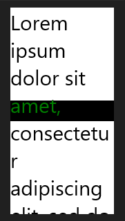
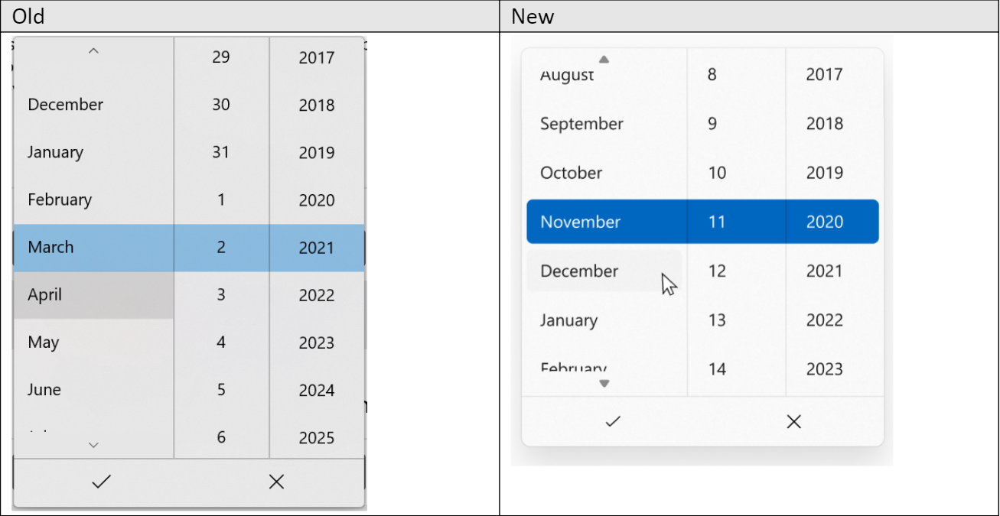
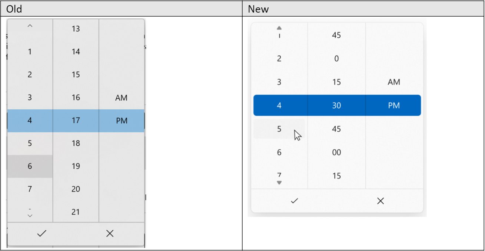
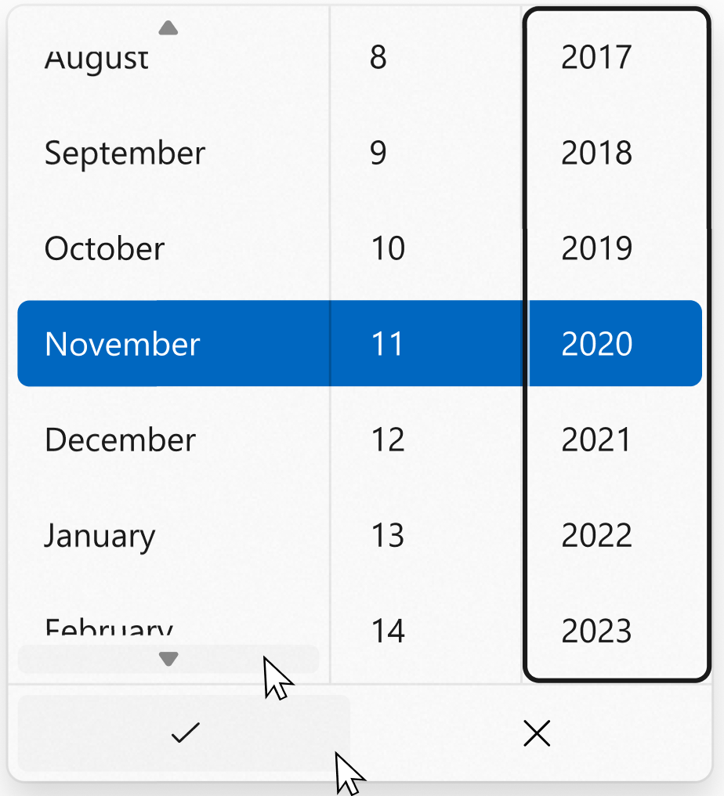

ElementBackgroundGrid
===

# Background

The `ElementBackgroundGrid` API in this spec is a Xaml Grid that lets you "draw" its background by
pointing at another element; the rendering of that other element becomes the background of
the Grid.

`ElementBackgroundGrid` element is similar to several precedents:
* [SwapChainBackgroundPanel](https://docs.microsoft.com/uwp/api/Windows.UI.Xaml.Controls.SwapChainBackgroundPanel),
which is a `Grid` that renders its background using a swap chain.
* [CompositionMaskBrush](https://docs.microsoft.com/uwp/api/Windows.UI.Composition.CompositionMaskBrush),
which  is a brush that gets its content from another (source) brush.
* WPF's [VisualBrush](https://docs.microsoft.com/dotnet/api/System.Windows.Media.VisualBrush),
which uses an element's rendering to draw a brush.

`ElementBackgroundGrid` is most similar to the WPF `VisualBrush`, the difference being that `ElementBackgroundGrid`
is an element rather than a Brush. So it can't for example be rendered as text foreground.

This new `ElementBackgroundGrid` will be used in the rendering of the 
[DatePicker](https://docs.microsoft.com/uwp/api/Windows.UI.Xaml.Controls.DatePicker)
control.

# API Pages

## ElementBackgroundGrid class

A [Grid](https://docs.microsoft.com/uwp/api/Windows.UI.Xaml.Controls.Grid)
whose background can be the rendering of another element, or using another element
as a mask.

```csharp
public class ElementBackgroundGrid : Grid
{
    public UIElement SourceElement { get; set; }
    public Color ReplacementColor { get; set; }
}
```

Set the `SourceElement` property to indicate which element's rendering should be drawn
as the background of the `ElementBackgroundGrid`. If the `Background` property is set, it
is rendered on top of the `SourceElement's` rendering.

Only the source element's rendering applies to the `ElementBackgroundGrid`; the user
cannot interact with it using the mouse, or move keyboard focus to it.

> Note: the element set as the `SourceElement` cannot be an ancestor or in the
descendancy of the `ElementBackgroundGrid`.

> Issue: are there other restrictions? Is there an underlying Comp page that this can point to?

If the `ReplacementColor` property is set, the `SourceElement` is treated as a mask;
every non-transparent pixel will be replaced by this color.


The image below shows another use of the `ColorFilterOverlayControl` API, where it manipulates the colors of an element on screen where the contents of that element are moving. Here, the control is overlaid on a ScrollViewer that has a fixed position but moving content. 

### ElementBackgroundGrid examples

The following example puts an `ElementBackgroundGrid` on top of (z-ordered above)
some scrolling text, causing the center of the text to be highlighted, even as it's scrolling.
Things to note:
* The `ElementBackgroundGrid` is sourcing from the `TextBlock`, it's also z-ordered above
the same `TextBlock`. If the `Background` and `SourceElement` properties weren't set,
it would have no effect; it would render the `TextBlock` exactly on top of itself.
* The 'Background` property is black, and the `ReplacementColor` is green, causing
the overlay text to be displayed as green on black.
* The `ElementBackgroundGrid` is positioned and given a height such that it's a black band
across the center of the scrolling text.


```xml
<Grid Background="White" Width="150">
    <ScrollViewer x:Name="Target" Height="300">
        <TextBlock
            Foreground="Black"
            FontSize="30"
            Text="{x:Bind LoremIpsum}"
            TextWrapping="Wrap">
        </TextBlock>
    </ScrollViewer>

    <ElementBackgroundGrid
        ReplacementColor="Green"
        Background="Black"
        TargetElement="{Binding ElementName=Target}"
        Height="30"
        VerticalAlignment="Center"
        HorizontalAlignment="Stretch"/>
</Grid>
```



The example below shows how the new `ColorFilterOverlayControl` API can be used to partially highlight a TextBlock.

```xml
 <Grid Background="{ThemeResource ApplicationPageBackgroundThemeBrush}">
        <StackPanel x:Name="Panel" Orientation="Vertical" HorizontalAlignment="Center" VerticalAlignment="Center">
            <Grid Margin="2,10,0,0">
                <TextBlock x:Name="Target" Text="This string will be partially highlighted"/>
                <ColorFilterOverlayControl
                    ReplacementColor="Black"
                    TargetElement="{Binding ElementName=Target}"
                    Width="50"
                    VerticalAlignment="Stretch"
                    HorizontalAlignment="Center"
                    Background="LightBlue"/>
            </Grid>
        </StackPanel>
    </Grid>
```

> Todo: add a reflection example (classic use of VisualBrush in WPF)

### ElementBackgroundGrid theme resources

You can modify the default Style and ControlTemplate to give the control a unique appearance. 
For more info, see the 
[Light-weight styling section](https://docs.microsoft.com/en-us/windows/uwp/design/controls-and-patterns/xaml-styles#lightweight-styling)
of the 
[Styling controls](https://docs.microsoft.com/en-us/windows/uwp/design/controls-and-patterns/xaml-styles)
article.

`ElementBackgroundGrid` defines the following new resource:

```xml
<StaticResource x:Key="DatePickerFlyoutPresenterHighlightForegroundColor" ResourceKey="TextOnAccentAAFillColorPrimary" />
```


## Other ElementBackgroundGrid members

| Name | Description |
| - | - |
| SourceElement | Gets or sets the UIElement to apply the color effect to. |
| ReplacementColor | Gets or sets the Color to use instead of the non-transparent pixels of the SourceElement.


# API Details

```csharp
namespace Microsoft.UI.Xaml.Controls
{

[MUX_PROPERTY_CHANGED_CALLBACK(TRUE)]
[MUX_PROPERTY_CHANGED_CALLBACK_METHODNAME("OnPropertyChanged")]
unsealed runtimeclass ColorFilterOverlayControl : Windows.UI.Xaml.Controls.Grid
{
    ColorFilterOverlayControl();

    Windows.UI.Xaml.UIElement TargetElement { get; set; };
    Windows.UI.Color ReplacementColor { get; set; };

    static Windows.UI.Xaml.DependencyProperty TargetElementProperty{ get; };
    static Windows.UI.Xaml.DependencyProperty ReplacementColorProperty{ get; };
}

}
```


# Appendix
<!-- Anything else that you want to write down for posterity, but 
that isn't necessary to understand the purpose and usage of the API.
For example, implementation details. -->
## Detailed Task Breakdown for styling implementation
The following steps apply to both DatePicker and TimePicker, unless otherwise noted.

1. The background color of the overall flyout should change, as shown in mockups above.

2. Selected items (entire rows) should have a rounded (4px corner radius) accent-color backplate. This backplate should have a 32px height, and have 4px margin on the left/right and 2px margin on the top/bottom from its overall footprint. 

3. When items (individual cells, i.e. "November") are in a hover or pressed state, they will have a rounded (4px corner radius) grey backplate, with the same margins from its overall footprint as the selection row has described above. This backplate should also be 32px in height. 

4. The scroll up/down button visuals should use caret icons (rather than the current chevron icons). 

5. When the scroller buttons are hovered, they should have a rounded grey backplate that have a height of 12px, and a 4px margin on all sides from their overall button footprints.

6. The check and X buttons at the bottom of the Date/TimePicker should also be updated to use new icons as shown in mockups above.

7. On hover, the check and X buttons should also receive a rounded gray backplate with 4px margins on all sides from its overall button footprint.

8. Focus visuals for all buttons need to be rounded. 

9. **DatePicker only**: Items in columns should now be left-aligned, rather than center-aligned as they were previously. 

10. Columns within an expanded Date/TimePicker can be focused upon. For the column focus, the black focus rectangle will need to be rounded.

11. Animations: Date/TimePicker should have an opening/closing animation and use the same easing/timing as other controls.

## DatePicker

In WinUI 2.2, controls began to be re-designed to have rounded corners, marking a shift in our overall design language. 
There's more information on rounded corners in WinUI [here](https://docs.microsoft.com/en-us/windows/uwp/design/style/rounded-corner), 
but the general purpose of the rounded corners design shift is to evoke warmth and trust, 
and make the UI easier for users to visually process. 
Since this shift, certain controls have adopted the new styling and recieved rounded corners, but some have not. 
This creates a strong visual inconsistency in WinUI apps, where certain pieces of an app may look modern and others may look dated. 
Examples of this include the DatePicker and TimePicker controls. While the corners of the controls themselves are rounded, the selection rectangle within the control is still squared off. Buttons and other areas inside these controls are also still squared off, making them look dated when placed alongside other controls that are more modernly designed, such as 
[NavigationView](https://docs.microsoft.com/en-us/windows/uwp/design/controls-and-patterns/navigationview).

Recently, [ListView was given design updates](https://github.com/microsoft/microsoft-ui-xaml-specs/blob/user/anawish/ListViewGridViewDesignUpdates/active/ListViewGridView/listviewgridview-designupdates.md) to round the corners of its items. DatePicker and TimePicker should follow in these footsteps, and make sure that they adopt any of the ListView design elements that are relevant. This includes general rounding of selection visuals, as well as rounded grey backplates for items that get hovered. 

This spec will detail a number of changes to update the designs of DatePicker and TimePicker so that they are more 
visually aligned with modern WinUI controls. At a high level, some key parts of these updated styles are: a rounded selection rectangle; rounded backplates on items, buttons, and scroll buttons on  hover; and new animations that are aligned with other controls. 

There is only one major API change that will come with these styling updates, which is adding a new class called `ColorFilterOverlayControl`. This class provides the logic behind displaying the 'inverted' selection rectangle that spans across all three columns in DatePicker and TimePicker, and giving it the correct foreground color to have appropriate contrast over the accent colored background.

### Visual Examples
<!-- Use this section to provide a brief description of the feature.
For an example, see the introduction to the PasswordBox control 
(http://docs.microsoft.com/windows/uwp/design/controls-and-patterns/password-box). -->

**DatePicker:**

As you can see on the left, the old version of DatePicker contains squared elements inside of it. The new version of DatePicker will round off these elements.



**TimePicker:**

Similarly to DatePicker, the old version of TimePicker contains squared elements inside of it. The new version of TimePicker will round off these elements.



**Rounded backplates and focus visuals**

As you can see in the mockup below, all buttons and items (individual cells) within DatePicker and TimePicker will receive a rounded grey backplate when hovered or pressed. In addition to this, columns within DatePicker and TimePicker will receive rounded focus rectangles (as shown below).


