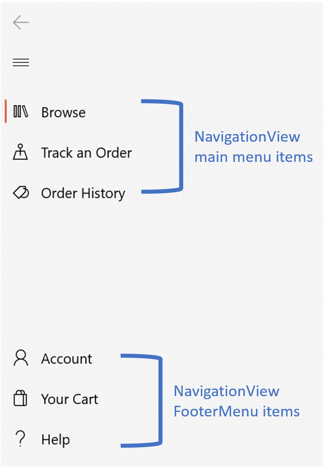

# Background

The [`NavigationView.FooterMenuItems`](https://docs.microsoft.com/windows/winui/api/microsoft.ui.xaml.controls.navigationview.footermenuitems?view=winui-2.5) property provides a way to place NavigationView items into a bottom-aligned (or right-aligned, if your NavigationView is in top mode) section of a NavigationView. This is distinct from the [`NavigationView.PaneFooter`](https://docs.microsoft.com/windows/winui/api/microsoft.ui.xaml.controls.navigationview.panefooter?view=winui-2.5) property, as only Navigation items should be placed in the Footer menu, while any kind of content can be placed in the PaneFooter.



Currently, the DataTemplate that's assigned to the [`NavigationView.MenuItemTemplate`](https://docs.microsoft.com/windows/winui/api/microsoft.ui.xaml.controls.navigationview.menuitemtemplate?view=winui-2.5) property is applied to all Navigation items in the NavigationView. This means that if you add both regular NavigationView menu items and NavigationView footer menu items, they will automatically have the same data template applied. This is an issue as there's no current way to provide a standardized data template for all footer menu items that's separate/different from the data template used for all main menu items.

# Description

In order to apply a data template to all items in the footer menu of your NavigationView, use the `NavigationView.FooterMenuItemTemplate` property. This property is similar to [NavigationView.MenuItemTemplate](https://docs.microsoft.com/windows/winui/api/microsoft.ui.xaml.controls.navigationview.menuitemtemplate?view=winui-2.5), but only applies to items placed in NavigationView's footer menu. It takes in a `DataTemplate` and applies that template to any Navigation item placed in the footer menu.

To apply different data templates to individual Navigation items within your footer menu based on certain criteria, use the `NavigationView.FooterMenuItemTemplateSelector`. This property is similar to the [NavigationView.MenuItemTemplateSelector](https://docs.microsoft.com/windows/winui/api/microsoft.ui.xaml.controls.navigationview.menuitemtemplateselector?view=winui-2.5), but only applies to items placed in NavigationView's footer menu.

The Settings item will not be affected by FooterMenuItemTemplate as it is not technically a part of the FooterMenuItems collection.

The [NavigationView.MenuItemTemplate](https://docs.microsoft.com/windows/winui/api/microsoft.ui.xaml.controls.navigationview.menuitemtemplate?view=winui-2.5) will only apply to Navigation items that are placed in the main menu of a NavigationView. 


# Examples

Example showing how a NavigationView can have different object types for main and footer menu items, and apply a different DataTemplate to each. 

```xml
<muxc:NavigationView x:Name="NavView" SelectionChanged="NavView_SelectionChanged"
                     MenuItemsSource="{x:Bind MainMenuItems}" FooterMenuItemSource="{x:Bind Accounts}">
    <muxc:NavigationView.MenuItemTemplate>
        <DataTemplate x:DataType="local:MainMenuItem">
            <muxc:NavigationViewItem Icon="{x:Bind ItemIcon}" Content="{x:Bind Name}" MenuItemsSource="{x:Bind Children}"/>
        </DataTemplate>     
    </muxc:NavigationView.MenuItemTemplate>
    <muxc:NavigationView.FooterMenuItemTemplate>
        <DataTemplate x:DataType="local:AccountDataObject">
            <Grid>
                <Grid.ColumnDefinitions>
                    <ColumnDefinition Width="45"/>
                    <ColumnDefinition Width="*"/>
                </Grid.ColumnDefinitions>
                <Image Grid.Column="0" Source="{x:Bind ProfilePhoto}" Height="30" Width="30" HorizontalAlignment="Left"/>
                <TextBlock Grid.Column="1" Text="{x:Bind AccountName}" HorizontalAlignment="Left" VerticalAlignment="Center"/>
            </Grid>
        </DataTemplate>
    </muxc:NavigationView.FooterMenuItemTemplate>
</muxc:NavigationView>

```


# API Notes


The following APIs are members of `NavigationView`.

| Name | Description |
| - | - |
| FooterMenuItemTemplate | Gets or sets the [DataTemplate](https://docs.microsoft.com/en-us/uwp/api/windows.ui.xaml.datatemplate) used to display each footer menu item. |
| FooterMenuItemTemplateSelector | Gets or sets a reference to a custom [DataTemplateSelector](https://docs.microsoft.com/uwp/api/windows.ui.xaml.controls.datatemplateselector) logic class. The DataTemplateSelector referenced by this property returns a template to apply to Navigation items placed in the footer menu.


# API Details
<!-- The exact API, in MIDL3 format (https://docs.microsoft.com/en-us/uwp/midl-3/) -->

```csharp
[MUX_PREVIEW]
    {
        Windows.UI.Xaml.DataTemplate FooterMenuItemTemplate { get; set; };
        Windows.UI.Xaml.Controls.DataTemplateSelector FooterMenuItemTemplateSelector { get; set; };
        
        static Windows.UI.Xaml.DependencyProperty FooterMenuItemTemplateProperty { get; };
        static Windows.UI.Xaml.DependencyProperty FooterMenuItemTemplateSelectorProperty { get; };
    }
    
```
