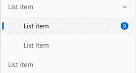

<!-- TEMPLATE

    Style guide:
    * Use second person; speak to the developer who will be learning/using this API.
    (For example "you use this to..." rather than "the developer uses this to...")
    * Use hard returns to keep the page width within ~100 columns.
    (Otherwise it's more difficult to leave comments in a GitHub PR.)
    * Talk about an API's behavior, not its implementation.
    (Speak to the developer using this API, not to the team implementing it.)
    * A picture is worth a thousand words.
    * An example is worth a million words.
    * Keep examples realistic but simple; don't add unrelated complications.
    (An example that passes a stream needn't show the process of launching the File-Open dialog.)

-->

Spec: InfoBadge control
===

# Background

<!-- TEMPLATE
    Use this section to provide background context for the new API(s) 
    in this spec. Try to briefly provide enough information to be able to read
    the rest of the document.

    This section and the appendix are the only sections that likely
    do not get copied to DMC; they're just an aid to reading this spec.

    For example this is a place to provide a brief explanation of some dependent
    area, just explanation enough to understand this new API, rather than telling
    the reader "go read 100 pages of background information posted at ...".

    For example this section is a place to explain why you're adding this new API rather than
    using an existing related API.

    For a simple example see the spec for the UIElement.ProtectedCursor property
    (https://github.com/microsoft/microsoft-ui-xaml-specs/blob/master/active/UIElement/ElementCursor.md)
    which has some of the thinking about how this Xaml API relates to existing
    Composition and WPF APIs. This is interesting background both for the current reader
    and the future reader trying to understand why we designed it this way,
    but not the kind of information
    that would land on DMC.
-->

A badge is a small piece of UI that usually displays a dot, number, or icon and serves to bring the user’s attention to where it’s placed, alerting them of something. In the example below, a badge with the number 9 is displayed on a Navigation item. 



There is currently no way to built-in way to show badges  in your WinUI app, and developers must create their own implementations. This blocks app developers from easily displaying notifications or indicating that new content is available, henceforth making a more difficult barrier to entry for a wide variety of app types that the WinUI platform should support (mail, messaging, social media). 

### NavigationView Context
NavigationView is the most common scenario in which InfoBadge will be used, and is the recommended way of displaying notifications/alerts that can be seen and accessed app-wide. In addition to this, NavigationView has a bit of a complicated architecture where it has multiple display modes, which poses a difficulty for developers looking to integrate InfoBadge into their NavigationView. For that reason, NavigationView items will have specific APIs to support badging. For InfoBadge placement in all other controls and scenarios, developers will use the placement and positioning (Margin, Alignment, etc) APIs that are built into InfoBadge itself. 


# Conceptual pages (How To)


<!-- TEMPLATE
    (Optional)

    All APIs have a page on DMC, some APIs or groups of APIs have an additional high level,
    conceptual page (called a "how-to" page). This section can be used for that content.

    For example, there are several Xaml controls for different forms of text input,
    each with an API page, and then there's also a conceptual page that
    discusses them collectively
    (https://docs.microsoft.com/windows/uwp/design/controls-and-patterns/text-controls).

    Another way to use this section is as a draft of a blog post that introduces the new feature.

    Sometimes it's difficult to decide if text belongs on a how-to page or an API page.
    It's not important to make a final decision on that in this spec; we can always
    adjust it when copying to DMC.
-->

Badging is the least intrusive and most intuitive way to display notifications or bring focus to something within an app. An InfoBadge is a small piece of UI that can be added into an app and customized to display a number, icon, or a simple dot. **InfoBadge is built into NavigationView but can also be added as a standalone element in the XAML tree, allowing you to place InfoBadge into any control or piece of UI of your choosing.** When using an InfoBadge somewhere other than NavigationView, you will be responsible for programmatically determining when to show/dismiss the InfoBadge and where to place the InfoBadge. An InfoBadge should be used to bring the user’s focus to an area – whether that be for notifications, indicating new content, or showing an alert.

There are three InfoBadge types that you can choose from - dot, icon, and numeric, as shown in order below.


The dot InfoBadge should be used for general scenarios in which you want to guide the user’s focus towards the InfoBadge – i.e. indicating new content or updates are available. The icon InfoBadge should be used to send a quick message along with getting the user’s attention – i.e. alerting the user that something non-blocking in the application has gone wrong, an extra important update is available, or that something specific in the app is currently enabled (like a countdown timer going). The numeric InfoBadge should be used for showing that there are a specific number of items that need attention – i.e. new emails/messages.

## Preset InfoBadge styles
To help support the most common scenarios in which InfoBadges are used, WinUI provides built-in, preset InfoBadge styles. While you can customize your InfoBadge to use any color/icon/number combination that you desire, these built-in presets are a quick option to make sure that your InfoBadge is compliant with accessibility guidelines and is proportional in terms of icon sizing (if you’re using an icon InfoBadge). 

To use a preset InfoBadge style, you'd use the following markup:

```xml
<InfoBadge x:Name="InfoBadge1" Style="{ThemeResource AttentionIconInfoBadgeStyle}"/>
```

## How and when to use an InfoBadge  
### When to use an InfoBadge
An InfoBadge should be used when you want to bring the user’s focus to a certain area of your app in an unintrusive way. When an InfoBadge appears, it is meant to bring focus to an area and then let the user get back into their flow, giving them the choice of whether or not to look into the details of why the InfoBadge appeared. InfoBadges should only represent messages that are dismissible and non-permanent – an InfoBadge should have specific rules as to when it can appear, disappear, and/or change.  

Examples of appropriate InfoBadge usage:
-	Indicating new messages have arrived
-	Indicating new articles are available to read
-	Indicating that there are new options available on a Page
-	Indicating that there might be an issue with an item on a certain page that does not block the app from functioning

### When NOT to use an InfoBadge:

An InfoBadge should not be used to display critical errors or convey highly important messages that need immediate action. InfoBadges should not be used in cases where they need to be interacted with immediately to continue usage of the app. 

Examples of inappropriate InfoBadge usage:
-	Indicating an urgent matter on a page within the app that needs to be addressed before continuing to use the app
-	Appearing in an app with no way for the user to dismiss the InfoBadge
-	Using the InfoBadge as a permanent way of bringing the user’s focus to an area, without a way for the user to dismiss the InfoBadge.
-	Using an InfoBadge as a regular Icon or image in your app

## Using an InfoBadge in NavigationView
Using InfoBadge in NavigationView is the recommended approach for showing app-wide notifications and alerts. To enable or customize the InfoBadge on a NavigationViewItem, assign the NavigationViewItem.InfoBadge property to an InfoBadge object in your app.

In Left-Expanded mode, InfoBadge will appear right-aligned to the edge of the NavigationViewItem. 

In Left-Compact mode, InfoBadge will appear overlayed on the top right corner of the icon. 

In Top mode, InfoBadge will be displayed aligned to the upper right hand corner of the overall item. 

It is not recommended to use different types of InfoBadges in one NavigationView, i.e. attach a numeric InfoBadge to one NavigationViewItem and a dot InfoBadge to another NavigationViewItem in the same NavigationView.

### Hierarchy and overflow
If you have a hierarchical NavigationView , InfoBadge will appear right-aligned on child items when they are expanded, regardless of PaneDisplayMode. Parent items in a hierarchical NavigationView will follow the same design/placement patterns as described above.

The parent NavigationViewItem and child NavigationView items will each have their own InfoBadge property, so you can bind the value of the parent’s InfoBadge to factors that determine that children’s InfoBadge values. 
The below image shows a hierarchical NavigationView with its PaneDisplayMode set to Top, where one top-level item has a numeric InfoBadge on it.

For overflow scenarios in a top-mode NavigationView (i.e. when the window size changes and Navigation items are placed inside of the overflow menu), the overflow button has its own InfoBadge (`NavigationView.OverflowButtonInfoBadge`) that can be assigned and changed based on the InfoBadges that may be present in overflow items.

To access the list of items present in the overflow menu, use the `NavigationViewOverflowItems` collection. You can hook up to the changed event for this collection to accurately check when items are being moved into the overflow menu. Once you know which items are in the overflow menu, you can update the `NavigationView.OverflowButtonInfoBadge` to represent InfoBadge information/status on the overflow button itself while the overflow navigation items are hidden. 

## Using an InfoBadge in another control
Use InfoBadge as you would any other control – simply add the InfoBadge markup where you’d like it to appear. Since InfoBadge inherits from Control, it has all the built-in positioning properties such as margin, alignment, padding, and more which you can take advantage of to position your InfoBadge exactly where you want it. Once the InfoBadge is positioned, use the `IsOpen` property to make the InfoBadge appear and disappear based on user actions, program logic, counters, etc. 

If you’re placing an InfoBadge inside of another control, such as a Button or a ListViewItem, note that it is not recommended for the InfoBadge to be visible past the footprint of the parent control. So if your InfoBadge is inside of a button, for instance, it should not be visible past the corners of the Button’s overall footprint. 

## Changing, hiding, and switching between types of InfoBadge
You can change the icon or number displayed in an InfoBadge while it is being shown. Decrementing or incrementing a numeric InfoBadge based on user action can be achieved by setting/manipulating the value of `InfoBadge.Value`. Changing the icon of an InfoBadge can be achieved by setting InfoBadge.IconSource to a new IconSource object. When changing icons, ensure that the new icon is the same size as the old icon to avoid a jarring visual effect.

### Default behavior
If neither `InfoBadge.Value` nor `InfoBadge.IconSource` are set, the InfoBadge defaults to showing a dot. On creation of the InfoBadge, both of these properties default to their sentinel values, hence the InfoBadge defaulting to show a dot. If both the `Value` and `IconSource` properties are set, the InfoBadge will honor the `Value` property and display a number value.  In order to hide an InfoBadge once any of its properties have been set, the `IsOpen` property will need to be set to `false`. 

You can also change the InfoBadge’s type while it is being shown. To change the type of InfoBadge, be sure that the current type’s corresponding property (`Value` or `IconSource`) is set to its sentinel value (-1 or null), and set the new type’s property equal to an appropriate value. To change the type of InfoBadge from Numeric or Icon to a Dot type InfoBadge, make sure that `InfoBadge.Value` is set to -1 and `InfoBadge.IconSource` is set to null. 

Depending on how you’ve positioned your InfoBadge, be aware that this may cause items to shift as the shape of the InfoBadge may change.

## Examples
### Create an InfoBadge
**Creating a dot InfoBadge**:
```xml
<InfoBadge />
```

**Creating a numeric InfoBadge**:
```xml
<InfoBadge x:Name="emailInfoBadge" Value="{x:Bind numUnreadMail}"/>
```

In most scenarios, you’ll want to bind the Value property of the InfoBadge to a changing int value in your app’s backend so you can easily increment/decrement and show/hide the InfoBadge based on a certain value. 

**Creating an Icon InfoBadge**:
```xml
<InfoBadge x:Name="SyncStatusInfoBadge">
    <InfoBadge.IconSource>
        <SymbolIcon Symbol="Sync"/>
    </InfoBadge.IconSource>
</InfoBadge>
```

## Placing an InfoBadge inside another control
Here’s a Button that has an InfoBadge placed in its upper right hand corner. This example can be applied to many controls other than Button as well – it simply shows how to place, position, and show an InfoBadge inside of another WinUI control. 

```xml
<Button Background="LightGray" Padding="0" Width="200" Height="50" 
  HorizontalContentAlignment="Stretch" VerticalContentAlignment="Stretch">
    <Button.Content>
        <Grid HorizontalAlignment="Stretch" VerticalAlignment="Stretch" 
  Width="Auto" Height="Auto">
            <SymbolIcon Symbol="Sync" HorizontalAlignment="Center"></SymbolIcon>
            <InfoBadge Background="Red" HorizontalAlignment="Right" 
    VerticalAlignment="Top">
                <InfoBadge.IconSource>
                    <FontIcon FontFamily="Segoe MDL2 Assets" Glyph="&#F13C;"/>
                </InfoBadge.IconSource>
            </InfoBadge>
        </Grid>
    </Button.Content>
</Button>
```

## Using InfoBadge with a style preset
The markup below would create an InfoBadge that takes on the color and icon of the “Attention” preset style. 

```xml
<InfoBadge x:Name="InfoBadge1" Style="{ThemeResource AttentionIconInfoBadgeStyle}"/>
```

## Increment a numeric InfoBadge in a NavigationView
Here’s a NavigationView that uses an InfoBadge to display the number of new emails in the inbox, and increments the number shown in the InfoBadge when a new message is recieved. 

XAML Markup:
```xml
<NavigationView>
    <NavigationView.MenuItems>
        <NavigationViewItem Content="Home" Icon="Home"/>
        <NavigationViewItem Content="Account" Icon="Contact"/>
        <NavigationViewItem x:Name="InboxPage" Content="Inbox" Icon="Mail">
<NavigationViewItem.InfoBadge>
   		<InfoBadge x:Name="bg1" Value="{x:Bind numUnreadMail}"/>
</NavigationViewItem.InfoBadge>
   	</NavigationViewItem>
    </NavigationView.MenuItems> 
    <Frame x:Name="contentFrame" />
</NavigationView>
```

C# code-behind:
```csharp
int numUnreadMail; 
public void onNewMessageArrival(object sender, RoutedEventArgs msg){
    numUnreadMail += 1;
    // Simply updating the numUnreadMail variable will cause the InfoBadge to increment if it’s currently visible.  
}
```

## Hide a dot InfoBadge after its corresponding page has been clicked in NavigationView

XAML Markup:
```xml
<NavigationView x:Name="nvSample">
    <NavigationView.MenuItems>
        <NavigationViewItem Content="Home" Icon="Home" Tag="Home" >
<NavigationViewItem.InfoBadge>
   		<InfoBadge />
</NavigationViewItem.InfoBadge>
</NavigationViewItem>
        <NavigationViewItem  Content="Account" Icon="Contact" Tag="Contact" />
        <NavigationViewItem Content="Inbox" Icon="Mail" Tag="Mail" />
    <NavigationView.MenuItems>
    <Frame x:Name="contentFrame" />
</NavigationView>
 ```

C# Code-behind:
```csharp
// This function is called when any NavigationViewItem is clicked. 
private void NavView_ItemInvoked(NavigationView sender,
                                 NavigationViewItemInvokedEventArgs args)
{
    // Check if the Settings item was clicked:
    if (args.IsSettingsInvoked == true)
    {
        NavView_Navigate("settings", args.RecommendedNavigationTransitionInfo);
    }
    else if (args.InvokedItemContainer != null)
    {
        NavigationViewItem current = args.InvokedItemContainer as NavigationViewItem;
        // If the clicked NavigationViewItem had an InfoBadge, hide the InfoBadge. 
        if (current.InfoBadge.IsOpen){
                current.InfoBadge.IsOpen = false;
        }
 
        //Navigate to the appropriate page.
        var navItemTag = args.InvokedItemContainer.Tag.ToString();
        NavView_Navigate(navItemTag, args.RecommendedNavigationTransitionInfo);
    }
}
 ```

## Define an InfoBadge in code for a NavigationViewItem
This example defines NavigationViewItems in code, and initializes and updates a numeric InfoBadge that can is shown when a message is received.

XAML Markup:

```xml
<muxc:NavigationView>
    <muxc:NavigationView.MenuItemTemplate>
        <DataTemplate x:DataType="local:CustomDataObject">
            <muxc:NavigationViewItem Content="{x:Bind Title}" Icon="{x:Bind ItemIcon}" 
                                     InfoBadge="{x:Bind ItemInfoBadge}">
            </muxc:NavigationViewItem>
        </DataTemplate>
    </muxc:NavigationView.MenuItemTemplate>
</muxc:NavigationView>
```
 
C# Code-behind:
```csharp
public sealed partial class MainPage : Page
{

    public MainPage()
    {
        this.InitializeComponent();

        
        // Initialize icons for NavigationView items
        SymbolIcon HomeIcon = new SymbolIcon(Symbol.Home);
        SymbolIcon AcctIcon = new SymbolIcon(Symbol.Contact);
        SymbolIcon MailIcon = new SymbolIcon(Symbol.Mail);

        // Initialize an InfoBadge for the Mail item that is not visible on page load
        InfoBadge MailBadge = new InfoBadge();
        MailBadge.Value = 0;
        MailBadge.IsOpen = false;

        //Populate NavigationView
        List<CustomNavObject> navItems = new List<CustomNavObject>(){
            new CustomNavObject("Home", "home", HomeIcon),
            new CustomNavObject("Account", "acct", AccountIcon),
            new CustomNavObject("Mail", "mail", MailIcon, MailBadge)
        };
    }

    // This function is called when a new message is received.
    private void OnMessageReceived(string msg)
    {
        //Once a new message is received, update the InfoBadge being shown on the Mail navigation item. 
           MailBadge.Value +=1;
           MailBadge.IsOpen = true;
    }
}

public class CustomNavObject
{
    public string Title { get; set; }
    public string Tag { get; set; }
    public IconSource ItemIcon { get; set; }
    public InfoBadge ItemInfoBadge { get; set; }

    public CustomNavObject(string title, string tag, IconSource icon)
    {
        Title = title;
        Tag = tag;
        ItemIcon =  icon;
    }

    public CustomNavObject(string title, string tag, IconSource icon, InfoBadge badge)
    {
        Title = title;
        Tag = tag;
        ItemIcon =  icon;
        ItemInfoBadge = badge;
    }

}
```

# API Pages

_(Each of the following L2 sections correspond to a page that will be on docs.microsoft.com)_

<!-- TEMPLATE

  Each of the L2 sections in this "API Pages" section corresponds to a page on DMC.

  It's not necessary to have a section for every class member though:
  * If its purpose and usage is obvious from it's name/type, it's not necessary to
    create a section for it.
  * If its purpose and usage is fully explained by brief description, either
      put it in a table in the "Other [class] members" section
      put it with /// comments in the IDL section

  Create an L2 section here for each API that needs more description or examples.
  For a new class with members, the members should go in their own L2 section.

  Example layout
    ## MyClass
    ## MyClass.Member1
    ## MyClass.Member2
    ## Other MyClass members
    ## MyOtherClass
    ## ...

  Notes:
  * The first line of each of these sections should become that first line on the DMC page,which then becomes the description you see in Intellisense.
  * Each page can have description, examples, and remarks.
    Remarks are where the documentation calls out special considerations that the developer
    should be aware of.
  * It can be helpful at the top of an API page (or after the Intellisense text) to add the
    API signature in C#
  * Add a "_Spec note: ..._" to add a note that's useful in this spec but shouldn't go to DMC.
  * Show _examples_, not _samples_; an example is a snippet, a sample is a full working app.

-->

## InfoBadge class

Represents a control that displays brief status as an icon, number, or dot. 

`public class InfoBadge : Control`  

### Example
Here's an example of a simple InfoBadge that's set to display the number of unread emails:

```xml
<InfoBadge x:Name="emailInfoBadge" Value="{x:Bind numUnreadMail}"/>
```
### Remarks

If neither `InfoBadge.Value` nor `InfoBadge.IconSource` are set, the InfoBadge defaults to showing a dot. If both of these properties are set, the value appears in a numeric InfoBadge. 

If `InfoBadge.IconSource` is set to null, the InfoBadge defaults to displaying a dot. If `InfoBadge.Value` is set to -1, InfoBadge also defaults to displaying a dot. In order to hide the InfoBadge, the `InfoBadge.IsOpen` property needs to be set to False. 


## InfoBadge.Value property

Gets or sets the integer to be displayed in a numeric InfoBadge.

` public int InfoBadge.Value { get; set; }`

### Remarks
There is no maximum value for this property. The InfoBadge will continue to stretch to display large numbers, so ensure that your layout accounts for that if you expect to have large values displayed in an InfoBadge.

## InfoBadge.IconSource property

Gets or sets the icon to be used inside of the Icon InfoBadge.

`public IconSource InfoBadge.IconSource { get; set; }`

## InfoBadge.IsOpen property

Gets or sets the current visibility of the InfoBadge.

`public Boolean InfoBadge.IsOpen { get; set; }`

_Spec note: This property changes the visibility of an InfoBadge by changing its opacity value._

### Remarks
If this property is changed, the InfoBadge will display a showing or hiding animation.

## NavigationViewItem.InfoBadge property

Gets or sets the InfoBadge object to display on the NavigationViewItem. 

`public InfoBadge NavigationViewItem.InfoBadge { get; set }`

## New ThemeResources
```xml
<Style x:Key="AttentionIconInfoBadgeStyle" TargetType="InfoBadge"></Style>
```
```xml
<Style x:Key="InformationalIconInfoBadgeStyle" TargetType="InfoBadge"></Style>
```
```xml
<Style x:Key="SuccessIconInfoBadgeStyle" TargetType="InfoBadge"></Style>
```
```xml
<Style x:Key="CautionIconInfoBadgeStyle" TargetType="InfoBadge"></Style>
```

```xml
<Style x:Key="CriticalIconInfoBadgeStyle" TargetType="InfoBadge"></Style>
```

```xml
<Style x:Key="AttentionDotInfoBadgeStyle" TargetType="InfoBadge"></Style>
```

```xml
<Style x:Key="InformationalDotInfoBadgeStyle" TargetType="InfoBadge"></Style>
```

```xml
<Style x:Key="SuccessDotInfoBadgeStyle" TargetType="InfoBadge"></Style>
```

```xml
<Style x:Key="CautionDotInfoBadgeStyle" TargetType="InfoBadge"></Style>
```

```xml
<Style x:Key="CriticalDotInfoBadgeStyle" TargetType="InfoBadge"></Style>
```

# API Details
## InfoBadge API Details
```c# (but really MIDL3)
[MUX_PUBLIC]
[webhosthidden]
unsealed runtimeclass InfoBadge : Windows.UI.Xaml.Controls.Control
{
    InfoBadge();

    Microsoft.UI.Xaml.Controls.IconSource Icon { get; set; }
    int Value { get; set; }
    Boolean IsOpen { get; set; }

    static Windows.UI.Xaml.DependencyProperty IconProperty { get; };
    static Windows.UI.Xaml.DependencyProperty ValueProperty { get; };
    static Windows.UI.Xaml.DependencyProperty IsOpenProperty { get; };
}

```csharp
## NavigationView API Details
[MUX_PUBLIC]
[webhosthidden]
unsealed runtimeclass NavigationViewItem : NavigationViewItemBase
{
    NavigationViewItem();

    // Existing members have been excluded
    
    Microsoft.UI.Xaml.Controls.InfoBadge InfoBadge { get; set; }

    static Windows.UI.Xaml.DependencyProperty InfoBadgeProperty { get; }
}


# Appendix

<!-- TEMPLATE
  Anything else that you want to write down about implementation notes and for posterity,
  but that isn't necessary to understand the purpose and usage of the API.

  This or the Background section are a good place to describe alternative designs
  and why they were rejected.
-->
