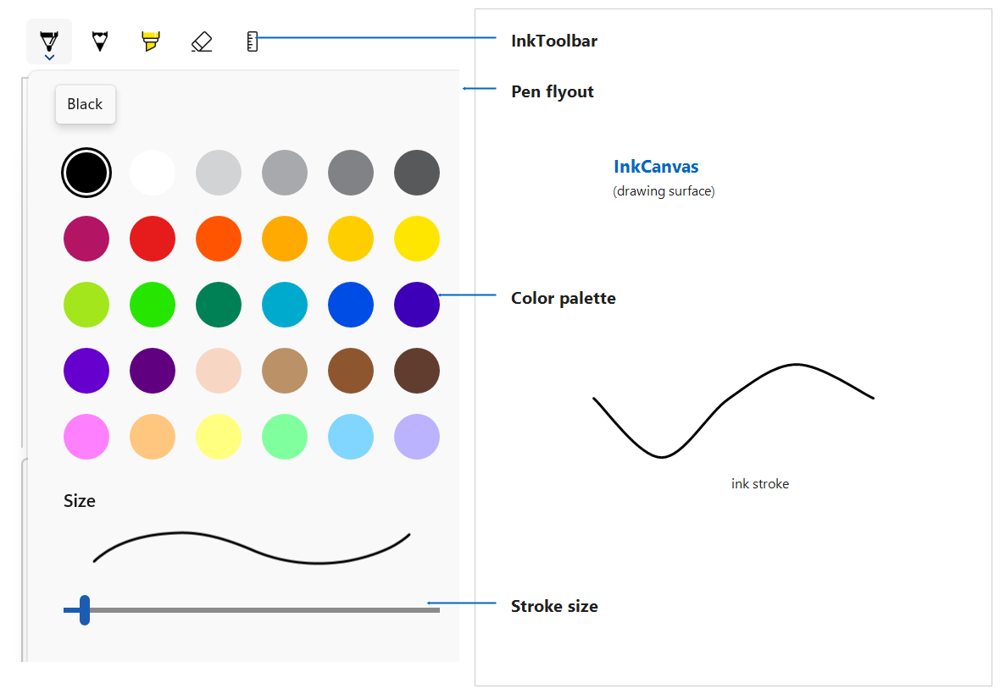
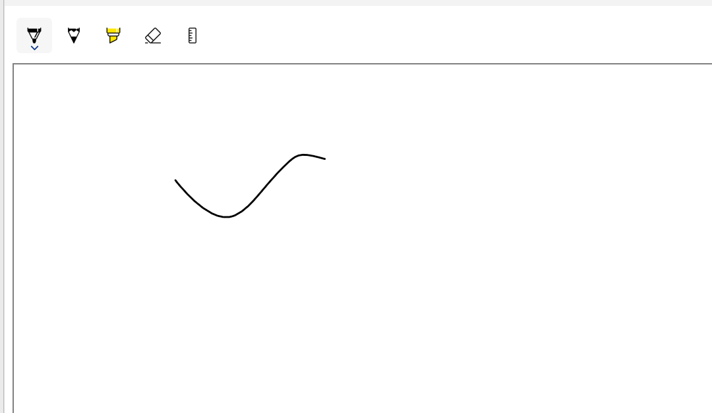
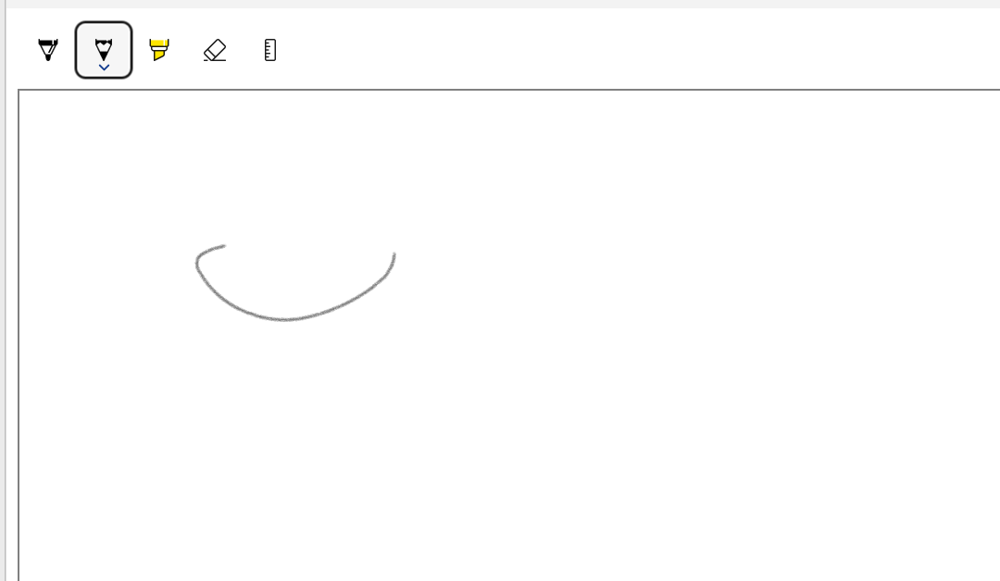
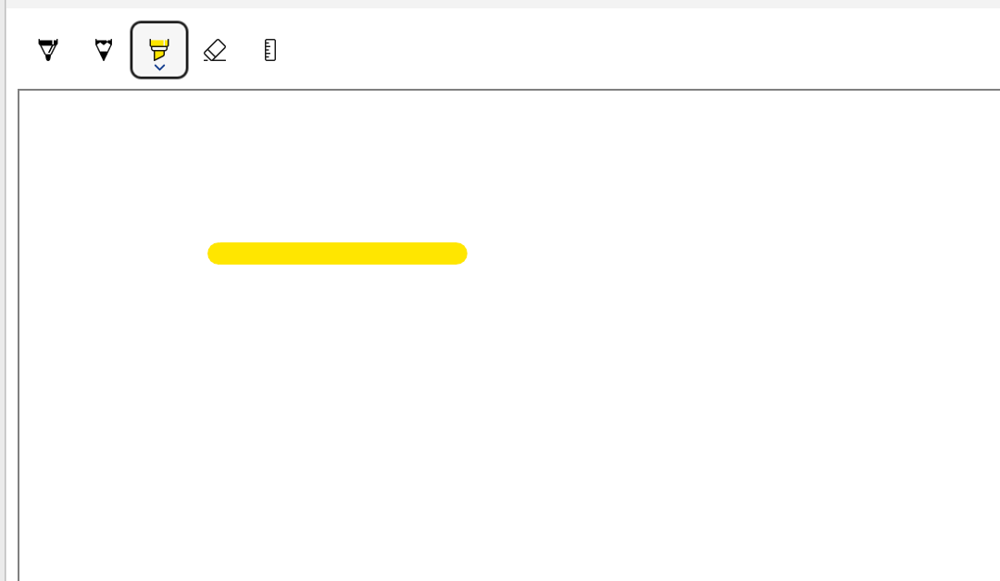
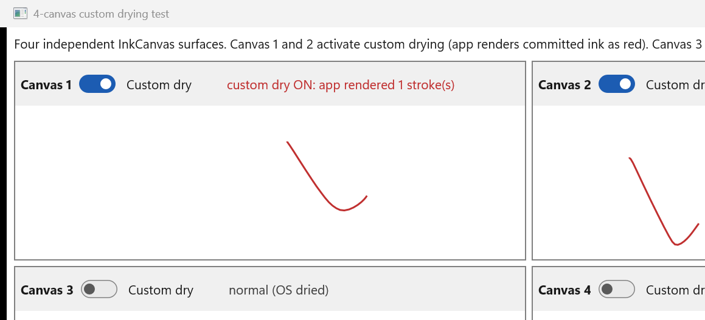

Inking (InkCanvas, InkPresenter, InkToolbar)
===

# Background

WinUI 2 / UWP shipped a full inking stack - `InkCanvas`, `InkPresenter`, and `InkToolbar` - under
`Windows.UI.Xaml.Controls`. The WinUI 3 framework did not have these controls, so apps that needed
pen / handwriting surfaces (note taking, annotation, markup, signature capture) had no first-party
option and had to fall back to WebView2 or interop.

This spec covers the WinUI 3 port of that stack into `Microsoft.UI.Xaml.Controls`:

- **`InkCanvas`** - a `FrameworkElement` that hosts an ink surface and renders wet and dry strokes.
- **`InkPresenter`** - the object (reached through `InkCanvas.InkPresenter`) that owns all ink
  configuration: input device types, drawing attributes, processing mode, the stroke container, and
  the stroke and erase input events.
- **`InkToolbar`** - a `Control` that auto-populates pen / pencil / highlighter / eraser / stencil
  buttons and drives an attached `InkCanvas`.

The port mirrors the UWP API shape so existing UWP inking code and documentation translate with
minimal change. All types in this spec are `[MUX_PREVIEW]`: they ship in the experimental / preview
WinUI channel first so the shape can be validated with partners before it is committed to the stable
contract. The public names live in `Microsoft.UI.Xaml.Controls` and
`Microsoft.UI.Xaml.Automation.Peers`.



# API diff from WinUI 2 (UWP)

This WinUI 3 stack is a port of the UWP inking surface, so nearly every type keeps its exact member
shape. This section is the full diff: why there is a diff at all, the namespace move, the handful of
member-shape changes, the small set of members that are new in WinUI 3, and what is not ported in this
preview.

## Why there is a diff at all

UWP inking ran the whole stack inside the app's view process. In WinUI 3 the underlying OS ink objects
(`Windows.UI.Input.Inking.InkPresenter` and everything reached through it) are thread-affine to a
dedicated ink thread that is **not** the XAML UI thread. The WinUI 3 `InkPresenter`,
`InkStrokeContainer`, `InkStrokeInput`, `InkUnprocessedInput`, and the input-configuration types are
therefore not the OS types - they are thin **mirrors** that live on the UI thread and marshal every
call across to the ink thread. Almost the entire diff below falls out of that threading model rather
than out of any behavior change: a mirror that also has to project into XAML metadata cannot always
keep the exact UWP member shape.

## Namespace move and re-implementation

The public types move out of the OS namespaces into the WinUI 3 namespaces:

| UWP namespace | WinUI 3 namespace |
|---|---|
| `Windows.UI.Xaml.Controls` (`InkCanvas`, `InkToolbar`, toolbar buttons) | `Microsoft.UI.Xaml.Controls` |
| `Windows.UI.Input.Inking` (`InkPresenter` and the objects it owns) | `Microsoft.UI.Xaml.Controls` (re-declared as mirrors) |
| automation peers | `Microsoft.UI.Xaml.Automation.Peers` |

The key point is that WinUI 3 does **not** hand the app the OS inking objects. `InkPresenter`,
`InkStrokeContainer`, `InkStrokeInput`, `InkUnprocessedInput`, and the input-configuration types are
our own ink-thread-marshaled mirrors, not `Windows.UI.Input.Inking` objects. Only the leaf data types
that are already thread-agnostic - `InkStroke`, `InkDrawingAttributes`, `InkStrokeBuilder`,
`InkPresenterRuler` / `InkPresenterProtractor`, `InkPersistenceFormat`, and `CoreInputDeviceTypes` -
are reused from `Windows.UI.Input.Inking` unchanged.

## Member shape changes

The only member-level differences are three `property -> method` changes forced by XAML metadata
generation - none of them changes behavior.

| WinUI 2 / UWP member | WinUI 3 | Reason |
|---|---|---|
| `InkPresenter.HighContrastAdjustment` (property) | `GetHighContrastAdjustment()` / `SetHighContrastAdjustment(value)` (methods) | The mirror `InkPresenter` shares its name with the OS `InkPresenter`; a property would bind XAML metadata to the OS presenter's differently-typed enum. |
| `InkStrokeInput.InkPresenter` (property) | `GetInkPresenter()` (method) | A property forms a metadata cycle with `InkPresenter.StrokeInput`. UWP's `get_InkPresenter` is already a method at the ABI. |
| `InkUnprocessedInput.InkPresenter` (property) | `GetInkPresenter()` (method) | Same cycle with `InkPresenter.UnprocessedInput`. |

These three are the mirror hitting a limitation in how XAML metadata is generated for a WinUI 3 type
that mirrors a same-named OS type. Teaching the generator to emit a property here (so the shape matches
UWP exactly) is a reasonable follow-up; for the preview the method shape is the safe choice and keeps
the ABI identical to UWP's `get_*` accessors.

`InkPresenter.StrokeContainer` is get/set in UWP; the mirror exposes it read-only (`get`) because the
presenter owns its container - strokes are still added and removed through the container's own methods.

## New in WinUI 3 (not public in UWP)

A few members are public here that were not public UWP APIs. They are called out so the review can
decide each one on purpose:

| Member | Kind | Why it is public |
|---|---|---|
| `InkToolbar.EraserFlyoutItemClicked` + `InkToolbarEraserFlyoutItemClickedEventArgs` | event | The eraser flyout (stroke eraser / precision erasers / clear-all) is a first-party WinUI 3 template. The event lets an app observe or handle an eraser-flyout selection before the toolbar acts on it; UWP handled this only internally. |
| `InkToolbarEraserFlyoutItemKind` | enum | Names the items in that eraser flyout so the event args and the visibility toggles below can refer to them. Not a public type in UWP. |
| `InkToolbarEraserKind` | enum | The selected eraser mode (`Stroke` / `PrecisionSmall` / `PrecisionLarge`) surfaced through `InkToolbarEraserButton.SelectedEraser`. Not public in UWP. |
| `InkToolbarEraserButton.IsStrokeEraserVisible`, `ArePrecisionErasersVisible` | properties | Let an app show or hide the individual eraser-flyout items, matching the existing `IsClearAllVisible`. UWP did not expose these toggles. |

## Not ported in this preview

Present on the UWP types, intentionally left out of the `[MUX_PREVIEW]` surface and tracked as
follow-up (see the [Not yet in this preview](#not-yet-in-this-preview) appendix):

- The pen-flyout live wet-stroke preview.
- The `UseSystemColorsWhenNecessary` high-contrast default-palette filtering.
- `InkInputConfiguration.IsPenHapticFeedbackEnabled` - the pen haptic-feedback toggle is not yet plumbed through the lifted stack.
- Surface Dial / `RadialController` integration.

Custom drying (`InkPresenter.ActivateCustomDrying()` and the `InkSynchronizer` it returns) **is**
included in this preview - see [Custom drying](#custom-drying-app-rendered-dry-ink) below. Every other
member on the UWP inking types is present with the same name and signature.

# Conceptual pages (How To)

## How to add an inking surface

An inking surface is an `InkCanvas`. Optionally pair it with an `InkToolbar` to give the user pen,
eraser, and color controls. The toolbar attaches to the canvas through `InkToolbar.TargetInkCanvas`.

### Standard usage

Put the **InkToolbar** above the **InkCanvas** and point it at the canvas. The toolbar auto-populates
the default buttons (ballpoint, pencil, highlighter, eraser) and wires drawing attributes into the
canvas's `InkPresenter` - no code-behind is required for the common case.

```xaml
<Grid RowDefinitions="Auto,*"
      xmlns:controls="using:Microsoft.UI.Xaml.Controls">
    <controls:InkToolbar Grid.Row="0"
                         x:Name="Toolbar"
                         TargetInkCanvas="{x:Bind InkSurface}" />
    <controls:InkCanvas Grid.Row="1" x:Name="InkSurface" />
</Grid>
```

By default the presenter accepts **pen, mouse, and touch**. Assigning `InputDeviceTypes` replaces the
whole mask, so setting `Pen | Mouse` turns touch off - include `Touch` to keep it. Drawing with the
active pen renders a stroke; selecting the eraser and dragging over a stroke removes it.


### Configuring the InkPresenter

All ink configuration flows through `InkCanvas.InkPresenter`, exactly as in UWP:

```csharp
var presenter = InkSurface.InkPresenter;

// Accept pen, mouse, and touch (assigning the mask replaces it, so list every type you want).
presenter.InputDeviceTypes =
    Windows.UI.Core.CoreInputDeviceTypes.Pen |
    Windows.UI.Core.CoreInputDeviceTypes.Mouse |
    Windows.UI.Core.CoreInputDeviceTypes.Touch;

// Set the default stroke color and size.
var attributes = presenter.CopyDefaultDrawingAttributes();
attributes.Color = Microsoft.UI.Colors.MediumPurple;
attributes.Size = new Windows.Foundation.Size(6, 6);
presenter.UpdateDefaultDrawingAttributes(attributes);
```

### Handling stroke input events

`InkPresenter` raises `StrokesCollected` when wet ink is committed to dry strokes, and `StrokesErased`
when strokes are removed. For lower-level input, `InkPresenter.StrokeInput` exposes the raw
start / continue / end / cancel of a stroke, and `InkPresenter.UnprocessedInput` exposes pointer
events the presenter did **not** turn into ink (for example when `InputProcessingConfiguration.Mode`
is `None`, used for lasso selection).

```csharp
presenter.StrokesCollected += (s, e) =>
{
    // e.Strokes is the set of strokes just committed.
    Log($"Collected {e.Strokes.Count} stroke(s).");
};

presenter.StrokesErased += (s, e) =>
{
    Log($"Erased {e.Strokes.Count} stroke(s).");
};

// Raw stroke lifecycle.
presenter.StrokeInput.StrokeStarted += (s, args) => { /* ... */ };
presenter.StrokeInput.StrokeEnded   += (s, args) => { /* ... */ };
```

> [!NOTE]
> `InkStrokeInput.GetInkPresenter()` and `InkUnprocessedInput.GetInkPresenter()` are methods, not
> properties. A property here would emit XAML metadata that forms a cycle with
> `InkPresenter.StrokeInput` / `InkPresenter.UnprocessedInput`; methods break that cycle. UWP's
> `get_InkPresenter` is also a method at the ABI.

### Using InkCanvas and InkToolbar in XAML, C#, and C++/WinRT

Any of these controls can be created in XAML, C#, or C++/WinRT. The table below shows the same
`InkCanvas` + `InkToolbar` pairing created three ways. Each example selects a different default tool
and color so you can see the effect in the rendered output.

<table>
<tr>
<th>Language</th>
<th>Code Sample</th>
<th>Rendered Output</th>
</tr>
<tr>
<td><b>XAML</b></td>
<td>
<pre lang="xml">&lt;Grid RowDefinitions="Auto,*"&gt;
    &lt;controls:InkToolbar Grid.Row="0"
        TargetInkCanvas="{x:Bind InkSurface}" /&gt;
    &lt;controls:InkCanvas Grid.Row="1"
        x:Name="InkSurface" /&gt;
&lt;/Grid&gt;</pre>
Default ballpoint pen.
</td>
<td></td>
</tr>
<tr>
<td><b>C#</b></td>
<td>
<pre lang="csharp">var canvas = new InkCanvas();
var toolbar = new InkToolbar { TargetInkCanvas = canvas };
// Select the pencil tool by default.
toolbar.ActiveTool = toolbar.GetToolButton(InkToolbarTool.Pencil);</pre>
Pencil tool (textured strokes).
</td>
<td></td>
</tr>
<tr>
<td><b>C++/WinRT</b></td>
<td>
<pre lang="cpp">using namespace winrt::Microsoft::UI::Xaml::Controls;
InkCanvas canvas{};
InkToolbar toolbar{};
toolbar.TargetInkCanvas(canvas);
// Default to the highlighter.
toolbar.ActiveTool(
    toolbar.GetToolButton(InkToolbarTool::Highlighter));</pre>
Highlighter tool (translucent strokes).
</td>
<td></td>
</tr>
</table>

### Remarks

- **Preview**: every type here is `[MUX_PREVIEW]` and ships in the experimental channel first.
- **Rendering (Visual Layer external content)**: `InkCanvas` presents its wet and dry ink through a
  system composition visual bridged into the XAML tree (the lifted `ContentExternalOutputLink` on the
  lifted path, or a system-visual splice on the system-compositor path). It is therefore subject to the
  Visual Layer [external content](https://learn.microsoft.com/windows/apps/develop/composition/visual-layer#external-content)
  limitations: XAML clipping, transforms, opacity, and z-order apply to the surface, but effects that
  need to read the ink pixels back (for example a XAML effect brush sampling the surface, or a
  `RenderTargetBitmap` capture of the ink) do not compose over the ink. `InkCanvas` belongs on the
  element list on that page. To snapshot ink, render the strokes yourself from the
  `InkStrokeContainer` rather than capturing the surface.
- **Threading and synchronous members**: `InkPresenter` and everything reached through it
  (`StrokeContainer`, `StrokeInput`, `UnprocessedInput`, the configuration objects) are thin mirrors
  of thread-affine OS ink objects. Most members are **synchronous** - they block the caller until the
  work completes - so calling one while a `SaveAsync` / `LoadAsync` is in flight waits for that I/O to
  finish. `SaveAsync` / `LoadAsync` are the async exceptions; the clipboard members
  (`CopySelectedToClipboard` / `PasteFromClipboard`) can re-enter while they wait. Events are raised
  on the UI thread.
- **Stroke model**: strokes are `Windows.UI.Input.Inking.InkStroke` - the OS stroke type is reused, so
  serialization (`InkStrokeContainer.SaveAsync` / `LoadAsync`, ISF / GIF formats) and interop with
  `InkStrokeBuilder` behave identically to UWP.

## Custom drying (app-rendered dry ink)

By default the `InkPresenter` renders committed ("dry") strokes for you. **Custom drying** hands that
job to the app: you receive each stroke the moment the presenter commits it and draw it into your own
visual. This is what a note-taking or document app uses to apply a custom brush, run ink through its
own document model, or composite ink with other content.

Turn it on once, before the first stroke, by calling `InkPresenter.ActivateCustomDrying()`. It returns
an `InkSynchronizer`. From then on, handle `StrokesCollected` and bracket your rendering with
`BeginDry` / `EndDry`:

```csharp
// Once, at setup - before any stroke is drawn.
var presenter = InkSurface.InkPresenter;
InkSynchronizer synchronizer = presenter.ActivateCustomDrying();

presenter.StrokesCollected += (s, e) =>
{
    // BeginDry hands back the just-committed strokes and holds the wet layer up so there is no gap.
    var strokes = synchronizer.BeginDry();

    // Render the strokes into your own canvas / visual however you like (custom brush, effects, ...).
    foreach (var stroke in strokes)
    {
        RenderDryStroke(stroke);   // app-owned rendering
    }

    // Release the wet layer now that your dry ink is on screen.
    synchronizer.EndDry();
};
```

> [!NOTE]
> Call `ActivateCustomDrying()` before the first stroke is collected. `BeginDry` is only valid from
> inside the `StrokesCollected` handler (it runs in context on the presenter's commit), and every
> `BeginDry` must be paired with an `EndDry`. If you never activate custom drying, the presenter dries
> ink for you and none of this is needed.



# API Pages

## InkCanvas class

An unsealed `FrameworkElement` that hosts an ink surface. It exposes a single member, `InkPresenter`,
through which all ink configuration and events flow - mirroring UWP `InkCanvas`.

```csharp
public unsealed class InkCanvas : Microsoft.UI.Xaml.FrameworkElement
{
    public InkCanvas();
    public InkPresenter InkPresenter { get; }
}
```

### Example usage

```xaml
<controls:InkCanvas x:Name="InkSurface" />
```

```csharp
InkSurface.InkPresenter.InputDeviceTypes =
    CoreInputDeviceTypes.Pen | CoreInputDeviceTypes.Mouse | CoreInputDeviceTypes.Touch;
```

## InkCanvas.InkPresenter property

Gets the `InkPresenter` that owns this canvas's ink configuration, stroke container, and input events.
Read-only; the presenter is created with the canvas.

## InkPresenter class

The configuration and event hub for an `InkCanvas`, mirroring `Windows.UI.Input.Inking.InkPresenter`.

| Member | Kind | Description |
|---|---|---|
| `InputDeviceTypes` | property | Which pointer device types produce ink (`Pen`, `Mouse`, `Touch`, ...). |
| `IsInputEnabled` | property | Enables / disables ink input. |
| `UpdateDefaultDrawingAttributes(InkDrawingAttributes)` | method | Sets the default drawing attributes (color, size, pen tip, ...). |
| `CopyDefaultDrawingAttributes()` | method | Returns an independent copy of the default drawing attributes; the caller mutates it and applies it back with `UpdateDefaultDrawingAttributes`. |
| `SetPredefinedConfiguration(InkPresenterPredefinedConfiguration)` | method | Applies a predefined input-processing configuration - `SimpleSinglePointer` or `SimpleMultiplePointer` (single- vs multi-pointer processing), not a tool. |
| `GetHighContrastAdjustment()` / `SetHighContrastAdjustment(InkHighContrastAdjustment)` | methods | High-contrast rendering mode. Exposed as get / set methods (not a property) to avoid metadata binding to the OS presenter's differently-typed enum. |
| `StrokeContainer` | property | The `InkStrokeContainer` holding this presenter's strokes. |
| `InputProcessingConfiguration` | property | `InkInputProcessingConfiguration` (`Mode`, `RightDragAction`). |
| `InputConfiguration` | property | `InkInputConfiguration` (barrel-button, eraser input toggles). |
| `StrokeInput` | property | `InkStrokeInput` - raw stroke lifecycle events. |
| `UnprocessedInput` | property | `InkUnprocessedInput` - pointer events not turned into ink. |
| `ActivateCustomDrying()` | method | Switches the presenter into custom drying and returns an `InkSynchronizer` so the app renders dry ink itself. Call before the first stroke is collected. See [Custom drying](#custom-drying-app-rendered-dry-ink). |
| `StrokesCollected` | event | Raised when wet ink is committed to dry strokes. Args: `InkStrokesCollectedEventArgs`. |
| `StrokesErased` | event | Raised when strokes are erased. Args: `InkStrokesErasedEventArgs`. |

## InkPresenter.ActivateCustomDrying method

Switches the presenter into **custom drying** and returns the `InkSynchronizer` the app uses to render
dry ink itself. In the default (system) drying mode the presenter renders committed strokes as dry
ink for you. With custom drying the app takes that over: it receives the strokes the presenter just
committed and draws them into its own visual, which is what lets an app apply custom brushes, effects,
or its own document model to dry ink.

Call `ActivateCustomDrying()` once, before the first stroke is collected. It returns an
`InkSynchronizer`; from then on `StrokesCollected` is your cue to run a `BeginDry` / render / `EndDry`
cycle (see [Custom drying](#custom-drying-app-rendered-dry-ink)).

## InkSynchronizer class

Returned by `InkPresenter.ActivateCustomDrying()`. Brackets the app's own rendering of dry ink so the
presenter does not also draw the same strokes.

| Member | Kind | Description |
|---|---|---|
| `BeginDry()` | method | Returns the strokes the presenter just committed and holds the wet layer up so there is no gap between the wet stroke disappearing and the app's dry ink appearing. |
| `EndDry()` | method | Releases the wet layer after the app has rendered the strokes as dry ink. |

The underlying OS synchronizer is thread-affine to the ink thread, so both calls marshal there through
the owning `InkPresenter`. `BeginDry` runs in context inside the presenter's commit, so call it from
the `StrokesCollected` handler and pair every `BeginDry` with an `EndDry`.

## InkStrokeContainer class

Holds and serializes the presenter's strokes and provides selection and clipboard operations.

Key members: `GetStrokes()`, `AddStroke` / `AddStrokes`, `Clear()`, `GetStrokeById(UInt32)`,
`SaveAsync` (with an `InkPersistenceFormat` overload) / `LoadAsync`, `BoundingRect`,
`SelectWithLine` / `SelectWithPolyLine`, `MoveSelected`, `DeleteSelected`,
`CopySelectedToClipboard` / `PasteFromClipboard` / `CanPasteFromClipboard`.

> [!NOTE]
> Geometry is in **physical pixels**, not DIPs: the presenter is sized `ActualWidth x RasterizationScale`.
> `BoundingRect` returns, and `SelectWithLine` / `SelectWithPolyLine` expect, physical-pixel
> coordinates. Scale by `XamlRoot.RasterizationScale` when converting to or from XAML DIP space (for
> example when feeding a lasso path back into the XAML tree).
>
> This is the same as UWP in the sense that the OS presenter has always worked in physical pixels; what
> is new is only that WinUI 3 XAML is DIP-based, so the physical-to-DIP scale is now something the app
> applies explicitly at the boundary.

## InkStrokeInput class

Raw stroke lifecycle, re-raised on the UI thread. Events: `StrokeStarted`, `StrokeContinued`,
`StrokeEnded`, `StrokeCanceled` (all
`TypedEventHandler<InkStrokeInput, Windows.UI.Core.PointerEventArgs>`). `GetInkPresenter()` returns the
owning presenter (method, not property - see the note above).

> [!NOTE]
> These events carry `Windows.UI.Core.PointerEventArgs`, not `Microsoft.UI.Input.PointerEventArgs`. The
> argument is produced by the OS `InkPresenter` on the ink thread and passed straight through by the
> mirror, so keeping the W.U.C type avoids a per-event conversion on the raw input path and matches the
> exact UWP signature. Switching to `Microsoft.UI.Input.PointerEventArgs` for consistency with the rest
> of WinAppSDK is an open question for the review; it would add a marshaling conversion per event.

## InkUnprocessedInput class

Pointer events the presenter did not convert to ink (used with `InputProcessingMode.None`, for example
lasso selection). Events: `PointerEntered`, `PointerHovered`, `PointerExited`, `PointerPressed`,
`PointerMoved`, `PointerReleased`, `PointerLost`. `GetInkPresenter()` returns the owning presenter.

## InkStrokesCollectedEventArgs / InkStrokesErasedEventArgs

Each exposes `Strokes` - an `IVectorView<Windows.UI.Input.Inking.InkStroke>` of the strokes that were
collected or erased.

## InkToolbar class

An unsealed `Control` that auto-populates and manages inking tool buttons and drives an attached
`InkCanvas`.

| Member | Kind | Description |
|---|---|---|
| `TargetInkCanvas` | property | The `InkCanvas` this toolbar drives. |
| `TargetInkPresenter` | property | Alternative target when driving a presenter directly. |
| `InitialControls` | property | Which default buttons to auto-populate (`All`, `None`, `PensOnly`, `AllExceptPens`). |
| `ActiveTool` | property | The currently selected `InkToolbarToolButton`. |
| `InkDrawingAttributes` | property (get) | The active tool's drawing attributes. |
| `IsRulerButtonChecked` / `IsStencilButtonChecked` | properties | Stencil (ruler / protractor) toggles. |
| `ButtonFlyoutPlacement` | property | Placement of tool flyouts. |
| `Orientation` | property | `Horizontal` (default) or `Vertical`. |
| `Children` | property (get) | The toolbar's child buttons (content property). |
| `GetToolButton` / `GetToggleButton` / `GetMenuButton` | methods | Look up a button by `InkToolbarTool` / `InkToolbarToggle` / `InkToolbarMenuKind`. |
| `ActiveToolChanged`, `InkDrawingAttributesChanged`, `EraseAllClicked`, `EraserFlyoutItemClicked`, `IsStencilButtonCheckedChanged` | events | Toolbar interaction events. |

### InkToolbar button types

The toolbar's buttons form a small hierarchy (all `[MUX_PREVIEW]`):

- `InkToolbarToolButton` (`RadioButton`) -> `InkToolbarPenButton`, `InkToolbarEraserButton`,
  `InkToolbarCustomToolButton`
  - `InkToolbarPenButton` -> `InkToolbarBallpointPenButton`, `InkToolbarPencilButton`,
    `InkToolbarHighlighterButton`, `InkToolbarCustomPenButton`
- `InkToolbarToggleButton` (`CheckBox`) -> `InkToolbarRulerButton`, `InkToolbarCustomToggleButton`
- `InkToolbarMenuButton` (`ToggleButton`) -> `InkToolbarStencilButton`
- `InkToolbarCustomPen` (`DependencyObject`) - factory for custom drawing attributes.
- `InkToolbarPenConfigurationControl`, `InkToolbarFlyoutItem` - flyout / config building blocks.

`InkToolbarPenButton` exposes the color `Palette`, `MinStrokeWidth` / `MaxStrokeWidth`,
`SelectedBrush` / `SelectedBrushIndex`, and `SelectedStrokeWidth`. `InkToolbarEraserButton` exposes
`SelectedEraser`, `IsClearAllVisible` (default `true`), `IsStrokeEraserVisible`,
`ArePrecisionErasersVisible`. `InkToolbarStencilButton` exposes `Ruler`, `Protractor`,
`SelectedStencil`, `IsRulerItemVisible` / `IsProtractorItemVisible` (default `true`).

## InkCanvasAutomationPeer / InkToolbarAutomationPeer classes

`InkCanvasAutomationPeer` (from `FrameworkElementAutomationPeer`) provides the automation peer for
`InkCanvas`. `InkToolbarAutomationPeer` (from `FrameworkElementAutomationPeer`) is the peer for the
toolbar. The toolbar's buttons have dedicated peers: `InkToolbarToolButtonAutomationPeer` and
`InkToolbarMenuButtonAutomationPeer` implement `IExpandCollapseProvider` (expand / collapse the tool
flyout), and `InkToolbarFlyoutItemAutomationPeer` implements `IInvokeProvider`. See the
[Automation Behaviour](#automation-behaviour) appendix.

# API Details

```c# (but really MIDL3)
namespace Microsoft.UI.Xaml.Controls
{
    // ---- InkCanvas / InkPresenter surface ----

    [MUX_PREVIEW]
    runtimeclass InkStrokesCollectedEventArgs
    {
        Windows.Foundation.Collections.IVectorView<Windows.UI.Input.Inking.InkStroke> Strokes{ get; };
    }

    [MUX_PREVIEW]
    runtimeclass InkStrokesErasedEventArgs
    {
        Windows.Foundation.Collections.IVectorView<Windows.UI.Input.Inking.InkStroke> Strokes{ get; };
    }

    [MUX_PREVIEW]
    runtimeclass InkStrokeContainer
    {
        void Clear();
        Windows.Foundation.Collections.IVectorView<Windows.UI.Input.Inking.InkStroke> GetStrokes();
        void AddStroke(Windows.UI.Input.Inking.InkStroke stroke);
        void AddStrokes(Windows.Foundation.Collections.IIterable<Windows.UI.Input.Inking.InkStroke> strokes);
        [default_overload][overload("SaveAsync")]
        Windows.Foundation.IAsyncAction SaveAsync(Windows.Storage.Streams.IOutputStream outputStream);
        [overload("SaveAsync")]
        Windows.Foundation.IAsyncAction SaveWithFormatAsync(Windows.Storage.Streams.IOutputStream outputStream, Windows.UI.Input.Inking.InkPersistenceFormat inkPersistenceFormat);
        Windows.Foundation.IAsyncAction LoadAsync(Windows.Storage.Streams.IInputStream inputStream);
        Windows.UI.Input.Inking.InkStroke GetStrokeById(UInt32 id);
        Windows.Foundation.Rect DeleteSelected();
        Windows.Foundation.Rect MoveSelected(Windows.Foundation.Point translation);
        Windows.Foundation.Rect SelectWithLine(Windows.Foundation.Point from, Windows.Foundation.Point to);
        Windows.Foundation.Rect SelectWithPolyLine(Windows.Foundation.Collections.IIterable<Windows.Foundation.Point> points);
        Windows.Foundation.Rect BoundingRect{ get; };
        void CopySelectedToClipboard();
        Windows.Foundation.Rect PasteFromClipboard(Windows.Foundation.Point position);
        Boolean CanPasteFromClipboard();
    }

    [MUX_PREVIEW]
    enum InkInputProcessingMode { None = 0, Inking = 1, Erasing = 2 };

    [MUX_PREVIEW]
    enum InkInputRightDragAction { LeaveUnprocessed = 0, AllowProcessing = 1 };

    [MUX_PREVIEW]
    runtimeclass InkInputProcessingConfiguration
    {
        InkInputProcessingMode Mode;
        InkInputRightDragAction RightDragAction;
    }

    [MUX_PREVIEW]
    runtimeclass InkInputConfiguration
    {
        Boolean IsPrimaryBarrelButtonInputEnabled;
        Boolean IsEraserInputEnabled;
        // UWP's IsPenHapticFeedbackEnabled is intentionally omitted in this preview (not yet plumbed).
    }

    [MUX_PREVIEW]
    enum InkHighContrastAdjustment
    {
        UseSystemColorsWhenNecessary = 0,
        UseSystemColors = 1,
        UseOriginalColors = 2,
    };

    [MUX_PREVIEW]
    runtimeclass InkStrokeInput
    {
        event Windows.Foundation.TypedEventHandler<InkStrokeInput, Windows.UI.Core.PointerEventArgs> StrokeStarted;
        event Windows.Foundation.TypedEventHandler<InkStrokeInput, Windows.UI.Core.PointerEventArgs> StrokeContinued;
        event Windows.Foundation.TypedEventHandler<InkStrokeInput, Windows.UI.Core.PointerEventArgs> StrokeEnded;
        event Windows.Foundation.TypedEventHandler<InkStrokeInput, Windows.UI.Core.PointerEventArgs> StrokeCanceled;
        InkPresenter GetInkPresenter();   // method, not property (breaks metadata cycle)
    }

    [MUX_PREVIEW]
    runtimeclass InkUnprocessedInput
    {
        event Windows.Foundation.TypedEventHandler<InkUnprocessedInput, Windows.UI.Core.PointerEventArgs> PointerEntered;
        event Windows.Foundation.TypedEventHandler<InkUnprocessedInput, Windows.UI.Core.PointerEventArgs> PointerHovered;
        event Windows.Foundation.TypedEventHandler<InkUnprocessedInput, Windows.UI.Core.PointerEventArgs> PointerExited;
        event Windows.Foundation.TypedEventHandler<InkUnprocessedInput, Windows.UI.Core.PointerEventArgs> PointerPressed;
        event Windows.Foundation.TypedEventHandler<InkUnprocessedInput, Windows.UI.Core.PointerEventArgs> PointerMoved;
        event Windows.Foundation.TypedEventHandler<InkUnprocessedInput, Windows.UI.Core.PointerEventArgs> PointerReleased;
        event Windows.Foundation.TypedEventHandler<InkUnprocessedInput, Windows.UI.Core.PointerEventArgs> PointerLost;
        InkPresenter GetInkPresenter();   // method, not property
    }

    [MUX_PREVIEW]
    runtimeclass InkSynchronizer
    {
        // Take over rendering of dry (committed) ink. BeginDry hands back the strokes the presenter
        // just committed and holds the wet layer; the app renders them as dry ink and calls EndDry to
        // release the wet layer. Both calls marshal to the ink thread through the owning InkPresenter.
        Windows.Foundation.Collections.IVectorView<Windows.UI.Input.Inking.InkStroke> BeginDry();
        void EndDry();
    }

    [MUX_PREVIEW]
    runtimeclass InkPresenter
    {
        Windows.UI.Core.CoreInputDeviceTypes InputDeviceTypes;
        Boolean IsInputEnabled;
        void UpdateDefaultDrawingAttributes(Windows.UI.Input.Inking.InkDrawingAttributes drawingAttributes);
        Windows.UI.Input.Inking.InkDrawingAttributes CopyDefaultDrawingAttributes();
        void SetPredefinedConfiguration(Windows.UI.Input.Inking.InkPresenterPredefinedConfiguration configuration);
        InkHighContrastAdjustment GetHighContrastAdjustment();
        void SetHighContrastAdjustment(InkHighContrastAdjustment value);
        InkStrokeContainer StrokeContainer{ get; };
        InkInputProcessingConfiguration InputProcessingConfiguration{ get; };
        InkInputConfiguration InputConfiguration{ get; };
        InkStrokeInput StrokeInput{ get; };
        InkUnprocessedInput UnprocessedInput{ get; };
        // Switch into custom-drying mode and return the synchronizer the app uses to render dry ink.
        // Must be called before the first stroke is collected.
        InkSynchronizer ActivateCustomDrying();
        event Windows.Foundation.TypedEventHandler<InkPresenter, InkStrokesCollectedEventArgs> StrokesCollected;
        event Windows.Foundation.TypedEventHandler<InkPresenter, InkStrokesErasedEventArgs> StrokesErased;
    }

    [MUX_PREVIEW]
    unsealed runtimeclass InkCanvas : Microsoft.UI.Xaml.FrameworkElement
    {
        InkCanvas();
        InkPresenter InkPresenter{ get; };
    };

    // ---- InkToolbar surface (enums) ----

    [MUX_PREVIEW] enum InkToolbarButtonFlyoutPlacement { Auto, Top, Bottom, Left, Right };
    [MUX_PREVIEW] enum InkToolbarEraserFlyoutItemKind { StrokeEraser, PrecisionSmallEraser, PrecisionLargeEraser, ClearAll };
    [MUX_PREVIEW] enum InkToolbarEraserKind { Stroke, PrecisionSmall, PrecisionLarge };
    [MUX_PREVIEW] enum InkToolbarFlyoutItemKind { Simple, Radio, Check, RadioCheck };
    [MUX_PREVIEW] enum InkToolbarInitialControls { All, None, PensOnly, AllExceptPens };
    [MUX_PREVIEW] enum InkToolbarMenuKind { Stencil };
    [MUX_PREVIEW] enum InkToolbarStencilKind { Ruler, Protractor };
    [MUX_PREVIEW] enum InkToolbarToggle { Ruler, Custom };
    [MUX_PREVIEW] enum InkToolbarTool { BallpointPen, Pencil, Highlighter, Eraser, CustomPen, CustomTool };

    // ---- InkToolbar surface (classes) ----

    [MUX_PREVIEW]
    runtimeclass InkToolbarEraserFlyoutItemClickedEventArgs
    {
        InkToolbarEraserFlyoutItemKind EraserFlyoutItemKind{ get; };
        Boolean Handled{ get; set; };
    };

    [MUX_PREVIEW]
    runtimeclass InkToolbarIsStencilButtonCheckedChangedEventArgs
    {
        InkToolbarStencilButton StencilButton{ get; };
        InkToolbarStencilKind StencilKind{ get; };
    };

    [MUX_PREVIEW]
    [contentproperty("Children")]
    unsealed runtimeclass InkToolbar : Microsoft.UI.Xaml.Controls.Control
    {
        InkToolbar();
        InkToolbarInitialControls InitialControls;
        Microsoft.UI.Xaml.DependencyObjectCollection Children{ get; };
        InkToolbarToolButton ActiveTool;
        Windows.UI.Input.Inking.InkDrawingAttributes InkDrawingAttributes{ get; };
        Boolean IsRulerButtonChecked;
        InkCanvas TargetInkCanvas;
        Boolean IsStencilButtonChecked;
        InkToolbarButtonFlyoutPlacement ButtonFlyoutPlacement;
        [MUX_DEFAULT_VALUE("winrt::Orientation::Horizontal")]
        Microsoft.UI.Xaml.Controls.Orientation Orientation;
        InkPresenter TargetInkPresenter;
        event Windows.Foundation.TypedEventHandler<InkToolbar, Object> ActiveToolChanged;
        event Windows.Foundation.TypedEventHandler<InkToolbar, Object> InkDrawingAttributesChanged;
        event Windows.Foundation.TypedEventHandler<InkToolbar, Object> EraseAllClicked;
        event Windows.Foundation.TypedEventHandler<InkToolbar, InkToolbarEraserFlyoutItemClickedEventArgs> EraserFlyoutItemClicked;
        event Windows.Foundation.TypedEventHandler<InkToolbar, InkToolbarIsStencilButtonCheckedChangedEventArgs> IsStencilButtonCheckedChanged;
        InkToolbarToolButton GetToolButton(InkToolbarTool tool);
        InkToolbarToggleButton GetToggleButton(InkToolbarToggle tool);
        InkToolbarMenuButton GetMenuButton(InkToolbarMenuKind menu);
        // + generated DependencyProperty statics for each property above.
    };

    [MUX_PREVIEW]
    [constructor_name("Microsoft.UI.Xaml.Controls.IInkToolbarCustomPenFactory")]
    unsealed runtimeclass InkToolbarCustomPen : Microsoft.UI.Xaml.DependencyObject
    {
        [method_name("CreateInstance")] protected InkToolbarCustomPen();
        Windows.UI.Input.Inking.InkDrawingAttributes CreateInkDrawingAttributes(Microsoft.UI.Xaml.Media.Brush brush, Double strokeWidth);
        overridable Windows.UI.Input.Inking.InkDrawingAttributes CreateInkDrawingAttributesCore(Microsoft.UI.Xaml.Media.Brush brush, Double strokeWidth);
    };

    [MUX_PREVIEW]
    unsealed runtimeclass InkToolbarPenConfigurationControl : Microsoft.UI.Xaml.Controls.Control
    {
        [method_name("CreateInstance")] InkToolbarPenConfigurationControl();
        InkToolbarPenButton PenButton{ get; };
    };

    [MUX_PREVIEW]
    unsealed runtimeclass InkToolbarFlyoutItem : Microsoft.UI.Xaml.Controls.Primitives.ButtonBase
    {
        [method_name("CreateInstance")] InkToolbarFlyoutItem();
        InkToolbarFlyoutItemKind Kind;
        Boolean IsChecked;
        event Windows.Foundation.TypedEventHandler<InkToolbarFlyoutItem, Object> Checked;
        event Windows.Foundation.TypedEventHandler<InkToolbarFlyoutItem, Object> Unchecked;
    };

    [MUX_PREVIEW]
    [constructor_name("Microsoft.UI.Xaml.Controls.IInkToolbarMenuButtonFactory")]
    unsealed runtimeclass InkToolbarMenuButton : Microsoft.UI.Xaml.Controls.Primitives.ToggleButton
    {
        InkToolbarMenuKind MenuKind{ get; };
        Boolean IsExtensionGlyphShown;
    };

    [MUX_PREVIEW]
    unsealed runtimeclass InkToolbarStencilButton : InkToolbarMenuButton
    {
        [method_name("CreateInstance")] InkToolbarStencilButton();
        Windows.UI.Input.Inking.InkPresenterRuler Ruler{ get; };
        Windows.UI.Input.Inking.InkPresenterProtractor Protractor{ get; };
        InkToolbarStencilKind SelectedStencil;
        [MUX_DEFAULT_VALUE("true")] Boolean IsRulerItemVisible;
        [MUX_DEFAULT_VALUE("true")] Boolean IsProtractorItemVisible;
    };

    [MUX_PREVIEW]
    [constructor_name("Microsoft.UI.Xaml.Controls.IInkToolbarToggleButtonFactory")]
    unsealed runtimeclass InkToolbarToggleButton : Microsoft.UI.Xaml.Controls.CheckBox
    {
        InkToolbarToggle ToggleKind{ get; };
    };

    [MUX_PREVIEW]
    [constructor_name("Microsoft.UI.Xaml.Controls.IInkToolbarToolButtonFactory")]
    unsealed runtimeclass InkToolbarToolButton : Microsoft.UI.Xaml.Controls.RadioButton
    {
        InkToolbarTool ToolKind{ get; };
        Boolean IsExtensionGlyphShown;
    };

    [MUX_PREVIEW] unsealed runtimeclass InkToolbarCustomToggleButton : InkToolbarToggleButton { [method_name("CreateInstance")] InkToolbarCustomToggleButton(); };
    [MUX_PREVIEW] unsealed runtimeclass InkToolbarRulerButton : InkToolbarToggleButton { [method_name("CreateInstance")] InkToolbarRulerButton(); };

    [MUX_PREVIEW]
    unsealed runtimeclass InkToolbarCustomToolButton : InkToolbarToolButton
    {
        [method_name("CreateInstance")] InkToolbarCustomToolButton();
        Microsoft.UI.Xaml.UIElement ConfigurationContent;
    };

    [MUX_PREVIEW]
    unsealed runtimeclass InkToolbarEraserButton : InkToolbarToolButton
    {
        [method_name("CreateInstance")] InkToolbarEraserButton();
        InkToolbarEraserKind SelectedEraser;
        [MUX_DEFAULT_VALUE("true")] Boolean IsClearAllVisible;
        Boolean IsStrokeEraserVisible;
        Boolean ArePrecisionErasersVisible;
    };

    [MUX_PREVIEW]
    [constructor_name("Microsoft.UI.Xaml.Controls.IInkToolbarPenButtonFactory")]
    unsealed runtimeclass InkToolbarPenButton : InkToolbarToolButton
    {
        Windows.Foundation.Collections.IVector<Microsoft.UI.Xaml.Media.Brush> Palette;
        Double MinStrokeWidth;
        Double MaxStrokeWidth;
        Microsoft.UI.Xaml.Media.Brush SelectedBrush{ get; };
        Int32 SelectedBrushIndex;
        Double SelectedStrokeWidth;
    };

    [MUX_PREVIEW] unsealed runtimeclass InkToolbarBallpointPenButton : InkToolbarPenButton { [method_name("CreateInstance")] InkToolbarBallpointPenButton(); };

    [MUX_PREVIEW]
    unsealed runtimeclass InkToolbarCustomPenButton : InkToolbarPenButton
    {
        [method_name("CreateInstance")] InkToolbarCustomPenButton();
        InkToolbarCustomPen CustomPen;
        Microsoft.UI.Xaml.UIElement ConfigurationContent;
    };

    [MUX_PREVIEW] unsealed runtimeclass InkToolbarHighlighterButton : InkToolbarPenButton { [method_name("CreateInstance")] InkToolbarHighlighterButton(); };
    [MUX_PREVIEW] unsealed runtimeclass InkToolbarPencilButton : InkToolbarPenButton { [method_name("CreateInstance")] InkToolbarPencilButton(); };
}

namespace Microsoft.UI.Xaml.Automation.Peers
{
    [MUX_PREVIEW]
    unsealed runtimeclass InkCanvasAutomationPeer : Microsoft.UI.Xaml.Automation.Peers.FrameworkElementAutomationPeer
    {
        InkCanvasAutomationPeer(Microsoft.UI.Xaml.Controls.InkCanvas owner);
    }

    [MUX_PREVIEW]
    unsealed runtimeclass InkToolbarAutomationPeer : Microsoft.UI.Xaml.Automation.Peers.FrameworkElementAutomationPeer
    {
        InkToolbarAutomationPeer(Microsoft.UI.Xaml.Controls.InkToolbar owner);
    }

    // Tool and menu buttons expose ExpandCollapse (open / close the tool flyout); flyout items expose Invoke.
    [MUX_PREVIEW]
    unsealed runtimeclass InkToolbarToolButtonAutomationPeer : Microsoft.UI.Xaml.Automation.Peers.RadioButtonAutomationPeer,
        Microsoft.UI.Xaml.Automation.Provider.IExpandCollapseProvider
    {
        InkToolbarToolButtonAutomationPeer(Microsoft.UI.Xaml.Controls.InkToolbarToolButton owner);
    }

    [MUX_PREVIEW]
    unsealed runtimeclass InkToolbarMenuButtonAutomationPeer : Microsoft.UI.Xaml.Automation.Peers.ToggleButtonAutomationPeer,
        Microsoft.UI.Xaml.Automation.Provider.IExpandCollapseProvider
    {
        InkToolbarMenuButtonAutomationPeer(Microsoft.UI.Xaml.Controls.InkToolbarMenuButton owner);
    }

    [MUX_PREVIEW]
    unsealed runtimeclass InkToolbarFlyoutItemAutomationPeer : Microsoft.UI.Xaml.Automation.Peers.ButtonBaseAutomationPeer,
        Microsoft.UI.Xaml.Automation.Provider.IInvokeProvider
    {
        InkToolbarFlyoutItemAutomationPeer(Microsoft.UI.Xaml.Controls.InkToolbarFlyoutItem owner);
    }
}
```

## Appendix

### Keyboard Behaviour

Inking is pointer-driven (pen / mouse / touch); the `InkCanvas` surface itself does not define keyboard
ink entry. The `InkToolbar` buttons are standard focusable controls: arrow keys move between tool
buttons, <kbd>Space</kbd> / <kbd>Enter</kbd> activate a tool, and a tool button's flyout (color / size,
eraser options, stencil) opens with <kbd>Enter</kbd> / <kbd>Down</kbd> and closes with <kbd>Esc</kbd>,
matching the WinUI 2 toolbar.

### Automation Behaviour

- `InkCanvas` maps to `InkCanvasAutomationPeer` (`FrameworkElementAutomationPeer`).
- `InkToolbar` tool and menu buttons expose `IExpandCollapseProvider` (Expand opens the tool flyout,
  Collapse closes it); flyout items expose `IInvokeProvider` (Invoke performs the item action). Buttons
  report `AutomationControlType.Custom`.
- Tool buttons carry tooltips and `AutomationProperties.Name` from the localized tool names.

### Not yet in this preview

These are called out so reviewers know the exact scope of the preview surface. They are **not** part of
the API above and are tracked as follow-up work:

| Area | Notes |
|---|---|
| Live stroke preview (pen-flyout wet preview) | The stroke logic ports from UWP; re-hosting the wet preview in the lifted framework is follow-up work. |
| High-contrast default palette | The `UseSystemColorsWhenNecessary` default-mode contrast filtering is not yet ported; other high-contrast modes and toolbar chrome adapt normally. |
| Pen haptic feedback | `InkInputConfiguration.IsPenHapticFeedbackEnabled` is not yet plumbed through the lifted stack. |
| Per-color localized color names | Uncommon colors fall back to an `RGB r,g,b` string, matching UWP's fallback. |
| Surface Dial / RadialController integration | Out of scope for this preview. |
