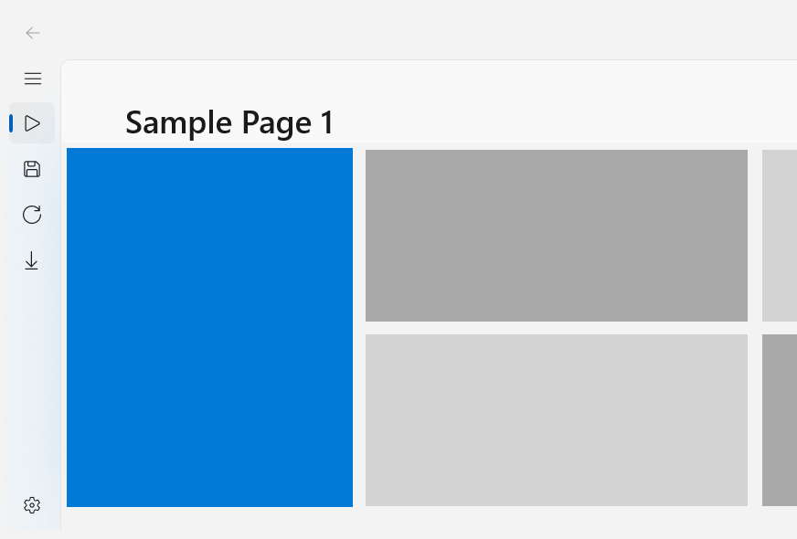
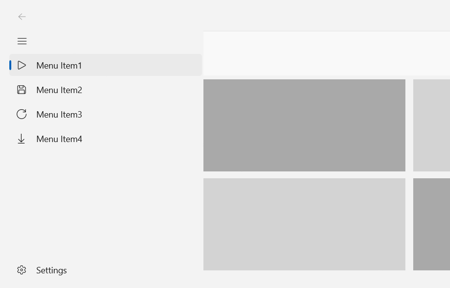

NavigationViewTemplateSettings.OpenPaneLength
===

# Background

_This spec adds an `OpenPaneLength` property to the Xaml
[NavigationViewTemplateSettings](https://docs.microsoft.com//windows/winui/api/microsoft.ui.xaml.controls.navigationviewtemplatesettings) class_

The (existing) WinUI [NavigationView](https://docs.microsoft.com/uwp/api/Windows.UI.Xaml.Controls.NavigationView) control has
a list of items you can view, and a content area that shows the selected item.
The list is shown in a pane that can be open, closed or partially open (compact).
The exact width of the open pane can be specified using the
[NavigationView.OpenPaneLength](https://docs.microsoft.com/uwp/api/Windows.UI.Xaml.Controls.NavigationView.OpenPaneLength)
property.

Example of compact pane:



Example of open pane:



The new property in this spec is a read-only `NavigationViewTemplateSettings.OpenPaneLength`,
to go along with the existing read/write `NavigationView.OpenPaneLength`.
It returns the `min` between `NavigationView.OpenPaneLength` and the window width.
This was necessary to fix a bug where the NavigationView pane contents were being cropped when
`OpenPaneLength` surpasses the window's width.
`NavigationViewTemplateSettings.OpenPaneLength` is set in `SplitView` and `ShadowCaster` template;
it was previously a simple template binding to `NavigationView.OpenPaneLength` property.

(Naming note: these APIs use "Length" rather than "Width" because
in the original design it was envisioned that there woould be a vertical mode in the future,
where this could represent a height too.)

TemplateSettings properties are not commonly used by app developers, 
however, in situations when they copy a WinUI control's template into their own project,
there is a Xaml error when the TemplateSettings property is not public.
See [issue #6682](https://github.com/microsoft/microsoft-ui-xaml/issues/6682)
for more information on the error caused by non-public TemplateSettings.

# API Pages

## NavigationViewTemplateSettings.OpenPaneLength

Gets the `min` between `OpenPaneLength` and the window's width.
This is the calculated value of the width of the pane when opened and fully expanded. Defaults to 320.0 in [view pixels](https://docs.microsoft.com/uwp/api/Windows.Graphics.Display.DisplayInformation.RawPixelsPerViewPixel)

(Type: Double)

This example shows the `OpenPaneLength` property being used in the `ControlTemplate` for `NavigationView`
to pass through to the
[SplitView.OpenPaneLength](https://docs.microsoft.com/uwp/api/Windows.UI.Xaml.Controls.SplitView.OpenPaneLength).

```xml
<ControlTemplate TargetType="NavigationView">
    <!-- ... -->
    <SplitView
        OpenPaneLength="{Binding RelativeSource={RelativeSource TemplatedParent}, Path=TemplateSettings.OpenPaneWidth}"
        Background="{TemplateBinding Background}"
        BorderBrush="{ThemeResource NavigationViewItemSeparatorForeground}"
        BorderThickness="{ThemeResource NavigationViewBorderThickness}"
        CompactPaneLength="{TemplateBinding CompactPaneLength}"
        DisplayMode="Inline"
        IsPaneOpen="{Binding RelativeSource={RelativeSource TemplatedParent}, Path=IsPaneOpen, Mode=TwoWay}"
        IsTabStop="False"
        PaneBackground="{ThemeResource NavigationViewDefaultPaneBackground}">

```

_Spec note: Usage available to view in this PR: [#7341](https://github.com/microsoft/microsoft-ui-xaml/pull/7341)_

# API Details

```c# (but really MIDL3)
[webhosthidden]
unsealed runtimeclass NavigationViewTemplateSettings : Windows.UI.Xaml.DependencyObject
{
    // ...

    [MUX_DEFAULT_VALUE("320.0")]
    Double OpenPaneLength{ get; };

    static Windows.UI.Xaml.DependencyProperty OpenPaneLengthProperty{ get; };
}
```

# Appendix

The NavigationView pane is open when it is expanded to its full width.
It is visible when the pane is shown - even in compact mode.
See [NavigationView.IsPaneOpen](https://docs.microsoft.com/windows/winui/api/microsoft.ui.xaml.controls.navigationview.ispaneopen) 
and [NavigationView.IsPaneVisible](https://docs.microsoft.com/windows/winui/api/microsoft.ui.xaml.controls.navigationview.ispanevisible) 
for additional information on the distinction.
