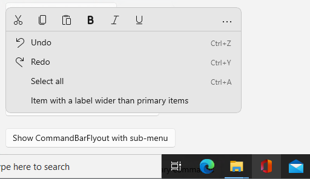
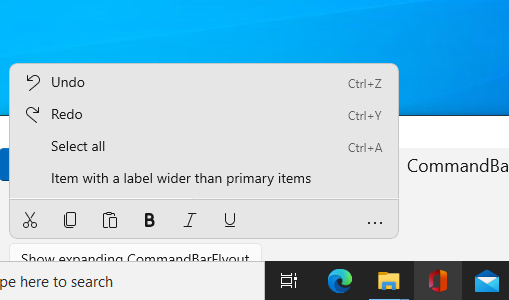

<!-- The purpose of this spec is to describe a new feature and
its APIs that make up a new feature in WinUI. -->

<!-- There are two audiences for the spec. The first are people
that want to evaluate and give feedback on the API, as part of
the submission process.  When it's complete
it will be incorporated into the public documentation at
docs.microsoft.com (http://docs.microsoft.com/uwp/toolkits/winui/).
Hopefully we'll be able to copy it mostly verbatim.
So the second audience is everyone that reads there to learn how
and why to use this API. -->

# Background
<!-- Use this section to provide background context for the new API(s) 
in this spec. -->

<!-- This section and the appendix are the only sections that likely
do not get copied to docs.microsoft.com; they're just an aid to reading this spec. -->

<!-- If you're modifying an existing API, included a link here to the
existing page(s) -->

<!-- For example, this section is a place to explain why you're adding this API rather than
modifying an existing API. -->

<!-- For example, this is a place to provide a brief explanation of some dependent
area, just explanation enough to understand this new API, rather than telling
the reader "go read 100 pages of background information posted at ...". -->

Flyouts in XAML are given two modes of display: they can either appear as part of the rest of XAML,
in which case they're confined to the bounds of the XAML root, or they can appear in their own HWND, which
allows them to escape the bounds of the XAML root.  This is common for elements such as context menus.

CommandBarFlyout is one such element, but since it's defined in WinUI 2 rather than in the OS, it does not
have access to the HWND used to allow it to escape the XAML root's bounds.  As such, it has no way to
determine which monitor it's being displayed in, which makes it unable to know whether it has enough visual space
to open its secondary commands below its primary commands or whether it should open them above instead.

This proposed API adds three properties and an event to Popup which will allow apps to specify where it desires a popup
to be displayed relative to another element, and then respond to where system XAML was able to actually place
the popup.  This will allow elements such as CommandBar to be able to rely on system XAML for the placement of their
child popups in a way that will take monitor or app bounds into account without needing to do that accounting manuall.

# Visual Examples
<!-- Use this section to provide a brief description of the feature.
For an example, see the introduction to the PasswordBox control 
(http://docs.microsoft.com/windows/uwp/design/controls-and-patterns/password-box). -->

When CommandBarFlyout has enough space below its primary commands, we want it to open down:




When CommandBarFlyout does *not* have enough space below its primary commands, we want it to be able to open up:




# API Notes
<!-- Option 1: Give a one or two line description of each API (type
and member), or at least the ones that aren't obvious
from their name.  These descriptions are what show up
in IntelliSense. For properties, specify the default value of the property if it
isn't the type's default (for example an int-typed property that doesn't default to zero.) -->

<!-- Option 2: Put these descriptions in the below API Details section,
with a "///" comment above the member or type. -->

## New APIs

```csharp
enum PopupPlacementMode
{
    None,
    Top,
    Bottom,
    Left,
    Right,
    TopEdgeAlignedLeft,
    TopEdgeAlignedRight,
    BottomEdgeAlignedLeft,
    BottomEdgeAlignedRight,
    LeftEdgeAlignedTop,
    LeftEdgeAlignedBottom,
    RightEdgeAlignedTop,
    RightEdgeAlignedBottom
}

class Popup
{
    UIElement Target { get; set; }
    PopupPlacementMode DesiredPlacement { get; set; }
    PopupPlacementMode ActualPlacement { get; }
    
    public event System.EventHandler<object> PlacementChanged;
}
```

`Target` is used to describe which element the `Popup` should be positioned relative to.
Defaults to `null`.  If this is `null`, then `DesiredPlacement` is ignored, `ActualPlacement` is always `None`, and
`PlacementChanged` is never raised.  If the `Popup` is in the visual tree, `Target` will override what its
position would otherwise be set to by layout.  Setting `Target` to an element under a different XAML root than
`Popup.XamlRoot` is invalid and will throw an `ArgumentException`.

`DesiredPlacement` is used to describe how the app author would ideally like the `Popup`
positioned relative to `Target`.  Defaults to `None`.  If this is `None`, then `Target` is ignored,
`ActualPlacement` is always `None` and `PlacementChanged` is never raised. 
If both `DesiredPlacement` and `Target` are set and `HorizontalOffset` and/or `VerticalOffset`
are also set, then the latter two properties will offset the `Popup` from where it would have been
placed by `DesiredPlacement` and `Target` alone.

`ActualPlacement` returns where the app actually positioned the `Popup`, after taking into account
available space, if both `Target` and `DesiredPlacement` were set.  Will always be `None`
if either `Target` and `DesiredPlacement` are not set.

`PlacementChanged` is synchronously raised whenever XAML sets the value of `ActualPlacement`,
which allows apps to respond to where a `Popup` was placed - for example, by setting
a visual state based on whether a `Popup` is appearing above or below `Target`.
This event is raised before the screen is refreshed, meaning that any visual changes made
in response to this event can be made before anything is drawn to the screen at the new position.
Will never be raised if either `Target` and `DesiredPlacement` are not set.

# API Details
<!-- The exact API, in MIDL3 format (https://docs.microsoft.com/en-us/uwp/midl-3/) -->

```csharp
namespace Windows.UI.Xaml.Controls.Primitives
{
    [webhosthidden]
    enum PopupPlacementMode
    {
        None,
        Top,
        Bottom,
        Left,
        Right,
        TopEdgeAlignedLeft,
        TopEdgeAlignedRight,
        BottomEdgeAlignedLeft,
        BottomEdgeAlignedRight,
        LeftEdgeAlignedTop,
        LeftEdgeAlignedBottom,
        RightEdgeAlignedTop,
        RightEdgeAlignedBottom
    };

    [webhosthidden]
    interface IPopup2
    {
        Windows.UI.Xaml.UIElement Target;
        Windows.UI.Xaml.Controls.Primitives.PopupPlacementMode DesiredPlacement;
        Windows.UI.Xaml.Controls.Primitives.PopupPlacementMode ActualPlacement { get; };
        
        event Windows.Foundation.EventHandler<Object> PlacementChanged;
        
        static Windows.UI.Xaml.DependencyProperty TargetProperty{ get; };
        static Windows.UI.Xaml.DependencyProperty DesiredPlacementProperty{ get; };
        static Windows.UI.Xaml.DependencyProperty ActualPlacementProperty{ get; };
    };
}
```

# Examples
The example below shows how the new APIs can be used to control where to place a CommandBarFlyoutCommandBar's
secondary commands Popup, and how to respond to the event raised when XAML places the Popup.

```xml
<!-- Part of the CommandBarFlyoutCommandBar's default template -->
<Popup
    x:Name="OverflowPopup"
    Target="{Binding ElementName=PrimaryItemsRoot}"
    DesiredPlacement="Bottom">
</Popup>
```

```csharp
void OnApplyTemplate()
{
    m_overflowPopup = GetTemplateChild("OverflowPopup");
    m_overflowPopup.PlacementChanged += OnOverflowPopupPlacementChanged;
}

void OnOverflowPopupPlacementChanged(object sender, object args)
{
    UpdateVisualState(useTransitions: false);
}

void UpdateVisualState(bool useTransitions)
{
    if (m_overflowPopup.ActualPlacement == PopupPlacementMode.Top)
    {
        VisualStateManager.GoToState(this, "ExpandedUp", useTransitions);
    }
    else
    {
        VisualStateManager.GoToState(this, "ExpandedDown", useTransitions);
    }
}
```
