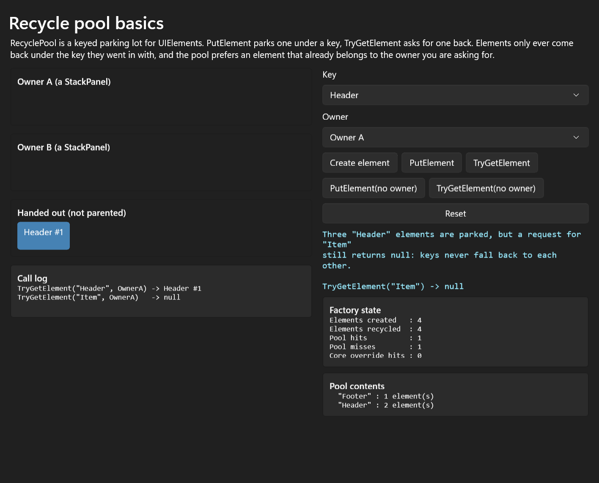
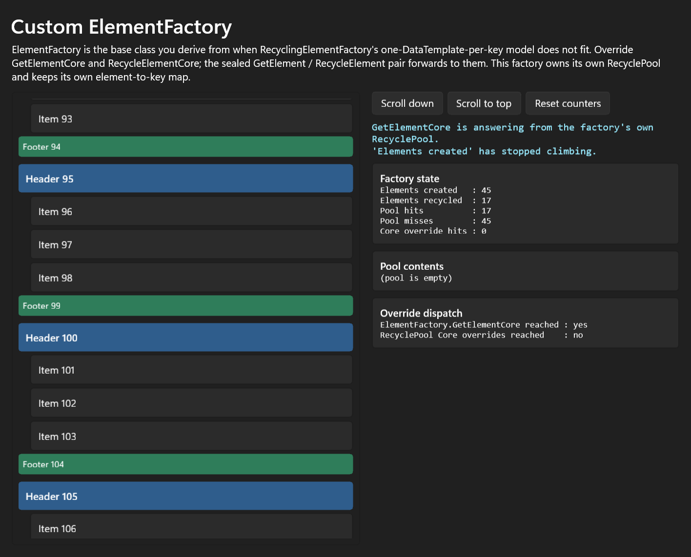
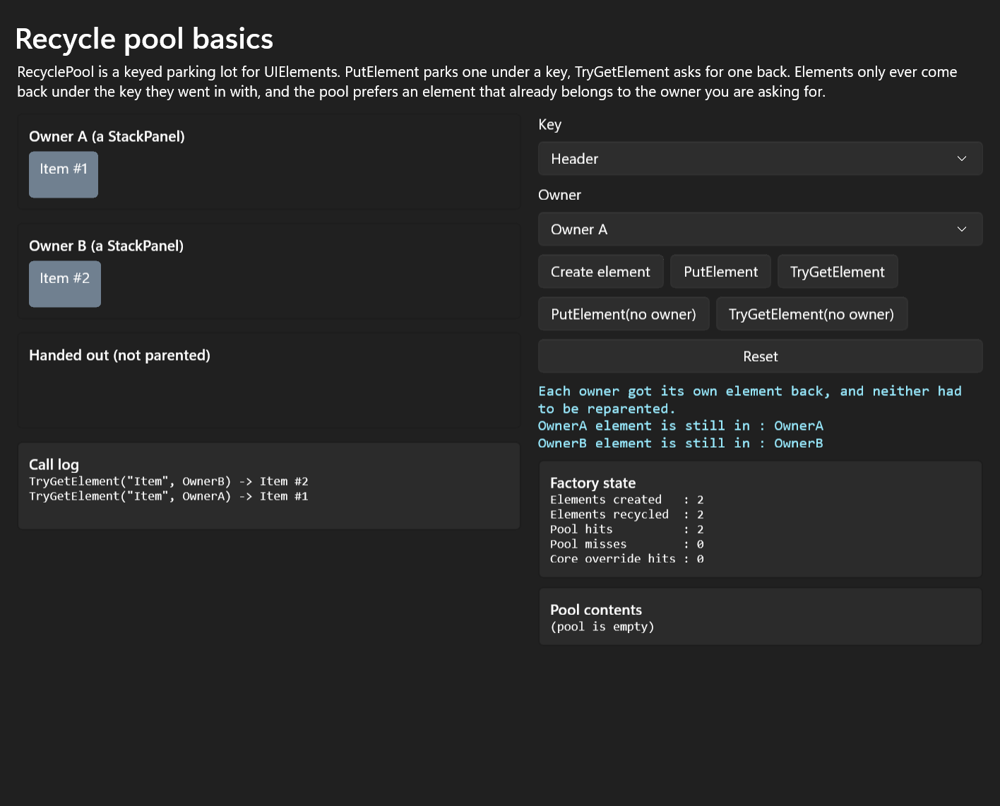
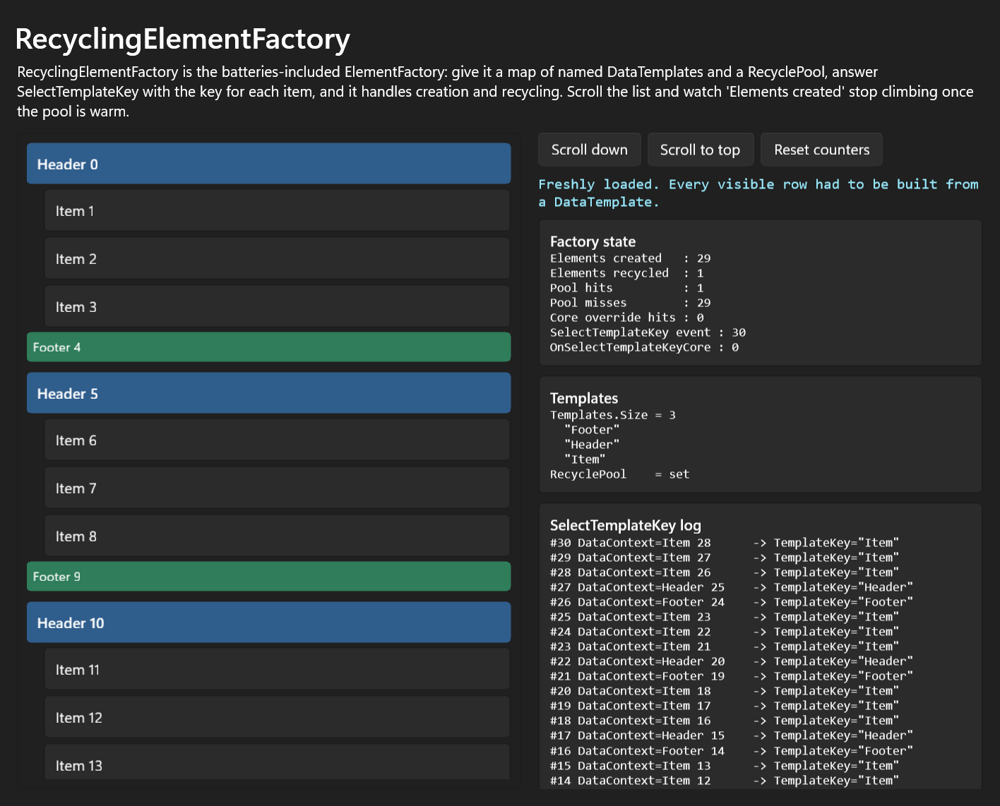
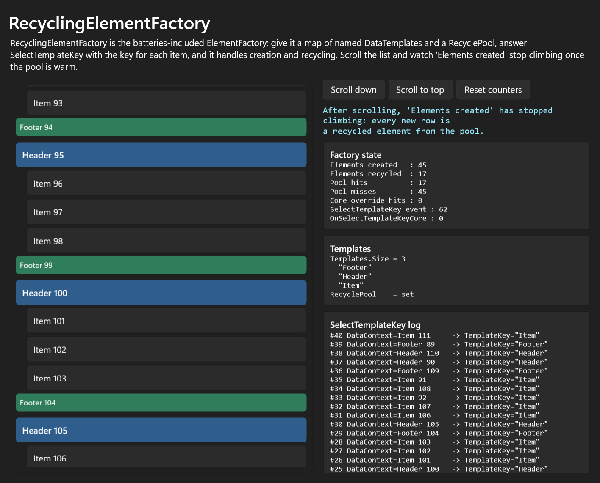
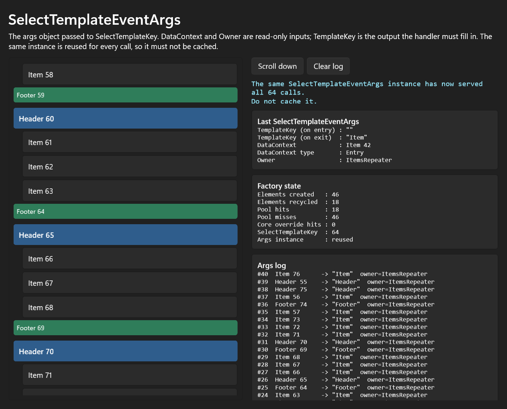
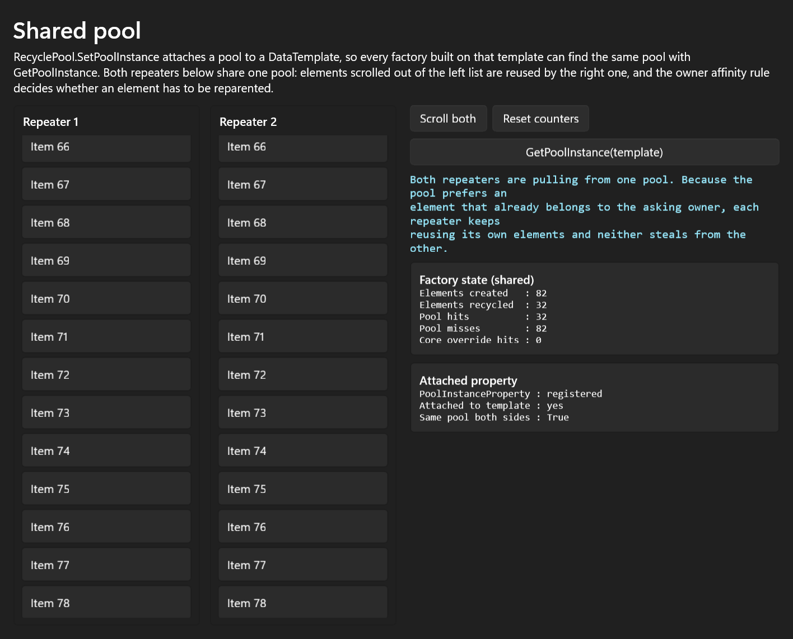
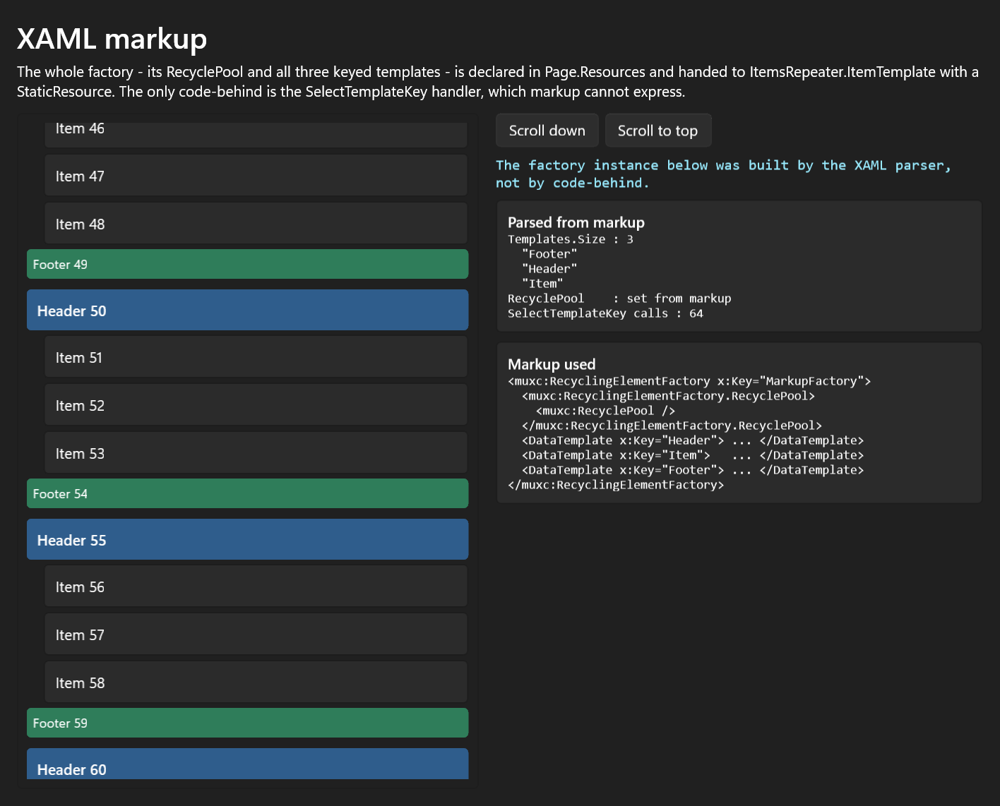

Element creation and recycling: ElementFactory, RecyclePool, RecyclingElementFactory
===

# Background

A non-virtualizing items control can afford to build one element per item and keep it forever.
A virtualizing one cannot. `ItemsRepeater` realizes only the elements inside its viewport plus
a cache buffer, so as the user scrolls it is continuously asked to produce an element for an
item that has just come into view and to give back the element for an item that has just left
it. On a long list this happens hundreds of times a second.

XAML's answer is to take element creation out of the items control entirely and put it behind
an interface. `Microsoft.UI.Xaml.IElementFactory` is that interface, and it has exactly two
methods:

```csharp
UIElement GetElement(ElementFactoryGetArgs args);
void RecycleElement(ElementFactoryRecycleArgs args);
```

`ItemsRepeater.ItemTemplate` is typed as `Object` precisely so that it can accept an
`IElementFactory` as well as a `DataTemplate`. Everything in this spec exists to make that
interface pleasant to implement:

| Type | Role |
| --- | --- |
| `ElementFactory` | The `DependencyObject` base class you derive from. Implements `IElementFactory` and forwards to two `overridable` members, so a subclass only writes the interesting half. |
| `RecyclePool` | The storage. A keyed parking lot for `UIElement`s: park one under a string key, ask for one back under the same key. |
| `RecyclingElementFactory` | The batteries-included `ElementFactory`. Give it a map of named `DataTemplate`s and a `RecyclePool` and it implements the whole contract. |
| `SelectTemplateEventArgs` | The args for `RecyclingElementFactory.SelectTemplateKey`, the event that asks the app which key an item should use. |

None of this is new code. All four types have shipped as `[MUX_PREVIEW]` since the
`ItemsRepeater` preview, and `RecyclingElementFactory` is the usual way to drive an
`ItemsRepeater` that has more than one kind of row - though not the only one: a
`DataTemplateSelector` or a hand-written `IElementFactory` also work. This spec covers
promoting these types to a stable public contract.



## What is in scope

39 members, across seven types. Four are the `[MUX_PREVIEW]` types under review; three are
already-public types that the contract is expressed in, included here as supporting context
rather than as new API.

| Type | Members | Status | Declared in |
| --- | --- | --- | --- |
| `ElementFactory` | 5 | `[MUX_PREVIEW]` — under review | `controls/dev/Repeater/ItemsRepeater.idl` |
| `RecyclePool` | 10 | `[MUX_PREVIEW]` — under review | `controls/dev/Repeater/ItemsRepeater.idl` |
| `SelectTemplateEventArgs` | 4 | `[MUX_PREVIEW]` — under review | `controls/dev/Repeater/ItemsRepeater.idl` |
| `RecyclingElementFactory` | 8 | `[MUX_PREVIEW]` — under review | `controls/dev/Repeater/ItemsRepeater.idl` |
| `Microsoft.UI.Xaml.IElementFactory` | 2 | already public | `dxaml/xcp/dxaml/idl/winrt/core/microsoft.ui.xaml.coretypes.idl` |
| `Microsoft.UI.Xaml.ElementFactoryGetArgs` | 5 | already public | `microsoft.ui.xaml.coretypes.idl` |
| `Microsoft.UI.Xaml.ElementFactoryRecycleArgs` | 5 | already public | `microsoft.ui.xaml.coretypes.idl` |

Property getters and setters, event add and remove, and constructors are each counted as one
member, matching the ABI.

## A note on the MuxFinal build

`RecyclePool` is omitted from the public WinMD in non-prerelease (MuxFinal) builds. The C++
class itself is still compiled; what `MUX_PRERELEASE` selects in
`controls/dev/Repeater/RecyclePool.h:8-29` is the generated dependency-property support, and in
the non-prerelease branch the type additionally overrides `GetRuntimeClassName` to report
`IInspectable` rather than `Microsoft.UI.Xaml.Controls.RecyclePool`:

```cpp
// We're using this runtime instance in a place that it might leak out and .NET Core gets upset when
// it sees types not in the public surface area. Return object since no one needs to know the real type.
hstring GetRuntimeClassName() const
{
    return winrt::hstring_name_of<winrt::IInspectable>();
}
```

Promoting `RecyclePool` means removing that carve-out, which is a decision for the review
board rather than an implementation detail. It is raised again under
[open questions](#open-questions-for-the-api-review-board).

_Spec note: the implementations live in `controls/dev/Repeater/ElementFactory.{h,cpp}`,
`RecyclePool.{h,cpp}`, `RecyclePoolFactory.cpp`, `RecyclingElementFactory.{h,cpp}` and
`SelectTemplateEventArgs.{h,cpp}`. The active tests in
`controls/dev/Repeater/APITests/RecyclePoolTests.cs` cover owner affinity and cross-owner
retrieval; `ValidateElementsHaveCorrectKeys` holds further key and error assertions but is
currently disabled - it has no `[TestMethod]` attribute._

## Parity with system XAML (`Windows.UI.Xaml`)

The same four types exist in the system XAML copy of this file, `os.2020`
`onecoreuap/windows/dxaml/controls/dev/Repeater/ItemsRepeater.idl` on `official/main`. That
copy was compared member by member against the WinUI IDL under review: **no member is added,
removed, or renamed on either side.** All 39 members line up exactly, including the
`[method_name(...)]` overload projections on `RecyclePool` and the `overridable` `Core` members
on `ElementFactory`, `RecyclePool`, and `RecyclingElementFactory`.

The differences are entirely in how the two builds express the same shape:

| Difference | System XAML (`os.2020`) | WinUI (this repo) |
| --- | --- | --- |
| Namespace of framework types | `Windows.UI.Xaml.*` | `Microsoft.UI.Xaml.*` |
| Versioning attribute | `[WUXC_VERSION_PREVIEW]` | `[MUX_PREVIEW]` |
| `ElementFactory` base | `IElementFactoryShim` (`[WUXC_VERSION_INTERNAL]`), or `Windows.UI.Xaml.IElementFactory` under `BUILD_WINDOWS` | `Microsoft.UI.Xaml.IElementFactory`, unconditionally |
| `ElementFactoryGetArgs` / `ElementFactoryRecycleArgs` | declared locally in this IDL as `[WUXC_VERSION_MUXONLY]`, under `#ifndef BUILD_WINDOWS` | framework types on `WinUIContract 1`, declared in `microsoft.ui.xaml.coretypes.idl` |
| `RecyclePool` attributes | none beyond `[webhosthidden]` | additionally `[MUX_OVERRIDE_ENSURE_PROPERTIES]` |

Two points follow from this that matter to the review:

* **The types are preview on both sides.** `WUXC_VERSION_PREVIEW` is the system XAML equivalent
  of `[MUX_PREVIEW]`, so promoting them here does not contradict a shape that is already stable
  elsewhere, and there is no existing system XAML contract version to match.
* **`ElementFactoryGetArgs` and `ElementFactoryRecycleArgs` are already public in WinUI and are
  not in system XAML.** In WinUI they are ordinary `WinUIContract 1` types, which is why they
  appear in this spec as supporting context rather than as new API. The `IElementFactoryShim`
  indirection that system XAML needs has no counterpart here.

The remaining differences between the two files (`AnimationContext` and `ScrollAnchorProvider`
in system XAML; `ItemCollectionTransition*`, `LinedFlowLayout*`, and `ItemsRepeaterScrollHost`
in WinUI) belong to layout and animation, not to element creation, and are out of scope for
this spec.

# Conceptual pages (How To)

## The get / recycle contract

`ItemsRepeater` normally does not create elements itself. When an item enters the realization
window it calls `GetElement` with an `ElementFactoryGetArgs` carrying the item (`Data`) and the
repeater (`Parent`). When an item leaves it calls `RecycleElement` with an
`ElementFactoryRecycleArgs` carrying the element and, usually, the same parent.

```csharp
// What ItemsRepeater does, roughly:
var element = factory.GetElement(new ElementFactoryGetArgs { Data = item, Parent = repeater });
// ... later ...
factory.RecycleElement(new ElementFactoryRecycleArgs { Element = element, Parent = repeater });
```

Two paths bypass this. A data item that is already a `UIElement`, in a repeater with no item
template, is used directly and no factory is involved. And when the repeater clears everything
at once it recycles with `Parent` set to null rather than to itself, so a factory that assumes
`args.Parent` is always the repeater is wrong.

Two rules follow from this and are worth stating plainly, because they are the source of most
bugs in hand-written factories:

* **An element handed out by `GetElement` may have been used before.** It can still be carrying
  state - a checked `CheckBox`, a scrolled inner list, an animation in flight. A factory that
  recycles must reset whatever the app has changed.
* **`RecycleElement` is not a destructor.** The element is expected to survive and be handed out
  again. Anything that must not leak - event subscriptions, timers - has to be torn down here.

## Deriving from ElementFactory

`ElementFactory` implements `IElementFactory` for you. `GetElement` and `RecycleElement` are
sealed and do nothing but forward:

```cpp
// controls/dev/Repeater/ElementFactory.cpp
winrt::UIElement ElementFactory::GetElement(winrt::ElementFactoryGetArgs const& args)
{
    return overridable().GetElementCore(args);
}
```

So a subclass overrides `GetElementCore` and `RecycleElementCore` and never touches the
interface methods. The base implementations of both throw `hresult_not_implemented`, so a
subclass must override both.

```csharp
public partial class CountingElementFactory : ElementFactory
{
    protected override UIElement GetElementCore(ElementFactoryGetArgs args)
    {
        var element = m_pool.TryGetElement(KeyFor(args.Data), args.Parent) as FrameworkElement
                      ?? (FrameworkElement)m_templates[KeyFor(args.Data)].LoadContent();

        element.DataContext = args.Data;
        return element;
    }

    protected override void RecycleElementCore(ElementFactoryRecycleArgs args)
    {
        m_pool.PutElement(args.Element, m_keys[args.Element], args.Parent);
    }
}
```



In C# the subclass must be declared `partial`, as with every managed type that derives from a
WinRT class.

## The recycle pool

`RecyclePool` is deliberately small. It is a `string -> list of elements` map with two
operations, and it makes exactly two promises.

**Keys partition the pool.** An element parked under `"Header"` is invisible to a request for
`"Item"`, however many headers are waiting. There is no fallback between keys, which is what
makes it safe for one pool to serve several templates.

```csharp
pool.PutElement(header1, "Header", ownerA);
pool.PutElement(header2, "Header", ownerA);
pool.PutElement(header3, "Header", ownerA);
pool.PutElement(footer,  "Footer", ownerA);

pool.TryGetElement("Item",   ownerA);   // -> null
pool.TryGetElement("Header", ownerA);   // -> one of the three headers
```


**Owners are preferred, not enforced.** The owner is caller-supplied affinity metadata: the
`Panel` the caller says the element belongs to. The pool records it as given and never checks
it against the element's actual parent. `TryGetElementCore` looks for an element whose recorded
owner is the requested owner, or whose recorded owner is null, before falling back to any
element under that key:

```cpp
// controls/dev/Repeater/RecyclePool.cpp
auto iter = std::find_if(
    elements.begin(),
    elements.end(),
    [&winrtOwner](const ElementInfo& elemInfo) { return elemInfo.Owner() == winrtOwner || !elemInfo.Owner(); });
```

The point of the preference is cost. An element that already belongs to the asking owner does
not have to leave and re-enter the visual tree. If the fallback does return an element whose
recorded owner is non-null and different from the requested one, the pool removes it from that
panel's `Children` before returning it. It does nothing in the other cases, so an element parked
with a null or inaccurate owner comes back with whatever parent it already had.



The pool does **not** enforce ownership: passing owner `A` does not guarantee an element that
belongs to `A`, only that one will be preferred. And it does not expose its contents - there is
no `Count`, no enumerator, no `Clear`. A UI that wants to show what is in the pool has to
shadow it, which is what the sample app does.

## RecyclingElementFactory

`RecyclingElementFactory` is what an app uses when it has one `DataTemplate` per kind of row.
It needs two things:

```csharp
var factory = new RecyclingElementFactory
{
    RecyclePool = new RecyclePool(),
};

factory.Templates["Header"] = headerTemplate;
factory.Templates["Item"]   = itemTemplate;
factory.Templates["Footer"] = footerTemplate;

factory.SelectTemplateKey += (sender, args) =>
{
    args.TemplateKey = ((Entry)args.DataContext).Kind;
};

repeater.ItemTemplate = factory;
```

`GetElementCore` then does the obvious thing: pick a key, ask the pool, and only load the
`DataTemplate` if the pool came back empty. Scroll far enough and element creation stops
entirely.





Two behaviours are not obvious from the signatures:

* **With exactly one template, `SelectTemplateKey` is never raised.** `GetElementCore`
  short-circuits to `Templates.First().Current().Key()` when `Templates.Size() == 1`. This is a
  meaningful saving, but it means a handler that assumes it always runs is wrong.
* **`RecyclePool` is not optional.** `GetElementCore` calls `RecyclePool.TryGetElement(...)`
  without a null check. A factory with templates but no pool faults on the first element.

## SelectTemplateEventArgs

The args object is an in/out pair: `DataContext` and `Owner` are the question, `TemplateKey` is
the answer the handler has to write.

```csharp
factory.SelectTemplateKey += (sender, args) =>
{
    // args.DataContext -> the item
    // args.Owner       -> the ItemsRepeater
    args.TemplateKey = ((Entry)args.DataContext).Kind;   // required
};
```

A handler that leaves `TemplateKey` empty gets an `E_FAIL` with the message _"Please provide a
valid template identifier in the handler for the SelectTemplateKey event."_ Because the key is
reset to `{}` before every raise, a handler that only assigns conditionally fails on the calls
where its condition is false.

**The args instance is reused for the lifetime of the factory.** `RecyclingElementFactory`
creates one lazily and then resets its three fields on every call, rather than allocating per
item. The screenshot below is from a page that captures the first instance it is handed and
compares it against every subsequent one:



The practical consequence is that the args must not be captured - stored in a field, closed
over by an async continuation, put in a list - because the values will have moved on by the
time it is read.

## Sharing a pool between repeaters

`RecyclePool.PoolInstance` is an attached property on `DataTemplate`, so a pool can be attached
to the template rather than to a factory:

```csharp
RecyclePool.SetPoolInstance(itemTemplate, sharedPool);
// ... elsewhere ...
var pool = RecyclePool.GetPoolInstance(itemTemplate);
```

Two repeaters that use the same template then draw from the same pool. Because of the owner
preference described above, each repeater still tends to get its own elements back, so sharing
costs little and means a row scrolled out of one list can be reused by the other.



## Using these types in XAML, C#, and C++/WinRT

`RecyclingElementFactory` is `[contentproperty("Templates")]`, so the whole factory - pool and
all its keyed templates - can be declared in markup, and only the key-selection callback has to
be code:

```xaml
<Page.Resources>
    <muxc:RecyclingElementFactory x:Key="MarkupFactory">
        <muxc:RecyclingElementFactory.RecyclePool>
            <muxc:RecyclePool />
        </muxc:RecyclingElementFactory.RecyclePool>

        <DataTemplate x:Key="Header"> ... </DataTemplate>
        <DataTemplate x:Key="Item">   ... </DataTemplate>
        <DataTemplate x:Key="Footer"> ... </DataTemplate>
    </muxc:RecyclingElementFactory>
</Page.Resources>

<muxc:ItemsRepeater ItemTemplate="{StaticResource MarkupFactory}" />
```



In C++/WinRT the shapes are the same. Note that although the IDL renames the second
`PutElement` and `TryGetElement` overloads to `PutElementWithOwner` and `TryGetElementWithOwner`
to satisfy MIDL's overload rules, the projection restores them as ordinary overloads - verified
in the generated `winrt/impl/Microsoft.UI.Xaml.Controls.0.h`:

```cpp
struct consume_Microsoft_UI_Xaml_Controls_IRecyclePool
{
    auto PutElement(UIElement const& element, param::hstring const& key) const;
    auto PutElement(UIElement const& element, param::hstring const& key, UIElement const& owner) const;
    auto TryGetElement(param::hstring const& key) const;
    auto TryGetElement(param::hstring const& key, UIElement const& owner) const;
};
```

## Code and result

Every row below is a snippet from the sample app in
[`Samples/RecyclePoolSampleApp`](../../Samples/RecyclePoolSampleApp), paired with the UI it
produces. The "Factory state" panel on the right of each screenshot prints live counters that
the sample records at the call site: elements created, elements recycled in, pool hits, pool
misses, and how many times a managed `Core` override was actually reached.

In the code columns `pool` is a `RecyclePool`, `factory` is a `RecyclingElementFactory`, and
the C++/WinRT column assumes `using namespace winrt::Microsoft::UI::Xaml::Controls;`.

| Scenario | XAML | C# | C++/WinRT | Result |
| --- | --- | --- | --- | --- |
| Keys partition the pool | <pre>&lt;muxc:RecyclePool x:Key="Pool" /&gt;</pre>`RecyclePool` has a default constructor, so it can be a plain resource. | <pre>pool.PutElement(h1, "Header", a);<br>pool.PutElement(h2, "Header", a);<br>pool.PutElement(f,&nbsp;&nbsp;"Footer", a);<br>pool.TryGetElement("Item", a);<br>// -&gt; null</pre> | <pre>pool.PutElement(h1, L"Header", a);<br>pool.PutElement(h2, L"Header", a);<br>pool.PutElement(f,&nbsp;&nbsp;L"Footer", a);<br>pool.TryGetElement(L"Item", a);<br>// -&gt; nullptr</pre> |  |
| Owner affinity | No markup — owners are passed per call. | <pre>pool.PutElement(a1, "Item", ownerA);<br>pool.PutElement(b1, "Item", ownerB);<br>pool.TryGetElement("Item", ownerA);<br>// -&gt; a1, still in ownerA</pre> | <pre>pool.PutElement(a1, L"Item", ownerA);<br>pool.PutElement(b1, L"Item", ownerB);<br>pool.TryGetElement(L"Item", ownerA);<br>// -&gt; a1, still in ownerA</pre> |  |
| Cold factory: every row is built | <pre>&lt;muxc:ItemsRepeater<br>&nbsp;&nbsp;ItemTemplate="{StaticResource F}" /&gt;</pre> | <pre>factory.RecyclePool = new RecyclePool();<br>factory.Templates["Item"] = t;<br>repeater.ItemTemplate = factory;<br>// creations == realized rows</pre> | <pre>factory.RecyclePool(RecyclePool{});<br>factory.Templates().Insert(L"Item", t);<br>repeater.ItemTemplate(factory);<br>// creations == realized rows</pre> |  |
| Warm factory: rows come from the pool | Same markup — warmth is a runtime state, not a declaration. | <pre>// after scrolling ~100 rows<br>// created&nbsp;&nbsp;: 45<br>// recycled : 17<br>// pool hits: 17</pre> | <pre>// after scrolling ~100 rows<br>// created&nbsp;&nbsp;: 45<br>// recycled : 17<br>// pool hits: 17</pre> |  |
| Choosing a template per item | No markup — `SelectTemplateKey` is an event. | <pre>factory.SelectTemplateKey +=<br>&nbsp;&nbsp;(s, e) =&gt; e.TemplateKey =<br>&nbsp;&nbsp;&nbsp;&nbsp;((Entry)e.DataContext).Kind;</pre> | <pre>factory.SelectTemplateKey(<br>&nbsp;&nbsp;[](auto&amp;&amp;, auto&amp;&amp; e)<br>&nbsp;&nbsp;{<br>&nbsp;&nbsp;&nbsp;&nbsp;e.TemplateKey(KindOf(e.DataContext()));<br>&nbsp;&nbsp;});</pre> |  |
| Hand-written ElementFactory | No markup — the subclass is instantiated in code. | <pre>protected override UIElement<br>GetElementCore(<br>&nbsp;&nbsp;ElementFactoryGetArgs args)<br>{<br>&nbsp;&nbsp;return pool.TryGetElement(<br>&nbsp;&nbsp;&nbsp;&nbsp;Key(args.Data), args.Parent)<br>&nbsp;&nbsp;&nbsp;&nbsp;?? Build(args.Data);<br>}</pre> | <pre>UIElement GetElementCore(<br>&nbsp;&nbsp;ElementFactoryGetArgs const&amp; args)<br>{<br>&nbsp;&nbsp;auto e = m_pool.TryGetElement(<br>&nbsp;&nbsp;&nbsp;&nbsp;Key(args.Data()), args.Parent());<br>&nbsp;&nbsp;return e ? e : Build(args.Data());<br>}</pre> |  |
| Sharing a pool via the attached property | <pre>&lt;DataTemplate x:Key="T"&gt;<br>&nbsp;&nbsp;...<br>&lt;/DataTemplate&gt;</pre>The pool is attached in code; there is no markup syntax for it. | <pre>RecyclePool.SetPoolInstance(<br>&nbsp;&nbsp;template, sharedPool);<br>var p = RecyclePool.GetPoolInstance(<br>&nbsp;&nbsp;template);</pre> | <pre>RecyclePool::SetPoolInstance(<br>&nbsp;&nbsp;dataTemplate, sharedPool);<br>auto p = RecyclePool::GetPoolInstance(<br>&nbsp;&nbsp;dataTemplate);</pre> |  |
| Whole factory in markup | <pre>&lt;muxc:RecyclingElementFactory<br>&nbsp;&nbsp;x:Key="F"&gt;<br>&nbsp;&nbsp;&lt;muxc:RecyclingElementFactory.RecyclePool&gt;<br>&nbsp;&nbsp;&nbsp;&nbsp;&lt;muxc:RecyclePool /&gt;<br>&nbsp;&nbsp;&lt;/muxc:RecyclingElementFactory.RecyclePool&gt;<br>&nbsp;&nbsp;&lt;DataTemplate x:Key="Item"&gt;...&lt;/DataTemplate&gt;<br>&lt;/muxc:RecyclingElementFactory&gt;</pre> | <pre>var f = (RecyclingElementFactory)<br>&nbsp;&nbsp;Resources["F"];<br>f.SelectTemplateKey += OnSelectKey;</pre> | <pre>auto f = Resources()<br>&nbsp;&nbsp;.Lookup(box_value(L"F"))<br>&nbsp;&nbsp;.as&lt;RecyclingElementFactory&gt;();<br>f.SelectTemplateKey({ this, &amp;OnSelectKey });</pre> |  |

# API Pages

## ElementFactory class

`unsealed runtimeclass ElementFactory : DependencyObject, Microsoft.UI.Xaml.IElementFactory`

The base class for an object that produces and recycles the elements of a virtualizing items
control. It implements `IElementFactory` and routes both interface methods to `overridable`
members, so a subclass implements the policy and never the plumbing.

Derive from `ElementFactory` when `RecyclingElementFactory`'s "one `DataTemplate` per key"
model does not fit - for example when elements are constructed in code, when an element's
identity depends on more than a key, or when recycling has to be suppressed for some items.

### Example Usage

```csharp
public partial class MyFactory : ElementFactory
{
    protected override UIElement GetElementCore(ElementFactoryGetArgs args)
        => new TextBlock { Text = args.Data.ToString() };

    protected override void RecycleElementCore(ElementFactoryRecycleArgs args)
    {
        // Nothing pooled: this factory builds a fresh element every time.
    }
}
```

## ElementFactory.ElementFactory constructor

`ElementFactory()`

Creates an `ElementFactory`. The base type is only useful when derived from: both overridables
throw `hresult_not_implemented` until a subclass replaces them.

## ElementFactory.GetElement method

`UIElement GetElement(ElementFactoryGetArgs args)`

The `IElementFactory` implementation. Not overridable; it calls `GetElementCore` on the most
derived type and returns the result.

## ElementFactory.RecycleElement method

`void RecycleElement(ElementFactoryRecycleArgs args)`

The `IElementFactory` implementation. Not overridable; it calls `RecycleElementCore` on the
most derived type.

## ElementFactory.GetElementCore method

`overridable UIElement GetElementCore(ElementFactoryGetArgs args)`

Produces the element for `args.Data`, to be parented by `args.Parent`. Must return a non-null
`UIElement`. The returned element may be one that was previously passed to
`RecycleElementCore`, in which case the override is responsible for resetting any state the app
put on it.

The base implementation throws `hresult_not_implemented`.

## ElementFactory.RecycleElementCore method

`overridable void RecycleElementCore(ElementFactoryRecycleArgs args)`

Takes `args.Element` back. The element is expected to survive and to be handed out again by a
later `GetElementCore`, so this is the place to unsubscribe events and stop animations, not the
place to dispose.

The base implementation throws `hresult_not_implemented`.

## RecyclePool class

`unsealed runtimeclass RecyclePool`

A keyed store of `UIElement`s waiting to be reused. `PutElement` parks an element under a
string key; `TryGetElement` asks for one back under the same key, and returns `null` when
nothing suitable is waiting.

`RecyclePool` is not a cache with a policy: it has no maximum size, no eviction and no
expiry. It holds every element put into it until one is taken back out, which means a factory
that never calls `TryGetElement` will grow the pool without bound.

The type is a plain `runtimeclass`, not a `DependencyObject`, but it does own one attached
dependency property, `PoolInstance`.

### Example Usage

```csharp
var pool = new RecyclePool();

pool.PutElement(element, "Header", repeater);
var reused = pool.TryGetElement("Header", repeater);  // -> element
var none   = pool.TryGetElement("Header", repeater);  // -> null, the pool is empty again
```

## RecyclePool.RecyclePool constructor

`RecyclePool()`

Creates an empty pool. Also forces registration of the `PoolInstance` attached property, so the
static accessors work whether or not an instance has been created yet.

## RecyclePool.PutElement method

`void PutElement(UIElement element, String key)`
`void PutElement(UIElement element, String key, UIElement owner)`

Parks `element` under `key`. The three-argument overload also records `owner`, which
`TryGetElement` later uses to prefer this element for that owner.

`owner` must be a `Panel` or `null`. Anything else throws `E_FAIL` with _"owner must to be a
Panel or null."_ The two-argument overload is exactly the three-argument one with a null owner.

`owner` is recorded, not verified: the pool does not check that `element` is actually in that
panel's `Children`, and parking does not unparent the element. If it was in the owner's
`Children` it stays there, which is what makes owner affinity cheap; it is the caller's job to
make it invisible or otherwise inert if that matters.

The ABI names the second overload `PutElementWithOwner`; C# and C++/WinRT both see plain
overloads.

## RecyclePool.TryGetElement method

`UIElement TryGetElement(String key)`
`UIElement TryGetElement(String key, UIElement owner)`

Returns an element previously parked under `key`, or `null` if none is waiting. Keys never fall
back to one another.

When several elements are waiting under the key, the pool prefers one whose recorded owner is
`owner`, or whose recorded owner is null, and otherwise takes the most recently parked one. If
the element it settles on has a non-null recorded owner different from `owner`, that panel's
`Children` entry is removed first. In every other case the element's parent is left alone.

`owner` is validated to be a `Panel` or `null` - but only on a hit. A request for a key with
nothing waiting returns `null` without ever looking at `owner`, so an invalid owner goes
unreported on a miss. `PutElement` validates unconditionally.

The ABI names the second overload `TryGetElementWithOwner`.

## RecyclePool.PoolInstanceProperty property

`static DependencyProperty PoolInstanceProperty { get; }`

Identifies the `PoolInstance` attached property. The property is attached to `DataTemplate`,
which lets a pool be associated with a template rather than with a particular factory, so
several factories built on the same template can find the same pool.

## RecyclePool.GetPoolInstance method

`static RecyclePool GetPoolInstance(DataTemplate dataTemplate)`

Reads the `PoolInstance` attached property. Returns `null` when no pool has been attached.

## RecyclePool.SetPoolInstance method

`static void SetPoolInstance(DataTemplate dataTemplate, RecyclePool value)`

Writes the `PoolInstance` attached property.

## RecyclePool.PutElementCore method

`overridable void PutElementCore(UIElement element, String key, UIElement owner)`

The single implementation behind both `PutElement` overloads.

> **Known issue.** `PutElement` calls this method directly rather than through the overridable,
> and the C++ implementation does not declare it virtual, so an override in a derived class is
> never reached. See [open questions](#open-questions-for-the-api-review-board).

## RecyclePool.TryGetElementCore method

`overridable UIElement TryGetElementCore(String key, UIElement owner)`

The single implementation behind both `TryGetElement` overloads, including the key/owner
preference and the reparenting described above.

> **Known issue.** As with `PutElementCore`, an override in a derived class is never reached.

## SelectTemplateEventArgs class

`runtimeclass SelectTemplateEventArgs`

The argument object for `RecyclingElementFactory.SelectTemplateKey`. It carries the item being
realized and the control realizing it, and expects the handler to write back the key of the
`DataTemplate` to use.

One instance is created per `RecyclingElementFactory` and reused for every raise. Handlers must
read what they need and return; they must not store the args.

### Example Usage

```csharp
factory.SelectTemplateKey += (sender, args) =>
{
    args.TemplateKey = args.DataContext switch
    {
        Header => "Header",
        Footer => "Footer",
        _      => "Item",
    };
};
```

## SelectTemplateEventArgs.TemplateKey property

`String TemplateKey { get; set; }`

The key of the `DataTemplate` to use for this item. This is an output: the factory clears it to
the empty string before raising the event, and throws `E_FAIL` afterwards if it is still empty.

A handler must therefore assign it unconditionally - a handler with an `if` and no `else` fails
on the items the `if` does not cover.

## SelectTemplateEventArgs.DataContext property

`Object DataContext { get; }`

The item being realized: the same object the repeater passed as `ElementFactoryGetArgs.Data`.
Read-only.

## SelectTemplateEventArgs.Owner property

`UIElement Owner { get; }`

The element that will parent the realized element - the `ItemsRepeater` in the normal case, and
the same object the repeater passed as `ElementFactoryGetArgs.Parent`. Read-only, and may be
null when the factory is driven directly rather than by a control.

## RecyclingElementFactory class

`unsealed runtimeclass RecyclingElementFactory : ElementFactory`

`[contentproperty("Templates")]`

An `ElementFactory` that maps a set of named `DataTemplate`s onto a `RecyclePool`. For each
item it asks which key applies, tries the pool for that key, and only calls
`DataTemplate.LoadContent()` if the pool had nothing. Recycling puts the element back under the
key it was created with.

This is the type to reach for first. A hand-written `ElementFactory` is only needed when the
one-template-per-key model does not fit.

### Example Usage

```xaml
<muxc:RecyclingElementFactory x:Key="Factory">
    <muxc:RecyclingElementFactory.RecyclePool>
        <muxc:RecyclePool />
    </muxc:RecyclingElementFactory.RecyclePool>

    <DataTemplate x:Key="Header"> ... </DataTemplate>
    <DataTemplate x:Key="Item">   ... </DataTemplate>
</muxc:RecyclingElementFactory>
```

## RecyclingElementFactory.RecyclingElementFactory constructor

`RecyclingElementFactory()`

Creates a factory with an empty, non-null `Templates` map and no `RecyclePool`. A pool must be
assigned before the factory is used.

## RecyclingElementFactory.RecyclePool property

`RecyclePool RecyclePool { get; set; }`

The pool this factory stores recycled elements in. Not optional: `GetElementCore` dereferences
it without a null check.

Assigning the same pool to two factories is supported and is the point of
`RecyclePool.PoolInstance`. Because keys partition the pool, two factories sharing a pool must
either use disjoint keys or agree on what each key means.

## RecyclingElementFactory.Templates property

`IMap<String, DataTemplate> Templates { get; set; }`

The keyed templates. Initialized to an empty map by the constructor, and the content property of
the class, so `<DataTemplate x:Key="..."/>` children in markup land here.

A key present in `Templates` but never selected costs nothing. A key selected but not present
throws - but only when the pool lookup missed, because the `HasKey` check sits inside the
"nothing was recycled" branch. A pool hit returns its element without validating the key
against `Templates` at all.

## RecyclingElementFactory.SelectTemplateKey event

`event TypedEventHandler<RecyclingElementFactory, SelectTemplateEventArgs> SelectTemplateKey`

Raised once per element that has to be produced, to ask which template key applies.

Not raised when `Templates` holds exactly one entry: that key is used directly. Handlers must
assign `args.TemplateKey`.

## RecyclingElementFactory.OnSelectTemplateKeyCore method

`overridable String OnSelectTemplateKeyCore(Object dataContext, UIElement owner)`

The overridable behind `SelectTemplateKey`. The base implementation fills in the shared
`SelectTemplateEventArgs`, raises the event, validates that the handler wrote a non-empty key,
and returns it.

Overriding this instead of handling the event would be the natural choice for a subclass that
always knows its own keys, since it avoids the event dispatch and the shared args entirely.

> **Known issue.** That does not currently work. `GetElementCore` calls this method directly
> rather than through the overridable, so an override in a derived class is never reached and
> the event is raised instead. Until that is fixed, template selection must go through
> `SelectTemplateKey`. See [open questions](#open-questions-for-the-api-review-board).

## RecyclingElementFactory.GetElementCore method

`overridable UIElement GetElementCore(ElementFactoryGetArgs args)`

Inherited from `ElementFactory` and overridden here. Selects a key, tries `RecyclePool`, and
loads the `DataTemplate` on a miss.

Throws `E_FAIL` when `Templates` is null or empty, when the selected key is empty, or when the
selected key is not present in a multi-template map **and** the recycle pool had nothing under
that key. The `HasKey` check runs only on a pool miss.

## RecyclingElementFactory.RecycleElementCore method

`overridable void RecycleElementCore(ElementFactoryRecycleArgs args)`

Inherited from `ElementFactory` and overridden here. Puts `args.Element` back into
`RecyclePool` under the key it was created with, with `args.Parent` as the owner.

## Microsoft.UI.Xaml.IElementFactory interface

`interface IElementFactory`

Already public. The contract `ItemsRepeater` consumes. `ItemsRepeater.ItemTemplate` is typed
`Object` and accepts either a `DataTemplate` or an `IElementFactory`.

* `UIElement GetElement(ElementFactoryGetArgs args)`
* `void RecycleElement(ElementFactoryRecycleArgs args)`

An app can implement this interface directly instead of deriving from `ElementFactory`. It
gains nothing except independence from `DependencyObject`, and loses the `Core` routing.

## Microsoft.UI.Xaml.ElementFactoryGetArgs class

`unsealed runtimeclass ElementFactoryGetArgs`

Already public. The question asked of a factory.

* `ElementFactoryGetArgs()`
* `Object Data { get; set; }` - the item to realize.
* `UIElement Parent { get; set; }` - the element that will parent the result, normally the
  `ItemsRepeater`.

Unlike `SelectTemplateEventArgs`, both properties are settable, so an app driving a factory by
hand can construct the args itself. `ItemsRepeater` reuses a single instance across calls.

## Microsoft.UI.Xaml.ElementFactoryRecycleArgs class

`unsealed runtimeclass ElementFactoryRecycleArgs`

Already public. The element being handed back.

* `ElementFactoryRecycleArgs()`
* `UIElement Element { get; set; }` - the element to take back.
* `UIElement Parent { get; set; }` - the element it is currently parented to.

# API Details

```csharp
namespace Microsoft.UI.Xaml.Controls
{
    [MUX_PREVIEW]
    [webhosthidden]
    unsealed runtimeclass ElementFactory : Microsoft.UI.Xaml.DependencyObject, Microsoft.UI.Xaml.IElementFactory
    {
        ElementFactory();

        overridable Microsoft.UI.Xaml.UIElement GetElementCore(Microsoft.UI.Xaml.ElementFactoryGetArgs args);
        overridable void RecycleElementCore(Microsoft.UI.Xaml.ElementFactoryRecycleArgs args);
    }

    [MUX_PREVIEW]
    [webhosthidden]
    [MUX_OVERRIDE_ENSURE_PROPERTIES]
    unsealed runtimeclass RecyclePool
    {
        RecyclePool();

        [method_name("PutElement")]
        void PutElement(Microsoft.UI.Xaml.UIElement element, String key);
        [method_name("PutElementWithOwner")]
        void PutElement(Microsoft.UI.Xaml.UIElement element, String key, Microsoft.UI.Xaml.UIElement owner);
        [method_name("TryGetElement")]
        Microsoft.UI.Xaml.UIElement TryGetElement(String key);
        [method_name("TryGetElementWithOwner")]
        Microsoft.UI.Xaml.UIElement TryGetElement(String key, Microsoft.UI.Xaml.UIElement owner);

        static Microsoft.UI.Xaml.DependencyProperty PoolInstanceProperty{ get; };
        static RecyclePool GetPoolInstance(Microsoft.UI.Xaml.DataTemplate dataTemplate);
        static void SetPoolInstance(Microsoft.UI.Xaml.DataTemplate dataTemplate, RecyclePool value);

        overridable void PutElementCore(Microsoft.UI.Xaml.UIElement element, String key, Microsoft.UI.Xaml.UIElement owner);
        overridable Microsoft.UI.Xaml.UIElement TryGetElementCore(String key, Microsoft.UI.Xaml.UIElement owner);
    }

    [MUX_PREVIEW]
    [webhosthidden]
    runtimeclass SelectTemplateEventArgs
    {
        String TemplateKey{ get; set; };
        Object DataContext { get; };
        Microsoft.UI.Xaml.UIElement Owner { get; };
    }

    [MUX_PREVIEW]
    [webhosthidden]
    [contentproperty("Templates")]
    unsealed runtimeclass RecyclingElementFactory : ElementFactory
    {
        RecyclingElementFactory();

        RecyclePool RecyclePool { get; set; };
        Windows.Foundation.Collections.IMap<String, Microsoft.UI.Xaml.DataTemplate> Templates { get; set; };
        event Windows.Foundation.TypedEventHandler<RecyclingElementFactory, SelectTemplateEventArgs> SelectTemplateKey;

        overridable String OnSelectTemplateKeyCore(Object dataContext, Microsoft.UI.Xaml.UIElement owner);
    }
}
```

The three connected types, reproduced from
`dxaml/xcp/dxaml/idl/winrt/core/microsoft.ui.xaml.coretypes.idl` for context. These are already
public and are not part of this review:

```csharp
namespace Microsoft.UI.Xaml
{
    [contract(Microsoft.UI.Xaml.WinUIContract, 1)]
    [webhosthidden]
    interface IElementFactory
    {
        Microsoft.UI.Xaml.UIElement GetElement(Microsoft.UI.Xaml.ElementFactoryGetArgs args);
        void RecycleElement(Microsoft.UI.Xaml.ElementFactoryRecycleArgs args);
    };

    [contract(Microsoft.UI.Xaml.WinUIContract, 1)]
    [webhosthidden]
    unsealed runtimeclass ElementFactoryGetArgs
    {
        [method_name("CreateInstance")] ElementFactoryGetArgs();
        Object Data;
        Microsoft.UI.Xaml.UIElement Parent;
    };

    [contract(Microsoft.UI.Xaml.WinUIContract, 1)]
    [webhosthidden]
    unsealed runtimeclass ElementFactoryRecycleArgs
    {
        [method_name("CreateInstance")] ElementFactoryRecycleArgs();
        Microsoft.UI.Xaml.UIElement Element;
        Microsoft.UI.Xaml.UIElement Parent;
    };
}
```

## Appendix

### Which type should I use?

| I want to... | Use |
| --- | --- |
| Show one kind of row | A plain `DataTemplate` on `ItemsRepeater.ItemTemplate` |
| Show several kinds of row, one template each | `RecyclingElementFactory` + `SelectTemplateKey` |
| Choose the key per item | `RecyclingElementFactory` + the `SelectTemplateKey` event (overriding `OnSelectTemplateKeyCore` does not currently dispatch) |
| Build elements in code rather than from templates | Derive from `ElementFactory` |
| Decide per item whether to recycle at all | Derive from `ElementFactory` |
| Reuse elements between two repeaters | One `RecyclePool`, attached to the template with `SetPoolInstance` |
| Pool elements outside an items control | `RecyclePool` on its own |
| Avoid `DependencyObject` entirely | Implement `IElementFactory` directly |

### Element lifetime

| Stage | Who does it | Notes |
| --- | --- | --- |
| Item enters the realization window | `ItemsRepeater` | Calls `IElementFactory.GetElement` |
| Key selection | `RecyclingElementFactory` | Skipped when `Templates.Size() == 1` |
| Pool lookup | `RecyclePool.TryGetElement` | Returns null on a miss |
| Construction | `DataTemplate.LoadContent()` | Only on a pool miss |
| In use | The app | The element is in the repeater's `Children` |
| Item leaves the window | `ItemsRepeater` | Calls `IElementFactory.RecycleElement` |
| Pooling | `RecyclePool.PutElement` | The element stays alive, keyed, and may stay parented |

There is no step at which the framework tears an element down. An element that enters the pool
stays there until something takes it out or the pool itself is collected.

### Error behaviour

| Condition | Result |
| --- | --- |
| `ElementFactory.GetElementCore` not overridden | `hresult_not_implemented` |
| `ElementFactory.RecycleElementCore` not overridden | `hresult_not_implemented` |
| `RecyclingElementFactory.Templates` null or empty | `E_FAIL` — _"Templates property cannot be null or empty."_ |
| `SelectTemplateKey` handler leaves `TemplateKey` empty | `E_FAIL` — _"Please provide a valid template identifier in the handler for the SelectTemplateKey event."_ |
| Selected key not present, `Templates.Size() > 1`, and the pool missed | `E_FAIL` — _"No templates of key &lt;key&gt; were found in the templates collection."_ |
| `owner` is neither a `Panel` nor null, on `PutElement` | `E_FAIL` — _"owner must to be a Panel or null."_ |
| `owner` is neither a `Panel` nor null, on a `TryGetElement` that hits | `E_FAIL` — same message |
| `owner` is neither a `Panel` nor null, on a `TryGetElement` that misses | Not validated; returns `null` |
| A pooled element is not in its recorded owner's `Children` | `E_FAIL` — _"ItemsRepeater's child not found in its Children collection."_ |
| `RecyclingElementFactory.RecyclePool` is null | Null dereference in `GetElementCore` — no diagnostic |

The last row is a gap: the failure is a crash rather than a message. It is listed under open
questions.

The `E_FAIL` message _"owner must to be a Panel or null."_ contains a grammatical error that is
visible to developers.

### Threading

None of these types are thread safe. They participate in XAML element creation and must be used
on the UI thread that owns the items control. A `RecyclePool` holds live `UIElement`s, so it is
bound to that thread for the lifetime of its contents and cannot be shared between windows on
different threads.

### Accessibility

These types produce elements; they have no UI and no automation peer of their own. The
accessibility of a virtualized list is determined by the templates, which means:

* **Recycled elements carry their automation state with them.** An override that resets visual
  state must reset `AutomationProperties` too, or a screen reader will read the previous item's
  name.
* **Parking does not unparent.** `PutElement` records the owner but leaves the element wherever
  it is, so a pooled element may still be in a panel's `Children` and therefore still visible to
  assistive technology. A factory that parks elements without hiding them must account for that.

### Open questions for the API review board

1. **The `Core` overridables on `RecyclePool` are unreachable.** `PutElement` and
   `TryGetElement` call `PutElementCore` / `TryGetElementCore` as ordinary C++ calls, and
   `RecyclePool.h` does not declare them `virtual`, unlike `ElementFactory.h` which does.
   `ElementFactory` routes correctly via `overridable()`; `RecyclePool` does not. The
   `IRecyclePoolOverrides` interface is generated and projected, so the members are visible and
   overridable in C# and C++/WinRT - they simply never run. The sample app's
   `ObservableRecyclePool` overrides both and reports `Core override hits : 0` after a run in
   which elements are demonstrably flowing through the pool. Should these members be fixed to
   dispatch properly, or removed from the public shape before it is frozen?
2. **`RecyclingElementFactory.OnSelectTemplateKeyCore` is unreachable for the same reason.**
   `GetElementCore` calls it directly. The sample's `TrackingRecyclingElementFactory` overrides
   it and reports `OnSelectTemplateKeyCore : 0` alongside `SelectTemplateKey event : 62` in the
   same run. `GetElementCore` and `RecycleElementCore` on the same type *are* reachable, because
   they are routed by `ElementFactory`. The inconsistency is worth resolving before promotion.
3. **`RecyclePool` is excluded from the WinMD in `MuxFinal` builds.** The C++ class is still
   compiled, but `MUX_PRERELEASE` selects its generated property support and the non-prerelease
   branch overrides `GetRuntimeClassName` to report `IInspectable`, so the type is invisible to
   managed callers. Promotion requires removing that carve-out; is there a reason it was added
   that still applies?
4. **`RecyclingElementFactory.RecyclePool` has no null check.** A factory with templates but no
   pool crashes on the first element rather than throwing a diagnosable error. Should the
   property default to a fresh pool, or should `GetElementCore` throw?
5. **`RecyclePool` is opaque and unbounded.** There is no `Count`, no enumerator, no `Clear`, and
   no maximum size. It is impossible to inspect a pool in a debugger view or to release its
   elements under memory pressure without dropping the pool itself. Should a minimal
   introspection or trimming surface be added before the shape is frozen?
6. **Naming.** `RecyclePool` is the only "Pool" in the WinUI surface, and
   `SelectTemplateEventArgs` is the only event args type in `Microsoft.UI.Xaml.Controls` whose
   name does not begin with the type that raises it - compare
   `SelectionModelChildrenRequestedEventArgs`. Should it be
   `RecyclingElementFactorySelectTemplateKeyEventArgs`, or is the shorter name worth the
   inconsistency?
7. **The shared `SelectTemplateEventArgs` instance.** Reusing one args object avoids an
   allocation per realized element, which matters at this rate, but it is a trap for handlers
   that capture it and is not the pattern used elsewhere in XAML. Is the allocation saving worth
   documenting a "do not cache" rule into a stable API?
8. **Overload projection names.** `PutElementWithOwner` and `TryGetElementWithOwner` exist only
   to satisfy MIDL's overload rules. They are invisible in C# and C++/WinRT but visible in the
   winmd and in some projections. Are they acceptable?
9. **The `owner` parameter is typed `UIElement` but must be a `Panel`.** The constraint is
   enforced at runtime with `E_FAIL` rather than by the signature. Should the parameter be typed
   `Panel`, which would be a breaking change to the preview shape but would move the failure to
   compile time?
10. **Error message wording.** _"owner must to be a Panel or null."_ is ungrammatical and would
    become part of the shipped, stable behaviour.

### Community feedback

This spec follows the
[WinUI Platform Public Spec Review Process](../public-api-review-process.md). Feedback is
gathered on the pull request that introduces this document.
