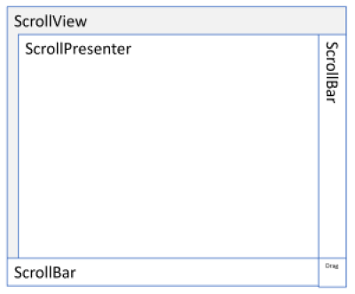
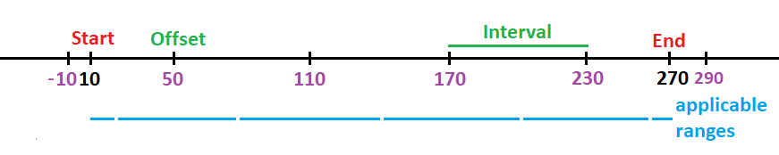
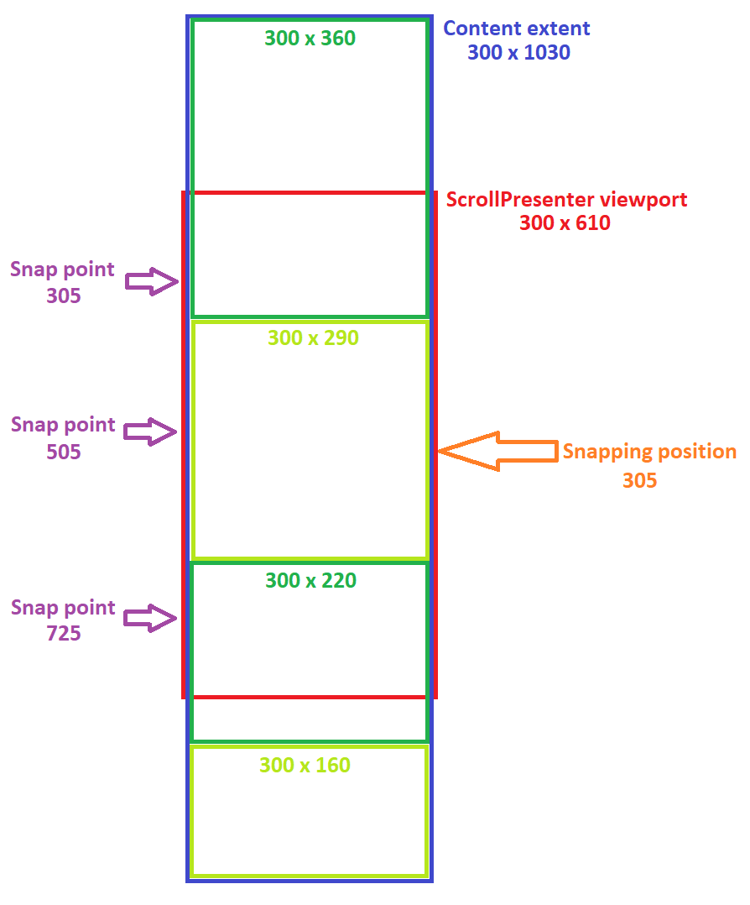
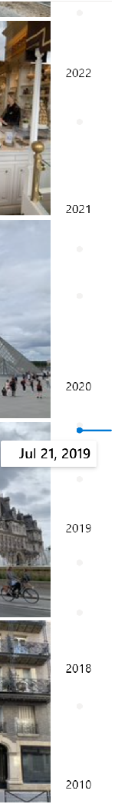
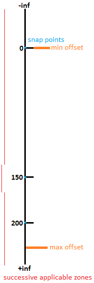

**WinUI** API Specification : **ScrollPresenter**
===============================================

# Background

(Full Summary, Rationale, and High-Level Plan in the proposal on GitHub: [A more flexible ScrollViewer](https://github.com/Microsoft/microsoft-ui-xaml/issues/108))

This spec describes a building block for the new `ScrollView` control (which is described in a 
[separate spec](ScrollView.md)): the `ScrollPresenter`. This pair of controls replaces the existing 
pair `ScrollViewer` and `ScrollContentPresenter`

|   | Current | New 
-|-|-
Primary control | [ScrollViewer](https://docs.microsoft.com/uwp/api/Windows.UI.Xaml.Controls.ScrollViewer) | `ScrollView`
Primitive scroller | [ScrollContentPresenter](https://docs.microsoft.com/uwp/api/Windows.UI.Xaml.Controls.ScrollContentPresenter) | `ScrollPresenter` (this spec)

`ScrollPresenter` is similar to the `ScrollContentPresenter` used in the old `ScrollViewer` control 
template as it applies the clipping, translation and scaling of the `ScrollView` content.
It is present in the `ScrollView`'s default control template alongside the two `ScrollBar` controls.



Contrary to the old `ScrollContentPresenter` element though, the `ScrollPresenter` is a fully functional 
and reusable primitive component with a public object model that is very similar to the `ScrollView` 
object model.
In most cases, the `ScrollView` control merely forwards an API call to the identical API of its 
inner `ScrollPresenter`.

The typical usage of a `ScrollPresenter` is that of a building block for a more complex control, 
like the `ScrollView`. 

Here the `ScrollPresenter` is used as part of a scrolling/zooming control which
employs custom UI widgets to control the translation and scale in lieu of two scrollbars.

```xml
<UserControl
    x:Class="AcmeApp.MyScroller"
    xmlns=http://schemas.microsoft.com/winfx/2006/xaml/presentation
    xmlns:muxp="using:Microsoft.UI.Xaml.Controls.Primitives">
    <Grid>
        <muxp:ScrollPresenter x:Name="scrollPresenter"/>
        <acme:ScrollController x:Name="scrollController" HorizontalAlignment="Right"/>
        <acme:ZoomController x:Name="zoomController" HorizontalAlignment="Right" VerticalAlignment="Top"/>
    </Grid>
</UserControl>
```

_Spec note:_
_Mike: "What's a ScrollController?"_

It can be used as a top level element too, as in the following example.

```xml
<Page 
    xmlns=http://schemas.microsoft.com/winfx/2006/xaml/presentation
    xmlns:muxp="using:Microsoft.UI.Xaml.Controls.Primitives">
    <muxp:ScrollPresenter Width="500" Height="400" Background="Beige">
        <TextBlock Text="{x:Bind AllTheText}" TextWrapping="Wrap"/>
    </muxp:ScrollPresenter>
</Page>
```


Xaml has a [ScrollViewer](https://docs.microsoft.com/uwp/api/Windows.UI.Xaml.Controls.ScrollViewer) control 
for scrolling content, using scroll bars and panning, etc. Typical uses are as the root of a page whose 
content might not fit; and a ListView, which internally uses a ScrollViewer for its list of items. 

For example the following shows a large text block that wraps horizontally and scrolls vertically:

```xml
<Page xmlns="http://schemas.microsoft.com/winfx/2006/xaml/presentation">
    <ScrollViewer>
        <TextBlock Text="{x:Bind AllTheText}" TextWrapping="Wrap" />
    </ScrollViewer>
</Page>
```

# Table of Contents

[[_TOC_]]


# Conceptual pages (how to)

`ScrollPresenter` is a container control that lets the user scroll (and pan), and zoom its content.

A `ScrollPresenter` enables content to be displayed in a smaller area than its actual size. The user 
can use touch to pan and zoom the content, or the keyboard and mouse wheel to scroll and zoom the content.

The area that includes all of the content of the `ScrollPresenter` is the *extent*. The visible area of 
the content is the *viewport*.


A second kind of scrolling element, providing just clipping and translation of content, and

The `ScrollPresenter` can be used as a primitive building block for controls like the `ScrollView` which
adds the default user interaction widgets (scrollbars, scroll indicator, etc.) and policy.
Indeed the `ScrollView` defined in the [separate spec](ScrollView.md) uses a `ScrollPresenter` as
part of its implementation (in its ControlTemplate).

Contrary to the `ScrollView` which is a Control, the `ScrollPresenter` is a FrameworkElement and
as such it does not receive keyboard focus. Its parent `ScrollView` has the
built-in logic to decide whether to scroll the viewport or move focus in response to a key event. 

The `ScrollPresenter` does not impose any particular policy.
Again it is the parent `ScrollView` that sets the properties on its inner `ScrollPresenter`
to values chosen to match common usage, 
for example the basic `<ScrollView/>` is configured for vertical scrolling.


## Snap points examples

The `ScrollPresenter` element exposes three collections to set scroll and zoom snap points.
(A snap point is a position that is a natural stopping place for scrolling or zooming to land on.)

| **Type**                                                    | **Snap points collection** |
|-------------------------------------------------------------|----------------------------|
| Windows.Foundation.Collections.IVector<ScrollSnapPointBase> | HorizontalSnapPoints       |
| Windows.Foundation.Collections.IVector<ScrollSnapPointBase> | VerticalSnapPoints         |
| Windows.Foundation.Collections.IVector<ZoomSnapPointBase>   | ZoomSnapPoints             |

At the end of a scroll inertia (for example the scrolling that continues briefly after touch input), 
the `ScrollPresenter`'s HorizontalOffset property will land at a value which depends on the 
HorizontalSnapPoints collection (same for VerticalOffset and VerticalSnapPoints). 
Likewise, at the end of a zoom inertia, the `ScrollPresenter`'s ZoomFactor property will land at
a value which depends on the ZoomSnapPoints collection.

Two types of scroll snap points exist, and they both derive from `ScrollSnapPointBase`: `ScrollSnapPoint` 
and `RepeatedScrollSnapPoint`. 

A `ScrollSnapPoint` is a single point characterized by an alignment and value.
The alignment enumeration of `Near`, `Center` or `Far` indicates where the snap point is located in 
relation to the viewport.
For example, for a horizontal snap point, the `Near` alignment corresponds to the left edge of the viewport.
`Center` means the middle of the viewport, and finally `Far` means the right edge.

_Spec note:_
_Mike: "So in RTL and horizontal, "Near" means the right side?"_

A `RepeatedScrollSnapPoint` defines multiple equidistant points.
It is characterized by an alignment, an interval, an offset, a start and end.
The interval determines the equidistance between two successive points.
The points are shifted from 0 by an amount defined by the offset.
The start and end define a domain in which the snap points are effective.

### Setting horizontal repeated snap points

In this example, a horizontal repeated snap point is defined at values -10, 50, 110, 170, 230 and 290.



The natural rest point is defined as the landing point after inertia if no snap points were present.
That natural rest point defines which snap point value is activated. 
In this case, if the natural rest point is before the _start_ 10 or after the _end_ 270,
no snap point value is activated and inertia carries on without the influence of the repeated snap point.
If however the natural rest point is in the \[10, 270\] domain,
the closest snap point value to the natural rest point is activated.
For example if the natural rest point is 95, the final HorizontalOffset property will be 110 instead of 95.
Because the provided _alignment_ is Near, the snap point values align with the left edge of the `ScrollPresenter`.   
The applicable ranges, or attraction zones, of the snap point values -10, 50, 110, 170, 230, 290 are
respectively \[10, 20\], \]20, 80\], \]80, 140\], \]140, 200\], \]200, 260\] and \]260, 270\].
If an activated horizontal snap point value is out-of-bounds, i.e. smaller than 0 or greater than ScrollableWidth,
the content will first animate to that out-of-bounds position then animate back to the closest in-bounds position.

_Spec note:_
_Mike: "Curious how much of this is ScrollPresenter and how much is InteractionTracker?"_

```csharp
RepeatedScrollSnapPoint snapPoint = 
    new RepeatedScrollSnapPoint(
        offset: 50,
        interval: 60,
        start: 10,
        end: 270,
        alignment: ScrollSnapPointsAlignment.Near);
myScrollPresenter.HorizontalSnapPoints.Add(snapPoint);
```

### Setting vertical repeated snap points

This example uses a vertical StackPanel in a `ScrollPresenter` with identically sized children.
All the children are 200px tall and the goal is to have their top edge snap at the top edge of the viewport.
A `RepeatedScrollSnapPoint` with Near alignment can be used for that purpose.

```csharp
RepeatedScrollSnapPoint snapPoint = 
    new RepeatedScrollSnapPoint(
        offset: 0,
        interval: 200,
        start: 0,
        end: myScrollPresenter.Content.ActualSize.Y,
        alignment: ScrollSnapPointsAlignment.Near);
myScrollPresenter.VerticalSnapPoints.Add(snapPoint);
```

### Setting vertical irregular snap points

This example showcases a vertical StackPanel in a `ScrollPresenter`.
That panel has 4 chidren elements of variable heights,
each of them being assigned a snap point so that their center snaps vertically to the center of the viewport 
as much as possible.



The viewport is 610px tall, the 4 children are 360px, 290px, 220px and 160px tall.
Since the desired alignment is Center, the content snap points will align to the middle of the viewport, 
at position 610/2=305px.
The ideal snap points for the 4 children are respectively at positions 180, 505, 760 and 950 from the top 
of the StackPanel.
Without the restriction of the content staying in-bounds, the 4 children's center would align with the 
viewport's center.
The content extent being 1030px tall, the `ScrollPresenter`'s VerticalOffset property can vary from 0 to
ScrollableHeight = 1030 - 610 = 420.
To avoid the content first animating out-of-bounds and then animating in-bounds,
the snap points can be moved to 305, 505, 725 and 725.
Only the second child is not affected by boundary restrictions.
The two last children get the same snap point at position 725.

```csharp
ScrollSnapPoint snapPoint1 = new ScrollSnapPoint(
    snapPointValue: 305, alignment: ScrollSnapPointsAlignment.Center);

ScrollSnapPoint snapPoint2 = new ScrollSnapPoint( 
    snapPointValue: 505, alignment: ScrollSnapPointsAlignment.Center);

ScrollSnapPoint snapPoint3 = new ScrollSnapPoint(
    snapPointValue: 725, alignment: ScrollSnapPointsAlignment.Center);

myScrollPresenter.VerticalSnapPoints.Add(snapPoint1);
myScrollPresenter.VerticalSnapPoints.Add(snapPoint2);
myScrollPresenter.VerticalSnapPoints.Add(snapPoint3);
```

The applicable ranges, or attraction zones, for snapPoint1,
snapPoint2 and snapPoint3 are \]-inf, 405\], \]405, 615\] and \]615, +inf\[.
So for example, if the natural rest point at the beginning of an inertial phase is 600,
the HorizontalOffset will animate to the snap point 505 instead.


### Setting repeated zoom snap points

A `RepeatedZoomSnapPoint` is set on the `ScrollPresenter` in order to have its ZoomFactor snap to
values 0.1, 0.2, 0.3, etc... at the end of an inertial zoom.

```csharp
RepeatedZoomSnapPoint snapPoint = 
    new RepeatedZoomSnapPoint(
        offset: 0,
        interval: 0.1,
        start: 0,
        end: myScrollPresenter.MaxZoomFactor);
myScrollPresenter.ZoomSnapPoints.Add(snapPoint);
```

### Setting irregular zoom snap points

In this case the goal is to set zoom snap points at values 0.15, 0.3, 0.6, 1.2, 2.4, 4.8 and 9.6.
Seven individual `ZoomSnapPoint` instances are added to the ZoomSnapPoints collection:

```csharp
for (double snapPointValue = 0.15; snapPointValue < 10.0; snapPointValue *= 2.0)
{
    myScrollPresenter.ZoomSnapPoints.Add(new ZoomSnapPoint(snapPointValue));
}
```

## Custom scroll controller example

The `ScrollPresenter`'s HorizontalScrollController and VerticalScrollController properties allow to
use custom scrollbar widgets instead of the default `ScrollBar` control.

_Spec note:_
_Mike: "What does "default" mean here? The ScrollPresenter doesn't have default scroll bars, does it?"_

| **Type**                                                | **Scroll controller properties** |
|---------------------------------------------------------|----------------------------------|
| Microsoft.UI.Xaml.Controls.Primitives.IScrollController | HorizontalScrollController       |
| Microsoft.UI.Xaml.Controls.Primitives.IScrollController | VerticalScrollController         |

Those widgets need to implement the IScrollController interface which standardizes the communication between
the `ScrollPresenter` and its 2 scroll controllers. 
In this example, the vertical `ScrollBar` found in a `ScrollView`'s default control template is hidden and
replaced with a custom timeline scrubber in a Photos Gallery application.
The TimelineScrubber control presents a timeline for the photos being scrolled through.
The default horizontal `ScrollBar` is left intact.  



```csharp
myScrollView.VerticalScrollBarVisibility = ScrollingScrollBarVisibility.Hidden;

ScrollPresenter myScrollPresenter = myScrollView.GetValue(ScrollView.ScrollPresenterProperty) as ScrollPresenter;

myScrollPresenter.VerticalScrollController = myTimelineScrubber;
```

_Spec note:_
_Mike: "Why using GetValue here, is this a DP with no property accessors?"_

An alternate approach would be to use a custom control template for that `ScrollView` instance with a TimelineScrubber 
named "PART_VerticalScrollBar" instead of a vertical `ScrollBar`.


# API Notes

## ScrollPresenter class

Provides primitive scroll and zoom supports for content.

### ScrollPresenter.HorizontalSnapPoints property

Gets the collection of snap points affecting the `ScrollPresenter.HorizontalOffset` property.
This collection is empty by default.
Horizontal snap points cause the HorizontalOffset property to settle at deterministic values at the end of inertia.

In this example, the `ScrollPresenter.HorizontalOffset` property lands at value 500.0 or 1500.0,
whichever is closest to the position where the content would have stopped without the presence of snap points.

```csharp
ScrollSnapPoint snapPoint1 = new ScrollSnapPoint(snapPointValue: 500.0, alignment: ScrollSnapPointsAlignment.Near);
ScrollSnapPoint snapPoint2 = new ScrollSnapPoint(snapPointValue: 1500.0, alignment: ScrollSnapPointsAlignment.Near);

myScrollPresenter.HorizontalSnapPoints.Add(snapPoint1);
myScrollPresenter.HorizontalSnapPoints.Add(snapPoint2);
```

### ScrollPresenter.VerticalSnapPoints property

Gets the collection of snap points affecting the `ScrollPresenter.VerticalOffset` property.
This collection is empty by default.
Vertical snap points cause the VerticalOffset property to settle at deterministic values at the end of inertia.

In this example, the `ScrollPresenter.VerticalOffset` property lands at value 500.0 or 1500.0,
whichever is closest to the position where the content would have stopped without the presence of snap points.

```csharp
ScrollSnapPoint snapPoint1 = new ScrollSnapPoint(snapPointValue: 500.0, alignment: ScrollSnapPointsAlignment.Near);
ScrollSnapPoint snapPoint2 = new ScrollSnapPoint(snapPointValue: 1500.0, alignment: ScrollSnapPointsAlignment.Near);

myScrollPresenter.VerticalSnapPoints.Add(snapPoint1);
myScrollPresenter.VerticalSnapPoints.Add(snapPoint2);
```

### ScrollPresenter.ZoomSnapPoints property

Gets the collection of snap points affecting the `ScrollPresenter.ZoomFactor` property.
This collection is empty by default.
Zoom snap points cause the ZoomFactor property to settle at deterministic values at the end of inertia.

In this example, the `ScrollPresenter.ZoomFactor` property lands at value 2.5 or 5.0,
whichever is closest to the zoom factor where the content would have stopped without the presence of snap points.

```csharp
ZoomSnapPoint snapPoint1 = new ZoomSnapPoint(snapPointValue: 2.5);
ZoomSnapPoint snapPoint2 = new ZoomSnapPoint(snapPointValue: 5.0);

myScrollPresenter.ZoomSnapPoints.Add(snapPoint1);
myScrollPresenter.ZoomSnapPoints.Add(snapPoint2);
```

### ScrollPresenter.HorizontalScrollController property

Gets or sets the `IScrollController` implementation that can drive the horizontal scrolling of the `ScrollPresenter`.
The component that implements IScrollController is typically a UI widget like a `ScrollBar` the user can
interact with to control the scrolling offset in one direction.
The default HorizontalScrollController property value is null.

```csharp
myScrollPresenter.HorizontalScrollController = myTimelineScrubber;
```

See [this section](#sample-iscrollController-implementations) for a couple of full `IScrollController` 
implementation samples.

### ScrollPresenter.VerticalScrollController property

Gets or sets the `IScrollController` implementation that can drive the vertical scrolling of the `ScrollPresenter`.
The component that implements IScrollController is typically a UI widget like a `ScrollBar` the user can
interact with to control the scrolling offset in one direction. 
The default VerticalScrollController property value is null.

```csharp
myScrollPresenter.VerticalScrollController = myTimelineScrubber;
```

See [this section](#sample-iscrollController-implementations) for a couple of full `IScrollController` 
implementation samples.


## IScrollController interface

The `ScrollPresenter` exposes two read-write properties of type IScrollController representing optional 
scrollbar-like widgets that can participate in setting the scrolling offsets of the content.
Those widgets are the implementers of the IScrollController interface, while the `ScrollController` 
is the consumer.

Throughout the remainder of this interface description, the term `ScrollPresenter` is used,
but the consumer of the IScrollController interface is not necessarily a ScrollPresenter.
It may be some alternative scrolling control.


## IScrollController.AreInteractionsAllowed property (Boolean)

This read-only property indicates whether the scroll controller can perform user interactions or not.

_Spec note:_
_Mike: "How does the controller indicate that this has changed? Do we need a change event 
that can be raised after the control gets disabled?"_

The scroll controller returns False for example when it is a disabled control.

The `ScrollView` control accesses this property to evaluate its ComputedHorizontalScrollBarVisibility 
and ComputedVerticalScrollBarVisibility dependency properties,
as well as the visibility of its scroll controller separator element (Template part named PART_ScrollBarsSeparator).

For example, when the ScrollView.HorizontalScrollBarVisibility property is `ScrollingScrollBarVisibility.Auto` 
and the horizontal IScrollController implementation's `AreInteractionsAllowed` property returns False,
the `ComputedHorizontalScrollBarVisibility` dependency property is set to `Visibility.Collapsed`.

_Spec note:_
_Mike: "We usually use "ActualFoo" rather than "ComputedFoo""_

## IScrollController.IsInteracting property (Boolean)

This read-only property indicates whether the scroll controller is handling a user interaction or not.

A scroll controller may return True for example when the user is dragging a thumb to control the scrolling 
offset of the `ScrollPresenter`.

A UI-thread-independent pan performed with the InteractionElement property must not cause the IsInteracting 
property to return `True` though.
It would prevent the user from being able to interrupt inertia from such a pan by touching the 
`ScrollPresenter`'s content.

_Spec note:_
_Mike: "Are any of these APIs called from off the UI thread?"_

The `ScrollView` control for example accesses this property to keep auto-hiding scroll controllers visible 
during a user interaction.
(That auto-hiding behavior is dependent on the 
[UISettings.AutoHideScrollBars](https://docs.microsoft.com/uwp/api/Windows.UI.ViewManagement.UISettings.AutoHideScrollBars) 
property evaluation.)

When returning True, this property prevents the `ScrollPresenter` from initiating a new pan of its content 
when the user touches it.


## IScrollController.InteractionElement property (UIElement)

This read-only property returns a UIElement that can be panned with touch off the UI-thread like the 
`ScrollPresenter`'s content.

_Spec note:_
_Mike: "Can't tell what this means? Is this saying that you could go from this element to a comp Visual 
and do background input on it?"_

A scroll controller can return null instead of a UIElement, indicating that none of its UI pieces can be 
panned off the UI-thread.
In that case the `ScrollPresenter` does not invoke the IsInteractionElementRailEnabled,
InteractionElementScrollOrientation and SetExpressionAnimationSources APIs.

## IScrollController.IsInteractionElementRailEnabled property (Boolean)

This read-only property indicates whether the UIElement returned by the InteractionElement property 
must use railing during a UI-thread-independent pan.
Railing locks the movement of the element on one orientation, horizontal or vertical.

This property is only invoked when the InteractionElement property returns a non-null UIElement.

## IScrollController.InteractionElementScrollOrientation property (Orientation)

This read-only property returns the panning orientation of the UIElement returned by the 
InteractionElement property.

This property is only invoked when the InteractionElement property returns a non-null UIElement.

## IScrollController.SetExpressionAnimationSources

```cs
void SetExpressionAnimationSources(
    Microsoft.UI.Composition.CompositionPropertySet propertySet, 
    String minOffsetPropertyName, 
    String maxOffsetPropertyName, 
    String offsetPropertyName, 
    String multiplierPropertyName)
```

This method is invoked by the `ScrollPresenter` to provide a CompositionPropertySet populated 
with 4 properties.

The scroll controller is meant to read 3 of those properties and write 1 of them.
The 3 readable scalar properties are identified by the names minOffsetPropertyName, maxOffsetPropertyName 
and offsetPropertyName - they represent the minimum, maximum and current scrolling offset values.

The 1 writeable property is also a scalar one, identified by the provided multiplierPropertyName name.
The scroll controller is in charge of writing into this scalar property, providing a number that 
represents the relative movement of the InteractionElement and ScrollPresenter content.
The property value represents a ratio. Both negative and positive ratios/multipliers are supported.

For example, for a typical scrollbar thumb, the finger on the InteractionElement may go down by 2 pixels,
causing the ScrollPresenter content to go up by 10 pixels.
To achieve this, the scroll controller is expected to write -5.0f into the multiplierPropertyName property.
The `ScrollPresenter` consumes that multiplierPropertyName scalar property in expression animations it builds 
internally to translate finger movement to content movement.

All 4 animated scalars can be used in the scroll controller's expression animations,
to position the InteractionElement's IVisual for example.

This method is only invoked when the InteractionElement property returns a non-null UIElement.

## IScrollController.SetScrollMode

```cs
void SetScrollMode(Microsoft.UI.Xaml.Controls.ScrollingScrollMode scrollMode)
```

This method is invoked by the `ScrollPresenter` to indicate whether scrolling through user input is 
turned on or not.
For example, the `ScrollPresenter` uses 4 of its properties for these calls: 
HorizontalScrollController.SetScrollMode(HorizontalScrollMode) and VerticalScrollController.SetScrollMode(VerticalScrollMode).

_Spec note:_
_Mike: "I'm confused about what this sentence is saying. Uses which 4 properties for those SetScrollMode 
calls? (Or do I need to understand the number of properties?)"_

## IScrollController.SetValues

```cs
void SetValues(Double minOffset, Double maxOffset, Double offset, Double viewport)
```

_Spec note:_
_Mike: "A more meaningful name? SetDimensionValues?"_

This method is invoked by the `ScrollPresenter` to provide dimension information to the scroll controller.

_minOffset_ and  _maxOffset_ indicate the minimum and maximum offsets allowed for the relevant scrolling 
orientation, at idle.
_offset_ indicates the current offset value, which is not necessarily between those minimum and maximum 
offsets because of overpan situations.
_viewport_ indicates the size of the `ScrollPresenter`'s viewport.

The scroll controller can use those dimensions to adjust the size and position of a UIElement, for example 
a draggable thumb on the UI thread.

## IScrollController.GetScrollAnimation

```cs
CompositionAnimation GetScrollAnimation(
    Int32 correlationId,
    Windows.Foundation.Numerics.Vector2 currentPosition,
    Microsoft.UI.Composition.CompositionAnimation defaultAnimation)
```

The scroll controller can request an animated scroll by raising its ScrollToRequested or 
ScrollByRequested event.
In response, the `ScrollPresenter` does not raise its ScrollAnimationStarting event.
Instead it invokes this GetScrollAnimation method to give the scroll controller the opportunity 
to customize the animation that is about to be launched.
The scroll controller is given the correlationId for the operation,
the current position of the content and default composition animation which is a Vector3KeyFrameAnimation 
about to be launched by default.
The correlationId is the one provided earlier in ScrollControllerScrollToRequestedEventArgs.CorrelationId 
or in ScrollControllerScrollByRequestedEventArgs.CorrelationId.
The scroll controller can then return: null or an unchanged _defaultAnimation_ to use that default animation, 
a modified version of _defaultAnimation_, or a brand-new custom animation.

## IScrollController.NotifyScrollCompleted

```cs
void NotifyScrollCompleted(Int32 correlationId)
```

This method is invoked by the `ScrollPresenter` to indicate that a scrolling operation initiated through 
a ScrollToRequested, ScrollByRequested or AddScrollVelocityRequested event has completed.
It provides the operation's correlationId which was exposed earlier in
ScrollControllerScrollToRequestedEventArgs.CorrelationId, ScrollControllerScrollByRequestedEventArgs.CorrelationId 
or ScrollControllerAddScrollVelocityRequestedEventArgs.CorrelationId.

## IScrollController.ScrollToRequested  event

```cs
event Windows.Foundation.TypedEventHandler<IScrollController, ScrollControllerScrollToRequestedEventArgs> ScrollToRequested
```

The scroll controller can request a scroll to a particular offset by raising its ScrollToRequested event.
The `ScrollPresenter` handles the event and provides a correlationId in 
ScrollControllerScrollToRequestedEventArgs.CorrelationId for the operation that is about to start.
The scroll controller can for example make such a request when a thumb is dragged to a new position.

## IScrollController.ScrollByRequested event

```cs
Windows.Foundation.TypedEventHandler<IScrollController, ScrollControllerScrollByRequestedEventArgs> ScrollByRequested
```

The scroll controller can request a scroll by a particular offset delta by raising its ScrollByRequested event.
The `ScrollPresenter` handles the event and provides a correlationId in ScrollControllerScrollByRequestedEventArgs.CorrelationId 
for the operation that is about to start.
The scroll controller can for example make such a request when a button is clicked to move a thumb by an increment.

## IScrollController.AddScrollVelocityRequested 

```cs
event Windows.Foundation.TypedEventHandler<IScrollController, ScrollControllerAddScrollVelocityRequestedEventArgs> AddScrollVelocityRequested
```

The scroll controller can request a scroll by adding velocity to the `ScrollPresenter` content through 
the AddScrollVelocityRequested event.

_Spec note:_
_Mike: "Don't understand what this means. Is this the case where we're in inertia and the pointer touches again?"_

## IScrollController.InteractionRequested event

```cs
event Windows.Foundation.TypedEventHandler<IScrollController, ScrollControllerInteractionRequestedEventArgs> InteractionRequested
```

This event can be raised by the scroll controller when the user attempts to initiate a UI-thread-independent pan,
with touch or a pen, using the UIElement returned by the InteractionElement property.

_Spec note:_
_Mike: "It's only for the off thread case? So the controller raises the event off thread?"_

The `ScrollPresenter` sets the ScrollControllerInteractionRequestedEventArgs.Handled property to True when
it successfully initiated such a pan. This event is not meant to be raised when the InteractionElement property 
returns null.

_Spec note:_
_Mike: "The event is named "interaction" but the description says "pan". Is it just for panning?"_

## IScrollController.InteractionInfoChanged event 

```cs
event Windows.Foundation.TypedEventHandler<IScrollController, Object> InteractionInfoChanged
```

This event is raised by the scroll controller after any of its properties AreInteractionsAllowed, IsInteracting,
IsInteractionElementRailEnabled, InteractionElement, or InteractionElementScrollOrientation changed.

_Spec note:_
_Mike: "Can we leave off the list of properties and just say "any of its properties"?"_

## ScrollControllerScrollToRequestedEventArgs class

Used by the ScrollToRequested event which is raised when the scroll controller requests a scroll 
to a particular offset.

| **Member**                                 | **Description**                                                                                                                                |
|--------------------------------------------|------------------------------------------------------------------------------------------------------------------------------------------------|
| ScrollControllerScrollToRequestedEventArgs | Constructor with _offset_ and _options_ parameters invoked by the scroll controller.                                                           |
| Offset                                     | Gets the target offset.                                                                                                                        |
| Options                                    | Gets the options for the scroll operation which determine whether the scroll is animated or not and whether snap points are applied or not.    |
| CorrelationId                              | Gets or sets the correlation ID associated with the offset change. This value is set by the `ScrollPresenter` which is fulfilling the request. |


## ScrollControllerScrollByRequestedEventArgs class

Used by the ScrollByRequested event which is raised when the scroll controller requests a scroll by 
a particular offset delta.

| **Member**                                 | **Description**                                                                                                                                |
|--------------------------------------------|------------------------------------------------------------------------------------------------------------------------------------------------|
| ScrollControllerScrollByRequestedEventArgs | Constructor with _offsetDelta_ and _options_ parameters invoked by the scroll controller.                                                      |
| OffsetDelta                                | Gets the offset change requested. May be positive or negative.                                                                                 |
| Options                                    | Gets the options for the scroll operation which determine whether the scroll is animated or not and whether snap points are applied or not.    |
| CorrelationId                              | Gets or sets the correlation ID associated with the offset change. This value is set by the `ScrollPresenter` which is fulfilling the request. |


## ScrollControllerAddScrollVelocityRequestedEventArgs class

Used by the AddScrollVelocityRequested event which is raised when the scroll controller requests a scroll by 
adding velocity to the `ScrollPresenter` content.

| **Member**                                          | **Description**                                                                                                                                |
|-----------------------------------------------------|------------------------------------------------------------------------------------------------------------------------------------------------|
| ScrollControllerAddScrollVelocityRequestedEventArgs | Constructor with _offsetVelocity_ and _inertiaDecayRate_ parameters invoked by the scroll controller.                                          |
| OffsetVelocity                                      | Gets the offset velocity change requested. May be positive or negative.                                                                        |
| InertiaDecayRate                                    | Gets the inertia decay rate, between 0.0 and 1.0, for the requested scroll operation. It affects the inertial velocity decrease (decay). The closer the value is to 1.0, the faster the deceleration. A value of 0.0 represents no decay and results in a constant velocity scroll. The returned value may be null which causes the default decay rate of 0.95 to be used. |
| CorrelationId                                       | Gets or sets the correlation ID associated with the offset change. This value is set by the `ScrollPresenter` which is fulfilling the request. |


## ScrollControllerInteractionRequestedEventArgs class

Used by the InteractionRequested event which is raised when the scroll controller attempts to initiate 
a UI-thread-independent pan, with touch or a pen, using the UIElement returned by the InteractionElement property.

| **Member**                                    | **Description**                                                                                                                                                                                                          |
|-----------------------------------------------|--------------------------------------------------------------------------------------------------------------------------------------------------------------------------------------------------------------------------|
| ScrollControllerInteractionRequestedEventArgs | Constructor with _pointerPoint_ parameter invoked by the scroll controller.                                                                                                                                              |
| PointerPoint                                  | Microsoft.UI.Input.PointerPoint instance associated with the user gesture triggering the InteractionRequested event. A scroll controller may retrieve it from a Microsoft.UI.Xaml.Input.PointerRoutedEventArgs instance. |
| Handled                                       | Gets or sets a value indicating whether the pan manipulation was successfully initiated or not. The `ScrollPresenter` sets this property while it processes the InteractionRequested event.                              |


# API Details

## Shared enumerations and structures between `ScrollView` and `ScrollPresenter`

Present in namespace Microsoft.UI.Xaml.Controls:

```csharp
enum ScrollingContentOrientation
{
    Vertical = 0,
    Horizontal = 1,
    None = 2,
    Both = 3,
};

enum ScrollingInteractionState
{
    Idle = 0,
    Interaction = 1,
    Inertia = 2,
    Animation = 3,
};

enum ScrollingScrollMode
{
    Enabled = 0,
    Disabled = 1,
};

enum ScrollingZoomMode
{
    Enabled = 0,
    Disabled = 1,
};

enum ScrollingChainMode
{
    Auto = 0,
    Always = 1,
    Never = 2,
};

enum ScrollingRailMode
{
    Enabled = 0,
    Disabled = 1,
};

[flags]
enum ScrollingInputKinds
{
    None = 0x00,
    Touch = 0x01,
    Pen = 0x02,
    MouseWheel = 0x04,
    Keyboard = 0x08,
    Gamepad = 0x10,
    All = 0xFFFFFFFF,
};

enum ScrollingAnimationMode
{
    Disabled = 0,
    Enabled = 1,
    Auto = 2,
};

enum ScrollingSnapPointsMode
{
    Default = 0,
    Ignore = 1,
};
```

_Spec note:_
_Mike: "I don't see any explanation for any of these three enums. 
A one/two-liner comment on top of each enum would be good"_

## `ScrollPresenter` enumeration

```csharp
enum Microsoft.UI.Xaml.Controls.Primitives.ScrollSnapPointsAlignment
{
    Near = 0,
    Center = 1,
    Far = 2,
};
```

## Shared method argument classes between `ScrollView` and `ScrollPresenter`

```csharp
unsealed runtimeclass Microsoft.UI.Xaml.Controls.ScrollingScrollOptions
{
    ScrollingScrollOptions(ScrollingAnimationMode animationMode);
    ScrollingScrollOptions(ScrollingAnimationMode animationMode, ScrollingSnapPointsMode snapPointsMode);
 
    ScrollingAnimationMode AnimationMode { get; set; };
    ScrollingSnapPointsMode SnapPointsMode { get; set; };
}

unsealed runtimeclass Microsoft.UI.Xaml.Controls.ScrollingZoomOptions
{
    ScrollingZoomOptions(ScrollingAnimationMode animationMode);
    ScrollingZoomOptions(ScrollingAnimationMode animationMode, ScrollingSnapPointsMode snapPointsMode);

    ScrollingAnimationMode AnimationMode { get; set; };
    ScrollingSnapPointsMode SnapPointsMode { get; set; };
}
```

## Shared event argument classes between `ScrollView` and `ScrollPresenter`

```csharp
runtimeclass Microsoft.UI.Xaml.Controls.ScrollingScrollAnimationStartingEventArgs
{
    Microsoft.UI.Composition.CompositionAnimation Animation { get; set; };
    Windows.Foundation.Numerics.Vector2 StartPosition { get; };
    Windows.Foundation.Numerics.Vector2 EndPosition { get; };
    Int32 CorrelationId { get; };
}

runtimeclass Microsoft.UI.Xaml.Controls.ScrollingZoomAnimationStartingEventArgs
{
    Windows.Foundation.Numerics.Vector2 CenterPoint { get; };
    Single StartZoomFactor { get; };
    Single EndZoomFactor { get; };
    Microsoft.UI.Composition.CompositionAnimation Animation { get; set; };
    Int32 CorrelationId { get; };
}

runtimeclass Microsoft.UI.Xaml.Controls.ScrollingScrollCompletedEventArgs
{
    Int32 CorrelationId { get; };
}

runtimeclass Microsoft.UI.Xaml.Controls.ScrollingZoomCompletedEventArgs
{
    Int32 CorrelationId { get; };
}

runtimeclass Microsoft.UI.Xaml.Controls.ScrollingBringingIntoViewEventArgs
{
    ScrollingSnapPointsMode SnapPointsMode { get; set; };
    Microsoft.UI.Xaml.BringIntoViewRequestedEventArgs RequestEventArgs { get; };
    Double TargetHorizontalOffset { get; };
    Double TargetVerticalOffset { get; };
    Int32 CorrelationId { get; };
    Boolean Cancel { get; set; };
}

runtimeclass Microsoft.UI.Xaml.Controls.ScrollingAnchorRequestedEventArgs
{
    Windows.Foundation.Collections.IVector<Microsoft.UI.Xaml.UIElement> AnchorCandidates { get; };
    Microsoft.UI.Xaml.UIElement AnchorElement { get; set; };
}
```

_Spec note:_
_Mike: "ScrollingZoomAnimationStartingEventArgs.CenterPoint: Why Vector2 rather than Point?"_
_Mike: "BringingIntoView: Name this BringIntoViewRequested to match UIElement.BringIntoViewRequested?"_
_Mike: "ScrollingBringingIntoViewEventArgs: No explanation for this. Odd that it has a property of another args type."_

## Snap points related classes

```csharp
unsealed runtimeclass Microsoft.UI.Xaml.Controls.Primitives.SnapPointBase :
    Microsoft.UI.Xaml.DependencyObject
{
}

unsealed runtimeclass Microsoft.UI.Xaml.Controls.Primitives.ScrollSnapPointBase
    : Microsoft.UI.Xaml.Controls.Primitives.SnapPointBase
{
    ScrollSnapPointsAlignment Alignment { get; };
}

unsealed runtimeclass Microsoft.UI.Xaml.Controls.Primitives.ScrollSnapPoint
    : Microsoft.UI.Xaml.Controls.Primitives.ScrollSnapPointBase
{
    ScrollSnapPoint(
        Double snapPointValue,
        ScrollSnapPointsAlignment alignment);

    Double Value { get; };
}

unsealed runtimeclass Microsoft.UI.Xaml.Controls.Primitives.RepeatedScrollSnapPoint
    : Microsoft.UI.Xaml.Controls.Primitives.ScrollSnapPointBase
{
    RepeatedScrollSnapPoint(
        Double offset,
        Double interval,
        Double start,
        Double end,
        ScrollSnapPointsAlignment alignment);

    Double Offset { get; };
    Double Interval { get; };
    Double Start { get; };
    Double End { get; };
}

unsealed runtimeclass Microsoft.UI.Xaml.Controls.Primitives.ZoomSnapPointBase
    : Microsoft.UI.Xaml.Controls.Primitives.SnapPointBase
{
}

unsealed runtimeclass Microsoft.UI.Xaml.Controls.Primitives.ZoomSnapPoint
    : Microsoft.UI.Xaml.Controls.Primitives.ZoomSnapPointBase
{
    ZoomSnapPoint(
        Double snapPointValue);

    Double Value { get; };
}

unsealed runtimeclass Microsoft.UI.Xaml.Controls.Primitives.RepeatedZoomSnapPoint
    : Microsoft.UI.Xaml.Controls.Primitives.ZoomSnapPointBase
{
    RepeatedZoomSnapPoint(
        Double offset,
        Double interval,
        Double start,
        Double end);

    Double Offset { get; };
    Double Interval { get; };
    Double Start { get; };
    Double End { get; };
}
```

_Spec note:_
_Mike: "SnapPointBase: Why is this a DependencyObject?"_


## `IScrollController` interface and related classes

```csharp
interface Microsoft.UI.Xaml.Controls.Primitives.IScrollController
{
    Boolean AreInteractionsAllowed { get; };
    Boolean IsInteracting { get; };
    Boolean IsInteractionElementRailEnabled { get; };
    Microsoft.UI.Xaml.UIElement InteractionElement { get; };
    Microsoft.UI.Xaml.Controls.Orientation InteractionElementScrollOrientation { get; };

    void SetExpressionAnimationSources(
            Microsoft.UI.Composition.CompositionPropertySet propertySet,
            String minOffsetPropertyName,
            String maxOffsetPropertyName,
            String offsetPropertyName,
            String multiplierPropertyName);
    void SetScrollMode(
            Microsoft.UI.Xaml.Controls.ScrollingScrollMode scrollMode);
    void SetValues(
            Double minOffset,
            Double maxOffset,
            Double offset,
            Double viewport);
    Microsoft.UI.Composition.CompositionAnimation GetScrollAnimation(
            Int32 correlationId,
            Windows.Foundation.Numerics.Vector2 currentPosition,
            Microsoft.UI.Composition.CompositionAnimation defaultAnimation);
    void NotifyScrollCompleted(
            Int32 correlationId);

    event Windows.Foundation.TypedEventHandler<IScrollController, ScrollControllerScrollToRequestedEventArgs> ScrollToRequested;
    event Windows.Foundation.TypedEventHandler<IScrollController, ScrollControllerScrollByRequestedEventArgs> ScrollByRequested;
    event Windows.Foundation.TypedEventHandler<IScrollController, ScrollControllerAddScrollVelocityRequestedEventArgs> AddScrollVelocityRequested;
    event Windows.Foundation.TypedEventHandler<IScrollController, ScrollControllerInteractionRequestedEventArgs> InteractionRequested;
    event Windows.Foundation.TypedEventHandler<IScrollController, Object> InteractionInfoChanged;
}

runtimeclass Microsoft.UI.Xaml.Controls.Primitives.ScrollControllerScrollToRequestedEventArgs
{
    ScrollControllerScrollToRequestedEventArgs(Double offset, Microsoft.UI.Xaml.Controls.ScrollingScrollOptions options);

    Double Offset { get; };
    Microsoft.UI.Xaml.Controls.ScrollingScrollOptions Options { get; };
    Int32 CorrelationId { get; set; };
}

runtimeclass Microsoft.UI.Xaml.Controls.Primitives.ScrollControllerScrollByRequestedEventArgs
{
    ScrollControllerScrollByRequestedEventArgs(Double offsetDelta, Microsoft.UI.Xaml.Controls.ScrollingScrollOptions options);

    Double OffsetDelta { get; };
    Microsoft.UI.Xaml.Controls.ScrollingScrollOptions Options { get; };
    Int32 CorrelationId { get; set; };
}

runtimeclass Microsoft.UI.Xaml.Controls.Primitives.ScrollControllerAddScrollVelocityRequestedEventArgs
{
    ScrollControllerAddScrollVelocityRequestedEventArgs(Single offsetVelocity, Windows.Foundation.IReference<Single> inertiaDecayRate);

    Single OffsetVelocity { get; };
    Windows.Foundation.IReference<Single> InertiaDecayRate { get; };
    Int32 CorrelationId { get; set; };
}

runtimeclass Microsoft.UI.Xaml.Controls.Primitives.ScrollControllerInteractionRequestedEventArgs
{
    ScrollControllerInteractionRequestedEventArgs(Microsoft.UI.Input.PointerPoint pointerPoint);

    Microsoft.UI.Input.PointerPoint PointerPoint { get; };
    Boolean Handled { get; set; };
}

runtimeclass Microsoft.UI.Xaml.Controls.Primitives.ScrollingViewChangeRequestedEventArgs
{
    Boolean IsAnimating { get; };
    Double TargetHorizontalOffset { get; };
    Double TargetVerticalOffset { get; };
    Single TargetZoomFactor { get; };
}
```

_Spec note:_
_Mike: "ScrollControllerScrollToRequestedEventArgs(Double offset, Microsoft.UI.Xaml.Controls.ScrollingScrollOptions options):
Why a constructor for the first two properties but not the CorrelationId? Is that not commonly used?
It might be easier to leave off the constructors; it's not that hard to set properties."_
_Mike: "Single OffsetVelocity { get; }: Is it valid for this to be negative?"_

## `ScrollPresenter` class

```csharp
[contentproperty("Content")]
unsealed runtimeclass Microsoft.UI.Xaml.Controls.Primittives.ScrollPresenter
    : Microsoft.UI.Xaml.FrameworkElement,
      Microsoft.UI.Xaml.Controls.IScrollAnchorProvider
{
    ScrollPresenter();

    Microsoft.UI.Xaml.Media.Brush Background { get; set; };
    Microsoft.UI.Xaml.UIElement Content { get; set; };
    Microsoft.UI.Composition.CompositionPropertySet ExpressionAnimationSources { get; };
    Double HorizontalOffset { get; };
    Double VerticalOffset { get; };
    Single ZoomFactor { get; };
    Double ExtentWidth { get; };
    Double ExtentHeight { get; };
    Double ViewportWidth { get; };
    Double ViewportHeight { get; };
    Double ScrollableWidth { get; };
    Double ScrollableHeight { get; };
    Microsoft.UI.Xaml.Controls.ScrollingContentOrientation ContentOrientation { get; set; };
    Microsoft.UI.Xaml.Controls.ScrollingChainMode HorizontalScrollChainMode { get; set; };
    Microsoft.UI.Xaml.Controls.ScrollingChainMode VerticalScrollChainMode { get; set; };
    Microsoft.UI.Xaml.Controls.ScrollingRailMode HorizontalScrollRailMode { get; set; };
    Microsoft.UI.Xaml.Controls.ScrollingRailMode VerticalScrollRailMode { get; set; };
    Microsoft.UI.Xaml.Controls.ScrollingScrollMode HorizontalScrollMode { get; set; };
    Microsoft.UI.Xaml.Controls.ScrollingScrollMode VerticalScrollMode { get; set; };
    Microsoft.UI.Xaml.Controls.ScrollingChainMode ZoomChainMode { get; set; };
    Microsoft.UI.Xaml.Controls.ScrollingZoomMode ZoomMode { get; set; };
    Microsoft.UI.Xaml.Controls.ScrollingInputKinds IgnoredInputKinds { get; set; };
    Double MinZoomFactor { get; set; };
    Double MaxZoomFactor { get; set; };
    Microsoft.UI.Xaml.Controls.ScrollingInteractionState State { get; };
    IScrollController HorizontalScrollController { get; set; };
    IScrollController VerticalScrollController { get; set; };
    Double HorizontalAnchorRatio { get; set; };
    Double VerticalAnchorRatio { get; set; };
    Windows.Foundation.Collections.IVector<ScrollSnapPointBase> HorizontalSnapPoints { get; };
    Windows.Foundation.Collections.IVector<ScrollSnapPointBase> VerticalSnapPoints { get; };
    Windows.Foundation.Collections.IVector<ZoomSnapPointBase> ZoomSnapPoints { get; };
    [method_name("ScrollTo")]
    Int32 ScrollTo(
        Double horizontalOffset,
        Double verticalOffset);
    [method_name("ScrollToWithOptions")]
    Int32 ScrollTo(
        Double horizontalOffset,
        Double verticalOffset,
        Microsoft.UI.Xaml.Controls.ScrollingScrollOptions options);
    [method_name("ScrollBy")]
    Int32 ScrollBy(
        Double horizontalOffsetDelta,
        Double verticalOffsetDelta);
    [method_name("ScrollByWithOptions")]
    Int32 ScrollBy(
        Double horizontalOffsetDelta,
        Double verticalOffsetDelta,
        Microsoft.UI.Xaml.Controls.ScrollingScrollOptions options);
    Int32 AddScrollVelocity(
        Windows.Foundation.Numerics.Vector2 offsetsVelocity,
        Windows.Foundation.IReference<Windows.Foundation.Numerics.Vector2> inertiaDecayRate);
    [method_name("ZoomTo")]
    Int32 ZoomTo(
        Single zoomFactor,
        Windows.Foundation.IReference<Windows.Foundation.Numerics.Vector2> centerPoint);
    [method_name("ZoomToWithOptions")]
    Int32 ZoomTo(
        Single zoomFactor,
        Windows.Foundation.IReference<Windows.Foundation.Numerics.Vector2> centerPoint,
        Microsoft.UI.Xaml.Controls.ScrollingZoomOptions options);
    [method_name("ZoomBy")]
    Int32 ZoomBy(
        Single zoomFactorDelta,
        Windows.Foundation.IReference<Windows.Foundation.Numerics.Vector2> centerPoint);
    [method_name("ZoomByWithOptions")]
    Int32 ZoomBy(
        Single zoomFactorDelta,
        Windows.Foundation.IReference<Windows.Foundation.Numerics.Vector2> centerPoint,
        Microsoft.UI.Xaml.Controls.ScrollingZoomOptions options);
    Int32 AddZoomVelocity(
        Single zoomFactorVelocity,
        Windows.Foundation.IReference<Windows.Foundation.Numerics.Vector2> centerPoint,
        Windows.Foundation.IReference<Single> inertiaDecayRate);

    event Windows.Foundation.TypedEventHandler<ScrollPresenter, Object> ExtentChanged;
    event Windows.Foundation.TypedEventHandler<ScrollPresenter, Object> StateChanged;
    event Windows.Foundation.TypedEventHandler<ScrollPresenter, Object> ViewChanged;
    event Windows.Foundation.TypedEventHandler<ScrollPresenter, Microsoft.UI.Xaml.Controls.ScrollingScrollAnimationStartingEventArgs> ScrollAnimationStarting;
    event Windows.Foundation.TypedEventHandler<ScrollPresenter, Microsoft.UI.Xaml.Controls.ScrollingZoomAnimationStartingEventArgs> ZoomAnimationStarting;
    event Windows.Foundation.TypedEventHandler<ScrollPresenter, Microsoft.UI.Xaml.Controls.ScrollingScrollCompletedEventArgs> ScrollCompleted;
    event Windows.Foundation.TypedEventHandler<ScrollPresenter, Microsoft.UI.Xaml.Controls.ScrollingZoomCompletedEventArgs> ZoomCompleted;
    event Windows.Foundation.TypedEventHandler<ScrollPresenter, Microsoft.UI.Xaml.Controls.ScrollingBringingIntoViewEventArgs> BringingIntoView;
    event Windows.Foundation.TypedEventHandler<ScrollPresenter, Microsoft.UI.Xaml.Controls.ScrollingAnchorRequestedEventArgs> AnchorRequested;
    event Windows.Foundation.TypedEventHandler<ScrollPresenter, MU_XCP_NAMESPACE.ScrollingViewChangeRequestedEventArgs> ViewChangeRequested;

    static Microsoft.UI.Xaml.DependencyProperty BackgroundProperty { get; };
    static Microsoft.UI.Xaml.DependencyProperty ContentProperty { get; };
    static Microsoft.UI.Xaml.DependencyProperty ContentOrientationProperty { get; };
    static Microsoft.UI.Xaml.DependencyProperty HorizontalScrollChainModeProperty { get; };
    static Microsoft.UI.Xaml.DependencyProperty VerticalScrollChainModeProperty { get; };
    static Microsoft.UI.Xaml.DependencyProperty HorizontalScrollRailModeProperty { get; };
    static Microsoft.UI.Xaml.DependencyProperty VerticalScrollRailModeProperty { get; };
    static Microsoft.UI.Xaml.DependencyProperty HorizontalScrollModeProperty { get; };
    static Microsoft.UI.Xaml.DependencyProperty VerticalScrollModeProperty { get; };
    static Microsoft.UI.Xaml.DependencyProperty ZoomChainModeProperty { get; };
    static Microsoft.UI.Xaml.DependencyProperty ZoomModeProperty { get; };
    static Microsoft.UI.Xaml.DependencyProperty IgnoredInputKindsProperty { get; };
    static Microsoft.UI.Xaml.DependencyProperty MinZoomFactorProperty { get; };
    static Microsoft.UI.Xaml.DependencyProperty MaxZoomFactorProperty { get; };
    static Microsoft.UI.Xaml.DependencyProperty HorizontalAnchorRatioProperty { get; };
    static Microsoft.UI.Xaml.DependencyProperty VerticalAnchorRatioProperty { get; };
}
```

_Spec note:_
_Mike: "Microsoft.UI.Composition.CompositionPropertySet ExpressionAnimationSources { get; }:
No explanation of what this is (it's fine to doc it as a comment)"_
_Mike: "Double ScrollableWidth { get; }: See 
[ScrollViewer.ScrollableWidth](https://docs.microsoft.com/uwp/api/Windows.UI.Xaml.Controls.ScrollViewer.ScrollableWidth)"_
_Mike: "ScrollingInteractionState State { get; }: "State" is too ambiguous, 
should be either ScrollingInterationState or InteractionState."_
_Mike: "ScrollCompleted, ZoomCompleted, BringingIntoView, AnchorRequested, ViewChangeRequested:
Is ScrollView going to listen to all of these events anyway? Would it be easier to make it a 
callback interface? We usually prefer events to that, but if the use case is to listen to everything, 
then it's more efficient."_

# Sample IScrollController implementations

_Spec note:_
_Mike: "These last samples are great, but long and I don't want reviewers to feel compelled to 
provide feedback on this much content. Also I think this would go into the samples repo rather 
than the docs. Could you keep them but put them in the appendix?"_

## IScrollController implementation without interaction element

The ScrollBarController class below is a sample implementation of the IScrollController interface 
which uses a `ScrollBar` control internally. Its InteractionElement property does not return a UIElement, 
so it does not support UI-thread-independent scrolling of the `ScrollPresenter`'s content.

```csharp
public class ScrollBarController : IScrollController
{
    private ScrollBar scrollBar = null;
    private ScrollingScrollMode scrollMode = ScrollingScrollMode.Disabled;
    private int lastOffsetChangeCorrelationIdForScrollTo = -1;
    private int lastOffsetChangeCorrelationIdForScrollBy = -1;
    private int lastOffsetChangeCorrelationIdForAddScrollVelocity = -1;
    private int operationsCount = 0;
    private double lastScrollBarValue = 0.0;
    private double lastOffset = 0.0;

    public event TypedEventHandler<IScrollController, ScrollControllerScrollToRequestedEventArgs> ScrollToRequested;
    public event TypedEventHandler<IScrollController, ScrollControllerScrollByRequestedEventArgs> ScrollByRequested;
    public event TypedEventHandler<IScrollController, ScrollControllerAddScrollVelocityRequestedEventArgs> AddScrollVelocityRequested;
    public event TypedEventHandler<IScrollController, ScrollControllerInteractionRequestedEventArgs> InteractionRequested;
    public event TypedEventHandler<IScrollController, object> InteractionInfoChanged;

    public ScrollBarController(ScrollBar scrollBar)
    {
        this.scrollBar = scrollBar;

        scrollBar.SmallChange = 16.0;
        scrollBar.Scroll += ScrollBarScroll;
        scrollBar.RegisterPropertyChangedCallback(Control.IsEnabledProperty, new DependencyPropertyChangedCallback(ScrollBarPropertyChanged));
    }

    public bool AreInteractionsAllowed
    {
        get;
        private set;
    }

    public bool IsInteracting
    {
        get;
        private set;
    }

    public bool IsInteractionElementRailEnabled
    {
        get
        {
            // Unused because InteractionElement returns null.
            return false;
        }
    }

    public UIElement InteractionElement
    {
        get
        {
            // This IScrollController implementation has no touch-manipulatable element.
            return null;
        }
    }

    public Orientation InteractionElementScrollOrientation
    {
        get
        {
            return scrollBar.Orientation;
        }
    }

    public void SetExpressionAnimationSources(
        CompositionPropertySet propertySet,
        string minOffsetPropertyName,
        string maxOffsetPropertyName,
        string offsetPropertyName,
        string multiplierPropertyName)
    {
        // Unused because InteractionElement returns null.
    }

    public void SetScrollMode(ScrollingScrollMode scrollMode)
    {
        this.scrollMode = scrollMode;
        UpdateAreInteractionsAllowed();
    }

    public void SetValues(
        double minOffset,
        double maxOffset,
        double offset,
        double viewport)
    {
        if (maxOffset < minOffset)
        {
            throw new ArgumentOutOfRangeException("maxOffset cannot be smaller than minOffset.");
        }

        if (viewport < 0.0)
        {
            throw new ArgumentOutOfRangeException("viewport cannot be negative.");
        }

        offset = Math.Max(minOffset, offset);
        offset = Math.Min(maxOffset, offset);
        lastOffset = offset;

        if (minOffset < scrollBar.Minimum)
        {
            scrollBar.Minimum = minOffset;
        }

        if (maxOffset > scrollBar.Maximum)
        {
            scrollBar.Maximum = maxOffset;
        }

        if (minOffset != scrollBar.Minimum)
        {
            scrollBar.Minimum = minOffset;
        }

        if (maxOffset != scrollBar.Maximum)
        {
            scrollBar.Maximum = maxOffset;
        }

        // Default amount to scroll when hitting the SmallIncrement/SmallDecrement buttons: 1/8 of the viewport size.
        // This amount can be overridden by setting the ScrollBar.SmallChange property to something else than double.NaN.
        const double s_defaultViewportToSmallChangeRatio = 8.0;

        scrollBar.ViewportSize = viewport;
        scrollBar.LargeChange = viewport;
        scrollBar.SmallChange = Math.Max(1.0, viewport / s_defaultViewportToSmallChangeRatio);

        // The ScrollBar Value is only updated when there is no operation in progress.
        if (operationsCount == 0 || scrollBar.Value < minOffset || scrollBar.Value > maxOffset)
        {
            scrollBar.Value = offset;
            lastScrollBarValue = offset;
        }

        // Potentially changed ScrollBar.Minimum / ScrollBar.Maximum value(s) may have an effect
        // on the read-only IScrollController.AreInteractionsAllowed property.
        UpdateAreInteractionsAllowed();
    }

    public CompositionAnimation GetScrollAnimation(
        int correlationId,
        Vector2 currentPosition,
        CompositionAnimation defaultAnimation)
    {
        return null;
    }

    public void NotifyScrollCompleted(int correlationId)
    {
        operationsCount--;

        if (operationsCount == 0 && scrollBar.Value != lastOffset)
        {
            scrollBar.Value = lastOffset;
            lastScrollBarValue = lastOffset;
        }
    }

    private void ScrollBarScroll(object sender, ScrollEventArgs e)
    {
        ScrollEventType scrollEventType = e.ScrollEventType;

        if (scrollMode == ScrollingScrollMode.Disabled && scrollEventType != ScrollEventType.ThumbPosition)
        {
            // This ScrollBar is not interactive. Restore its previous Value.
            scrollBar.Value = lastScrollBarValue;
            return;
        }

        switch (scrollEventType)
        {
            case ScrollEventType.First:
            case ScrollEventType.Last:
                {
                    break;
                }
            case ScrollEventType.EndScroll:
                {
                    if (IsInteracting)
                    {
                        IsInteracting = false;
                        RaiseInteractionInfoChanged();
                    }
                    break;
                }
            case ScrollEventType.LargeDecrement:
            case ScrollEventType.LargeIncrement:
            case ScrollEventType.SmallDecrement:
            case ScrollEventType.SmallIncrement:
            case ScrollEventType.ThumbPosition:
            case ScrollEventType.ThumbTrack:
                {
                    if (scrollEventType == ScrollEventType.ThumbTrack)
                    {
                        if (!IsInteracting)
                        {
                            IsInteracting = true;
                            RaiseInteractionInfoChanged();
                        }
                    }

                    bool offsetChangeRequested = false;

                    if (scrollEventType == ScrollEventType.ThumbPosition ||
                        scrollEventType == ScrollEventType.ThumbTrack)
                    {
                        offsetChangeRequested = RaiseScrollToRequested(e.NewValue);
                    }
                    else
                    {
                        double offsetDelta = 0.0;

                        switch (scrollEventType)
                        {
                            case ScrollEventType.LargeDecrement:
                                offsetDelta = -Math.Min(lastScrollBarValue - scrollBar.Minimum, scrollBar.LargeChange);
                                break;
                            case ScrollEventType.LargeIncrement:
                                offsetDelta = Math.Min(scrollBar.Maximum - lastScrollBarValue, scrollBar.LargeChange);
                                break;
                            case ScrollEventType.SmallDecrement:
                                offsetDelta = -Math.Min(lastScrollBarValue - scrollBar.Minimum, scrollBar.SmallChange);
                                break;
                            case ScrollEventType.SmallIncrement:
                                offsetDelta = Math.Min(scrollBar.Maximum - lastScrollBarValue, scrollBar.SmallChange);
                                break;
                        }

                        const double s_minMaxEpsilon = 0.001;

                        // When the requested Value is near the Mininum or Maximum, include a little additional velocity
                        // to ensure the extreme value is reached.
                        if (e.NewValue - scrollBar.Minimum < s_minMaxEpsilon)
                        {
                            offsetDelta -= s_minMaxEpsilon;
                        }
                        else if (scrollBar.Maximum - e.NewValue < s_minMaxEpsilon)
                        {
                            offsetDelta += s_minMaxEpsilon;
                        }

                        if (new UISettings().AnimationsEnabled)
                        {
                            offsetChangeRequested = RaiseAddScrollVelocityRequested(offsetDelta);
                        }
                        else
                        {
                            offsetChangeRequested = RaiseScrollByRequested(offsetDelta);
                        }
                    }

                    if (!offsetChangeRequested)
                    {
                        // This request could not be requested, restore the previous Value.
                        scrollBar.Value = lastScrollBarValue;
                    }
                    break;
                }
        }

        lastScrollBarValue = scrollBar.Value;
    }

    private void ScrollBarPropertyChanged(DependencyObject sender, DependencyProperty e)
    {
        if (e == Control.IsEnabledProperty)
        {
            // Potentially changed ScrollBar.Minimum / ScrollBar.Maximum value(s) may have an effect
            // on the read-only IScrollController.AreInteractionsAllowed property.
            UpdateAreInteractionsAllowed();
        }
    }

    private void UpdateAreInteractionsAllowed()
    {
        bool oldAreInteractionsAllowed = AreInteractionsAllowed;

        AreInteractionsAllowed =
            scrollBar.IsEnabled &&
            scrollBar.Maximum > scrollBar.Minimum &&
            scrollMode != ScrollingScrollMode.Disabled;

        if (oldAreInteractionsAllowed != AreInteractionsAllowed)
        {
            RaiseInteractionInfoChanged();
        }
    }

    private void RaiseInteractionInfoChanged()
    {
        if (InteractionInfoChanged != null)
        {
            InteractionInfoChanged(this, null);
        }
    }

    private bool RaiseScrollToRequested(double offset)
    {
        if (ScrollToRequested == null)
        {
            return false;
        }

        ScrollingScrollOptions options = new ScrollingScrollOptions(ScrollingAnimationMode.Disabled, ScrollingSnapPointsMode.Ignore);
        ScrollControllerScrollToRequestedEventArgs scrollToRequestedEventArgs = new ScrollControllerScrollToRequestedEventArgs(offset, options);

        ScrollToRequested(this, scrollToRequestedEventArgs);

        int correlationId = scrollToRequestedEventArgs.CorrelationId;

        // Only increment operationsCount when the returned OffsetsChangeCorrelationId represents a new request that was not coalesced with a pending request. 
        if correlationId != -1 && correlationId != lastOffsetChangeCorrelationIdForScrollTo)
        {
            lastOffsetChangeCorrelationIdForScrollTo = correlationId;
            operationsCount++;
            return true;
        }

        return false;
    }

    private bool RaiseScrollByRequested(double offsetDelta)
    {
        if (ScrollToRequested == null)
        {
            return false;
        }

        ScrollingScrollOptions options = new ScrollingScrollOptions(ScrollingAnimationMode.Disabled, ScrollingSnapPointsMode.Ignore);
        ScrollControllerScrollByRequestedEventArgs scrollByRequestedEventArgs = new ScrollControllerScrollByRequestedEventArgs(offsetDelta, options);

        ScrollByRequested(this, scrollByRequestedEventArgs);

        int correlationId = scrollByRequestedEventArgs.CorrelationId;

        // Only increment operationsCount when the returned OffsetsChangeCorrelationId represents a new request that was not coalesced with a pending request. 
        if (correlationId != -1 && correlationId != lastOffsetChangeCorrelationIdForScrollBy)
        {
            lastOffsetChangeCorrelationIdForScrollBy = correlationId;
            operationsCount++;
            return true;
        }

        return false;
    }

    private bool RaiseAddScrollVelocityRequested(double offsetDelta)
    {
        if (AddScrollVelocityRequested == null)
        {
            return false;
        }

        // Minimum initial velocity required by InteractionTracker.TryUpdatePositionWithAdditionalVelocity to affect the Position.
        const double s_minimumVelocity = 30.0;

        // Inertia decay rate for SmallChange / LargeChange animated Value changes.
        const float s_inertiaDecayRate = 0.9995f;

        // Approximate additional velocity required with decay s_inertiaDecayRate to move offset by one pixel.
        const double s_velocityNeededPerPixel = 7.6;

        double offsetVelocity = operationsCount == 0 ? s_minimumVelocity : 0.0;

        if (offsetDelta < 0.0)
        {
            offsetVelocity *= -1;
        }
        offsetVelocity += offsetDelta * s_velocityNeededPerPixel;

        ScrollControllerAddScrollVelocityRequestedEventArgs addScrollVelocityRequestedEventArgs = new ScrollControllerAddScrollVelocityRequestedEventArgs((float)offsetVelocity, s_inertiaDecayRate);

        AddScrollVelocityRequested(this, addScrollVelocityRequestedEventArgs);

        int correlationId = addScrollVelocityRequestedEventArgs.CorrelationId;

        // Only increment operationsCount when the returned OffsetsChangeCorrelationId represents a new request that was not coalesced with a pending request. 
        if (correlationId != -1 && correlationId != lastOffsetChangeCorrelationIdForAddScrollVelocity)
        {
            lastOffsetChangeCorrelationIdForAddScrollVelocity = correlationId;
            operationsCount++;
            return true;
        }

        return false;
    }
}
```

## IScrollController implementation with interaction element

The CompositionScrollController class below is a sample implementation of the IScrollController interface which
supports UI-thread-independent scrolling of the `ScrollPresenter`'s content by exposing a pannable thumb.

```csharp
public sealed class CompositionScrollController : Control, IScrollController
{
    private const float SmallChangeAdditionalVelocity = 144.0f;
    private const float SmallChangeInertiaDecayRate = 0.975f;

    private Dictionary<int, double> operations = new Dictionary<int, double>();
    private FrameworkElement interactionFrameworkElement = null;
    private UIElement horizontalGrid = null;
    private UIElement verticalGrid = null;
    private UIElement horizontalThumb = null;
    private UIElement verticalThumb = null;
    private RepeatButton horizontalDecrementRepeatButton = null;
    private RepeatButton verticalDecrementRepeatButton = null;
    private RepeatButton horizontalIncrementRepeatButton = null;
    private RepeatButton verticalIncrementRepeatButton = null;
    private Visual interactionVisual = null;
    private CompositionPropertySet expressionAnimationSources = null;
    private ExpressionAnimation thumbOffsetAnimation = null;
    private Orientation orientation = Orientation.Vertical;
    private ScrollingScrollMode scrollMode = ScrollingScrollMode.Disabled;
    private bool isThumbDragged = false;
    private double minOffset = 0.0;
    private double maxOffset = 0.0;
    private double offset = 0.0;
    private double offsetTarget = 0.0;
    private double viewport = 0.0;
    private double preManipulationThumbOffset = 0.0;
    private string minOffsetPropertyName;
    private string maxOffsetPropertyName;
    private string offsetPropertyName;
    private string multiplierPropertyName;

    public CompositionScrollController()
    {
        this.DefaultStyleKey = typeof(CompositionScrollController);
        OverriddenOffsetChangeDuration = TimeSpan.MinValue;
        IsEnabledChanged += CompositionScrollController_IsEnabledChanged;
        SizeChanged += CompositionScrollController_SizeChanged;
    }

    protected override void OnApplyTemplate()
    {
        UnhookHandlers();

        base.OnApplyTemplate();

        horizontalGrid = GetTemplateChild("HorizontalGrid") as UIElement;
        verticalGrid = GetTemplateChild("VerticalGrid") as UIElement;
        horizontalThumb = GetTemplateChild("HorizontalThumb") as UIElement;
        verticalThumb = GetTemplateChild("VerticalThumb") as UIElement;
        horizontalDecrementRepeatButton = GetTemplateChild("HorizontalDecrementRepeatButton") as RepeatButton;
        verticalDecrementRepeatButton = GetTemplateChild("VerticalDecrementRepeatButton") as RepeatButton;
        horizontalIncrementRepeatButton = GetTemplateChild("HorizontalIncrementRepeatButton") as RepeatButton;
        verticalIncrementRepeatButton = GetTemplateChild("VerticalIncrementRepeatButton") as RepeatButton;

        UpdateOrientation();
    }

    public TimeSpan OverriddenOffsetChangeDuration
    {
        get;
        set;
    }

    public Orientation Orientation
    {
        get
        {
            return orientation;
        }
        set
        {
            if (orientation != value)
            {
                UnhookHandlers();
                StopThumbAnimation(orientation);
                orientation = value;
                UpdateOrientation();
            }
        }
    }

    public void SetExpressionAnimationSources(
        CompositionPropertySet propertySet,
        string minOffsetPropertyName,
        string maxOffsetPropertyName,
        string offsetPropertyName,
        string multiplierPropertyName)
    {
        expressionAnimationSources = propertySet;
        if (expressionAnimationSources != null)
        {
            this.minOffsetPropertyName = minOffsetPropertyName.Trim();
            this.maxOffsetPropertyName = maxOffsetPropertyName.Trim();
            this.offsetPropertyName = offsetPropertyName.Trim();
            this.multiplierPropertyName = multiplierPropertyName.Trim();

            UpdateInteractionElementScrollMultiplier();

            if (thumbOffsetAnimation == null)
            {
                EnsureThumbAnimation();
                UpdateThumbExpression();
                StartThumbAnimation(Orientation);
            }
        }
        else
        {
            minOffsetPropertyName =
            maxOffsetPropertyName =
            offsetPropertyName =
            multiplierPropertyName = string.Empty;
            thumbOffsetAnimation = null;
            StopThumbAnimation(Orientation);
        }
    }

    public void SetScrollMode(ScrollingScrollMode scrollMode)
    {
        this.scrollMode = scrollMode;
        UpdateAreInteractionsAllowed();
    }

    public void SetValues(double minOffset, double maxOffset, double offset, double viewport)
    {
        if (maxOffset < minOffset)
        {
            throw new ArgumentOutOfRangeException("maxOffset");
        }

        if (viewport < 0.0)
        {
            throw new ArgumentOutOfRangeException("viewport");
        }

        offset = Math.Max(minOffset, offset);
        offset = Math.Min(maxOffset, offset);

        if (operations.Count == 0)
        {
            offsetTarget = offset;
        }
        else
        {
            offsetTarget = Math.Max(minOffset, offsetTarget);
            offsetTarget = Math.Min(maxOffset, offsetTarget);
        }

        bool updateInteractionFrameworkElementSize =
            this.minOffset != minOffset ||
            this.maxOffset != maxOffset ||
            this.viewport != viewport;

        this.minOffset = minOffset;
        this.offset = offset;
        this.maxOffset = maxOffset;
        this.viewport = viewport;

        if (updateInteractionFrameworkElementSize && !UpdateInteractionFrameworkElementSize())
        {
            UpdateInteractionElementScrollMultiplier();
        }
    }

    // Builds a custom Vector3KeyFrameAnimation animation that the ScrollPresenter applies when an animated offset change
    // is requested by the CompositionScrollController. 
    public CompositionAnimation GetScrollAnimation(
        int correlationId,
        Vector2 currentPosition,
        CompositionAnimation defaultAnimation)
    {
        Vector3KeyFrameAnimation stockKeyFrameAnimation = defaultAnimation as Vector3KeyFrameAnimation;

        if (stockKeyFrameAnimation != null)
        {
            Vector3KeyFrameAnimation customKeyFrameAnimation = stockKeyFrameAnimation;
            float positionTarget = (float)operations[correlationId];
            float otherOrientationPosition = orientation == Orientation.Horizontal ? currentPosition.Y : currentPosition.X;

            customKeyFrameAnimation = stockKeyFrameAnimation.Compositor.CreateVector3KeyFrameAnimation();
            float deltaPosition = (float)(positionTarget - offset);

            CubicBezierEasingFunction cubicBezierStart = stockKeyFrameAnimation.Compositor.CreateCubicBezierEasingFunction(
                new Vector2(1.0f, 0.0f),
                new Vector2(1.0f, 0.0f));

            StepEasingFunction step = stockKeyFrameAnimation.Compositor.CreateStepEasingFunction(1);

            CubicBezierEasingFunction cubicBezierEnd = stockKeyFrameAnimation.Compositor.CreateCubicBezierEasingFunction(
                new Vector2(0.0f, 1.0f),
                new Vector2(0.0f, 1.0f));

            if (orientation == Orientation.Horizontal)
            {
                customKeyFrameAnimation.InsertKeyFrame(
                    0.499999f,
                    new Vector3(positionTarget - 0.9f * deltaPosition, otherOrientationPosition, 0.0f),
                    cubicBezierStart);
                customKeyFrameAnimation.InsertKeyFrame(
                    0.5f,
                    new Vector3(positionTarget - 0.1f * deltaPosition, otherOrientationPosition, 0.0f),
                    step);
                customKeyFrameAnimation.InsertKeyFrame(
                    1.0f,
                    new Vector3(positionTarget, otherOrientationPosition, 0.0f),
                    cubicBezierEnd);
            }
            else
            {
                customKeyFrameAnimation.InsertKeyFrame(
                    0.499999f,
                    new Vector3(otherOrientationPosition, positionTarget - 0.9f * deltaPosition, 0.0f),
                    cubicBezierStart);
                customKeyFrameAnimation.InsertKeyFrame(
                    0.5f,
                    new Vector3(otherOrientationPosition, positionTarget - 0.1f * deltaPosition, 0.0f),
                    step);
                customKeyFrameAnimation.InsertKeyFrame(
                    1.0f,
                    new Vector3(otherOrientationPosition, positionTarget, 0.0f),
                    cubicBezierEnd);
            }
            customKeyFrameAnimation.Duration = stockKeyFrameAnimation.Duration;

            if (OverriddenOffsetChangeDuration != TimeSpan.MinValue)
            {
                customKeyFrameAnimation.Duration = OverriddenOffsetChangeDuration;
            }

            return customKeyFrameAnimation;
        }

        return null;
    }

    public void NotifyScrollCompleted(int correlationId)
    {
        if (operations.ContainsKey(correlationId))
        {
            operations.Remove(correlationId);
        }
    }

    public bool AreInteractionsAllowed
    {
        get;
        private set;
    }

    public bool IsInteracting
    {
        get;
        private set;
    }

    public bool IsInteractionElementRailEnabled
    {
        get
        {
            return true;
        }
    }

    public UIElement InteractionElement
    {
        get
        {
            return (IsEnabled && interactionFrameworkElement != null && interactionFrameworkElement.Parent != null) ? interactionFrameworkElement.Parent as UIElement : null;
        }
    }

    public Orientation InteractionElementScrollOrientation
    {
        get
        {
            return Orientation;
        }
    }

    private float InteractionElementScrollMultiplier
    {
        get
        {
            if (interactionFrameworkElement != null)
            {
                interactionFrameworkElement.UpdateLayout();

                double parentDimension = 0.0;
                double interactionFrameworkElementDim = Orientation == Orientation.Horizontal ? interactionFrameworkElement.ActualWidth : interactionFrameworkElement.ActualHeight;
                FrameworkElement parent = interactionFrameworkElement.Parent as FrameworkElement;
                if (parent != null)
                {
                    parentDimension = Orientation == Orientation.Horizontal ? parent.ActualWidth : parent.ActualHeight;
                }
                if (parentDimension != interactionFrameworkElementDim)
                {
                    return (float)((maxOffset - minOffset) / (interactionFrameworkElementDim - parentDimension));
                }
            }

            return 0.0f;
        }
    }

    public event TypedEventHandler<IScrollController, ScrollControllerInteractionRequestedEventArgs> InteractionRequested;
    public event TypedEventHandler<IScrollController, ScrollControllerScrollToRequestedEventArgs> ScrollToRequested;
    public event TypedEventHandler<IScrollController, ScrollControllerScrollByRequestedEventArgs> ScrollByRequested;
    public event TypedEventHandler<IScrollController, ScrollControllerAddScrollVelocityRequestedEventArgs> AddScrollVelocityRequested;
    public event TypedEventHandler<IScrollController, Object> InteractionInfoChanged;

    public int ScrollTo(double offset, ScrollingAnimationMode animationMode)
    {
        return RaiseScrollToRequested(offset, animationMode);
    }

    public int ScrollBy(double offsetDelta, ScrollingAnimationMode animationMode)
    {
        return RaiseScrollByRequested(offsetDelta, animationMode);
    }

    public int AddScrollVelocity(float offsetVelocity, float? inertiaDecayRate)
    {
        return RaiseAddScrollVelocityRequested(offsetVelocity, inertiaDecayRate);
    }

    private void RaiseInteractionInfoChanged()
    {
        if (InteractionInfoChanged != null)
        {
            InteractionInfoChanged(this, null);
        }
    }

    private void RaiseInteractionRequested(PointerPoint pointerPoint)
    {
        if (InteractionRequested != null)
        {
            ScrollControllerInteractionRequestedEventArgs e = new ScrollControllerInteractionRequestedEventArgs(pointerPoint);
            InteractionRequested(this, e);
        }
    }

    private int RaiseScrollToRequested(double offset, ScrollingAnimationMode animationMode)
    {
        if (ScrollToRequested != null)
        {
            ScrollControllerScrollToRequestedEventArgs e =
                new ScrollControllerScrollToRequestedEventArgs(
                    offset,
                    new ScrollingScrollOptions(animationMode, ScrollingSnapPointsMode.Ignore));
            ScrollToRequested(this, e);
            return e.CorrelationId;
        }

        return -1;
    }

    private int RaiseScrollByRequested(double offsetDelta, ScrollingAnimationMode animationMode)
    {
        if (ScrollByRequested != null)
        {
            ScrollControllerScrollByRequestedEventArgs e =
                new ScrollControllerScrollByRequestedEventArgs(
                    offsetDelta,
                    new ScrollingScrollOptions(animationMode, ScrollingSnapPointsMode.Ignore));
            ScrollByRequested(this, e);
            return e.CorrelationId;
        }

        return -1;
    }

    private int RaiseAddScrollVelocityRequested(float offsetVelocity, float? inertiaDecayRate)
    {
        if (AddScrollVelocityRequested != null)
        {
            ScrollControllerAddScrollVelocityRequestedEventArgs e =
                new ScrollControllerAddScrollVelocityRequestedEventArgs(
                    offsetVelocity,
                    inertiaDecayRate);
            AddScrollVelocityRequested(this, e);
            return e.CorrelationId;
        }

        return -1;
    }

    private void InteractionFrameworkElement_PointerPressed(object sender, Microsoft.UI.Xaml.Input.PointerRoutedEventArgs e)
    {
        switch (e.Pointer.PointerDeviceType)
        {
            case Microsoft.UI.Input.PointerDeviceType.Touch:
            case Microsoft.UI.Input.PointerDeviceType.Pen:
                RaiseInteractionRequested(e.GetCurrentPoint(null));
                break;
            case Microsoft.UI.Input.PointerDeviceType.Mouse:
                isThumbDragged = true;
                if (!IsInteracting)
                {
                    IsInteracting = true;
                    RaiseInteractionInfoChanged();
                }
                break;
        }
    }

    private void InteractionFrameworkElement_ManipulationStarting(object sender, ManipulationStartingRoutedEventArgs e)
    {
        if (isThumbDragged)
        {
            preManipulationThumbOffset = Orientation == Orientation.Horizontal ? HorizontalThumbOffset : VerticalThumbOffset;
        }
    }

    private void InteractionFrameworkElement_ManipulationDelta(object sender, ManipulationDeltaRoutedEventArgs e)
    {
        if (isThumbDragged)
        {
            double targetThumbOffset = preManipulationThumbOffset + (Orientation == Orientation.Horizontal ? e.Cumulative.Translation.X : e.Cumulative.Translation.Y);
            double scrollPresenterOffset = ScrollPresenterOffsetFromThumbOffset(targetThumbOffset);

            int offsetChangeCorrelationId = RaiseScrollToRequested(
                scrollPresenterOffset, ScrollingAnimationMode.Disabled);
        }
    }

    private void InteractionFrameworkElement_ManipulationCompleted(object sender, ManipulationCompletedRoutedEventArgs e)
    {
        if (isThumbDragged)
        {
            isThumbDragged = false;
            if (IsInteracting)
            {
                IsInteracting = false;
                RaiseInteractionInfoChanged();
            }
        }
    }

    private void UnhookHandlers()
    {
        if (horizontalDecrementRepeatButton != null)
        {
            horizontalDecrementRepeatButton.Click -= DecrementRepeatButton_Click;
        }

        if (horizontalIncrementRepeatButton != null)
        {
            horizontalIncrementRepeatButton.Click -= IncrementRepeatButton_Click;
        }

        if (verticalDecrementRepeatButton != null)
        {
            verticalDecrementRepeatButton.Click -= DecrementRepeatButton_Click;
        }

        if (verticalIncrementRepeatButton != null)
        {
            verticalIncrementRepeatButton.Click -= IncrementRepeatButton_Click;
        }

        if (interactionFrameworkElement != null)
        {
            interactionFrameworkElement.PointerPressed -= InteractionFrameworkElement_PointerPressed;
            interactionFrameworkElement.ManipulationStarting -= InteractionFrameworkElement_ManipulationStarting;
            interactionFrameworkElement.ManipulationDelta -= InteractionFrameworkElement_ManipulationDelta;
            interactionFrameworkElement.ManipulationCompleted -= InteractionFrameworkElement_ManipulationCompleted;

            FrameworkElement parent = interactionFrameworkElement.Parent as FrameworkElement;
            if (parent != null)
            {
                parent.PointerPressed -= Parent_PointerPressed;
            }
        }
    }

    private void UpdateAreInteractionsAllowed()
    {
        bool oldAreInteractionsAllowed = AreInteractionsAllowed;

        AreInteractionsAllowed = scrollMode != ScrollingScrollMode.Disabled && IsEnabled;

        if (oldAreInteractionsAllowed != AreInteractionsAllowed)
        {
            RaiseInteractionInfoChanged();
        }
    }

    private void UpdateOrientation()
    {
        if (Orientation == Orientation.Horizontal)
        {
            if (horizontalGrid != null)
                horizontalGrid.Visibility = Visibility.Visible;
            if (verticalGrid != null)
                verticalGrid.Visibility = Visibility.Collapsed;
            interactionFrameworkElement = horizontalThumb as FrameworkElement;
            if (interactionFrameworkElement != null)
            {
                interactionFrameworkElement.ManipulationMode = ManipulationModes.TranslateX;
            }

            if (horizontalDecrementRepeatButton != null)
            {
                horizontalDecrementRepeatButton.Click += DecrementRepeatButton_Click;
            }

            if (horizontalIncrementRepeatButton != null)
            {
                horizontalIncrementRepeatButton.Click += IncrementRepeatButton_Click;
            }
        }
        else
        {
            if (verticalGrid != null)
                verticalGrid.Visibility = Visibility.Visible;
            if (horizontalGrid != null)
                horizontalGrid.Visibility = Visibility.Collapsed;
            interactionFrameworkElement = verticalThumb as FrameworkElement;
            if (interactionFrameworkElement != null)
            {
                interactionFrameworkElement.ManipulationMode = ManipulationModes.TranslateY;
            }

            if (verticalDecrementRepeatButton != null)
            {
                verticalDecrementRepeatButton.Click += DecrementRepeatButton_Click;
            }

            if (verticalIncrementRepeatButton != null)
            {
                verticalIncrementRepeatButton.Click += IncrementRepeatButton_Click;
            }
        }

        if (interactionFrameworkElement != null)
        {
            interactionVisual = ElementCompositionPreview.GetElementVisual(interactionFrameworkElement);
            ElementCompositionPreview.SetIsTranslationEnabled(interactionFrameworkElement, true);
            StartThumbAnimation(Orientation);

            interactionFrameworkElement.PointerPressed += InteractionFrameworkElement_PointerPressed;
            interactionFrameworkElement.ManipulationStarting += InteractionFrameworkElement_ManipulationStarting;
            interactionFrameworkElement.ManipulationDelta += InteractionFrameworkElement_ManipulationDelta;
            interactionFrameworkElement.ManipulationCompleted += InteractionFrameworkElement_ManipulationCompleted;

            FrameworkElement parent = interactionFrameworkElement.Parent as FrameworkElement;
            if (parent != null)
            {
                parent.IsTapEnabled = true;
                parent.PointerPressed += Parent_PointerPressed;
            }
        }
        else
        {
            interactionVisual = null;
        }

        RaiseInteractionInfoChanged();
    }

    private void UpdateInteractionElementScrollMultiplier()
    {
        if (expressionAnimationSources != null && !string.IsNullOrWhiteSpace(multiplierPropertyName))
        {
            float interactionVisualScrollMultiplier = InteractionElementScrollMultiplier;

            expressionAnimationSources.InsertScalar(multiplierPropertyName, interactionVisualScrollMultiplier);
        }
    }

    private bool UpdateInteractionFrameworkElementSize()
    {
        if (interactionFrameworkElement != null)
        {
            double parentWidth = 0.0;
            double parentHeight = 0.0;
            FrameworkElement parent = interactionFrameworkElement.Parent as FrameworkElement;

            if (parent != null)
            {
                parentWidth = parent.ActualWidth;
                parentHeight = parent.ActualHeight;
            }

            if (orientation == Orientation.Horizontal)
            {
                double newWidth;
                if (viewport == 0.0)
                {
                    newWidth = 40.0;
                }
                else
                {
                    newWidth = Math.Max(Math.Min(40.0, parentWidth), viewport / (maxOffset - minOffset + viewport) * parentWidth);
                }
                if (newWidth != interactionFrameworkElement.Width)
                {
                    interactionFrameworkElement.Width = newWidth;
                    var ignored = Dispatcher.RunAsync(Windows.UI.Core.CoreDispatcherPriority.Low, UpdateInteractionElementScrollMultiplier);
                    return true;
                }
            }
            else
            {
                double newHeight;
                if (viewport == 0.0)
                {
                    newHeight = 40.0;
                }
                else
                {
                    newHeight = Math.Max(Math.Min(40.0, parentHeight), viewport / (maxOffset - minOffset + viewport) * parentHeight);
                }
                if (newHeight != interactionFrameworkElement.Height)
                {
                    interactionFrameworkElement.Height = newHeight;
                    var ignored = Dispatcher.RunAsync(Windows.UI.Core.CoreDispatcherPriority.Low, UpdateInteractionElementScrollMultiplier);
                    return true;
                }
            }
        }
        return false;
    }

    private void EnsureThumbAnimation()
    {
        if (thumbOffsetAnimation == null && expressionAnimationSources != null &&
            !string.IsNullOrWhiteSpace(multiplierPropertyName) &&
            !string.IsNullOrWhiteSpace(offsetPropertyName) &&
            !string.IsNullOrWhiteSpace(minOffsetPropertyName) &&
            !string.IsNullOrWhiteSpace(maxOffsetPropertyName))
        {
            thumbOffsetAnimation = expressionAnimationSources.Compositor.CreateExpressionAnimation();
            thumbOffsetAnimation.SetReferenceParameter("sources", expressionAnimationSources);
        }
    }

    private void UpdateThumbExpression()
    {
        if (thumbOffsetAnimation != null)
        {
            thumbOffsetAnimation.Expression =
                "min(sources." + maxOffsetPropertyName + ",max(sources." + minOffsetPropertyName + ",sources." + offsetPropertyName + "))/(-sources." + multiplierPropertyName + ")";
        }
    }

    private void StartThumbAnimation(Orientation orientation)
    {
        if (interactionVisual != null && thumbOffsetAnimation != null)
        {
            if (orientation == Orientation.Horizontal)
            {
                interactionVisual.StartAnimation("Translation.X", thumbOffsetAnimation);
            }
            else
            {
                interactionVisual.StartAnimation("Translation.Y", thumbOffsetAnimation);
            }
        }
    }

    private void StopThumbAnimation(Orientation orientation)
    {
        if (interactionVisual != null)
        {
            if (orientation == Orientation.Horizontal)
            {
                interactionVisual.StopAnimation("Translation.X");
            }
            else
            {
                interactionVisual.StopAnimation("Translation.Y");
            }
        }
    }

    private void DecrementRepeatButton_Click(object sender, RoutedEventArgs e)
    {
        int offsetChangeCorrelationId =
            RaiseAddScrollVelocityRequested(-SmallChangeAdditionalVelocity, SmallChangeInertiaDecayRate);
    }

    private void IncrementRepeatButton_Click(object sender, RoutedEventArgs e)
    {
        int offsetChangeCorrelationId =
            RaiseAddScrollVelocityRequested(SmallChangeAdditionalVelocity, SmallChangeInertiaDecayRate);
    }

    private double HorizontalThumbOffset
    {
        get
        {
            if (interactionFrameworkElement != null)
            {
                double parentWidth = 0.0;
                FrameworkElement parent = interactionFrameworkElement.Parent as FrameworkElement;
                if (parent != null)
                {
                    parentWidth = parent.ActualWidth;
                }
                if (maxOffset != minOffset)
                {
                    return (offset - minOffset) / (maxOffset - minOffset) * (parentWidth - interactionFrameworkElement.Width);
                }
            }

            return 0.0;
        }
    }

    private double VerticalThumbOffset
    {
        get
        {
            if (interactionFrameworkElement != null)
            {
                double parentHeight = 0.0;
                FrameworkElement parent = interactionFrameworkElement.Parent as FrameworkElement;
                if (parent != null)
                {
                    parentHeight = parent.ActualHeight;
                }
                if (maxOffset != minOffset)
                {
                    return (offset - minOffset) / (maxOffset - minOffset) * (parentHeight - interactionFrameworkElement.Height);
                }
            }

            return 0.0;
        }
    }

    private double ScrollPresenterOffsetFromThumbOffset(double thumbOffset)
    {
        double scrollPresenterOffset = 0.0;

        if (interactionFrameworkElement != null)
        {
            double parentDimension = 0.0;
            double interactionFrameworkElementDim = Orientation == Orientation.Horizontal ? interactionFrameworkElement.ActualWidth : interactionFrameworkElement.ActualHeight;
            FrameworkElement parent = interactionFrameworkElement.Parent as FrameworkElement;
            if (parent != null)
            {
                parentDimension = Orientation == Orientation.Horizontal ? parent.ActualWidth : parent.ActualHeight;
            }
            if (parentDimension != interactionFrameworkElementDim)
            {
                scrollPresenterOffset = thumbOffset * (maxOffset - minOffset) / (parentDimension - interactionFrameworkElementDim);
            }
        }

        return scrollPresenterOffset;
    }

    private void CompositionScrollController_SizeChanged(object sender, SizeChangedEventArgs e)
    {
        UpdateInteractionFrameworkElementSize();
    }

    private void CompositionScrollController_IsEnabledChanged(object sender, DependencyPropertyChangedEventArgs e)
    {
        UpdateAreInteractionsAllowed();
    }

    private void Parent_PointerPressed(object sender, PointerRoutedEventArgs e)
    {
        Point pt = e.GetCurrentPoint(sender as UIElement).Position;
        double relativeOffsetChange = 0.0;

        if (Orientation == Orientation.Horizontal)
        {
            if (pt.X < HorizontalThumbOffset)
            {
                relativeOffsetChange = -viewport;
            }
            else if (pt.X > HorizontalThumbOffset + interactionFrameworkElement.ActualWidth)
            {
                relativeOffsetChange = viewport;
            }
            else
            {
                return;
            }
        }
        else
        {
            if (pt.Y < VerticalThumbOffset)
            {
                relativeOffsetChange = -viewport;
            }
            else if (pt.Y > VerticalThumbOffset + interactionFrameworkElement.ActualHeight)
            {
                relativeOffsetChange = viewport;
            }
            else
            {
                return;
            }
        }

        double newOffsetTarget = offsetTarget + relativeOffsetChange;
        newOffsetTarget = Math.Max(minOffset, newOffsetTarget);
        newOffsetTarget = Math.Min(maxOffset, newOffsetTarget);
        offsetTarget = newOffsetTarget;

        int offsetChangeCorrelationId = RaiseScrollToRequested(offsetTarget, ScrollingAnimationMode.Auto);
        if (offsetChangeCorrelationId != -1 && !operations.ContainsKey(offsetChangeCorrelationId))
        {
            operations.Add(offsetChangeCorrelationId, offsetTarget);
        }
    }
}
```

# Related Documents

| Document                       | URL                                  |
|--------------------------------|--------------------------------------|
| Functional Specification       |                                      |
| `ScrollView` API Specification | [ScrollView API spec](ScrollView.md) |

# Appendix


## ScrollView versus ScrollPresenter

This section lists the differences between the `ScrollPresenter` and `ScrollView` elements:

| **Characteristic**                                                   | **ScrollPresenter**                                         | **ScrollView**                                         |
|----------------------------------------------------------------------|-------------------------------------------------------------|--------------------------------------------------------|
| Namespace                                                            | Microsoft.UI.Xaml.Controls.Primitives                       | Microsoft.UI.Xaml.Controls                             |
| Base class                                                           | FrameworkElement                                            | Control                                                |
| Chrome                                                               | Has no chrome                                               | Has chrome with 2 scrollbars                           |
| Policy                                                               | Does not set policy (ex: no particular content orientation) | Sets policy (ex: default vertical content orientation) |
| Keyboard handling                                                    | No                                                          | Yes                                                    |
| IScrollAnchorProvider interface implementation                       | Yes                                                         | No                                                     |
| Background property                                                  | Yes                                                         | No                                                     |
| CurrentAnchor property                                               | No                                                          | Yes                                                    |
| ScrollBar visibility properties                                      | No                                                          | Yes                                                    |
| Horizontal/vertical IScrollController properties                     | Yes                                                         | No                                                     |
| RegisterAnchorCandidate/UnregisterAnchorCandidate methods            | No                                                          | Yes                                                    |
| ViewChangeRequested event                                            | No                                                          | Yes                                                    |
| ScrollPresenterProperty dependency property                          | No                                                          | Yes                                                    |
| Horizontal/vertical/zoom snap points collection properties           | Yes                                                         | No                                                     |


These are the APIs that are common between the two elements. The `ScrollView` simply delegates 
those API calls to its inner `ScrollPresenter`.

| **Type**            | **Name**                          |
|---------------------|-----------------------------------|
| Property            | Content                           |
| Property            | ExpressionAnimationSources        |
| Property            | HorizontalOffset                  |
| Property            | VerticalOffset                    |
| Property            | ZoomFactor                        |
| Property            | ExtentWidth                       |
| Property            | ExtentHeight                      |
| Property            | ViewportWidth                     |
| Property            | ViewportHeight                    |
| Property            | ScrollableWidth                   |
| Property            | ScrollableHeight                  |
| Property            | ContentOrientation                |
| Property            | HorizontalScrollChainMode         |
| Property            | VerticalScrollChainMode           |
| Property            | HorizontalScrollRailMode          |
| Property            | VerticalScrollRailMode            |
| Property            | HorizontalScrollMode              |
| Property            | VerticalScrollMode                |
| Property            | ZoomChainMode                     |
| Property            | ZoomMode                          |
| Property            | IgnoredInputKinds                 |
| Property            | MinZoomFactor                     |
| Property            | MaxZoomFactor                     |
| Property            | State                             |
| Property            | HorizontalAnchorRatio             |
| Property            | VerticalAnchorRatio               |
| Dependency property | ContentProperty                   |
| Dependency property | ContentOrientationProperty        |
| Dependency property | HorizontalScrollChainModeProperty |
| Dependency property | VerticalScrollChainModeProperty   |
| Dependency property | HorizontalScrollRailModeProperty  |
| Dependency property | VerticalScrollRailModeProperty    |
| Dependency property | HorizontalScrollModeProperty      |
| Dependency property | VerticalScrollModeProperty        |
| Dependency property | ZoomChainModeProperty             |
| Dependency property | ZoomModeProperty                  |
| Dependency property | IgnoredInputKindsProperty         |
| Dependency property | MinZoomFactorProperty             |
| Dependency property | MaxZoomFactorProperty             |
| Dependency property | HorizontalAnchorRatioProperty     |
| Dependency property | VerticalAnchorRatioProperty       |
| Method              | ScrollTo                          |
| Method              | ScrollBy                          |
| Method              | AddScrollVelocity                 |
| Method              | ZoomTo                            |
| Method              | ZoomBy                            |
| Method              | AddZoomVelocity                   |
| Event               | ExtentChanged                     |
| Event               | StateChanged                      |
| Event               | ViewChanged                       |
| Event               | ScrollAnimationStarting           |
| Event               | ZoomAnimationStarting             |
| Event               | ScrollCompleted                   |
| Event               | ZoomCompleted                     |
| Event               | BringingIntoView                  |
| Event               | AnchorRequested                   |


## Future Supported Features with known scenarios

These features have valid scenarios and should be considered for future releases.

### Support for optional snap points

The `ScrollPresenter` only supports one kind of snap points: mandatory. The old `ScrollViewer` also 
supports optional snap points. This could be achieved by introducing the notion of ApplicableRange at 
the SnapPointBase class level. The developer could optionally provide custom applicable ranges that 
are smaller than the default ranges which result in mandatory snap points.

```csharp
unsealed runtimeclass SnapPointBase : Microsoft.UI.Xaml.DependencyObject
{
    Double ApplicableRange { get; };
}

unsealed runtimeclass ScrollSnapPoint
    : ScrollSnapPointBase
{
    ScrollSnapPoint(
        Double snapPointValue,
        Double applicableRange,
        ScrollSnapPointsAlignment alignment);

    ...
}

unsealed runtimeclass RepeatedScrollSnapPoint
    : ScrollSnapPointBase
{
    RepeatedScrollSnapPoint(
        Double offset,
        Double interval,
        Double start,
        Double end,
        Double applicableRange,
        ScrollSnapPointsAlignment alignment);

    ...
}

unsealed runtimeclass ZoomSnapPoint
    : ZoomSnapPointBase
{
    ZoomSnapPoint(
        Double snapPointValue,
        Double applicableRange);

    ...
}

unsealed runtimeclass RepeatedZoomSnapPoint
    : ZoomSnapPointBase
{
    RepeatedZoomSnapPoint(
        Double offset,
        Double interval,
        Double start,
        Double end,
        Double applicableRange);
    
    ...
}
```

### Example: Setting ScrollPresenter snap points with custom applicable range

This feature would add a ScrollSnapPoint constructor with an additional _applicableRange_ parameter:
     ScrollSnapPoint(
        Double snapPointValue,
        Double applicableRange,
        ScrollSnapPointsAlignment alignment);

The concept of custom applicable range allows the implementation of optional snap points.

This example adds scrolling snap points at offsets 0, 100 and 200 for content that is 
300 pixels large, with custom application ranges:

```csharp
ScrollSnapPoint snapPoint1 = new ScrollSnapPoint(
    snapPointValue: 0, applicableRange: 140, alignment: ScrollSnapPointsAlignment.Near);

ScrollSnapPoint snapPoint2 = new ScrollSnapPoint( 
    snapPointValue: 100, applicableRange: 10, alignment: ScrollSnapPointsAlignment.Near);

ScrollSnapPoint snapPoint3 = new ScrollSnapPoint(
    snapPointValue: 200, applicableRange: 40, alignment: ScrollSnapPointsAlignment.Near);

_scrollingPresenter.VerticalSnapPoints.Add(snapPoint1);

_scrollingPresenter.VerticalSnapPoints.Add(snapPoint2);

_scrollingPresenter.VerticalSnapPoints.Add(snapPoint3);
```



snapPoint1's applicable range: \]-inf, 140\]

snapPoint2's applicable range: \]140, 160\]

snapPoint3's applicable range: \]160, +inf\[


### Support for very large extents and offsets

Because the `ScrollPresenter`'s underlying `InteractionTracker` component uses floats to represent 
extents and offsets, and passes them to DWM, float rounding issues are encountered when an extent 
or offset gets into the millions.
We could introduce virtual offsets and extents as Doubles. This would allow the InteractionTracker, 
`ScrollPresenter.ExpressionAnimationSources` and DWM to deal with reasonably small float numbers and 
not run into rounding issues. 

```csharp
unsealed runtimeclass Microsoft.UI.Xaml.Controls.Primittives.ScrollPresenter
    : Microsoft.UI.Xaml.FrameworkElement,
      Microsoft.UI.Xaml.Controls.IScrollAnchorProvider
{
    Double VirtualHorizontalOffset{ get; };
    Double VirtualVerticalOffset{ get; };
    Double VirtualExtentWidth{ get; };
    Double VirtualExtentHeight{ get; };

    void SetVirtualHorizontalValues(Double virtualOffset, Double virtualExtent);
    void SetVirtualVerticalValues(Double virtualOffset, Double virtualExtent);
}
```
