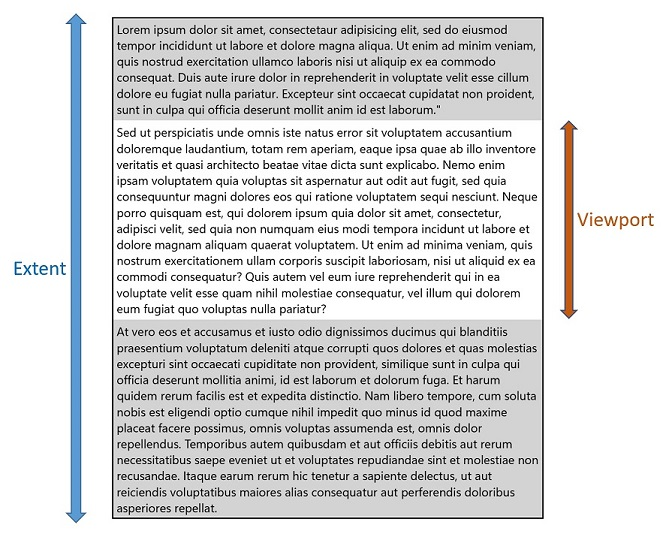
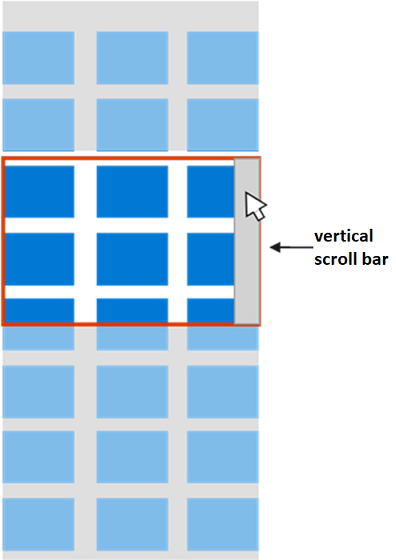
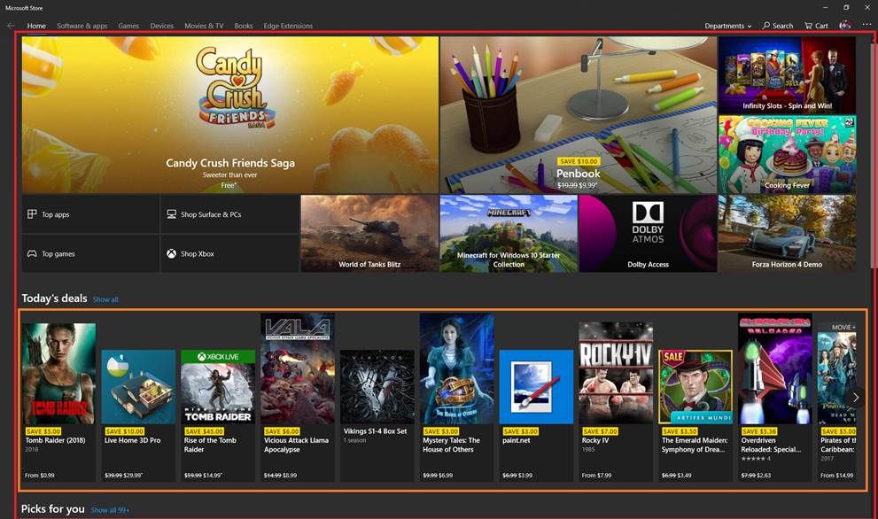
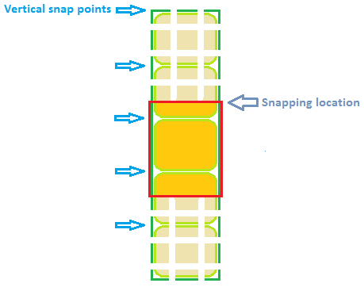
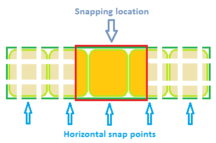

**WinUI** API Specification : **ScrollView**
===============================================
# Background

(Full Summary, Rationale, and High-Level Plan in the proposal on GitHub: [A more flexible ScrollViewer](https://github.com/Microsoft/microsoft-ui-xaml/issues/108))

Xaml has a [ScrollViewer](https://docs.microsoft.com/uwp/api/Windows.UI.Xaml.Controls.ScrollViewer) control 
for scrolling content, using scroll bars and panning, etc. Typical uses are as the root of a page whose 
content might not fit; and a ListView, which internally uses a ScrollViewer for its list of items. 

_Spec note:_
_Mike: "Do we need this paragraph/example? ScrollView vs ScrollViewer is confusing, and dwelling on 
ScrollViewer (which is not the subject of this spec) just adds to the confusion."_

For example the following shows a large text block that wraps horizontally and scrolls vertically:

```xml
<Page xmlns="http://schemas.microsoft.com/winfx/2006/xaml/presentation">
    <ScrollViewer>
        <TextBlock Text="{x:Bind AllTheText}" TextWrapping="Wrap" />
    </ScrollViewer>
</Page>
```

The touch support in ScrollViewer is implemented with [DirectManipulation](https://docs.microsoft.com/en-us/previous-versions/windows/desktop/directmanipulation/direct-manipulation-portal), 
and has a lot of complicated history and implementation and dev experience. And DirectManipulation is deprecated, 
replaced by [InteractionTracker](https://docs.microsoft.com/en-us/uwp/api/Windows.UI.Composition.Interactions.InteractionTracker). 
(See also [Benefits of InteractionTracker](#Benefits-of-InteractionTracker) later in this document.)

This spec describes a new ScrollViewer control named `ScrollView`. This new control is highly aligned 
in behavior and API with the existing ScrollViewer control, but is based on InteractionTracker, has 
new features such as animation-driven view changes, and is also designed to ensure full functionality 
of [ItemsRepeater](https://docs.microsoft.com/uwp/api/Microsoft.UI.Xaml.Controls.ItemsRepeater).

`ScrollView` is not yet a full replacement for ScrollViewer. So the latter is not yet being deprecated. 
`ScrollView` will continue to be developed (in open source) after its first release as part of the 
WinUI framework package.

In order to avoid naming conflicts since the old and new controls are in the same Microsoft.UI.Xaml.Controls 
namespace, the new control is called `ScrollView`. 

The above example becomes (simply renaming the control):

```xml
<Page xmlns=<http://schemas.microsoft.com/winfx/2006/xaml/presentation>
      xmlns:mux="using:Microsoft.UI.Xaml.Controls">
    <mux:ScrollView>
        <TextBlock Text="{x:Bind AllTheText}" TextWrapping="Wrap" />
    </mux:ScrollView>
</Page>
```

A few key points:
  - `ScrollView` performs scrolling, panning, and zooming. There's no good word that covers that, and 
  given the existing ScrollViewer naming, this is being called just *Scrolling*View. And the word 
  "scroll" implies "pan" throughout.
  - This new API will largely mirror the existing control to minimize barriers to adoption.
  - The API will differ in key areas that we believe will address top points of developer confusion 
  with the existing control and/or provide meaningful improvements. For each scenario in this spec 
  the code for both the new `ScrollView` (new control) and the existing ScrollViewer (existing control) 
  are provided if different.

# Table of Contents

[Overview](#overview)  
[Examples](#layout-examples)   
[API Notes](#api-notes)   
[API Details (IDL)](#api-details)      


# Overview

_Spec note:_
_Mike: "This conceptual overview could include more of ScrollView info, and then be the same 
in both docs (or one references the other would be OK in this case).
In the end on the public docs, we'll have API pages for ScrollPresenter and ScrollView, 
and then a separate page with this section's content (some new version of today's)."_

`ScrollView` is a container control that lets the user scroll (and pan), and zoom its content.

A `ScrollView` enables content to be displayed in a smaller area than its actual size. When the content 
of the `ScrollView` is not entirely visible, it displays scrollbars that the user can use to move the 
content area that is visible. The user can use touch to pan and zoom the content, keyboard and mouse 
to scroll the content (scroll bars or mouse wheel), and mouse wheel and keyboard to zoom the content.

The area that includes all of the content of the `ScrollView` is the *extent*. The visible area of the 
content is the *viewport*.



A second kind of scrolling element, the `ScrollPresenter`, is more primitive, providing just clipping 
and translation of content, and not providing scroll bars and other features found in a `ScrollView`. 
A `ScrollView` typically uses a `ScrollPresenter` as part of its implementation (in its ControlTemplate). 
`ScrollPresenter` is in a [separate spec](ScrollPresenter.md).

The `ScrollView` adds the default user interaction widgets (scrollbars, scroll indicator, etc.) and policy. 
As a Control it can be templated and can receive keyboard focus. It has the built-in logic to decide whether 
to scroll the viewport or move focus in response to a key event. It sets the properties on its `ScrollPresenter` 
to values chosen to match common usage, for example the basic `<ScrollView/>` is configured for vertical scrolling. 

Most of the time you simply wrap content with a `ScrollView` to enable a default scrolling experience when 
the content is too large to fit in the user visible area.

```xml
<mux:ScrollView>
    <mux:ItemsRepeater ItemsSource="{x:Bind Items}" ItemTemplate="{StaticResource MyTemplate}"/>
</mux:ScrollView>
```

# Layout examples

This section focuses on properties that let you define the visual layout of the `ScrollView`.

## Setting the scrollable content

This example sets a `Rectangle` as the content of the `ScrollView` control. The user only sees a 
500x400 portion of that rectangle and can scroll to see the rest of it.

*`ScrollView` (new control)*

```xml
<mux:ScrollView Width="500" Height="400">
    <Rectangle Fill="Red" Width="1000" Height="800"/>
</mux:ScrollView>
```

*ScrollViewer (existing control)*

```xml
<ScrollViewer Width="500" Height="400" HorizontalScrollBarVisibility="Auto">
    <Rectangle Fill="Red" Width="1000" Height="800"/>
</ScrollViewer>
```


## Vertical layout

The layout of the `ScrollView`'s content can be vertical, horizontal, both, or neither (for an example of 
neither, see the later Photo Viewer example). 

By default the `ScrollView`'s content layout (orientation) is set to Vertical, which means that the user 
can scroll the content up and down. Horizontal means left and right.

In the following example, the `ContentOrientation` property is left at its default value of Vertical, 
with an ItemsRepeater as the `ScrollView`'s Content. The UniformGridLayout for the ItemsRepeater positions 
the items horizontally in a row until it runs out of space (500px in this example), then positions 
the next item on the next row. The ItemsRepeater may then be taller than the 400px that the user can see, 
but the user can then scroll the content vertically.

**`ScrollView` markup (new)**

```xml
<mux:ScrollView Width="500" Height="400">
    <mux:ItemsRepeater ItemsSource="{x:Bind Albums}" ItemTemplate="{StaticResource MyTemplate}">
        <mux:ItemsRepeater.Layout>
            <mux:UniformGridLayout RowSpacing="8" ColumnSpacing="8"/>
        </mux:ItemsRepeater.Layout>
    </mux:ItemsRepeater>
</mux:ScrollView>
```

**ScrollViewer markup (existing)**

Identical to above.

## Horizontal layout

In this example the content is a StackPanel that is laying out its items horizontally. The `ScrollView`'s 
ContentOrientation property is set to Horizontal to allow the content to grow horizontally as much as needed.

*`ScrollView` (new)*

```xml
<mux:ScrollView Width="500" Height="400" ContentOrientation="Horizontal">
    <StackPanel Orientation="Horizontal">
        <Button Width="300" Content="Button1"/>
        <Button Width="300" Content="Button2"/>
        <Button Width="300" Content="Button3"/>
        <Button Width="300" Content="Button4"/>
        <Button Width="300" Content="Button5"/>
    </StackPanel>
</mux:ScrollView>
```

*ScrollViewer (existing)*

```xml
<ScrollViewer Width="500" Height="400"
    HorizontalScrollBarVisibility="Auto" VerticalScrollBarVisibility="Disabled">
    <StackPanel Orientation="Horizontal">
        <Button Width="300" Content="Button1"/>
        <Button Width="300" Content="Button2"/>
        <Button Width="300" Content="Button3"/>
        <Button Width="300" Content="Button4"/>
        <Button Width="300" Content="Button5"/>
    </StackPanel>
</ScrollViewer>
```

## Two-dimensional (unconstrained) layout

In this example the ContentOrientation is set to Both, indicating that the content can be scrolled 
both horizontally and vertically. The content's layout is unconstrained, meaning that it can be as 
wide and high as it wants to be, though the user will only be able to see what fits into the 
500x400 viewport.

The Image's natural size may be 2880 x 1800 and would be rendered using that size, but only 500x400 
of the image would be displayed at a time.


*`ScrollView` (new)*

```xml
<mux:ScrollView Width="500" Height="400" 
    ContentOrientation="Both">
    <Image Source="Assets/LargeEiffelTower.png"/>
</mux:ScrollView>
```

*ScrollViewer (existing)*

```xml
<ScrollViewer Width="500" Height="400" HorizontalScrollBarVisibility="Auto">
    <Image Source="Assets/LargeEiffelTower.png"/>
</ScrollViewer>
```

## A Photo Viewer - Constrained to the Viewport Layout
In this example the image will scale to fill the viewport while preserving its aspect ratio. 

This is accomplished by:
- Setting the ContentOrientation to None, indicating that the content should be constrained to fit 
within the `ScrollView`'s space
- Setting the Image's Stretch to Uniform, indicating that it should stretch up or down to fill its 
space without changing shape. 

Since ZoomMode is enabled, the user can zoom in and then scroll.


**`ScrollView` (new)**

```xml
<mux:ScrollView ContentOrientation="None" ZoomMode="Enabled">
    <Image Stretch="Uniform" Source="Assets/LargeEiffelTower.png"/>
</mux:ScrollView>
```

The following example is similar but uses a Viewbox control rather than an Image.

Or more generally for any XAML content a [Viewbox](https://docs.microsoft.com/uwp/api/Windows.UI.Xaml.Controls.Viewbox) 
could  be used. The content will be scaled to fit into the viewport, but the user can then zoom in and scroll through it.

```xml
<mux:ScrollView ContentOrientation="None" ZoomMode="Enabled">
    <Viewbox>
        ...
    </Viewbox>
</mux:ScrollView>
```

*ScrollViewer (existing)*

In the past this required inserting a Viewbox and binding its MaxHeight/MaxWidth to the ViewportHeight/ViewportWidth 
of the ScrollViewer which is just trying to constrain the layout of Viewbox to the size of the viewport. Having a "None" 
option on the `ScrollView`'s 'ContentOrientation enables the same thing in a more performant way with less markup/code.

```xml
<ScrollViewer x:Name="outputScrollViewer" HorizontalScrollBarVisibility="Auto">
    <Viewbox MaxWidth="{x:Bind outputScrollViewer.ViewportWidth, Mode=OneWay}"  
             MaxHeight="{x:Bind outputScrollViewer.ViewportHeight, Mode=OneWay}">
        <Image Source="Assets/LargeEiffelTower.png"/>
    </Viewbox>
</ScrollViewer>
```

## Controlling the presence of scroll bars

By default, a `ScrollView` has [ScrollBar](https://docs.microsoft.com/uwp/api/Windows.UI.Xaml.Controls.Primitives.ScrollBar) 
controls that allow the user to move the content within the `ScrollView` using the mouse or pen. 
A `ScrollBar` does not support touch-based user interactions though.

### Using the default Auto settings

The default value of the Horizontal/VerticalScrollBarVisibility properties is 'Auto'. The following 
pictures show examples of this default behavior for the scroll bars in a `ScrollView`. 

1.  The `ScrollView`'s content is arranged to stay within the width of the viewport but not the height. 
Only the vertical scroll bar appears.



2.  Because the `ScrollView`'s content is arranged larger than the viewport in both directions, 
the two scroll bars and their separator appear.


### Hiding both scroll bars

In this example the scroll bars are hidden, meaning that it won't be possible to scroll the content 
with scroll bars. Scrolling by other means is still permitted.

*`ScrollView` (new)*

```xml
<mux:ScrollView Width="500" Height="400"
    ContentOrientation="Both"
    HorizontalScrollBarVisibility="Hidden"
    VerticalScrollBarVisibility="Hidden">
    <Image Source="Assets/LargeParisMap.png"/>
</mux:ScrollView>
```

*ScrollViewer (existing)*

```xml
<ScrollViewer Width="500" Height="400"
    HorizontalScrollBarVisibility="Hidden"
    VerticalScrollBarVisibility="Hidden">
    <Image Source="Assets/LargeParisMap.png"/>
</ScrollViewer>
```


# Interactivity examples

This section focuses on properties that let you define the user interaction capabilities with the `ScrollView`.

## Controlling user's ability to zoom
Enable zooming through user interaction using the `ZoomMode` property (which is Disabled by default). 
Changes to the ZoomMode property take effect immediately and may affect an on-going user interaction.

*`ScrollView` (new)*

```xml
<mux:ScrollView Width="500" Height="400" ContentOrientation="Both" ZoomMode="Enabled">
    <Image Source="Assets/LargeParisMap.png"/>
</mux:ScrollView>
```

*ScrollViewer (existing)*

```xml
<ScrollViewer Width="500" Height="400" HorizontalScrollBarVisibility="Auto" ZoomMode="Enabled">
    <Image Source="Assets/LargeParisMap.png"/>
</ScrollViewer>
```

## Controlling the Minimum and Maximum Zoom Factor
Use the `MinZoomFactor` and `MaxZoomFactor` properties to control the amount the user may zoom the content. 
These properties are effective for both user interactions and programmatic API calls.

*`ScrollView` (new)*

```xml
<mux:ScrollView Width="500" Height="400" ContentOrientation="Both"
    ZoomMode="Enabled" 
    MinZoomFactor="1.0" MaxZoomFactor="2.0">
    <Image Source="Assets/LargeParisMap.png"/>
</mux:ScrollView>
```

*ScrollViewer (existing)*

```xml
<ScrollViewer Width="500" Height="400" HorizontalScrollBarVisibility="Auto"
    ZoomMode="Enabled" MinZoomFactor="1.0" MaxZoomFactor="2.0">
    <Image Source="Assets/LargeParisMap.png"/>
</ScrollViewer>
```

## Controlling the user's ability to scroll

The `ScrollView`'s HorizontalScrollMode and VerticalScrollMode properties affect the user interactivity 
of the control. They do not affect its layout.

HorizontalScrollMode determines whether the user can interact with the control with touch, mouse wheel, 
scroll bar, etc. to scroll the content horizontally. Similarly VerticalScrollMode is for the vertical 
direction. The content can still be scrolled programatically though.

The possible values are Enabled and Disabled, and the default value for both directions is Enabled.

When the scroll mode is Enabled and the content is smaller than the viewport, the user can still 
wiggle (overpan) the content with touch input.

Changes to the HorizontalScrollMode and VerticalScrollMode properties take effect immediately and 
may affect an on-going user interaction.

This example shows vertical-only scrolling. Even though the content is wider than the viewport, 
the user cannot scroll horizontally.

*`ScrollView` (new)*

```xml
<mux:ScrollView x:Name="ScrollView"
    HorizontalScrollMode="Disabled" VerticalScrollMode="Enabled"
    ContentOrientation="Both">
    <Grid ...>
        ...
    </Grid>
</mux:ScrollView>
```

This example shows horizontal-only scrolling. Even if the content is taller than the viewport, 
the user cannot scroll vertically.

*`ScrollView` (new)*

```xml
<mux:ScrollView x:Name="ScrollView"
    HorizontalScrollMode="Enabled" VerticalScrollMode="Disabled"
    ContentOrientation="Both">
    <Grid ...>
        ...
    </Grid>
</mux:ScrollView>
```

## Turning off built-in MouseWheel support

In this example the mouse wheel is disabled from scrolling the `ScrollView`. This allows the PointerWheelChanged 
events to be processed to respond to mouse-wheel input in a custom way while still leaving Pen and Touch inputs 
active for the `ScrollView`.

*`ScrollView` (new)*

```xml
<mux:ScrollView ContentOrientation="Both" IgnoredInputKinds="MouseWheel">
    <SwapChainPanel Width="40000" Height="40000">
        ...
    </SwapChainPanel>
</mux:ScrollView>
```

The most common scenario is an experience like the Microsoft Store application where several horizontally 
scrollable lists are stacked vertically. By default the mouse wheel will scroll an inner horizontal list, 
but the user expects it to vertically scroll the outer list.



In this example, the orange rectangle represents an inner `ScrollView` for a horizontal ListView. The red 
rectangle represents an outer vertical `ScrollView`. By default, the inner `ScrollView` would scroll 
horizontally with the mouse-wheel, but in this case the app wants the outer vertical `ScrollView` to 
scroll instead. So instead set innerScrollView.IgnoredInputKinds = ScrollingInputKinds.MouseWheel.

## Turning off built-in Pen support

In this example from a canvas-based design app, pen input is being used to directly draw on the scrollable 
surface or perform lasso selection instead of scrolling it. MouseWheel, Touch, etc. inputs remain active 
for scrolling.


*`ScrollView` (new)*

```xml
<mux:ScrollView Width="500" Height="400" ContentOrientation="Both" IgnoredInputKinds="Pen">
    <SwapChainPanel Width="4000" Height="4000">
        ...
    </SwapChainPanel>
</mux:ScrollView>
```

*ScrollViewer (existing)*

N/A. Non-intuitive (and even non-trivial) code would be needed to achieve these.


## Disabling scroll chaining

A `ScrollView` can be in the content of (nested within) another `ScrollView`. In this configuration, 
scrolling can be "chained". For example, once the user scrolls the inner `ScrollView` up to the top, 
the outer `ScrollView` starts to scroll up.

Chaining can be disabled, though, as shown in the following examples.

This example shows a UI with a horizontal pivot control of pages. The first page's content also 
contains a horizontally scrolling list that a user should be able to scroll left/right. When the 
user reaches the end of the horizontal list it should **not** cause the page to change.


> **Credit**: Scenario and image taken from [this StackOverflow question](https://stackoverflow.com/questions/35207827/disable-pivot-swipe-during-scrolling-on-uwp-app/35765990#35765990)

This behavior is achieved by disabling horizontal scroll chaining on the page's `ScrollView` 
(the inner `ScrollView`).

*`ScrollView` (new)*

```xml
<mux:ScrollView HorizontalScrollChainMode="Never">
    <mux:ItemsRepeater ItemsSource="{x:Bind Items}">
        <mux:ItemsRepeater.Layout>
            <mux:StackLayout Orientation="Horizontal"/>
        </mux:ItemsRepeater.Layout>
        <DataTemplate x:DataType="x:String">
            <Button Content="{x:Bind}"/>
        </DataTemplate>
    </mux:ItemsRepeater>
</mux:ScrollView>
```

*ScrollViewer (existing)*

```xml
<ScrollViewer IsHorizontalScrollChainingEnabled="False">
    <mux:ItemsRepeater ItemsSource="{x:Bind Items}">
        <mux:ItemsRepeater.Layout>
            <mux:StackLayout Orientation="Horizontal"/>
        </mux:ItemsRepeater.Layout>
        <DataTemplate x:DataType="x:String">
            <Button Content="{x:Bind}"/>
        </DataTemplate>
    </mux:ItemsRepeater>
</ScrollViewer>
```

## Controlling zoom chaining between nested scrollers

Zoom chaining is similar to scroll chaining. For example once the inner control is zoomed out to 
its maximum, the outer control is zoomed out.

In the following example zoom chaining is disabled.

*`ScrollView` (new)*

```xml
<mux:ScrollView ZoomMode="Enabled" ZoomChainMode="Never">
    <mux:ItemsRepeater ItemsSource="{x:Bind Items}">
        <mux:ItemsRepeater.Layout>
            <mux:StackLayout/>
        </mux:ItemsRepeater.Layout>
        <DataTemplate x:DataType="x:String">
            <Button Content="{x:Bind}"/>
        </DataTemplate>
    </mux:ItemsRepeater>
</mux:ScrollView>
```

*ScrollViewer (existing)*

```xml
<ScrollViewer ZoomMode="Enabled" IsZoomChainingEnabled="False">
    <mux:ItemsRepeater ItemsSource="{x:Bind Items}">
        <mux:ItemsRepeater.Layout>
            <mux:StackLayout/>
        </mux:ItemsRepeater.Layout>
        <DataTemplate x:DataType="x:String">
            <Button Content="{x:Bind}"/>
        </DataTemplate>
    </mux:ItemsRepeater>
</ScrollViewer>
```

## Controlling railing behavior

When touch panning is enabled in both vertical and horizontal directions, by default the user can 
pan in one direction at a time, but not both at the same time (the user can't pan diagonally). 
This can be controlled with the `Horizontal/VerticalScrollRailMode` properties. Both properties 
default to Enabled.

In this example, all railing is turned off, so the user can always pan in all directions.

*`ScrollView` (new)*

```xml
<mux:ScrollView HorizontalScrollRailMode="Disabled" VerticalScrollRailMode="Disabled"
    ContentOrientation="Both">
    <SwapChainPanel x:Name="swapChainPanelMap" Width="40000" Height="40000">
        ...
    </SwapChainPanel>
</mux:ScrollView>
```

*ScrollViewer (existing)*

```xml
<ScrollViewer IsHorizontalRailEnabled="False" IsVerticalRailEnabled="False"
    HorizontalScrollBarVisibility="Auto">
    <SwapChainPanel x:Name="swapChainPanelMap" Width="40000" Height="40000">
        ...
    </SwapChainPanel>
</ScrollViewer>
```


## Using element anchoring

When the content of a `ScrollView` changes, it may or may not be desirable to change the content offset.

For example, a `ScrollView` can be used to make a list of items scrollable, and the list of items could 
change. Maybe an item is added which is earlier than what is currently displayed (lower viewport offset), 
or maybe later. Often, for either case, you want the content being shown not to change.

In the following example, the element in the middle of the viewport, in the vertical list, remains 
anchored vertically when the source collection is modified.

Note that this behavior depends on the [UIElement.CanBeScrollAnchor](https://docs.microsoft.com/uwp/api/Windows.UI.Xaml.UIElement.CanBeScrollAnchor) 
being set, which is handled by the ItemsRepeater.

*`ScrollView` (new)*

```xml
<mux:ScrollView VerticalAnchorRatio="0.5">
    <mux:ItemsRepeater ItemsSource="{x:Bind Items}">
        <mux:ItemsRepeater.Layout>
            <mux:StackLayout Orientation="Vertical"/>
        </mux:ItemsRepeater.Layout>
        <DataTemplate x:DataType="x:String">
            <Button Content="{x:Bind}"/>
        </DataTemplate>
    </mux:ItemsRepeater>
</mux:ScrollView>
```

*ScrollViewer (existing)*

Identical to above.


# Using Layout-centric Properties and Events in Code

The samples in this section focus on using properties and events that relate to the layout aspects 
of the `ScrollView` control.


## Shrink the extents by a certain percentage of the current factor

This example defines a DecreaseZoomFactor method that decreases the content's zoom factor by the 
provided percentage. For instance, if the current zoom factor is 5, calling DecreaseZoomFactor(0.1) 
reduces the zoom factor by 10%, to 4.5, using the content's center in the scaling operation.

*`ScrollView` (new)*

```csharp
private void DecreaseZoomFactor(float percent)
{
    _scrollView.ZoomBy(
        zoomFactorDelta: -_scrollView.ZoomFactor * percent,
        centerPoint: null);
}
```

*ScrollViewer (existing)*

```csharp
private void DecreaseZoomFactor(float percent)
{
    double newHorizontalOffset = (_scrollViewer.HorizontalOffset + _scrollViewer.ViewportWidth / 2.0) * (1.0 - percent) - _scrollViewer.ViewportWidth / 2.0;
    double newVerticalOffset = (_scrollViewer.VerticalOffset + _scrollViewer.ViewportHeight / 2.0) * (1.0 - percent) - _scrollViewer.ViewportHeight / 2.0;
    _scrollViewer.ChangeView(
        newHorizontalOffset, newVerticalOffset, (1.0 - percent) * _scrollViewer.ZoomFactor);
}
```

## Incrementally load more data

In this example more data is loaded when the user has scrolled off 90% of the content. It uses 
the `ScrollView`'s ViewChanged event which gets raised whenever the _view_ changed. 
The HorizontalOffset, VerticalOffset and ZoomFactor trio constitute the view.

*`ScrollView` (new)*

```xml
<mux:ScrollView ViewChanged="ScrollView_ViewChanged">
    <mux:ItemsRepeater ItemsSource="{x:Bind Albums}" ItemTemplate="{StaticResource MyTemplate}">
        <mux:ItemsRepeater.Layout>
            <mux:UniformGridLayout RowSpacing="8" ColumnSpacing="8"/>
        </mux:ItemsRepeater.Layout>
    </mux:ItemsRepeater>
</mux:ScrollView>
```

```csharp
private void ScrollView_ViewChanged(ScrollView sender, object args)
{
    if (sender.VerticalOffset >= 0.9 * sender.ScrollableHeight && !_isLoadingMoreData)
    {
        _isLoadingMoreData = LoadMoreData();
    }
}
```

*ScrollViewer (existing)*

Same as above

# Using Interaction-centric Properties and Events in Code

This example disables a custom ZoomBar control during the user's interactions with the `ScrollView`.

*`ScrollView` (new)*

```csharp
private void ScrollView_StateChanged(ScrollView scrollView, object args)
{
    _zoomBar.IsEnabled = scrollView.State != ScrollingInteractionState.Interaction;
}
```

*ScrollViewer (existing)*

```csharp
private void ScrollViewer_DirectManipulationStarting(object sender, object args)
{
    _zoomBar.IsEnabled = false;
}

private void ScrollViewer_DirectManipulationCompleted(object sender, object args)
{
    _zoomBar.IsEnabled = true;
}
```


# Using View-centric Methods and Events in Code

## Changing the offsets

### Immediately Jumping to an Offset 

In this example the `ScrollView` control is used in a word processor which allows the user to search 
for a term in the text document. The application can jump to scrolling offsets in order to bring the 
searched term into view using the `ScrollTo` method.

*`ScrollView` (new)*

```csharp

// Jump to scrolling offsets to bring first occurrence of search term into view.
private void JumpToFirstSearchTermOccurrence(string searchTerm)
{
    double horizontalOffset, verticalOffset;
    
    ComputeOffsetsForSearchTerm(searchTerm, ref horizontalOffset, ref verticalOffset);

    _scrollView.ScrollTo(
        horizontalOffset: horizontalOffset,
        verticalOffset: verticalOffset,
        options: new ScrollingScrollOptions(ScrollingAnimationMode.Disabled));
}
```

*ScrollViewer (existing)*

```csharp
private void JumpToFirstSearchTermOccurrence(string searchTerm)
{
    double horizontalOffset, verticalOffset;
    
    ComputeOffsetsForSearchTerm(searchTerm, ref horizontalOffset, ref verticalOffset);

    _scrollViewer.ChangeView(
        horizontalOffset: horizontalOffset,
        verticalOffset: verticalOffset,
        zoomFactor: null,
        disableAnimation: true);
}
```

### Animating to an offset

In this example a custom list control with a `ScrollView` in its control template animates the 
vertical offset to special values when processing the Home and End keystrokes.

More precisely, the Home key animates to the top of the content excluding the top header and presenving 
the current horizontal offset. Thus the top header ends up being scrolled off.

The End key similarly animates to the bottom of the content exclusing the bottom header and presenving 
the current horizontal offset. 

*`ScrollView` (new)*

```csharp
protected override void OnKeyUp(KeyRoutedEventArgs e)
{
    base.OnKeyUp(e);
    if (e.Key == VirtualKey.Home)
    {
        _scrollView.ScrollTo(
            _scrollView.HorizontalOffset,
            Math.Min(_scrollView.ScrollableHeight, _headerHeight));
    }
    else if (e.Key == VirtualKey.End)
    {
        _scrollView.ScrollTo(
            _scrollView.HorizontalOffset,
            Math.Max(0, _scrollView.ScrollableHeight - _footerHeight));
    }
}
```

*ScrollViewer (existing)*

```csharp
protected override void OnKeyUp(KeyRoutedEventArgs e)
{
    base.OnKeyUp(e);
    if (e.Key == VirtualKey.Home)
    {
        _scrollViewer.ChangeView(
            horizontalOffset: null,
            verticalOffset: _headerHeight,
            zoomFactor: null);
    }
    else if (e.Key == VirtualKey.End)
    {
        _scrollViewer.ChangeView(
            horizontalOffset: null,
            verticalOffset: _scrollViewer.ScrollableHeight - _footerHeight,
            zoomFactor: null);
    }
}
```

### Jump by some delta of the current offset (no animation)

A custom horizontal list control with a `ScrollView` in its control template jumps the horizontal offset 
by special values when processing the Left and Right Arrow keystrokes, for a FlipView-like experience.

Both provided offsets are clamped by the ScrollBy method according to the content's extent. Thus the 
`ScrollView` will not jump to offsets beyond the boundaries of its content - instead it will jump to 
the clamped offsets.

*`ScrollView` (new)*

```csharp
protected override void OnKeyUp(KeyRoutedEventArgs e)
{
    base.OnKeyUp(e);
    if (e.Key == VirtualKey.Left)
    {
        _scrollView.ScrollBy(
            horizontalOffsetDelta: -_previousGroup.Width,
            verticalOffsetDelta: 0.0,
            new ScrollingScrollOptions(ScrollingAnimationMode.Disabled));
    }
    else if (e.Key == VirtualKey.Right)
    {
        _scrollView.ScrollBy(
            horizontalOffsetDelta: _currentGroup.Width,
            verticalOffsetDelta: 0.0,
            new ScrollingScrollOptions(ScrollingAnimationMode.Disabled));
    }
}
```

*ScrollViewer (existing)*

```csharp
protected override void OnKeyUp(KeyRoutedEventArgs e)
{
    base.OnKeyUp(e);
    if (e.Key == VirtualKey.Left)
    {
        _scrollViewer.ChangeView(
            horizontalOffset: _scrollViewer.HorizontalOffset - _previousGroup.Width),
            verticalOffset: null,
            zoomFactor: null,
            disableAnimation: true);
    }
    else if (e.Key == VirtualKey.Right)
    {
        _scrollViewer.ChangeView(
            horizontalOffset: _scrollViewer.HorizontalOffset + _currentGroup.Width),
            verticalOffset: null,
            zoomFactor: null,
            disableAnimation: true);
    }
}
```

### Animating with a custom curve to a new offset by some delta of the current

The changes to the Value of a Slider trigger the animation of the `ScrollView`'s VerticalOffset, 
using custom animation durations.

When animating, rather than jumping like in the prior example, the provided offsets are not clamped 
according to the current content extent. The content may first animate to an out-of-bounds target and 
then animate back to the closest in-bounds offsets.

When ScrollBy or ScrollTo triggers an animation (as opposed to a jump), the ScrollAnimationStarting 
event is raised asynchronously just before the animation starts. In that event handler, the animation 
curve can be customized.

The ScrollingScrollAnimationStartingEventArgs.Animation provided in the ScrollAnimationStarting event 
is always of type Vector3KeyFrameAnimation, but it can be overwritten in that event handler to any type 
of CompositionAnimation. Or it can be customized as is done in this example.
The `ScrollView`'s HorizontalOffset and VerticalOffset properties will land on values according to that 
custom animation, whether they are the original target values or not.

*`ScrollView` (new)*

```csharp
// This variable is used to keep track of the ScrollBy operations triggered by interactions with the Slider.
// Other programmatic view changes, which also trigger the ScrollAnimationStarting event, will not use a 
// custom curve because their correlation ID are not recorded in the hash table.
private HashSet<int> _scrollsWithCustomDuration = new HashSet<int>();

private void VerticalOffsetSlider_ValueChanged(object sender, RangeBaseValueChangedEventArgs e)
{
    double verticalOffsetDelta = GetOffsetDelta(e.NewValue);
    int correlationId = _scrollView.ScrollBy(0.0, verticalOffsetDelta);
    _scrollsWithCustomDuration.Add(correlationId);
}

private void ScrollView_ScrollAnimationStarting(ScrollView scrollView, ScrollingScrollAnimationStartingEventArgs e)
{
    if (_scrollsWithCustomDuration.Contains(e.CorrelationId))
    {
        TimeSpan animationDuration = GetAnimationCustomDuration(e.StartPosition, e.EndPosition);
        (e.Animation as Vector3KeyFrameAnimation).Duration = animationDuration;
        _scrollsWithCustomDuration.Remove(e.CorrelationId);
    }
}
```

*ScrollViewer (existing)*

Not supported

### Animating the Offsets with Additional Velocity

In this example the `ScrollView`'s scrolling velocity is driven by a bi-dimensional joystick widget. 
The more the joystick is off-center, the higher the `ScrollView`'s scrolling velocity (in both directions). 
You can also think of the "joystick" here as the compass-like cursor you might see when clicking the 
mouse-wheel to initiate a scrolling mode.

*`ScrollView` (new)*

```csharp
private void MainPage()
{
    _requestScrollTimer.Interval = new TimeSpan(0, 0, 0, 1); // 1 second interval
}

private void Joystick_PositionChanged(Joystick joystick, object args)
{
    if (joystick.HorizontalValue != 0.0 || joystick.VerticalValue != 0.0)
    {
        if (!_requestScrollTimer.IsEnabled)
        {
            // Adjust `ScrollView`'s velocity at most once a second as long as joystick isn't centered.
            AdjustScrollViewVelocity();
            _requestScrollTimer.Start();
        }
    }
    else if (_requestScrollTimer.IsEnabled)
    {
        _requestScrollTimer.Stop();
    }
}

private void RequestScrollTimer_Tick(object sender, object e)
{
    AdjustScrollViewVelocity();
}

private void AdjustScrollViewVelocity()
{
    _scrollView.AddScrollVelocity(
        offsetsVelocity: new Vector2(80*_joystick.HorizontalValue, 80*_joystick.VerticalValue),
        inertiaDecayRate: new Vector2(0.975, 0.975));
}
```

*ScrollViewer (existing)*

Not supported


## Changing the zoom factor

###  Jumping to zoom factor

The changes to the Value of a Slider trigger zoom factor changes without animations.

*`ScrollView` (new)*

```csharp
private void ZoomFactorSlider_ValueChanged(object sender, RangeBaseValueChangedEventArgs e)
{
    _scrollView.ZoomTo(
        zoomFactor: e.NewValue,
        centerPoint: null, // Use the viewport center as the zoom center point.
        options: new ScrollingZoomOptions(ScrollingAnimationMode.Disabled));
}
```

*ScrollViewer (existing)*

```csharp
private void ZoomFactorSlider_ValueChanged(object sender, RangeBaseValueChangedEventArgs e)
{
    _scrollViewer.ChangeView(
        horizontalOffset: (_scrollViewer.HorizontalOffset + _scrollViewer.ViewportWidth / 2) *
            e.NewValue / _scrollViewer.ZoomFactor - _scrollViewer.ViewportWidth / 2,
        verticalOffset: (_scrollViewer.VerticalOffset + _scrollViewer.ViewportHeight / 2) *
            e.NewValue / _scrollViewer.ZoomFactor - _scrollViewer.ViewportHeight / 2,
        zoomFactor: e.NewValue,
        disableAnimation: true);
}
```

### Animating to zoom factor

A custom map control with a `ScrollView` in its control template animates the zoom factor to special 
values when processing the Ctrl+Home and Ctrl+End keystrokes.

*`ScrollView` (new)*

```csharp
protected override void OnKeyUp(KeyRoutedEventArgs e)
{
    base.OnKeyUp(e);

    if (!CoreWindow.GetForCurrentThread().GetKeyState(VirtualKey.Control).HasFlag(CoreVirtualKeyStates.Down))
    {
        return;
    }

    if (e.Key == VirtualKey.Home)
    {
        _scrollView.ZoomTo(
            zoomFactor: _scrollView.MinZoomFactor,
            centerPoint: null);
    }
    else if (e.Key == VirtualKey.End)
    {
        _scrollView.ZoomTo(
            zoomFactor: _scrollView.MaxZoomFactor,
            centerPoint: null);
    }
}
```

*ScrollViewer (existing)*

```csharp
protected override void OnKeyUp(KeyRoutedEventArgs e)
{
    base.OnKeyUp(e);

    if (!CoreWindow.GetForCurrentThread().GetKeyState(VirtualKey.Control).HasFlag(CoreVirtualKeyStates.Down))
    {
        return;
    }

    if (e.Key == VirtualKey.Home)
    {
        _scrollViewer.ChangeView(
            (_scrollViewer.HorizontalOffset + _scrollViewer.ViewportWidth / 2) * _scrollViewer.MinZoomFactor / _scrollViewer.ZoomFactor - _scrollViewer.ViewportWidth / 2,
            (_scrollViewer.VerticalOffset + _scrollViewer.ViewportHeight / 2) * _scrollViewer.MinZoomFactor / _scrollViewer.ZoomFactor - _scrollViewer.ViewportHeight / 2,
            _scrollViewer.MinZoomFactor);
    }
    else if (e.Key == VirtualKey.End)
    {
        _scrollViewer.ChangeView(
            (_scrollViewer.HorizontalOffset + _scrollViewer.ViewportWidth / 2) * _scrollViewer.MaxZoomFactor / _scrollViewer.ZoomFactor - _scrollViewer.ViewportWidth / 2,
            (_scrollViewer.VerticalOffset + _scrollViewer.ViewportHeight / 2) * _scrollViewer.MaxZoomFactor / _scrollViewer.ZoomFactor - _scrollViewer.ViewportHeight / 2,
            _scrollViewer.MaxZoomFactor);
    }
}
```

### Jumping by zoom factor delta

A custom map control with a `ScrollView` in its control template jumps immediately (no animation) 
the zoom factor by special values when processing the Ctrl+Minus and Ctrl+Plus keystrokes.

*`ScrollView` (new)*

```csharp
protected override void OnKeyUp(KeyRoutedEventArgs e)
{
    base.OnKeyUp(e);

    if (!CoreWindow.GetForCurrentThread().GetKeyState(VirtualKey.Control).HasFlag(CoreVirtualKeyStates.Down))
    {
        return;
    }

    if (e.Key == VirtualKey.Subtract || e.Key == VirtualKey.Add)
    {
        float zoomFactorDelta = GetKeyboardZoomDelta(e);
        Vector2 centerPoint = GetKeyboardZoomCenterPoint();
        _scrollView.ZoomBy(
            zoomFactorDelta,
            centerPoint,
            new ScrollingScrollOptions(ScrollingAnimationMode.Disabled));
    }
}
```

*ScrollViewer (existing)*

```csharp
protected override void OnKeyUp(KeyRoutedEventArgs e)
{
    base.OnKeyUp(e);

    if (!CoreWindow.GetForCurrentThread().GetKeyState(VirtualKey.Control).HasFlag(CoreVirtualKeyStates.Down))
    {
        return;
    }

    if (e.Key == VirtualKey.Subtract || e.Key == VirtualKey.Add)
    {
        float zoomFactorDelta = GetKeyboardZoomDelta(e);
        Vector2 centerPoint = GetKeyboardZoomCenterPoint();
        double horizontalOffset = ComputeTargetHorizontalOffset(
            scrollViewer: _scrollViewer,
            zoomFactorDelta: zoomFactorDelta,
            centerPoint: centerPoint);
        double verticalOffset = ComputeTargetVerticalOffset(
            scrollViewer: _scrollViewer,
            zoomFactorDelta: zoomFactorDelta,
            centerPoint: centerPoint);
        _scrollViewer.ChangeView(
            horizontalOffset: horizontalOffset,
            verticalOffset: verticalOffset,
            zoomFactor: _scrollViewer.ZoomFactor + zoomFactorDelta,
            disableAnimation: true);
    }
}
```

### Animate by zoom factor delta with custom animation

A Slider's Value changes are used to animate the `ScrollView`'s ZoomFactor, using custom animations.

The ScrollingZoomAnimationStartingEventArgs.Animation provided in the ZoomAnimationStarting event 
is always of type ScalarKeyFrameAnimation. It can be customized or completely overwritten (to any 
type of CompositionAnimation) as it is done in this example.
The `ScrollView`'s ZoomFactor property will land on a value according to that custom animation, 
whether it is the original target value or not.

*`ScrollView` (new)*

```csharp
private void ZoomFactorSlider_ValueChanged(object sender, RangeBaseValueChangedEventArgs e)
{
    float zoomFactorDelta = GetZoomFactorDelta(e.NewValue);
    _scrollView.ZoomBy(
        zoomFactorDelta,
        centerPoint: null);
}

private void ScrollView_ZoomAnimationStarting(ScrollView scrollView, ScrollingZoomAnimationStartingEventArgs e)
{
    CompositionAnimation animation = GetCustomZoomAnimation(
        e.StartZoomFactor,
        e.EndZoomFactor,
        e.CenterPoint);
        e.Animation = animation;
}
```

*ScrollViewer (existing)*

Not supported

### Animate zoom factor with additional velocity

A `ScrollView`'s zooming velocity is animated by a unidimensional joystick widget. The more the joystick is 
off-center, the higher the `ScrollView`'s zooming velocity.

*`ScrollView` (new)*

```csharp
private void MainPage()
{
    _requestScrollTimer.Interval = new TimeSpan(0, 0, 0, 1); // 1 second interval
}

private void VerticalJoystick_PositionChanged(VerticalJoystick verticalJoystick, object args)
{
    if (verticalJoystick.Value != 0.0)
    {
        if (!_requestZoomTimer.IsEnabled)
        {
            // Adjust `ScrollView`'s velocity at most once a second as long as joystick isn't centered.
            AdjustScrollViewZoomFactor();
            _requestZoomTimer.Start();
        }
    }
    else if (_requestZoomTimer.IsEnabled)
    {
        _requestZoomTimer.Stop();
    }
}

private void RequestZoomTimer_Tick(object sender, object e)
{
    AdjustScrollViewZoomFactor();
}

private void AdjustScrollViewZoomFactor()
{
    _scrollView.AddZoomVelocity(
    zoomFactorVelocity: 12 * _verticalJoystick.Value,
    inertiaDecayRate: 0.975);
}
```

*ScrollViewer (existing)*

Not supported


## Customizing the bring-into-view participation

When the framework raises a FrameworkElement.RequestBringIntoView event, `ScrollView` instances in the 
parent chain attempt to participate. Just before a `ScrollView` launches an animation for its participation, 
it raises its BringingIntoView event so the listener can customize that participation.

###  Adjust target offset for sticky headers

This example shows a list control that supports sticky headers. Vertically sticky headers are group headers 
that stick at the top of the scrolling surface as long as items of that group are displayed. 
The `ScrollView`'s BringingIntoView event is handled to adjust the target vertical offset to account for the 
sticky header's presence which the `ScrollView` is unaware of.

*`ScrollView` (new)*

```csharp
private void ScrollView_BringingIntoView(ScrollView scrollView, ScrollingBringingIntoViewEventArgs e)
{
    // Adjust the BringIntoViewRequestedEventArgs instance stored in e.RequestEventArgs based on the provided target vertical offset.
    AdjustOffsetForStickyHeader(e.RequestEventArgs, e.TargetVerticalOffset);
}
```

*ScrollViewer (existing)*

Not supported

### Detect end of bring-into-view contribution

This example shows how you can know when a bring-into-view contribution starts and ends in order to temporarily 
turn off user interactions during the contribution.

A bring-into-view animation, if allowed to proceed in the BringingIntoView event handler, will cancel any scroll 
or zoom animation that might be in progress.

The BringingIntoView event is raised even when the default `ScrollView` contribution is nil because the targeted 
area is already in view.

The ScrollingBringingIntoViewEventArgs instance provided to the event handler exposes a correlation ID. This is 
the beginning of that correlation ID's lifetime.
It ends in the subsequent ScrollCompleted event where it is exposed for a last time in the provided 
ScrollingScrollCompletedEventArgs instance.

*`ScrollView` (new)*

```csharp
private void ScrollView_BringingIntoView(ScrollView scrollView, ScrollingBringingIntoViewEventArgs e)
{
    _bringIntoViewCorrelationId = e.CorrelationId;
    scrollView.IgnoredInputKinds = ScrollingInputKinds.All;
}

private void ScrollView_ScrollCompleted(ScrollView scrollView, ScrollingScrollCompletedEventArgs e)
{
    if (_bringIntoViewCorrelationId == e.CorrelationId)
    {
        scrollView.IgnoredInputKinds = ScrollingInputKinds.None;
    }
}
```

*ScrollViewer (existing)*

Not supported


## Customize the anchor selection

The anchor element in a `ScrollView` is used to maintain the content of the viewport when the scrolling 
content changes. For example in a list, the center item's position on screen can be maintained when items 
earlier in the list are removed.

The `ScrollView` raises its AnchorRequested event to allow handlers to influence the anchor selection. 
AnchorRequested is raised within the `ScrollView`'s arrange pass, before its content is arranged and 
its properties are updated.

### Set an explicit anchor element

This example shows a Grid in a `ScrollView`, and uses a custom algorithm to select an anchor based on 
an internal currency element in the Grid.

*`ScrollView` (new)*

```csharp
private void ScrollView_AnchorRequested(ScrollView scrollView, ScrollingAnchorRequestedEventArgs e)
{
    e.Anchor = SelectAnchorElement();
}
```

*ScrollViewer (existing)*

Same as above

### Populate the anchor candidates collection

This example shows an application with a vertical StackPanel in a `ScrollView`. The AnchorCandidates 
collection is populated with all the children in the StackPanel and the `ScrollView` picks an anchor 
based on the VerticalAnchorRatio property.

Note that you can instead set the UIElement.CanBeScrollAnchor boolean property to True for all 
StackPanel children.
Indeed, the `ScrollPresenter` inner component of the `ScrollView` implements the IScrollAnchorProvider 
interface and thus the XAML framework automatically calls its IScrollAnchorProvider.RegisterAnchorCandidate 
method for all UIElement children, direct or not, that have their CanBeScrollAnchor property set to True.
The `ScrollPresenter` and `ScrollViewer` elements are treated and behave the same way in that regard.

`ScrollView` also has public RegisterAnchorCandidate/UnregisterAnchorCandidate methods that delegate 
to the inner `ScrollPresenter`’s methods.

*`ScrollView` (new)*

```csharp
private void ScrollView_AnchorRequested(ScrollView scrollView, ScrollingAnchorRequestedEventArgs e)
{
    foreach (UIElement child in _stackPanel.Children)
    {
        e.AnchorCandidates.Add(child);
    }
}
```

*ScrollViewer (existing)*

Same as above


## Consuming the `ScrollView`'s Properties in Animations 

The `ScrollView` exposes a read-only property called ExpressionAnimationSources of type 
Microsoft.UI.CompositionPropertySet. It can provide inputs to Composition expressions.

Note that the inner ScrollPresenter class has the same property and the `ScrollView` just returns 
the ScrollPresenter's value.

### Vertical offset drives opacity

*`ScrollView` (new)*

```csharp
ExpressionAnimation _headerOpacityExpression = null;
private void SetupHeaderOpacityAnimation()
{
    _headerOpacityExpression = _compositor.CreateExpressionAnimation(
        "1 - (svAP.Position.Y - svAP.MinPosition.Y) / (svAP.MaxPosition.Y - svAP.MinPosition.Y)");

    _headerOpacityExpression.SetReferenceParameter("svAP", _scrollView.ExpressionAnimationSources);
    _headerVisual.StartAnimation("Opacity", _headerOpacityExpression);
}
```

*ScrollViewer (existing)*

```csharp
ExpressionAnimation _headerOpacityExpression = null;
private void SetupHeaderOpacityAnimation()
{
    CompositionPropertySet scrollingProperties =
        ElementCompositionPreview.GetScrollViewerManipulationPropertySet(_scrollViewer);

    _headerOpacityExpression = _compositor.CreateExpressionAnimation(
        "1 - sp.Translation.Y / scrollableHeight");

    _headerOpacityExpression.SetReferenceParameter(
        "sp", scrollingProperties);

    _headerOpacityExpression.SetScalarParameter(
        "scrollableHeight", (float)_scrollViewer.ScrollableHeight);

    _headerVisual.StartAnimation("Opacity", headerOpacityExpression);
}

private void ScrollViewer_SizeChanged(object sender, SizeChangedEventArgs e)
{
    if (_headerOpacityExpression != null)
    {
        _headerOpacityExpression.SetScalarParameter(
            "scrollableHeight", (float)_scrollViewer.ScrollableHeight);
    }
}
```


# Default `ScrollView` control template

`ScrollView` uses a `ScrollPresenter` ([defined in this spec](.\ScrollPresenter.md)), two ScrollBars, 
a Border, all inside a Grid.

The horizontal scroll bar must be named PART_HorizontalScrollBar (similar for vertical). That element 
can either be a ScrollBar control or implement Microsoft.UI.Xaml.Controls.Primitives.IScrollController.

An element that implements Microsoft.UI.Xaml.Controls.Primitives.IScrollController can provide richer 
user experiences than a ScrollBar. It can include inertia-driven offset changes and UI-thread independent 
scrolling through touch/pen.


```xml
<Style TargetType="local:ScrollView">
    <Setter Property="Background" Value="Transparent"/>
    <Setter Property="IsTabStop" Value="False"/>
    <Setter Property="UseSystemFocusVisuals" Value="{StaticResource UseSystemFocusVisuals}"/>
    <Setter Property="ContentOrientation" Value="Vertical"/>
    <Setter Property="HorizontalScrollMode" Value="Enabled"/>
    <Setter Property="HorizontalScrollChainMode" Value="Auto"/>
    <Setter Property="HorizontalScrollRailMode" Value="Enabled"/>
    <Setter Property="VerticalScrollMode" Value="Enabled"/>
    <Setter Property="VerticalScrollChainMode" Value="Auto"/>
    <Setter Property="VerticalScrollRailMode" Value="Enabled"/>
    <Setter Property="ZoomChainMode" Value="Auto"/>
    <Setter Property="ZoomMode" Value="Disabled"/>
    <Setter Property="IgnoredInputKinds" Value="None"/>
    <Setter Property="MinZoomFactor" Value="0.1"/>
    <Setter Property="MaxZoomFactor" Value="10.0"/>
    <Setter Property="HorizontalAnchorRatio" Value="0.0"/>
    <Setter Property="VerticalAnchorRatio" Value="0.0"/>
    <Setter Property="Template">
    <Setter.Value>
        <ControlTemplate TargetType="local:ScrollView">
            <Grid x:Name="PART_Root">
                <VisualStateManager.VisualStateGroups>
                    ...
                </VisualStateManager.VisualStateGroups>
                <Grid.RowDefinitions>
                    <RowDefinition Height="*"/>
                    <RowDefinition Height="Auto"/>
                </Grid.RowDefinitions>
                <Grid.ColumnDefinitions>
                    <ColumnDefinition Width="*"/>
                    <ColumnDefinition Width="Auto"/>
                </Grid.ColumnDefinitions>
                <local:ScrollPresenter x:Name="PART_ScrollPresenter"
                                Grid.ColumnSpan="2" Grid.RowSpan="2"
                                Background="{TemplateBinding Background}"
                                Margin="{TemplateBinding Padding}"
                                Content="{TemplateBinding Content}"
                                ContentOrientation="{TemplateBinding ContentOrientation}"
                                HorizontalScrollMode="{TemplateBinding HorizontalScrollMode}"
                                VerticalScrollMode="{TemplateBinding VerticalScrollMode}"
                                HorizontalScrollChainMode="{TemplateBinding HorizontalScrollChainMode}"
                                HorizontalScrollRailMode="{TemplateBinding HorizontalScrollRailMode}"
                                VerticalScrollChainMode="{TemplateBinding VerticalScrollChainMode}"
                                VerticalScrollRailMode="{TemplateBinding VerticalScrollRailMode}"
                                ZoomMode="{TemplateBinding ZoomMode}"
                                ZoomChainMode="{TemplateBinding ZoomChainMode}"
                                IgnoredInputKinds="{TemplateBinding IgnoredInputKinds}"
                                MinZoomFactor="{TemplateBinding MinZoomFactor}"
                                MaxZoomFactor="{TemplateBinding MaxZoomFactor}"
                                HorizontalAnchorRatio="{TemplateBinding HorizontalAnchorRatio}"
                                VerticalAnchorRatio="{TemplateBinding VerticalAnchorRatio}"/>
                    <ScrollBar x:Name="PART_HorizontalScrollBar"
                               Grid.Row="1"
                               Orientation="Horizontal"
                               HorizontalAlignment="Stretch"
                               Visibility="{TemplateBinding ComputedHorizontalScrollBarVisibility}"/>
                    <ScrollBar x:Name="PART_VerticalScrollBar"
                               Grid.Column="1"
                               Orientation="Vertical"
                               VerticalAlignment="Stretch"
                               Visibility="{TemplateBinding ComputedVerticalScrollBarVisibility}"/>
                    <Border x:Name="PART_ScrollBarsSeparator"
                            Grid.Row="1"
                            Grid.Column="1"
                            Opacity="0"
                            Background="{ThemeResource ScrollViewScrollBarsSeparatorBackground}"/>
            </Grid>
        </ControlTemplate>
        </Setter.Value>
    </Setter>
</Style>
```

# API Notes

## ScrollView class

### ScrollView.Content property
Gets or sets the scrollable/zoomable content.

The `ScrollView.Content` property is the Xaml markup content property, as indicated by `ScrollView` having 
the `[ContentProperty("Content")]` attribute set. This means that the following shorthand markup is equivalent 
to the subsequent markup syntax:

```xml
<mux:ScrollView>
    <TextBlock Text='{x:Bind AllTheText}'/>
</mux:ScrollView>
```

```xml
<mux:ScrollView>
    <mux:ScrollView.Content>
        <TextBlock Text='{x:Bind AllTheText}'/>
    </mux:ScrollView.Content>
</mux:ScrollView>
```

### ScrollView.ContentOrientation property
Gets or sets the preferred content orientation. Defaults to Vertical.

The ContentOrientation property affects the ScrollPresenter's MeasureOverride behavior:

When the Vertical orientation is applied, the ScrollPresenter.Content's available width is set to 
the ScrollPresenter's available width. Otherwise, the ScrollPresenter.Content's available width is 
infinity.

When the Horizontal orientation is applied, the ScrollPresenter.Content's available height is set to 
the ScrollPresenter's available height. Otherwise, the ScrollPresenter.Content's available height is 
infinity.

### ScrollView.HorizontalScrollMode (and VerticalScrollMode) property
Gets or sets the ability to scroll horizontally/vertically through user input. Defaults to Enabled.

When set to Disabled, the user will not be able to scroll through user input.

When HorizontalScrollMode is set to Enabled, the user will be able to pan horizontally with touch and a pen. 

The user can also scroll horizontally with the mouse wheel and scroll bar as long as the ScrollableWidth 
property is strictly positive.

When VerticalScrollMode is set to Enabled, the user will be able to pan vertically with touch and a pen. 

The user can also scroll vertically with the mouse wheel and scroll bar as long as the ScrollableHeight 
property is strictly positive.

### ScrollView.IgnoredInputKinds property
Gets or sets the kinds of user input the control does not respond to. Defaults to None.

Each input kind affects both scrolling and zooming capabilities. For instance, if the Pen flag is included, 
the user can no longer scroll nor zoom using the pen.


### ScrollView.HorizontalScrollChainMode (and VerticalScrollChainMode) property

Gets or sets the ability to chain horizontal scrolling to an outer `ScrollViewer` or `ScrollPresenter`. 
Defaults to Auto.

The outer component that picks up the scrolling through chaining can be either DirectManipulation-driven 
(example: `ScrollViewer`) or InteractionTracker-driven (example: `ScrollPresenter`).

| **Value** | **Meaning**                                                               |
|-----------|---------------------------------------------------------------------------|
| Auto      | The `ScrollView` chains to the closest horizontally scrollable outer component if any. |
| Always    | Even when no horizontally scrollable outer component is present, the `ScrollView` acts as if chaining occurred. |
| Never     | Even when a horizontally scrollable outer component is present, it is ignored and no chaining occurs. |


### ScrollView.ZoomChainMode property

Gets or sets the ability to chain zooming to an outer `ScrollViewer` or `ScrollPresenter`. 
Defaults to Auto.

The outer component that picks up the zooming through chaining can be either DirectManipulation-driven 
(example: `ScrollViewer`) or InteractionTracker-driven (example: `ScrollPresenter`).

| **Value** | **Meaning**                                                               |
|-----------|---------------------------------------------------------------------------|
| Auto      | The `ScrollView` chains to the closest zoomable outer component if any. |
| Always    | Even when no zoomable outer component is present, the `ScrollView` acts as if chaining occurred. |
| Never     | Even when a zoomable outer component is present, it is ignored and no chaining occurs. |


### ScrollView.CurrentAnchor property

Gets the most recently chosen UIElement for scroll anchoring after a layout pass, or null.


### ScrollView.HorizontalAnchorRatio (and VerticalAnchorRatio) property

Gets or sets ratio within the viewport where the anchor element is selected. Defaults to zero.

When the HorizontalAnchorRatio is NaN, no horizontal anchoring is performed. Horizontal anchoring is 
performed when the property value is between 0 and 1.
When it is 0.5, the middle of the anchor element is anchored to the middle of the viewport. That is the 
distance between the middle of the anchor and the middle of the viewport is kept constant.
If the ScrollingAnchorRequestedEventArgs.Anchor property is set in the AnchorRequested event handler, 
it is picked as the anchor. Otherwise the `ScrollView` selects an anchor from the 
ScrollingAnchorRequestedEventArgs.AnchorCandidates collection which may have been altered in the event 
handler.
For example when HorizontalAnchorRatio is 0.5, the selected anchor is the anchor candidate the closest 
to the middle of the viewport.

0 and 1 have special meanings for the HorizontalAnchorRatio property. A value of 0 forces the HorizontalOffset 
to remain at 0 if it is already 0. Thus the left edge of the `ScrollView` content sticks to the left edge 
of the viewport.
A value of 1 forces the HorizontalOffset to match the ScrollableWidth value if it is already equal to 
ScrollableWidth. Thus the right edge of the `ScrollView` content sticks to the right edge of the viewport.
When HorizontalAnchorRatio has one of those two special values, the AnchorRequested event is not raised 
as no anchor is at play.


### ScrollView.AddScrollVelocity method

Asynchronously adds scrolling velocity. The State property transitions to the ScrollingInteractionState.Inertia 
value during the resulting inertial scroll. Because it does not consume any CompositionAnimation, the 
ScrollAnimationStarting event is not raised.

By default the `ScrollView` control uses an inertia decay rate of (0.95, 0.95) for inertial scrolling operations. 
That default decay rate can be overwritten by providing a non-null inertiaDecayRate parameter to the 
AddScrollVelocity method.
That custom decay rate is then applied during the duration of that scroll operation alone. If the inertial scroll 
is interrupted with a touch gesture or with a new AddScrollVelocity call, the application of that custom decay 
rate is cancelled. 

Inertia decay rates affect the inertial velocity decrease (decay). Values must be between 0.0 and 1.0. 
The closer the value is to 1.0, the faster the deceleration. A value of 0.0 represents no decay and results 
in a constant velocity scroll.

### ScrollView.ScrollableWidth (and ScrollableHeight) property

Gets the horizontal length of the content that can be scrolled. Defaults to 0.

The ScrollableWidth property returns the value Max(0, ZoomFactor x ExtentWidth - ViewportWidth).

The ScrollableHeight property returns the value Max(0, ZoomFactor x ExtentHeight - ViewportHeight).

When overpanning horizontally at the left edge, HorizontalOffset returns a negative value.

When overpanning horizontally at the right edge, HorizontalOffset returns a value larger than ScrollableWidth.

The same comments apply to the vertical dimension.


### ScrollView.AddZoomVelocity method

Asynchronously adds zooming velocity. The State property transitions to the ScrollingInteractionState.Inertia 
value during the resulting inertial zoom. Because it does not consume any CompositionAnimation, the 
ZoomAnimationStarting event is not raised. 

When the centerPoint parameter is null, the methods ZoomTo, ZoomBy and AddZoomVelocity use the center 
of the viewport as the zoom center point.

By default the `ScrollView` control uses an inertia decay rate of 0.95 for inertial zooming operations. 
That default decay rate can be overwritten by providing a non-null inertiaDecayRate parameter to the 
AddZoomVelocity method.
That custom decay rate is then applied during the duration of that zoom operation alone. If the inertial 
zoom is interrupted with a touch gesture or with a new AddZoomVelocity call, the application of that 
custom decay rate is cancelled. 

Inertia decay rates affect the inertial velocity decrease (decay). Values must be between 0.0 and 1.0. 
The closer the value is to 1.0, the faster the deceleration. A value of 0.0 represents no decay and 
results in a constant velocity zoom.

Changing the ZoomFactor does not affect the `ScrollView`'s ViewportWidth, ViewportHeight, ExtentWidth, 
ExtentHeight properties. It does potentially affect the HorizontalOffset, VerticalOffset, ScrollableWidth 
and ScrollableHeight properties.

For instance, starting with HorizontalOffset=10, VerticalOffset=20, ZoomFactor=1 and changing the 
ZoomFactor to 2 with a centerPoint at (0, 0) results in HorizontalOffset=20, VerticalOffset=40.

The ScrollableWidth being defined as Max(0, ZoomFactor x ExtentWidth - ViewportWidth) is affected by 
the change too - it is increased.

The ScrollableHeight being defined as Max(0, ZoomFactor x ExtentHeight - ViewportHeight) is affected 
by the change too - it is increased.


### ScrollView.AnchorRequested event

Raised when the `ScrollView` is about to select an anchor element. 

It exposes a ScrollingAnchorRequestedEventArgs.AnchorCandidates collection which is initialized with 
the elements that are registered as anchor candidates. That initial collection of candidates is 
populated with the `ScrollPresenter` children with the UIElement.CanBeScrollAnchor property set to 
True, and with elements explicitly registered with the ScrollView.RegisterAnchorCandidate method.
The event handler can modify that collection to adjust the list of candidates for this anchor request. 
After it is executed, the `ScrollView` uses its HorizontalAnchorRatio and VerticalAnchorRatio properties 
to select an anchor among the final AnchorCandidates collection.

Alternatively the AnchorRequested event handler can set the ScrollingAnchorRequestedEventArgs.Anchor 
property, initialized to null, to force the use of a particular element as the anchor. In that case 
the AnchorCandidates collection is ignored and the `ScrollView`'s selection process is skipped entirely. 


### ScrollView, additional properties

| **Member** | **Description**                                                            | **Default**|
|------------|----------------------------------------------------------------------------|------------|
| HorizontalScrollBarVisibility|Gets or sets a value that indicates whether a scroll controller should be displayed for the horizontal scrolling direction.|Auto|
| VerticalScrollBarVisibility|Gets or sets a value that indicates whether a scroll controller should be displayed for the vertical  scrolling direction.|Auto|
| ZoomMode     | Gets or sets the ability to zoom in and out through user input. | Disabled          
| MinZoomFactor | Gets or sets the minimum value for the read-only ZoomFactor property. | 0.1 |
| MaxZoomFactor | Gets or sets the minimum value for the read-only ZoomFactor property.| 10.0 |
| HorizontalScrollRailMode | Gets or sets the ability to rail horizontal panning. | Enabled 
| VerticalScrollRailMode   | Gets or sets the ability to rail vertical panning.   | Enabled
| HorizontalOffset | Gets the horizontal offset of the scrolled content. | 0
| VerticalOffset | Gets the vertical offset of the scrolled content. | 0 |
| ZoomFactor | Gets the zoom factor of the content. | 1.0 |
| ExtentWidth | Gets the horizontal size of the content. | 0 |
| ExtentHeight | Gets the vertical size of the content. | 0 |
| ViewportWidth | Gets the horizontal size of the viewport. | 0 |
| ViewportHeight | Gets the vertical size of the viewport. | 0 |
| ExpressionAnimationSources | Gets a CompositionPropertySet of scrolling related property values.<br/>The returned instance can be used to drive Composition animations and includes these properties:<br/>- Extent: Represents the content size (unaffected by the ZoomFactor, i.e. at ZoomFactor 1.0).<br/>- Viewport: Represents the viewport size.<br/>- Offset: Represents the content offset in the XAML layout engine. This offset may not be (0, 0) when element anchoring is turned on.<br/>- Position: Represents an animated Vector2 built using the underlying InteractionTracker's Position.X and Position.Y components.<br/>- MinPosition: Represents a Vector2 built using the underlying InteractionTracker's MinPosition.X and MinPosition.Y components.<br/>- MaxPosition: Represents a Vector2 built using the underlying InteractionTracker's MaxPosition.X and MaxPosition.Y components.<br/>- ZoomFactor: Represents an animated Scalar built using the underlying InteractionTracker's Scale component.


### ScrollView, additional events

| **Member** | **Description**                                                            |
|------------|----------------------------------------------------------------------------|
| ExtentChanged | Raised when any of the two ExtentWidth and ExtentHeight properties changed. |
| State | Gets the current interaction state of the control | Idle |
| ScrollAnimationStarting | Raised when a ScrollTo or ScrollBy call triggers an animation. Allows customization of that animation. |
| ScrollCompleted | Raised at the end of a ScrollTo, ScrollBy, or AddScrollVelocity asynchronous operation. Provides the original correlation ID. |
| ZoomAnimationStarting | Raised when a ZoomTo or ZoomBy call triggers an animation. Allows customization of that animation. |
| ZoomCompleted | Raised at the end of a ZoomTo, ZoomBy, or AddZoomVelocity asynchronous operation. Provides the original correlation ID. |
| BringingIntoView | Raised at the beginning of a bring-into-view request participation. Allows customization of that participation.


### ScrollView, additional methods

| **Member** | **Description**                                                            |
|------------|----------------------------------------------------------------------------|
| ScrollTo(double horizontalOffset, double verticalOffset) | Asynchronously scrolls to specified offsets. Allows animation, respects snap points. |
| ScrollTo(double horizontalOffset, double verticalOffset, ScrollingScrollOptions options) |Asynchronously scrolls to specified offsets with optional animation, with optional snap points respecting.
| ScrollBy(double horizontalOffsetDelta, double verticalOffsetDelta) | Asynchronously scrolls by the provided delta amount. Allows animation, respects snap points.
| ScrollBy(double horizontalOffsetDelta, double verticalOffsetDelta, ScrollingScrollOptions options) | Asynchronously scrolls by the provided delta amount with optional animation, with optional snap points respecting.
| ZoomTo(float zoomFactor,IReference<Vector2> centerPoint) | Asynchronously zooms to specified zoom factor. Allows animation.
| ZoomTo(float zoomFactor, IReference<Vector2> centerPoint, ScrollingZoomOptions options) | Asynchronously zooms to specified offsets with optional animation.
| ZoomBy(float zoomFactorDelta, IReference<Vector2> centerPoint) | Asynchronously zooms by the provided delta amount. Allows animation.
| ZoomBy(float zoomFactorDelta, IReference<Vector2> centerPoint, ScrollingZoomOptions options) | Asynchronously zooms by the provided delta amount with optional animation.


## ScrollingZoomOptions class

| **Member** | **Description**                                                            |
|------------|----------------------------------------------------------------------------|
| AnimationMode | Gets or sets a value indicating whether an animation is allowed or not for the zoom factor change.<br/>When AnimationMode is Auto, the view change is animated when OS settings enable animations. 
| SnapPointsMode | Gets or sets a value indicating whether the snap points must be ignored or respected during the zoom factor change. Defaults to Default.<br/>When SnapPointsMode is Default, snap points are applied.


## ScrollingZoomAnimationStartingEventArgs class

| **Member** | **Description**                                                            |
|------------|----------------------------------------------------------------------------|
| Animation | Gets or sets the animation run during the animated zoom factor change. The animation is targeting the content's scale.
| StartZoomFactor | Gets the default content scale at the start of the animation.
| EndZoomFactor | Gets the default content scale at the end of the animation.
| CenterPoint | Gets the center point for the zoom factor change.
| CorrelationId | Gets the correlation ID associated with the animated zoom factor change, previously returned by ZoomTo or ZoomBy.

Used by the ZoomAnimationStarting event which is raised when a ZoomTo or ZoomBy call triggers an 
animation. Allows customization of that animation.


## ScrollingZoomCompletedEventArgs class

| **Member** | **Description**                                                            |
|------------|----------------------------------------------------------------------------|
| CorrelationId | Gets the correlation ID associated with the zoom factor change, previously returned by ZoomTo, ZoomBy or AddZoomVelocity.

Used by the ZooomCompleted event which is raised when the zoom factor changes caused by a ZoomTo, 
ZoomBy or AddZoomVelocity method call completed.


## ScrollingBringingIntoViewEventArgs class

Used by the BringingIntoView event which is raised when the `ScrollView` is about to participate in 
a bring-into-view request triggered by a FrameworkElement.RequestBringIntoView event. It allows 
customization of that participation.

Setting the SnapPointsMode property to ScrollngSnapPointsMode.Default causes the participating 
`ScrollView` to land on a mandatory snap point, if present.


### ScrollingBringingIntoViewEventArgs.Cancel

Gets or sets a value indicating whether the participation must be cancelled or not.

The BringingIntoView event handler can set the Cancel property to True to skip the participation 
of the `ScrollView` that raises the event. The request will still be processed potentially by 
parent ScrollViewer/ScrollView controls. Only the one participation that was about to start is cancelled.

For example, the Cancel property can be set to True for a nested `ScrollView` that already has the 
target element partially in view, to prevent it from moving beyond that.
Any outer `ScrollView` will still attempt to scroll the target element into its own view.

On the other hand, setting BringIntoViewRequestedEventArgs.Handled to True stops the entire chain 
of participations.
BringIntoViewRequestedEventArgs.Handled is typically set to True by a `ScrollViewer` or `ScrollView` 
control when it could not bring the target into its own viewport, not even partially. As a result 
potential parent participants do not try to bring the target into their view because it would be pointless.


### ScrollingBringingIntoViewEventArgs class, additional details

| **Member** | **Description**                                                            |
|------------|----------------------------------------------------------------------------|
| SnapPointsMode | Gets or sets the snap points mode used during the `ScrollView`'s participation. By default, it's ScrollingSnapPointsMode.Ignored.
| RequestEventArgs | Gets the BringIntoViewRequestedEventArgs argument from the RequestBringIntoView event that is being processed.
| TargetHorizontalOffset | Gets the target HorizontalOffset for the default participation.
| TargetVerticalOffset | Gets the target VerticalOffset for the default participation.
| CorrelationId | Gets the correlation ID for the imminent offsets change participation.


## ScrollingAnchorRequestedEventArgs class

Used by the AnchorRequested event which is raised when the `ScrollView` is selecting an element to 
be anchored. Allows customization of that selection.
If the event handler leaves the Anchor null, then the `ScrollView` selects an anchor from among the 
AnchorCandidates collection.


| **Member** | **Description**                                                            |
|------------|----------------------------------------------------------------------------|
| AnchorCandidates | Gets the collection of anchor element candidates to pick from.
| Anchor | Gets or sets the selected anchor element. Originally set to null.

The AnchorCandidates collection is initialized with the elements that are registered as anchor 
candidates. That initial collection of candidates is populated with the `ScrollPresenter` children 
with the UIElement.CanBeScrollAnchor property set to True, and with elements explicitly registered 
with the ScrollView.RegisterAnchorCandidate method.
The AnchorRequested event handler can modify that collection to adjust the list of candidates for 
the anchor request. After it is executed, the `ScrollView` uses its HorizontalAnchorRatio and 
VerticalAnchorRatio properties to select an anchor among the final AnchorCandidates collection.

Alternatively the AnchorRequested event handler can set the Anchor property, initialized to null, 
to force the use of a particular element as the anchor. In that case the AnchorCandidates collection 
is ignored and the `ScrollView`'s selection process is skipped entirely. 


## ScrollingScrollOptions class

When AnimationMode is Auto, the view change is animated when OS settings enable animations. 
When SnapPointsMode is Default, snap points are applied.

| **Member** | **Description**                                                            |
|------------|----------------------------------------------------------------------------|
| AnimationMode  | Gets or sets a value indicating whether an animation is allowed or not for the offsets change.
| SnapPointsMode | Gets or sets a value indicating whether the snap points must be ignored or respected during the offsets change. Defaults to Default.


## ScrollingScrollAnimationStartingEventArgs class

Used by the ScrollAnimationStarting event which is raised when a ScrollTo or ScrollBy call triggers 
an animation. Allows customization of that animation.

| **Member** | **Description**                                                            |
|------------|----------------------------------------------------------------------------|
| Animation     | Gets or sets the animation run during the animated offsets change. The animation is targeting the content's position.
| StartPosition | Gets the default content position at the start of the animation.
| EndPosition   | Gets the default content position at the end of the animation.
| CorrelationId | Gets the correlation ID associated with the animated offsets change, previously returned by ScrollTo or ScrollBy.


## ScrollingScrollCompletedEventArgs class

Used by the ScrollCompleted event which is raised when the offset changes caused by a ScrollTo, 
ScrollBy or AddScrollVelocity method call completed.

| **Member** | **Description**                                                            |
|------------|----------------------------------------------------------------------------|
| CorrelationId | Gets the correlation ID associated with the offsets change, previously returned by ScrollTo, ScrollBy or AddScrollVelocity.


## Correlation ID

Each programmatic scroll or zoom change is associated with a particular correlation ID number. 
That number is provided when requesting a view change with ScrollTo, ScrollBy, AddScrollVelocity, 
ZoomTo, ZoomBy or AddZoomVelocity as a return value.
A correlation ID is also provided in the BringingIntoView event raised at the beginning of a 
bring-into-view request participation. This marks the beginning of a correlation ID's lifetime.

That same number is then exposed in subsequent events like ScrollAnimationStarting and ScrollCompleted, 
or ZoomAnimationStarting and ZoomCompleted. This allows to match events with their triggering method 
call or request.

The lifetime of a correlation ID always ends in a completion event: ScrollCompleted or ZoomCompleted.

Note that lifetimes of correlation IDs can overlap. For example, two back-to-back ScrollTo calls will 
generate two correlation IDs with overlapping lifetimes.
When a new view change is requested while an old one is still in progress, the old one is cancelled. 
That cancellation triggers a ScrollCompleted or ZoomCompleted event with the old CorrelationId.

# API Details

## Shared enumerations and structures

Present in namespace Microsoft.UI.Xaml.Controls:

```csharp
enum ScrollingContentOrientation
{
    Vertical = 0,
    Horizontal = 1,
    None = 2,
    Both = 3,
};

enum ScrollingInteractionState
{
    Idle = 0,
    Interaction = 1,
    Inertia = 2,
    Animation = 3,
};

enum ScrollingScrollMode
{
    Enabled = 0,
    Disabled = 1,
};

enum ScrollingZoomMode
{
    Enabled = 0,
    Disabled = 1,
};

enum ScrollingChainMode
{
    Auto = 0,
    Always = 1,
    Never = 2,
};

enum ScrollingRailMode
{
    Enabled = 0,
    Disabled = 1,
};

[flags]
enum ScrollingInputKinds
{
    None = 0x00,
    Touch = 0x01,
    Pen = 0x02,
    MouseWheel = 0x04,
    Keyboard = 0x08,
    Gamepad = 0x10,
    All = 0xFFFFFFFF,
};

enum ScrollingAnimationMode
{
    Disabled = 0,
    Enabled = 1,
    Auto = 2,
};

enum ScrollingSnapPointsMode
{
    Default = 0,
    Ignore = 1,
};
```

## `ScrollView` enumerations

```csharp
enum Microsoft.UI.Xaml.Controls.ScrollingScrollBarVisibility
{
    Auto = 0,
    Visible = 1,
    Hidden = 2,
};
```

## Shared method argument classes

```csharp
unsealed runtimeclass Microsoft.UI.Xaml.Controls.ScrollingScrollOptions
{
    ScrollingScrollOptions(ScrollingAnimationMode animationMode);
    ScrollingScrollOptions(ScrollingAnimationMode animationMode, ScrollingSnapPointsMode snapPointsMode);
 
    ScrollingAnimationMode AnimationMode { get; set; };
    ScrollingSnapPointsMode SnapPointsMode { get; set; };
}

unsealed runtimeclass Microsoft.UI.Xaml.Controls.ScrollingZoomOptions
{
    ScrollingZoomOptions(ScrollingAnimationMode animationMode);
    ScrollingZoomOptions(ScrollingAnimationMode animationMode, ScrollingSnapPointsMode snapPointsMode);

    ScrollingAnimationMode AnimationMode { get; set; };
    ScrollingSnapPointsMode SnapPointsMode { get; set; };
}
```

## Shared event argument classes

```csharp
runtimeclass Microsoft.UI.Xaml.Controls.ScrollingScrollAnimationStartingEventArgs
{
    Microsoft.UI.Composition.CompositionAnimation Animation { get; set; };
    Windows.Foundation.Numerics.Vector2 StartPosition { get; };
    Windows.Foundation.Numerics.Vector2 EndPosition { get; };
    Int32 CorrelationId { get; };
}

runtimeclass Microsoft.UI.Xaml.Controls.ScrollingZoomAnimationStartingEventArgs
{
    Windows.Foundation.Numerics.Vector2 CenterPoint { get; };
    Single StartZoomFactor { get; };
    Single EndZoomFactor { get; };
    Microsoft.UI.Composition.CompositionAnimation Animation { get; set; };
    Int32 CorrelationId { get; };
}

runtimeclass Microsoft.UI.Xaml.Controls.ScrollingScrollCompletedEventArgs
{
    Int32 CorrelationId { get; };
}

runtimeclass Microsoft.UI.Xaml.Controls.ScrollingZoomCompletedEventArgs
{
    Int32 CorrelationId { get; };
}

runtimeclass Microsoft.UI.Xaml.Controls.ScrollingBringingIntoViewEventArgs
{
    ScrollingSnapPointsMode SnapPointsMode { get; set; };
    Microsoft.UI.Xaml.BringIntoViewRequestedEventArgs RequestEventArgs { get; };
    Double TargetHorizontalOffset { get; };
    Double TargetVerticalOffset { get; };
    Int32 CorrelationId { get; };
    Boolean Cancel { get; set; };
}

runtimeclass Microsoft.UI.Xaml.Controls.ScrollingAnchorRequestedEventArgs
{
    Windows.Foundation.Collections.IVector<Microsoft.UI.Xaml.UIElement> AnchorCandidates { get; };
    Microsoft.UI.Xaml.UIElement AnchorElement { get; set; };
}
```


## `ScrollView` class

```csharp
[contentproperty("Content")]
unsealed runtimeclass Microsoft.UI.Xaml.Controls.ScrollView :
    Microsoft.UI.Xaml.Controls.Control
{
    ScrollView();

    Microsoft.UI.Xaml.UIElement Content { get; set; };
    Microsoft.UI.Xaml.UIElement CurrentAnchor { get; };
    Microsoft.UI.Composition.CompositionPropertySet ExpressionAnimationSources { get; };
    Double HorizontalOffset { get; };
    Double VerticalOffset { get; };
    Single ZoomFactor { get; };
    Double ExtentWidth { get; };
    Double ExtentHeight { get; };
    Double ViewportWidth{ get; };
    Double ViewportHeight{ get; };
    Double ScrollableWidth{ get; };
    Double ScrollableHeight{ get; };
    ScrollingInteractionState State { get; };
    ScrollingScrollBarVisibility HorizontalScrollBarVisibility { get; set; };
    ScrollingScrollBarVisibility VerticalScrollBarVisibility { get; set; };
    ScrollingContentOrientation ContentOrientation { get; set; };
    ScrollingChainMode HorizontalScrollChainMode { get; set; };
    ScrollingChainMode VerticalScrollChainMode { get; set; };
    ScrollingRailMode HorizontalScrollRailMode { get; set; };
    ScrollingRailMode VerticalScrollRailMode { get; set; };
    ScrollingScrollMode HorizontalScrollMode { get; set; };
    ScrollingScrollMode VerticalScrollMode { get; set; };
    Microsoft.UI.Xaml.Visibility ComputedHorizontalScrollBarVisibility{ get; };
    Microsoft.UI.Xaml.Visibility ComputedVerticalScrollBarVisibility{ get; };
    ScrollingChainMode ZoomChainMode { get; set; };
    ScrollingZoomMode ZoomMode { get; set; };
    ScrollingInputKinds IgnoredInputKinds { get; set; };
    Double MinZoomFactor { get; set; };
    Double MaxZoomFactor { get; set; };
    Double HorizontalAnchorRatio { get; set; };
    Double VerticalAnchorRatio { get; set; };
    void RegisterAnchorCandidate(Microsoft.UI.Xaml.UIElement element);
    void UnregisterAnchorCandidate(Microsoft.UI.Xaml.UIElement element);
    [method_name("ScrollTo")]
    Int32 ScrollTo(
        Double horizontalOffset,
        Double verticalOffset);
    [method_name("ScrollToWithOptions")]
    Int32 ScrollTo(
        Double horizontalOffset,
        Double verticalOffset,
        ScrollingScrollOptions options);
    [method_name("ScrollBy")]
    Int32 ScrollBy(
        Double horizontalOffsetDelta,
        Double verticalOffsetDelta);
    [method_name("ScrollByWithOptions")]
    Int32 ScrollBy(
        Double horizontalOffsetDelta,
        Double verticalOffsetDelta,
        ScrollingScrollOptions options);
    Int32 AddScrollVelocity(
        Windows.Foundation.Numerics.Vector2 offsetsVelocity,
        Windows.Foundation.IReference<Windows.Foundation.Numerics.Vector2> inertiaDecayRate);
    [method_name("ZoomTo")]
    Int32 ZoomTo(
        Single zoomFactor,
        Windows.Foundation.IReference<Windows.Foundation.Numerics.Vector2> centerPoint);
    [method_name("ZoomToWithOptions")]
    Int32 ZoomTo(
        Single zoomFactor,
        Windows.Foundation.IReference<Windows.Foundation.Numerics.Vector2> centerPoint,
        ScrollingZoomOptions options);
    [method_name("ZoomBy")]
    Int32 ZoomBy(
        Single zoomFactorDelta,
        Windows.Foundation.IReference<Windows.Foundation.Numerics.Vector2> centerPoint);
    [method_name("ZoomByWithOptions")]
    Int32 ZoomBy(
        Single zoomFactorDelta,
        Windows.Foundation.IReference<Windows.Foundation.Numerics.Vector2> centerPoint,
        ScrollingZoomOptions options);
    Int32 AddZoomVelocity(
        Single zoomFactorVelocity,
        Windows.Foundation.IReference<Windows.Foundation.Numerics.Vector2> centerPoint,
        Windows.Foundation.IReference<Single> inertiaDecayRate);

    event Windows.Foundation.TypedEventHandler<ScrollView, Object> ExtentChanged;
    event Windows.Foundation.TypedEventHandler<ScrollView, Object> StateChanged;
    event Windows.Foundation.TypedEventHandler<ScrollView, Object> ViewChanged;
    event Windows.Foundation.TypedEventHandler<ScrollView, ScrollingScrollAnimationStartingEventArgs> ScrollAnimationStarting;
    event Windows.Foundation.TypedEventHandler<ScrollView, ScrollingZoomAnimationStartingEventArgs> ZoomAnimationStarting;
    event Windows.Foundation.TypedEventHandler<ScrollView, ScrollingScrollCompletedEventArgs> ScrollCompleted;
    event Windows.Foundation.TypedEventHandler<ScrollView, ScrollingZoomCompletedEventArgs> ZoomCompleted;
    event Windows.Foundation.TypedEventHandler<ScrollView, ScrollingBringingIntoViewEventArgs> BringingIntoView;
    event Windows.Foundation.TypedEventHandler<ScrollView, ScrollingAnchorRequestedEventArgs> AnchorRequested;

    static Microsoft.UI.Xaml.DependencyProperty ContentProperty { get; };
    static Microsoft.UI.Xaml.DependencyProperty ScrollPresenterProperty { get; };
    static Microsoft.UI.Xaml.DependencyProperty HorizontalScrollBarVisibilityProperty { get; };
    static Microsoft.UI.Xaml.DependencyProperty VerticalScrollBarVisibilityProperty { get; };
    static Microsoft.UI.Xaml.DependencyProperty ContentOrientationProperty { get; };
    static Microsoft.UI.Xaml.DependencyProperty HorizontalScrollChainModeProperty { get; };
    static Microsoft.UI.Xaml.DependencyProperty VerticalScrollChainModeProperty { get; };
    static Microsoft.UI.Xaml.DependencyProperty HorizontalScrollRailModeProperty { get; };
    static Microsoft.UI.Xaml.DependencyProperty VerticalScrollRailModeProperty { get; };
    static Microsoft.UI.Xaml.DependencyProperty HorizontalScrollModeProperty { get; };
    static Microsoft.UI.Xaml.DependencyProperty VerticalScrollModeProperty { get; };
    static Microsoft.UI.Xaml.DependencyProperty ComputedHorizontalScrollBarVisibilityProperty{ get; };
    static Microsoft.UI.Xaml.DependencyProperty ComputedVerticalScrollBarVisibilityProperty{ get; };
    static Microsoft.UI.Xaml.DependencyProperty ZoomChainModeProperty { get; };
    static Microsoft.UI.Xaml.DependencyProperty ZoomModeProperty { get; };
    static Microsoft.UI.Xaml.DependencyProperty IgnoredInputKindsProperty { get; };
    static Microsoft.UI.Xaml.DependencyProperty MinZoomFactorProperty { get; };
    static Microsoft.UI.Xaml.DependencyProperty MaxZoomFactorProperty { get; };
    static Microsoft.UI.Xaml.DependencyProperty HorizontalAnchorRatioProperty { get; };
    static Microsoft.UI.Xaml.DependencyProperty VerticalAnchorRatioProperty { get; };
}
```


# Related Documents

| Document                            | URL                                            |
|-------------------------------------|------------------------------------------------|
| Functional Specification            |                                                |
| Dev Design Specification            |                                                |
| `ScrollPresenter` API Specification | [ScrollPresenter API spec](ScrollPresenter.md) |

# Appendix

## Benefits of InteractionTracker

Most ScrollViewer usage is indirect.  It happens simply because ScrollViewer is within another 
control's template. The old ScrollViewer works well enough for those scenarios.  However, when 
an app needs to directly use a ScrollViewer it can encounter the limitations that relate to 
what DManip supports.  A new InteractionTracker-based `ScrollView` could unlock a number of 
new capabilities that are otherwise not possible.
These are benefits for an InteractionTracker-based scrolling/zooming control compared to 
the DirectManipulation-based WUX ScrollViewer.

<table>
<thead>
<tr class="header">
<th><strong>Benefits</strong></th>
<th><strong>Details</strong></th>
</tr>
</thead>
<tbody>
<tr class="odd">
<td>Developers can control programmatic view change curve</td>
<td>Developers can provide a composition animation that specifies the curve followed by the offsets or the zoom factor when programmatically going from view A to view B.</td>
</tr>
<tr class="even">
<td>Programmatic view changes based on additional velocity</td>
<td>Both offsets and zoom factor can be changed with an additional velocity.</td>
</tr>
<tr class="odd">
<td>Control can be first class façade / IAnimatable citizen</td>
<td>InteractionTracker-based control can implement new Composition IAnimatable interface and take fully advantage of façades.</td>
</tr>
<tr class="even">
<td>Access to velocities</td>
<td><p>Developers have access to the offsets and zoom factor velocities.</p>
<p> </p>
<p>For instance, those velocities are exposed when an inertia phase starts.</p></td>
</tr>
<tr class="odd">
<td>Developers can control inertial view change curve and destination</td>
<td><p>Developers can alter the inertial curve by controlling its velocity decay and final rest point.</p>
<p> </p>
<p>This allows flexibility in snap points implementation for instance.</p></td>
</tr>
<tr class="even">
<td>Developers can control input-driven view change curve</td>
<td><p>Developers can provide composition expressions for controlling the finger down behaviors.</p>
<p> </p>
<p>This allows flexibility in gravity wells implementation for instance.</p></td>
</tr>
<tr class="odd">
<td>UI-thread-independent mouse wheel scrolling and zooming</td>
<td><p>(DManip only supports UI-thread-bound manipulations for mouse wheel)</p>
<p> </p>
<p>InteractionTracker supports optional independent handling of mouse wheel input.</p></td>
</tr>
<tr class="even">
<td>Access to inertia trigger</td>
<td>Developers have access to the nature of the inertia trigger: mouse wheel or touch input.</td>
</tr>
<tr class="odd">
<td>DirectManipulation in maintenance mode</td>
<td><p>No significant investment is being made in this technology.</p>
<p> </p>
<p>On the other hand, feature requests for the InteractionTracker are more likely to be fulfilled by the Composition team.</p></td>
</tr>
</tbody>
</table>


## Goals and non-goals

### P1 Goals

1.  Microsoft.UI.Xaml includes controls to support independent scrolling and zooming like the 
crollViewer/ScrollContentPresenter do in Windows.UI.Xaml and Microsoft.UI.Xaml.

2.  In the long term, these Microsoft.UI.Xaml scrolling/zooming controls can replace the 
ScrollViewer/ScrollContentPresenter used by some existing controls like the TextBox.

3.  App-developer-facing object models are similar to old ones to minimize adoption barrier.

4.  New controls work well with the existing ParallaxView, RefreshContainer and SwipeControl.

### P2 Goals

1.  Get rid of internal hooks: As the individual controls are being lifted and shifted, we do not 
replicate the existing internal hooks they had with the ScrollViewer. Instead we add public API replacements.

### Non-Goals

1.  100% API compatibility with MUX controls. Adjustments in existing object models are acceptable, 
including base type changes.

2.  100% behavior compatibility with WUX controls.

3.  Ability to transition to using a ScrollView for all existing controls that currently consume a 
ScrollViewer. For instance, not moving the Hub, Pivot, SemanticZoom controls is acceptable.

4.  Preserve object models rarely exercised by app developers (i.e. object models rarely used by app 
developers, like ScrollContentPresenter, do not need to adhere as closely to the old object models).

## `ScrollView` responsibilities

What are the `ScrollView`'s responsibilities and added values on top of its inner ScrollPresenter? 
Here's a list:

  - Default chrome
      - Today:
          - Conscious scrollbars, scroll indicator and scroll indicators separator (The `ScrollView` 
          shows the mouse-friendly scrollbars and their separator square as the mouse moves in, etc.).
          - Implement an IScrollController wrapper around any scrollbar template part that does not 
          implement it itself. Note that a scroll controller is a component, with or without UI, 
          that can be associated with a `ScrollView` and can read and write its scroll offset 
          for one dimension. 
          A familiar scroll controller is the [ScrollBar](https://docs.microsoft.com/uwp/api/Windows.UI.Xaml.Controls.Primitives.ScrollBar) 
          control, in this case a UI widget. A scroll controller is characterized by its implementation 
          of the new IScrollController interface.
          It communicates with the inner `ScrollPresenter` through that interface. The scroller can 
          have up to one controller for the horizontal dimension, and up to one for the vertical dimension.
          The IScrollController interface is detailed in the [ScrollPresenter spec](./ScrollPresenter.md).
          - Hand off IScrollController implementations to inner ScrollPresenter.
      - Tomorrow:
          - More mouse cursors (e.g. open/close hand for dragging in a PDF app, compass for panning 
          based on pointer relative to middle mouse-wheel button click).
          - Horizontal scrolling support via Shift + mousewheel.
  - Default support for UI-thread bound keyboard and gamepad inputs
  - Default focus movement for gamepad and proper focus rect clipping
  - Default accessibility support
  - Default support to respect user's system settings (For instance disable conscious scrollbars)
  - Ease-of-use for configuring snap points (The `ScrollView` consumes IScrollSnapPointsInfo 
  implementations and forwards snap points to its inner ScrollPresenter).


## (Temporary) Down-Level Limitations

The (MUX) `ScrollView` can be deployed and used down to RS2. Once the framework has been fully 
decoupled these limitations should disappear.

| **Capability**                                                                             | **RS2** | **RS3**       | **RS4**       | **RS5**              | **Notes**                                                                                                                                                                                                                                                                                                                                                                                                   |
| ------------------------------------------------------------------------------------------ | ------- | ------------- | ------------- | -------------------- | ----------------------------------------------------------------------------------------------------------------------------------------------------------------------------------------------------------------------------------------------------------------------------------------------------------------------------------------------------------------------------------------------------------- |
| Elements are automatically brought into view when they receive focus (keyboard / Narrator) | No      | No            | Yes           | Yes                  | For RS3 and earlier an app side workaround would be required to use these control. This involves listening to focus and programmatically scrolling the ScrollPresenter/ScrollView as well as a custom automation peer implementation on each focusable element that implements IScrollItemProvider and programmatically scrolls the item into view when the IScrollItemProvider.ScrollIntoView method is called. |
| Mouse wheel scrolling / zooming is supported                                               | No      | Work required | Work required | Yes (to be verified) | Would need to investigate whether an app-side workaround is feasible.  Probably for scrolling.  Probably not for zooming.                                                                                                                                                                                                                                                                                   |
| Focus rects on elements in the sub-tree are displayed correctly (clipped / not clipped)    | No      | No            | Yes           | Yes                  | UX polish issue                                                                                                                                                                                                                                                                                                                                                                                             |


# Future Supported Features with known scenarios

These features have valid scenarios and should be considered for future releases.

## Markup scenarios

### Clipping suppression

The old ScrollViewer has [this property](https://docs.microsoft.com/en-us/uwp/api/windows.ui.xaml.controls.scrollviewer.cancontentrenderoutsidebounds) 
already. It would allow the inner ScrollPresenter to stop its clipping.

```csharp
unsealed runtimeclass ScrollView : ...
{
    // Default Value: False
    Boolean CanContentRenderOutsideBounds { get; set; };
}

unsealed runtimeclass ScrollPresenter : ...
{
    // Default Value: False
    Boolean CanContentRenderOutsideBounds { get; set; };
}
```

### Deferral of visual scrolling when interacting with scroll bar

This property exists as is in old ScrollViewer.

```csharp
unsealed runtimeclass ScrollView : ...
{
    // Default Value: False
    Boolean IsDeferredScrollingEnabled { get; set; };
}
```

### Ability to define quadrants in content with various scrolling/zooming capabilities

The old WUX ScrollViewer exposes UIElement read-write properties called TopLeftHeader, TopHeader and 
LeftHeader. These add headers around the primary Content to support an Excel-like experience where 
the TopLeftHeader cannot scroll, the LeftHeader cannot scroll horizontally and the TopHeader cannot 
scroll vertically.

The v1 MUX release does not support this scenario. The needed APIs have not been defined yet.


### Setting the scroll snap points type with the ScrollView.HorizontalSnapPointsType (and VerticalSnapPointsType) property

Gets or sets the type of snap points to use on the horizontal scrolling direction. Defaults to None.

By default, because HorizontalSnapPointsType and VerticalSnapPointsType are set to None, no scrolling 
snap points are applied.

When HorizontalSnapPointsType is set to Mandatory (the only other option available for now), the 
`ScrollView` checks if its Content element implements the WUX 
<a href="https://docs.microsoft.com/en-us/uwp/api/windows.ui.xaml.controls.primitives.iscrollsnappointsinfo">IScrollSnapPointsInfo</a> 
interface.

If the content does not implement that interface, no horizontal snap points are applied.

If the content does implement that interface, the `ScrollView` forwards the advertised snap points 
to its inner ScrollPresenter control, using its 
IVector&lt;Microsoft.UI.Xaml.Controls.ScrollSnapPointBase&gt; HorizontalSnapPoints { get; } property.

The same applies to the vertical direction, using the ScrollPresenter's VerticalSnapPoints property.

The Mandatory type forces any inertial phase to end on a snap-point-driven location.

ScrollView-specific members to add:

| **Property**                                | **Type**                                                        |
|---------------------------------------------|-----------------------------------------------------------------|
| HorizontalSnapPointsType { get; set; }      | Microsoft.UI.Xaml.Controls.SnapPointsType                       |
| VerticalSnapPointsType { get; set; }        | Microsoft.UI.Xaml.Controls.SnapPointsType                       |


####  Example: Using the built-in StackPanel snap locations as mandatory snap points through its IScrollSnapPointsInfo implementation

1.  Vertical StackPanel



*`ScrollView` (new)*

```xml
<mux:ScrollView VerticalSnapPointsType="Mandatory" Width="500" Height="400">
    <StackPanel>
        <Button Height="300" Content="Button1"/>
        <Button Height ="300" Content="Button2"/>
        <Button Height ="300" Content="Button3"/>
        <Button Height ="300" Content="Button4"/>
        <Button Height ="300" Content="Button5"/>
    </StackPanel>
</mux:ScrollView>
```

*ScrollViewer (existing)*

Similar to above

2.  Horizontal StackPanel


*`ScrollView` (new)*

```xml
<mux:ScrollView HorizontalSnapPointsType="Mandatory" ContentOrientation="Horizontal" Width="500" Height="400">
    <StackPanel Orientation="Horizontal">
        <Button Width="300" Content="Button1"/>
        <Button Width="300" Content="Button2"/>
        <Button Width="300" Content="Button3"/>
        <Button Width="300" Content="Button4"/>
        <Button Width="300" Content="Button5"/>
    </StackPanel>
</mux:ScrollView>
```

*ScrollViewer (existing)*

Similar to above (excluding the changes related to ContentOrientation).


### Setting the scroll snap points alignment with the ScrollView.HorizontalSnapPointsAlignment (and VerticalSnapPointsAlignment) property

Gets or sets the type of snap points to use on the horizontal scrolling direction. Defaults to Near.

By default, the left and top edges of the `ScrollView` viewport are the snapping locations for snap 
points, as seen in the HorizontalSnapPointsType/VerticalSnapPointsType section.

This corresponds to the Near alignment.

The snapping location is moved to the center of the viewport when the Center alignment is picked. 
It is moved to the right and bottom edges when the Far alignment is picked.

ScrollView-specific members to add:

| **Property**                                | **Type**                                                        |
|---------------------------------------------|-----------------------------------------------------------------|
| HorizontalSnapPointsAlignment { get; set; } | Microsoft.UI.Xaml.Controls.Primitives.ScrollSnapPointsAlignment |
| VerticalSnapPointsAlignment { get; set; }   | Microsoft.UI.Xaml.Controls.Primitives.ScrollSnapPointsAlignment |


#### Example: Centering the snap points in the viewport in a flip-view control



*`ScrollView` (new)*

```xml
<mux:ScrollView HorizontalSnapPointsAlignment="Center"
    HorizontalSnapPointsType="Mandatory"
    ContentOrientation="Horizontal"
    Width="500" Height="400">
    <StackPanel Orientation="Horizontal">
        <Button Width="300" Content="Button1"/>
        <Button Width="300" Content="Button2"/>
        <Button Width="300" Content="Button3"/>
        <Button Width="300" Content="Button4"/>
        <Button Width="300" Content="Button5"/>
    </StackPanel>
</mux:ScrollView>
```

*ScrollViewer (existing)*

Similar to above (excluding the changes related to ContentOrientation).


### Support for optional and single snap points

The `ScrollPresenter` only supports one kind of snap points: mandatory. The old ScrollViewer supports 
3 additional snap point types: optional, optional-single and madatory-single.

```csharp
enum Microsoft.UI.Xaml.Controls.SnapPointsType
{
    None = 0,
    Optional = 1,
    Mandatory = 2,
    OptionalSingle = 3,
    MandatorySingle = 4,
};

enum Microsoft.UI.Xaml.Controls.Primitives.SnapPointApplicableRangeType
{
    Optional = 0,
    Mandatory = 1,
};

unsealed runtimeclass SnapPointBase : Microsoft.UI.Xaml.DependencyObject
{
    Double ApplicableRange{ get; };
    SnapPointApplicableRangeType ApplicableRangeType{ get; };
}

unsealed runtimeclass ZoomSnapPoint: ZoomSnapPointBase
{
    ZoomSnapPoint(Double snapPointValue, Double applicableRange);
}

unsealed runtimeclass RepeatedZoomSnapPoint : ZoomSnapPointBase
{
    RepeatedZoomSnapPoint(
        Double offset,
        Double interval,
        Double start,
        Double end,
        Double applicableRange);
}
```

## Coding scenarios

### Controlling default inertia decelerations

| **Member** | **Description**                                                            | **Default**  |
|------------|----------------------------------------------------------------------------|--------------|
| ScrollInertiaDecayRate | Gets or sets the inertial deceleration of scrolling.           | (0.95, 0.95) |
| ZoomInertiaDecayRate   | Gets or sets the inertial deceleration of zooming.             | 0.95         |

Affects the inertial velocity decrease (decay). Values must be between 0.0 and 1.0. The closer 
the value is to 1.0, the faster the deceleration. A value of 0.0 represents no decay and results in 
a constant velocity scroll or zoom.

#### Customizing the inertial scrolling decay

In this example code from a game, a panned object's deceleration is simulated based on friction with 
its environment (space, atmosphere, water).

*`ScrollView` (new)*

```csharp
private void ScrollView_ViewChanged(ScrollView sender, object args)
{
    if (myScrollView.State == ScrollingInteractionState.Inertia)
    {
        Environment environment = GetEnvironmentFromOffsets(
        myScrollView.HorizontalOffset,
        myScrollView.VerticalOffset);
        switch (environment)
        {
            case Environment.Space:
                myScrollView.ScrollInertiaDecayRate = new Vector2(0.0, 0.0);
                break;
            case Environment.Atmosphere:
                myScrollView.ScrollInertiaDecayRate = new Vector2(0.9, 0.9);
                break;
            case Environment.Water:
                myScrollView.ScrollInertiaDecayRate = new Vector2(0.99, 0.99);
                break;
        }
    }
}
```

*ScrollViewer (existing)*

N/A. Cannot be done.

#### Customize the inertial zooming decay

A geographical map browsing application needs the `ScrollView`'s zooming inertia to be shortened to 
avoid loading too many tiles.

*`ScrollView` (new)*

`myScrollView.ZoomInertiaDecayRate = 0.99;`

*ScrollViewer (existing)*

N/A. Cannot be done.


### Support for zoom snap points types

ZoomSnapPointBase, RepeatedZoomSnapPoint and ZoomSnapPoint are already in the 
Microsoft.UI.Xaml.Controls.Primitives namespace.

```csharp
unsealed runtimeclass ScrollView : ...
{
    // Default Value: None
    Microsoft.UI.Xaml.Controls.SnapPointsType ZoomSnapPointsType { get; set; };
}
```

### Consuming predicted end-of-inertia view

The old ScrollViewer raises a ViewChanging event which exposes the expected end-of-inertia view in 
e.FinalView. 
The v1 MUX `ScrollView` does not yet have an equivalent event. The new API is still to be defined.

This piece of information is particularly interesting in scenarios that use data virtualization so 
that final items can be pre-fetched ASAP.

### Support for Virtual Content Extents

There is no way in the v1 release to define a virtual content extent. The content extent is always 
matching the ScrollPresenter.Content size.

It could be useful to have APIs like:

```csharp
unsealed runtimeclass ScrollView : ...
{
    // Default Value: 0
    double LeftVirtualExtent { get; };

    // Default Value: 0
    double RightVirtualExtent { get; };

    // Default Value: 0
    double TopVirtualExtent { get; };

    // Default Value: 0
    double BottomVirtualExtent { get; };

    void UpdateHorizontalVirtualExtents(
        double leftVirtualExtent,
        double rightVirtualExtent,
        double horizontalOffset);

    void UpdateVerticalVirtualExtents(
        double topVirtualExtent,
        double bottomVirtualExtent,
        double verticalOffset);
}
```

```csharp
unsealed runtimeclass ScrollPresenter : ...
{
    // Default Value: 0
    double LeftVirtualExtent { get; };

    // Default Value: 0
    double RightVirtualExtent { get; };

    // Default Value: 0
    double TopVirtualExtent { get; };

    // Default Value: 0
    double BottomVirtualExtent { get; };

    void UpdateHorizontalVirtualExtents(
        double leftVirtualExtent,
        double rightVirtualExtent,
        double horizontalOffset);

    void UpdateVerticalVirtualExtents(
        double topVirtualExtent,
        double bottomVirtualExtent,
        double verticalOffset);
}
```


### Setting ScrollPresenter snap points with custom applicable range

This featoure would add a ScrollSnapPoint constructor with an additional _applicableRange_ parameter:
     ScrollSnapPoint(
        Double snapPointValue,
        Double applicableRange,
        ScrollSnapPointsAlignment alignment);

The concept of custom applicable range allows the implementation of optional snap points.

This example adds scrolling snap points at offsets 0, 100 and 200 for content that is 300 pixels large, 
with custom application ranges:

```csharp
ScrollSnapPoint snapPoint1 = new ScrollSnapPoint(
    snapPointValue: 0, applicableRange: 140, alignment: ScrollSnapPointsAlignment.Near);

ScrollSnapPoint snapPoint2 = new ScrollSnapPoint( 
    snapPointValue: 100, applicableRange: 10, alignment: ScrollSnapPointsAlignment.Near);

ScrollSnapPoint snapPoint3 = new ScrollSnapPoint(
    snapPointValue: 200, applicableRange: 40, alignment: ScrollSnapPointsAlignment.Near);

_scrollPresenter.VerticalSnapPoints.Add(snapPoint1);

_scrollPresenter.VerticalSnapPoints.Add(snapPoint2);

_scrollPresenter.VerticalSnapPoints.Add(snapPoint3);
```


snapPoint1's applicable range: \]-inf, 140\[

snapPoint2's applicable range: \[140, 160\[

snapPoint3's applicable range: \[160, +inf\[


# Unsupported features that would need justification

These are things we brainstormed, but weren't aware of specific scenarios.

## Markup scenarios

### Ability to turn off inertia.

The old ScrollViewer supports turning off inertia with these properties:

```csharp
unsealed runtimeclass ScrollView : ...
{
    // Default Value: True
    Boolean IsScrollInertiaEnabled { get; set; };

    // Default Value: True
    Boolean IsZoomInertiaEnabled { get; set; };
}

unsealed runtimeclass ScrollPresenter : ...
{
    // Default Value: True
    Boolean IsScrollInertiaEnabled { get; set; };

    // Default Value: True
    Boolean IsZoomInertiaEnabled { get; set; };
}
```

### Ability to turn off overpanning

```csharp
enum Microsoft.UI.Xaml.Controls.OverpanMode
{
    // Overpan is possible when the content is larger than the viewport,
    // or ZoomMode is Enabled.
    Auto = 0,

    // Overpan is always possible
    Enabled = 1,

    // Overpan is never possible
    Disabled = 2
};

unsealed runtimeclass ScrollView : ...
{
    // Default Value: Enabled
    Microsoft.UI.Xaml.Controls.OverpanMode OverpanMode { get; set; };
}

unsealed runtimeclass ScrollPresenter : ...
{
    // Default Value: Enabled
    Microsoft.UI.Xaml.Controls.OverpanMode OverpanMode { get; set; };
}
```

### Ability to turn off inertia bouncing

```csharp
enum Microsoft.UI.Xaml.Controls.BounceMode
{
    Enabled = 0,
    Disabled = 1,
};

unsealed runtimeclass ScrollView : ...
{
    // Default Value: Enabled
    Microsoft.UI.Xaml.Controls.BounceMode BounceMode { get; set; };
}

unsealed runtimeclass ScrollPresenter : ...
{
    // Default Value: Enabled
    Microsoft.UI.Xaml.Controls.BounceMode BounceMode { get; set; };
}
```

### Viewport reduction for core input view occlusion

The old ScrollViewer has [this property](https://docs.microsoft.com/en-us/uwp/api/windows.ui.xaml.controls.scrollviewer.reduceviewportforcoreinputviewocclusions) 
already.

```csharp
unsealed runtimeclass ScrollView : ...
{
    // Default Value: False
    Boolean ReduceViewportForCoreInputViewOcclusions { get; set; };
}

unsealed runtimeclass ScrollPresenter : ...
{
    // Default Value: False
    Boolean ReduceViewportForCoreInputViewOcclusions { get; set; };
}
```

## Coding scenarios

### Providing completion reason at the end of a view change

ScrollingScrollCompletedEventArgs and ScrollingZoomCompletedEventArgs both get a read-only **Result** 
property of new type **ViewChangeResult enum**.

```csharp
enum Microsoft.UI.Xaml.Controls.ViewChangeResult
{
    Completed = 0, /*default result*/
    Interrupted = 1, /*used when a request is interrupted by user input or new programmatic request*/
    Ignored = 2,     /*used when request is made during user input*/
};

runtimeclass Microsoft.UI.Xaml.Controls.ScrollingScrollCompletedEventArgs
{
    ScrollingScrollCompletedEventArgs(Int32 correlationId);
    Int32 CorrelationId { get; };
    ViewChangeResult Result { get; };
}

runtimeclass Microsoft.UI.Xaml.Controls.ScrollingZoomCompletedEventArgs
{
    ScrollingZoomCompletedEventArgs(Int32 correlationId);
    Int32 CorrelationId { get; };
    ViewChangeResult Result { get; };
}

interface IScrollController
{
    void NotifyScrollCompleted(Int32 correlationId, ViewChangeResult result);
    ...
}
```

### Support for mixed TIE / IT manipulations

TIE: Touch Interaction Engine

IT: InteractionTracker

The old WUX ScrollViewer supports TIE / DManip mixed manipulations through the use of UIElement.ManipulationMode. 
A UIElement's ManipulationMode property can include System and TranslateX, TranslateY, Scale, etc. to use DManip 
for some manipulation and TIE for some other manipulation (with the UIElement.ManipulationStarting/Started/Delta/Completed events).

The v1 MUX `ScrollView` does not yet support TIE & IT manipulations.
