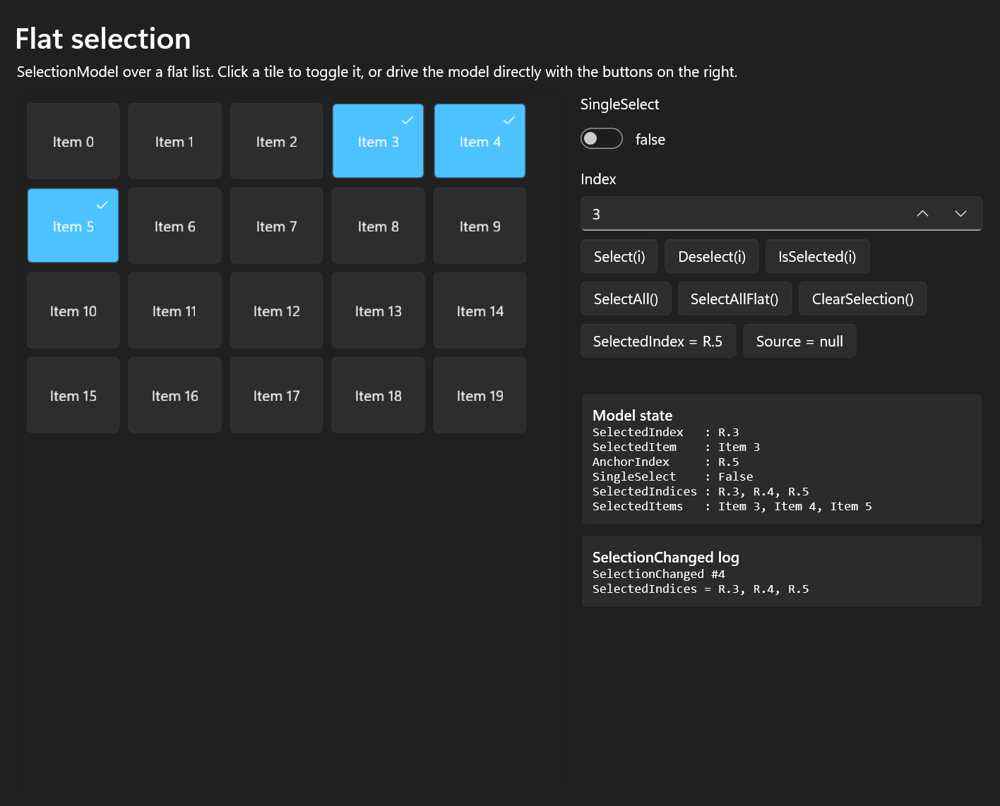
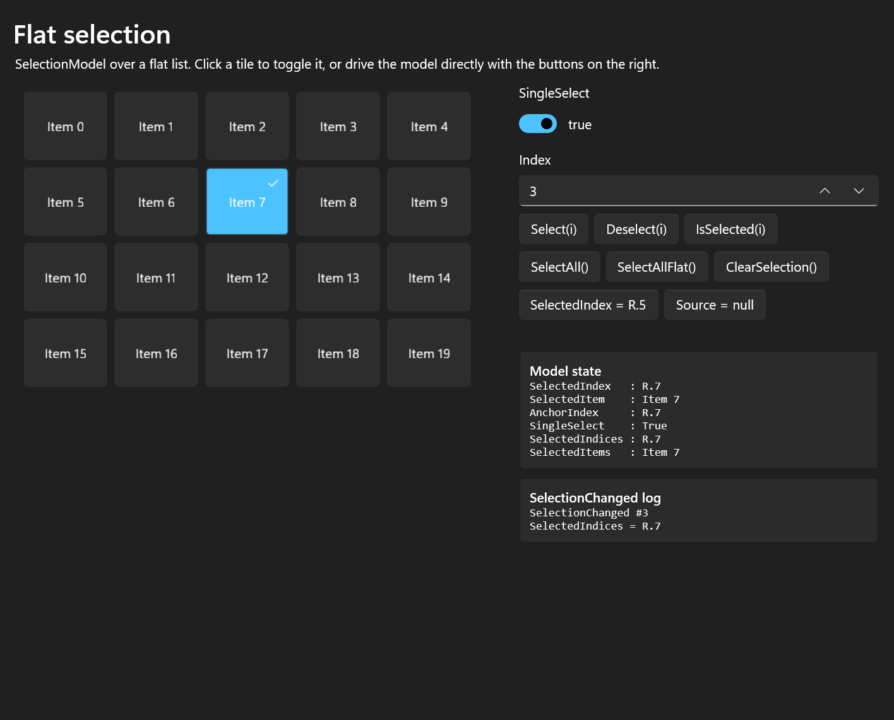
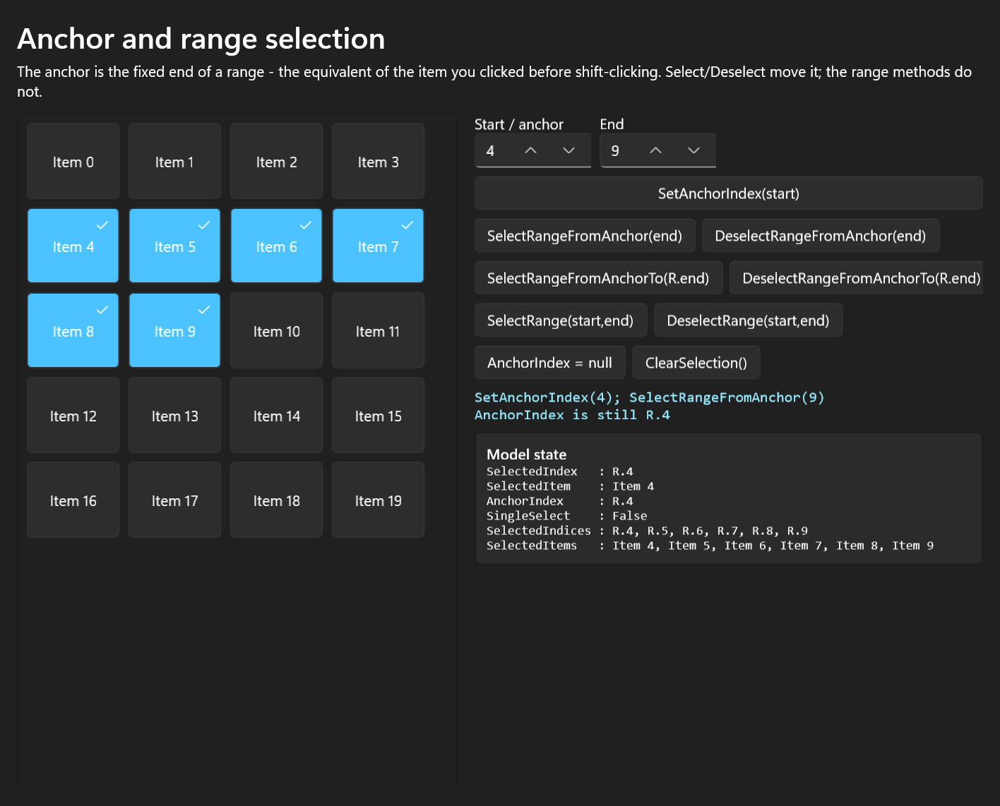
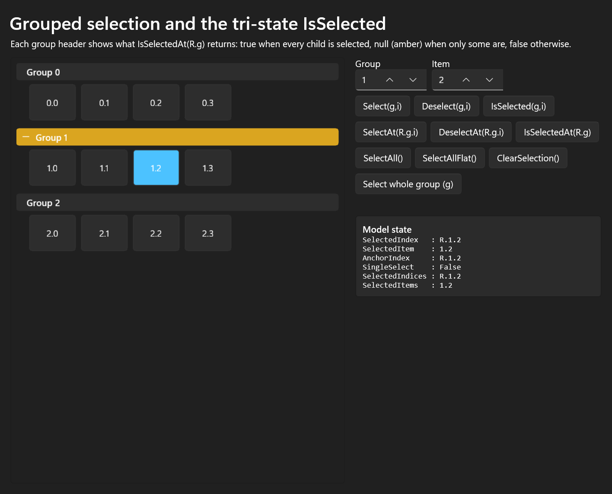
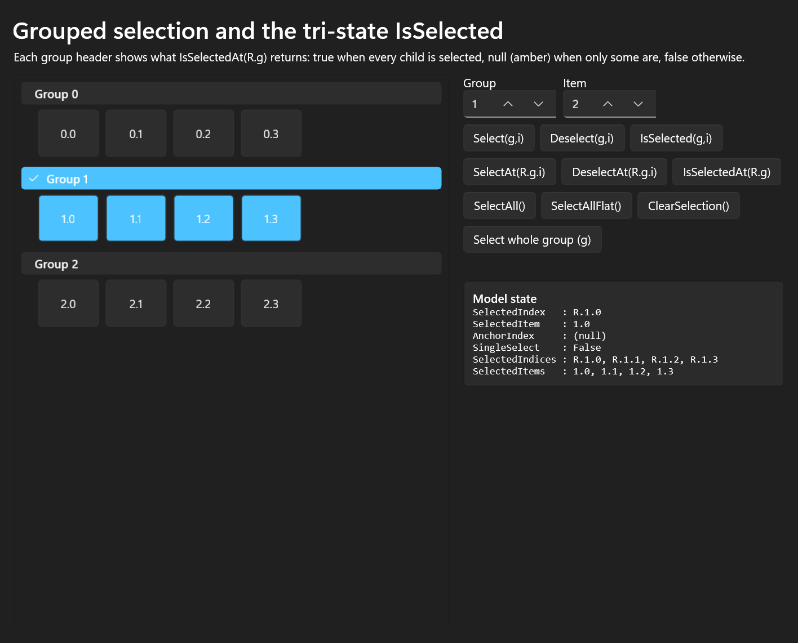
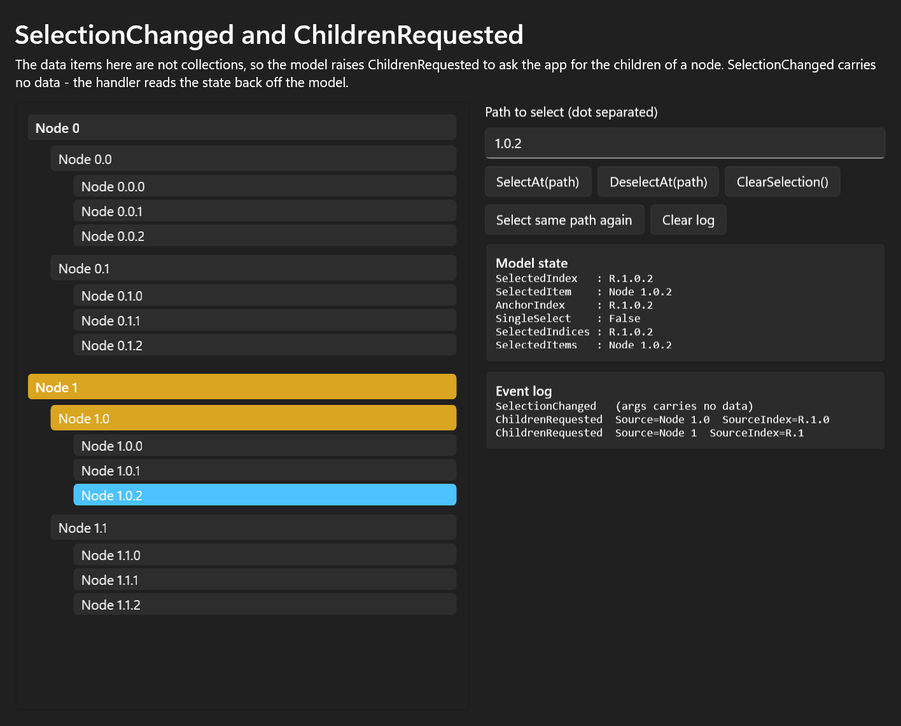
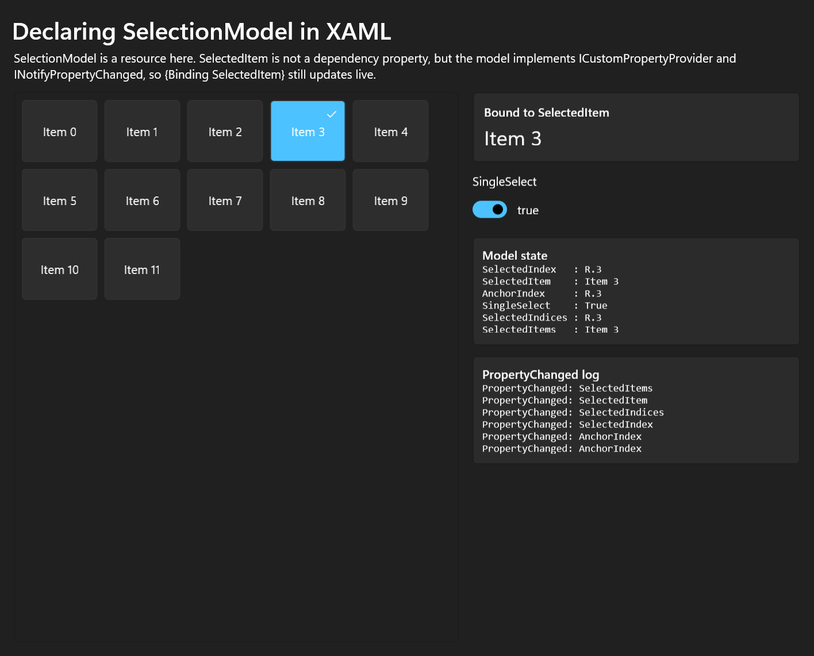
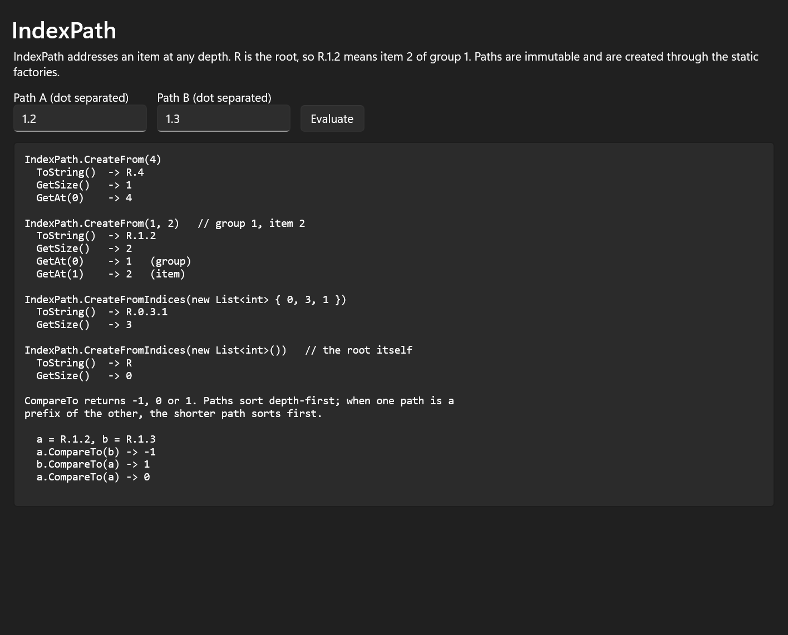

SelectionModel
===

# Background

Selection in XAML has historically been owned by the items control. `ListView` decides what
"selected" means, stores the selection, and exposes it through `SelectedItem`,
`SelectedItems` and `SelectionMode`. That works well when the control owns the items, but it
breaks down in three common situations:

* `ItemsRepeater` deliberately has **no** built-in selection. It is a layout panel for data,
  not a control, so an app that uses it has to bring its own selection story.
* Selection state needs to **outlive the control**. Navigating away from a page, virtualizing
  items out of the tree, or swapping the items control should not lose what the user selected.
* The data is **hierarchical**. A tree or a grouped list needs to express "this whole group is
  selected", "this group is partially selected" and "this one leaf, four levels down, is
  selected".

`SelectionModel` is the answer to all three. It is a standalone, control-independent object
that tracks selection over a data source. It stores nothing on the items themselves, it works
for flat lists and arbitrarily deep trees, and because it is just an object, it can be created
in markup, shared between controls, put on a view model, and unit tested without any UI.



The type has been available as a preview API in WinUI since the `ItemsRepeater` preview and is
already used internally by `TreeView` and `ItemsView`. This spec covers promoting it, together
with `IndexPath` and its two event argument types, to a stable public contract.

_Spec note: the implementation lives in `controls/dev/Repeater/SelectionModel.cpp` and its
behaviour is pinned by `controls/dev/Repeater/APITests/SelectionModelTests.cs`._

# Conceptual pages (How To)

## How to use SelectionModel

At its simplest, a `SelectionModel` needs one thing: a `Source`. Everything else is a method
call.

```csharp
var items = new ObservableCollection<string>(Enumerable.Range(0, 20).Select(i => $"Item {i}"));

var selectionModel = new SelectionModel();
selectionModel.Source = items;

selectionModel.Select(3);
selectionModel.Select(4);

// selectionModel.SelectedIndex  -> R.3
// selectionModel.SelectedItem   -> "Item 3"
// selectionModel.SelectedItems  -> ["Item 3", "Item 4"]
```

The model does not render anything. It answers questions - `IsSelected(3)` - and raises
`SelectionChanged` when the answers change. Pairing it with an `ItemsRepeater` is the common
case: the repeater draws the items, the model decides which of them look selected.

```xaml
<muxc:ItemsRepeater x:Name="Repeater">
    <muxc:ItemsRepeater.ItemTemplate>
        <DataTemplate>
            <Border Background="{Binding IsSelected, Converter={StaticResource StateToBrush}}">
                <TextBlock Text="{Binding Label}" />
            </Border>
        </DataTemplate>
    </muxc:ItemsRepeater.ItemTemplate>
</muxc:ItemsRepeater>
```

### Standard Usage (Default behaviour)

By default the model is **multi-select**: every `Select` call adds to the selection and
`Deselect` removes from it. Set `SingleSelect` to `true` to get radio-button behaviour, where
selecting an item replaces whatever was selected before.

```csharp
selectionModel.SingleSelect = true;
selectionModel.Select(3);
selectionModel.Select(7);   // Item 3 is deselected automatically

// selectionModel.SelectedItems -> ["Item 7"]
```

Switching an existing multi-selection into single-select mode is allowed. The model keeps the
**first** selected item, drops the rest, resets the anchor onto the surviving item, and raises
`SelectionChanged`. If only one item was selected, nothing changes and no event is raised.



### Selecting with the keyboard: the anchor

Shift-clicking in a list needs two pieces of information: where the range starts and where it
ends. `SelectionModel` calls the fixed end the **anchor**.

`Select` and `Deselect` move the anchor to the item they touched. The range methods read the
anchor but leave it where it is, so repeated shift-clicks grow and shrink the range around the
same fixed point - exactly what `ListView` does.

```csharp
selectionModel.SetAnchorIndex(4);          // like clicking item 4
selectionModel.SelectRangeFromAnchor(9);   // like shift-clicking item 9 -> selects 4..9
selectionModel.SelectRangeFromAnchor(6);   // shift-click item 6 instead -> 4..6
```

If no anchor has been set, the range methods start from index 0.



### Advanced Usage

#### Hierarchical data and IndexPath

For anything deeper than a flat list, an `int` is not enough to address an item.
`SelectionModel` uses `IndexPath`, an immutable list of indices from the root down to the item.
Its string form starts with `R` for root, so `R.1.2` means "item 2 of group 1".

```csharp
selectionModel.Source = groups;                        // an IEnumerable of IEnumerables

selectionModel.Select(1, 2);                           // group 1, item 2
selectionModel.SelectAt(IndexPath.CreateFrom(1, 2));   // the same thing, spelled with a path
selectionModel.SelectAt(IndexPath.CreateFromIndices(new List<int> { 0, 3, 1 }));  // three levels deep
```

#### Tri-state selection

Because a group can be *partly* selected, `IsSelected`, `IsSelected(group, item)` and
`IsSelectedAt` return a **nullable** `bool`:

| Return value | Meaning |
| --- | --- |
| `true` | The item, or every descendant of the group, is selected |
| `false` | Nothing in that subtree is selected |
| `null` | **Some but not all** descendants are selected |

```csharp
selectionModel.Select(1, 2);

selectionModel.IsSelected(1, 2);                      // true
selectionModel.IsSelectedAt(IndexPath.CreateFrom(1)); // null - group 1 is partially selected
selectionModel.IsSelectedAt(IndexPath.CreateFrom(0)); // false
```

`SelectedIndices` reports the paths that were actually selected, not the implied ones. Selecting
the four leaves of group 1 gives `R.1.0, R.1.1, R.1.2, R.1.3`, even though `IsSelectedAt(R.1)`
now reports `true`. Selecting the group itself with `SelectAt(IndexPath.CreateFrom(1))` gives the
single path `R.1` instead.





#### Lazy hierarchies with ChildrenRequested

If a data item is itself a collection - an `IEnumerable`, an `IBindableVector` or an
`ItemsSourceView` - the model walks into it automatically. If it is not, the model raises
`ChildrenRequested` and asks the app what the children are. That makes it possible to keep a
tree virtual and only materialize the branches selection actually touches.

```csharp
selectionModel.ChildrenRequested += (sender, args) =>
{
    var node = args.Source as Node;
    // Assigning null declares this node a leaf.
    args.Children = node?.Children;
};

selectionModel.SelectAt(IndexPath.CreateFromIndices(new List<int> { 1, 0, 2 }));
```

`args.Source` and `args.SourceIndex` may only be read **inside** the handler; the args object
is recycled and throws afterwards.



#### Reacting to changes

`SelectionChanged` tells you *that* the selection changed. It deliberately carries no payload,
so the handler reads the current state back off the model.

```csharp
selectionModel.SelectionChanged += (sender, args) =>
{
    Debug.WriteLine($"Now selected: {string.Join(", ", sender.SelectedIndices)}");
};
```

`SelectionModel` also implements `INotifyPropertyChanged`, which is what makes
`{Binding SelectedItem}` work even though `SelectedItem` is not a dependency property.



#### Collection changes

When the source is observable, the model keeps the selection anchored to the *items*, not to
the raw indices. Inserting three items above a selected item shifts its index up by three;
removing a selected item drops it from the selection. The model raises `SelectionChanged`
whenever this happens.

### Using SelectionModel in XAML, C#, and C++

The model can be declared in markup and shared as a resource:

```xaml
<Page.Resources>
    <muxc:SelectionModel x:Key="SharedSelectionModel" x:Name="SharedSelectionModel"
                         SingleSelect="True" />
</Page.Resources>

<TextBlock Text="{Binding SelectedItem, Source={StaticResource SharedSelectionModel}}" />
```

`SelectionModel` is not a `DependencyObject`, but it is an activatable runtime class with
settable properties, so the XAML parser can construct it and set `SingleSelect` from markup.
`Source`, the anchor and the selection itself have no markup syntax — everything else is
imperative.

```csharp
var selectionModel = new SelectionModel();
selectionModel.Source = items;
selectionModel.SingleSelect = true;
selectionModel.Select(3);

bool? isSelected = selectionModel.IsSelected(3);
```

```cpp
// C++/WinRT
winrt::SelectionModel selectionModel;
selectionModel.Source(items);
selectionModel.SingleSelect(true);
selectionModel.Select(3);

winrt::IReference<bool> isSelected = selectionModel.IsSelected(3);
```

## Code and result

Every row below is a snippet from the sample app in
[`Samples/SelectionModelSampleApp`](../../Samples/SelectionModelSampleApp), paired with the UI
it produces. The panel on the right of each screenshot prints the live values of
`SelectedIndex`, `SelectedItem`, `AnchorIndex`, `SingleSelect`, `SelectedIndices` and
`SelectedItems`.

All rows share the same markup: an `ItemsRepeater` and a `SelectionModel` declared as a page
resource.

```xaml
<Page.Resources>
    <muxc:SelectionModel x:Key="Model" x:Name="Model" />
</Page.Resources>

<muxc:ItemsRepeater x:Name="Repeater" ItemsSource="{x:Bind Items}">
    <muxc:ItemsRepeater.ItemTemplate>
        <DataTemplate x:DataType="local:Item">
            <Button Content="{x:Bind Label}" Click="OnItemClick" />
        </DataTemplate>
    </muxc:ItemsRepeater.ItemTemplate>
</muxc:ItemsRepeater>
```

In the code columns, `model` is that `SelectionModel` instance. The C++/WinRT column assumes
`using namespace winrt::Microsoft::UI::Xaml::Controls;`. Note that the C++/WinRT projection
exposes the group/item variants as ordinary overloads (`Select(index)` and
`Select(groupIndex, itemIndex)`), even though the ABI names them `SelectWithGroup` and friends.

| Scenario | XAML | C# | C++/WinRT | Result |
| --- | --- | --- | --- | --- |
| Multi-select over a flat list | <pre>&lt;muxc:SelectionModel<br>&nbsp;&nbsp;x:Key="Model" x:Name="Model" /&gt;</pre>Multi-select is the default; no extra markup. | <pre>model.Source = items;<br>model.Select(3);<br>model.Select(4);<br>model.Select(5);</pre> | <pre>model.Source(items);<br>model.Select(3);<br>model.Select(4);<br>model.Select(5);</pre> |  |
| Single select | <pre>&lt;muxc:SelectionModel<br>&nbsp;&nbsp;x:Key="Model" x:Name="Model"<br>&nbsp;&nbsp;SingleSelect="True" /&gt;</pre>`SingleSelect` is settable from markup. | <pre>model.SingleSelect = true;<br>model.Select(3);<br>model.Select(7);<br>// only R.7 survives</pre> | <pre>model.SingleSelect(true);<br>model.Select(3);<br>model.Select(7);<br>// only R.7 survives</pre> |  |
| Partially selected group | No markup — `Source` is set in code to a grouped collection. | <pre>model.Source = groups;<br>model.Select(1, 2);<br>bool? g =<br>&nbsp;&nbsp;model.IsSelectedAt(<br>&nbsp;&nbsp;&nbsp;&nbsp;IndexPath.CreateFrom(1));<br>// g == null (partial)</pre> | <pre>model.Source(groups);<br>model.Select(1, 2);<br>IReference&lt;bool&gt; g =<br>&nbsp;&nbsp;model.IsSelectedAt(<br>&nbsp;&nbsp;&nbsp;&nbsp;IndexPath::CreateFrom(1));<br>// g == nullptr (partial)</pre> |  |
| Fully selected group | No markup — range selection is imperative. | <pre>model.SelectRange(<br>&nbsp;&nbsp;IndexPath.CreateFrom(1, 0),<br>&nbsp;&nbsp;IndexPath.CreateFrom(1, 3));<br>// IsSelectedAt(R.1) -&gt; true</pre> | <pre>model.SelectRange(<br>&nbsp;&nbsp;IndexPath::CreateFrom(1, 0),<br>&nbsp;&nbsp;IndexPath::CreateFrom(1, 3));<br>// IsSelectedAt(R.1) -&gt; true</pre> |  |
| Anchor and range | No markup — `AnchorIndex` has no markup syntax. | <pre>model.SetAnchorIndex(4);<br>model.SelectRangeFromAnchor(9);</pre> | <pre>model.SetAnchorIndex(4);<br>model.SelectRangeFromAnchor(9);</pre> |  |
| Addressing items with IndexPath | No markup — `IndexPath` is created by its static factories. | <pre>IndexPath.CreateFrom(4);<br>IndexPath.CreateFrom(1, 2);<br>IndexPath.CreateFromIndices(<br>&nbsp;&nbsp;new List&lt;int&gt; { 0, 3, 1 });</pre> | <pre>IndexPath::CreateFrom(4);<br>IndexPath::CreateFrom(1, 2);<br>IndexPath::CreateFromIndices(<br>&nbsp;&nbsp;std::vector&lt;int32_t&gt;{ 0, 3, 1 });</pre> |  |
| Lazy tree via ChildrenRequested | No markup — the handler is wired up in code. | <pre>model.ChildrenRequested +=<br>&nbsp;&nbsp;(s, e) =&gt; e.Children =<br>&nbsp;&nbsp;&nbsp;&nbsp;(e.Source as Node)?.Children;<br>model.SelectAt(path);</pre> | <pre>model.ChildrenRequested(<br>&nbsp;&nbsp;[](auto&amp;&amp;, auto&amp;&amp; e)<br>&nbsp;&nbsp;{<br>&nbsp;&nbsp;&nbsp;&nbsp;e.Children(ChildrenOf(e.Source()));<br>&nbsp;&nbsp;});<br>model.SelectAt(path);</pre> |  |
| Binding to SelectedItem | <pre>&lt;TextBlock Text="{Binding<br>&nbsp;&nbsp;SelectedItem,<br>&nbsp;&nbsp;Source={StaticResource Model}}" /&gt;</pre> | <pre>model.PropertyChanged += (s, e) =&gt;<br>{<br>&nbsp;&nbsp;if (e.PropertyName ==<br>&nbsp;&nbsp;&nbsp;&nbsp;"SelectedItem")<br>&nbsp;&nbsp;&nbsp;&nbsp;Update(model.SelectedItem);<br>};</pre> | <pre>model.PropertyChanged(<br>&nbsp;&nbsp;[=](auto&amp;&amp; s, auto&amp;&amp; e)<br>&nbsp;&nbsp;{<br>&nbsp;&nbsp;&nbsp;&nbsp;if (e.PropertyName() ==<br>&nbsp;&nbsp;&nbsp;&nbsp;&nbsp;&nbsp;L"SelectedItem")<br>&nbsp;&nbsp;&nbsp;&nbsp;&nbsp;&nbsp;Update(model.SelectedItem());<br>&nbsp;&nbsp;});</pre> |  |

# API Pages

## SelectionModel class

Tracks the selected items of a data source, independently of any control.

`SelectionModel` is `unsealed`, so an app can derive from it - for example to add commands or
extra computed properties - and use the protected `OnPropertyChanged` to participate in
`INotifyPropertyChanged`.

### Example Usage

```csharp
var selectionModel = new SelectionModel { Source = items };
selectionModel.SelectionChanged += (s, e) => UpdateCommandBar(s.SelectedItems);
selectionModel.Select(0);
```

## SelectionModel.Source property

`Object Source { get; set; }`

The data the model tracks selection over. It can be any list-like object: an
`IEnumerable`, an `IList`, an `IBindableVector`, or an `ItemsSourceView`. For hierarchical
data, items that are themselves collections are treated as groups.

Setting `Source` **clears the current selection and resets the anchor**, then raises a single
`SelectionChanged`. Assigning `null` leaves the model with an empty selection.

## SelectionModel.SingleSelect property

`Boolean SingleSelect { get; set; }`

`false` by default. When `true`, at most one item can be selected: selecting an item deselects
whatever was selected before.

Turning `SingleSelect` on while several items are selected keeps the **first** selected path,
resets the anchor onto it, and raises `SelectionChanged`. Turning it on while at most one item is
selected changes nothing and raises no `SelectionChanged`.

## SelectionModel.AnchorIndex property

`IndexPath AnchorIndex { get; set; }`

The fixed end of a range operation - the equivalent of the item the user clicked before
shift-clicking. `null` when there is no anchor, in which case the range methods behave as if
the anchor were index 0.

`Select`, `Deselect`, `SelectAt` and `DeselectAt` move the anchor onto the item they acted on.
The range methods read it but do not move it.

## SelectionModel.SelectedIndex property

`IndexPath SelectedIndex { get; set; }`

The first selected path, or `null` when nothing is selected.

Setting it clears the existing selection and selects the given path. Setting it to a path that
is already selected does nothing.

## SelectionModel.SelectedItem property

`Object SelectedItem { get; }`

The first selected item, or `null`. This is not a dependency property, but the model
implements `ICustomPropertyProvider` and `INotifyPropertyChanged`, so classic
`{Binding SelectedItem}` works and updates live.

## SelectionModel.SelectedItems property

`IVectorView<Object> SelectedItems { get; }`

All selected items, in depth-first order. The returned view is computed lazily and does not
copy the data, which keeps it cheap even when a large range is selected.

The view is a **snapshot tied to the current selection**. Reading from a view that was obtained
before the selection changed throws.

## SelectionModel.SelectedIndices property

`IVectorView<IndexPath> SelectedIndices { get; }`

The paths of all selected items. These are the paths that were selected, not the ones that are
implied: selecting every leaf of a group lists the leaves, while selecting the group itself
lists just the group's path. In both cases `IsSelectedAt` reports the group as `true`.

Same lifetime rule as `SelectedItems`: re-read the property after a selection change.

## SelectionModel.SetAnchorIndex method

`void SetAnchorIndex(Int32 index)`
`void SetAnchorIndex(Int32 groupIndex, Int32 itemIndex)`

Convenience wrappers over the `AnchorIndex` property for flat and two-level data.

## SelectionModel.Select method

`void Select(Int32 index)`
`void Select(Int32 groupIndex, Int32 itemIndex)`

Selects an item and moves the anchor onto it. In single-select mode the previous selection is
cleared first.

Selecting an already selected item in a flat list is a no-op and raises no event.

## SelectionModel.SelectAt method

`void SelectAt(IndexPath index)`

Selects the item at an arbitrary depth. Raises `SelectionChanged` only if the state actually
changed.

## SelectionModel.Deselect method

`void Deselect(Int32 index)`
`void Deselect(Int32 groupIndex, Int32 itemIndex)`

Deselects an item. Deselecting an item that is not selected is a no-op in a flat list.

## SelectionModel.DeselectAt method

`void DeselectAt(IndexPath index)`

Deselects the item at an arbitrary depth.

## SelectionModel.IsSelected method

`IReference<Boolean> IsSelected(Int32 index)`
`IReference<Boolean> IsSelected(Int32 groupIndex, Int32 itemIndex)`

Returns `true` when the item is selected, `false` when it is not, and `null` when it is a group
that is only partially selected. Items in branches that have never been realized report
`false`.

## SelectionModel.IsSelectedAt method

`IReference<Boolean> IsSelectedAt(IndexPath index)`

Tri-state selection state of the item at an arbitrary depth. Passing the empty root path
reports the state of the whole source.

## SelectionModel.SelectRangeFromAnchor method

`void SelectRangeFromAnchor(Int32 index)`
`void SelectRangeFromAnchor(Int32 groupIndex, Int32 itemIndex)`

Selects everything between `AnchorIndex` and the given index, inclusive, in either direction.
The anchor is not moved. With no anchor set, the range starts at index 0.

## SelectionModel.SelectRangeFromAnchorTo method

`void SelectRangeFromAnchorTo(IndexPath index)`

`SelectRangeFromAnchor` for hierarchical data - equivalent to
`SelectRange(AnchorIndex, index)`.

## SelectionModel.DeselectRangeFromAnchor method

`void DeselectRangeFromAnchor(Int32 index)`
`void DeselectRangeFromAnchor(Int32 groupIndex, Int32 itemIndex)`

The deselecting counterpart of `SelectRangeFromAnchor`.

## SelectionModel.DeselectRangeFromAnchorTo method

`void DeselectRangeFromAnchorTo(IndexPath index)`

The deselecting counterpart of `SelectRangeFromAnchorTo`.

## SelectionModel.SelectRange method

`void SelectRange(IndexPath start, IndexPath end)`

Selects every leaf between two paths, inclusive. The order of the arguments does not matter -
the model sorts them. Only leaves are selected; groups become selected implicitly once all
their children are.

## SelectionModel.DeselectRange method

`void DeselectRange(IndexPath start, IndexPath end)`

The deselecting counterpart of `SelectRange`.

## SelectionModel.SelectAll method

`void SelectAll()`

Selects every item in the source, walking the whole tree and realizing every group. On a large
hierarchical source this materializes the entire tree, so prefer `SelectAllFlat` when the data
is flat.

## SelectionModel.SelectAllFlat method

`void SelectAllFlat()`

Selects every item of a **flat** source without realizing children. Used on hierarchical data
it selects the top-level groups rather than the leaves.

## SelectionModel.ClearSelection method

`void ClearSelection()`

Deselects everything and resets the anchor to `null`.

## SelectionModel.SelectionChanged event

`event TypedEventHandler<SelectionModel, SelectionModelSelectionChangedEventArgs> SelectionChanged`

Raised after the selection changes, including when a change to the source collection
invalidates the selection. The event args carry no data, so the handler reads the state back
off the sender.

## SelectionModel.ChildrenRequested event

`event TypedEventHandler<SelectionModel, SelectionModelChildrenRequestedEventArgs> ChildrenRequested`

Raised when the model needs the children of a data item in order to resolve a path.

If no handler is attached, the model auto-resolves children for items that are themselves
`ItemsSourceView`, `IBindableVector`, `IIterable<Object>` or `IBindableIterable`, and treats
anything else as a leaf.

## SelectionModel.OnPropertyChanged method

`protected void OnPropertyChanged(String propertyName)`

Lets a derived class raise `PropertyChanged` for its own properties.

## IndexPath class

An immutable path from the root of a data source to a single item, expressed as a list of
indices. `ToString` renders it as `R` followed by each index, so `R.1.2` is item 2 of group 1
and `R` alone is the root.

### Example Usage

```csharp
var flat = IndexPath.CreateFrom(4);                                 // R.4
var grouped = IndexPath.CreateFrom(1, 2);                           // R.1.2
var deep = IndexPath.CreateFromIndices(new List<int> { 0, 3, 1 });  // R.0.3.1

grouped.GetSize();       // 2
grouped.GetAt(0);        // 1
grouped.CompareTo(deep); // 1  - R.1.2 sorts after R.0.3.1
```

## IndexPath.GetSize method

`Int32 GetSize()`

The depth of the path. `0` for the root path.

## IndexPath.GetAt method

`Int32 GetAt(Int32 index)`

The index at the given level, counting from the root.

## IndexPath.CompareTo method

`Int32 CompareTo(IndexPath other)`

Returns `-1`, `0` or `1`. Paths are compared level by level; if one path is a prefix of the
other, the shorter one sorts first. This is the same order items appear in a depth-first walk
of the data.

## IndexPath.CreateFrom method

`static IndexPath CreateFrom(Int32 index)`
`static IndexPath CreateFrom(Int32 groupIndex, Int32 itemIndex)`

Creates a one- or two-level path.

## IndexPath.CreateFromIndices method

`static IndexPath CreateFromIndices(IVector<Int32> indices)`

Creates a path of arbitrary depth. An empty collection creates the root path.

## SelectionModelSelectionChangedEventArgs class

The event args for `SelectionModel.SelectionChanged`. The class currently exposes no members;
handlers read the new state from the `SelectionModel` that raised the event.

## SelectionModelChildrenRequestedEventArgs class

The event args for `SelectionModel.ChildrenRequested`.

## SelectionModelChildrenRequestedEventArgs.Source property

`Object Source { get; }`

The data item whose children are being requested. Reading this property outside the
`ChildrenRequested` handler throws.

## SelectionModelChildrenRequestedEventArgs.SourceIndex property

`IndexPath SourceIndex { get; }`

The path of the item whose children are being requested. Reading this property outside the
`ChildrenRequested` handler throws.

## SelectionModelChildrenRequestedEventArgs.Children property

`Object Children { get; set; }`

Set this to the children of `Source`. Leaving it `null` declares the item a leaf.

# API Details

```csharp
namespace Microsoft.UI.Xaml.Controls
{
    [webhosthidden]
    runtimeclass IndexPath : Windows.Foundation.IStringable
    {
        Int32 GetSize();
        Int32 GetAt(Int32 index);
        Int32 CompareTo(IndexPath other);

        [default_overload] [method_name("CreateFrom")]
        static IndexPath CreateFrom(Int32 index);
        [method_name("CreateFromGroupAndItemIndex")]
        static IndexPath CreateFrom(Int32 groupIndex, Int32 itemIndex);
        static IndexPath CreateFromIndices(Windows.Foundation.Collections.IVector<Int32> indices);
    }

    [webhosthidden]
    [default_interface]
    runtimeclass SelectionModelSelectionChangedEventArgs
    {
    }

    [webhosthidden]
    runtimeclass SelectionModelChildrenRequestedEventArgs
    {
        Object Source { get; };
        IndexPath SourceIndex { get; };
        Object Children { get; set; };
    }

    [webhosthidden]
    unsealed runtimeclass SelectionModel : Microsoft.UI.Xaml.Data.INotifyPropertyChanged
    {
        SelectionModel();

        event Windows.Foundation.TypedEventHandler<SelectionModel, SelectionModelSelectionChangedEventArgs> SelectionChanged;
        event Windows.Foundation.TypedEventHandler<SelectionModel, SelectionModelChildrenRequestedEventArgs> ChildrenRequested;
        Object Source { get; set; };
        Boolean SingleSelect { get; set; };
        IndexPath AnchorIndex { get; set; };
        IndexPath SelectedIndex { get; set; };
        Object SelectedItem { get; };
        Windows.Foundation.Collections.IVectorView<Object> SelectedItems { get; };
        Windows.Foundation.Collections.IVectorView<IndexPath> SelectedIndices { get; };
        [method_name("SetAnchorIndex")]
        void SetAnchorIndex(Int32 index);
        [method_name("SetAnchorIndexWithGroup")]
        void SetAnchorIndex(Int32 groupIndex, Int32 itemIndex);
        [default_overload] [method_name("Select")]
        void Select(Int32 index);
        [method_name("SelectWithGroup")]
        void Select(Int32 groupIndex, Int32 itemIndex);
        void SelectAt(IndexPath index);
        [default_overload] [method_name("Deselect")]
        void Deselect(Int32 index);
        [method_name("DeselectWithGroup")]
        void Deselect(Int32 groupIndex, Int32 itemIndex);
        void DeselectAt(IndexPath index);
        [default_overload] [method_name("IsSelected")]
        Windows.Foundation.IReference<Boolean> IsSelected(Int32 index);
        [method_name("IsSelectedWithGroup")]
        Windows.Foundation.IReference<Boolean> IsSelected(Int32 groupIndex, Int32 itemIndex);
        Windows.Foundation.IReference<Boolean> IsSelectedAt(IndexPath index);
        [default_overload] [method_name("SelectRangeFromAnchor")]
        void SelectRangeFromAnchor(Int32 index);
        [method_name("SelectRangeFromAnchorWithGroup")]
        void SelectRangeFromAnchor(Int32 groupIndex, Int32 itemIndex);
        void SelectRangeFromAnchorTo(IndexPath index);
        [default_overload] [method_name("DeselectRangeFromAnchor")]
        void DeselectRangeFromAnchor(Int32 index);
        [method_name("DeselectRangeFromAnchorWithGroup")]
        void DeselectRangeFromAnchor(Int32 groupIndex, Int32 itemIndex);
        void DeselectRangeFromAnchorTo(IndexPath index);
        void SelectRange(IndexPath start, IndexPath end);
        void DeselectRange(IndexPath start, IndexPath end);
        void SelectAll();
        void SelectAllFlat();
        void ClearSelection();

        protected void OnPropertyChanged(String propertyName);
    }
}
```

## Appendix

### Which method should I call?

| I want to... | Flat list | Grouped list | Any depth |
| --- | --- | --- | --- |
| Select one item | `Select(i)` | `Select(g, i)` | `SelectAt(path)` |
| Deselect one item | `Deselect(i)` | `Deselect(g, i)` | `DeselectAt(path)` |
| Ask whether it is selected | `IsSelected(i)` | `IsSelected(g, i)` | `IsSelectedAt(path)` |
| Set the anchor | `SetAnchorIndex(i)` | `SetAnchorIndex(g, i)` | `AnchorIndex = path` |
| Shift-click behaviour | `SelectRangeFromAnchor(i)` | `SelectRangeFromAnchor(g, i)` | `SelectRangeFromAnchorTo(path)` |
| Select an explicit range | - | - | `SelectRange(start, end)` |
| Select everything | `SelectAllFlat()` | `SelectAll()` | `SelectAll()` |
| Start over | `ClearSelection()` | `ClearSelection()` | `ClearSelection()` |

### Event behaviour

* `SelectionChanged` is raised **once** per operation, after the model is fully updated.
* Operations that would not change anything - selecting an already selected item in a flat
  list, deselecting an unselected one - raise no event.
* Setting `Source` raises one `SelectionChanged` for the implicit clear.
* `PropertyChanged` is raised for `Source`, `SingleSelect` and `AnchorIndex` when they are set,
  and for `SelectedIndex` and `SelectedIndices` on every selection change. `SelectedItem` and
  `SelectedItems` also raise `PropertyChanged`, but only while `Source` is non-null.

### Collection change behaviour

When the source raises collection change notifications, the model keeps the selection attached
to the items rather than the indices:

| Change | Effect on the selection |
| --- | --- |
| Insert before or inside the selected range | Selected indices shift up |
| Insert after the selected range | Selected indices unchanged |
| Remove | Selected indices shift down; a removed selected item is dropped |
| Replace an item | The index stays selected |
| Replace a group | That group's selection is lost |
| Clear | The selection is cleared |

### Threading

`SelectionModel` is not thread safe and, like the rest of XAML, is expected to be used from
the UI thread that owns the items control it drives.

### Accessibility

`SelectionModel` has no UI of its own and therefore no automation peer. Apps that drive
selection visuals from a `SelectionModel` are responsible for setting
`AutomationProperties` and the `SelectionItem` pattern on their containers, exactly as the
`SelectionSample` pages in `controls/dev/Repeater/TestUI` do.

### Open questions for the API review board

1. **`SelectionModelSelectionChangedEventArgs` is empty.** Every other selection-changed event
   in XAML (`SelectionChangedEventArgs`, `TreeViewSelectionChangedEventArgs`) exposes added and
   removed items. Should this type gain `AddedItems`/`RemovedItems` before it becomes stable?
   Adding members later is source compatible, but the args instance is currently reused between
   raises, which would have to change.
2. **Tri-state `IReference<Boolean>`.** Is `bool?` with `null` meaning "partially selected" the
   right shape, or would an explicit enum (`Selected` / `NotSelected` / `PartiallySelected`) be
   clearer, especially for C++ callers who get an `IReference<bool>`?
3. **Naming.** `SelectAllFlat` is an unusual name for "select all, assuming the data is flat".
   `ClearSelection` is spelled `DeselectAll` elsewhere in the platform. Should
   `SelectRangeFromAnchor` and `SelectRangeFromAnchorTo` be a single overload set?
4. **Snapshot lifetime.** `SelectedItems` and `SelectedIndices` throw if they are read after the
   selection changed. Should they instead return a stable snapshot?
5. **Overload projection names.** `SelectWithGroup`, `IsSelectedWithGroup`,
   `CreateFromGroupAndItemIndex` and friends exist only because of MIDL overload rules. They are
   invisible in C# but visible in the winmd and in some projections. Are they acceptable?
6. **`SelectedItem` is not a dependency property**, so `x:Bind` cannot bind to it one-way
   without relying on `INotifyPropertyChanged`. Should it become a DP?

### Community feedback

This spec follows the
[WinUI Platform Public Spec Review Process](../public-api-review-process.md). Feedback is
gathered on the pull request that introduces this document.
