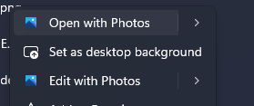
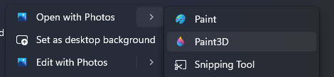
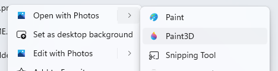
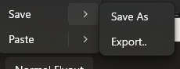
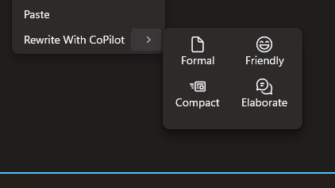
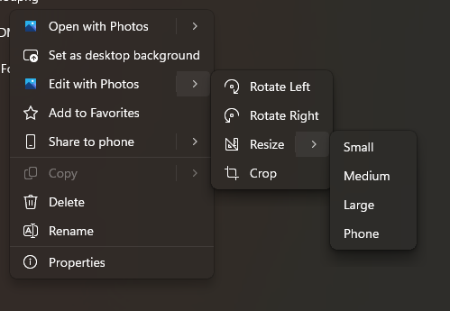

SplitMenuFlyoutItem
===

# Background

The `SplitMenuFlyoutItem` control is a new addition to the WinUI library, designed to provide 
a split button experience within a menu flyout. This control derives from `MenuFlyoutItem` and 
introduces a dual-button interface consisting of a primary button and a flyout button.



The primary button behaves like a standard `MenuFlyoutItem`, raising a click event and 
executing a command when clicked. The flyout button operates similarly to `MenuFlyoutSubItem` 
and opens a submenu when hovered over. The flyout button does not support click operations.

This control addresses scenarios where you need to provide both a default action and 
additional options in a submenu, offering a more efficient use of menu space while 
maintaining discoverability of related actions.





# Conceptual pages (How To)

## How to use SplitMenuFlyoutItem

The `SplitMenuFlyoutItem` control enables you to create menu items that combine both immediate 
actions and additional options. The control consists of two distinct interactive areas: 
a primary button for the main action and a flyout button for accessing additional options.

### Standard Usage (Default behaviour)

***Invocation without Selection*** 
You can use `SplitMenuFlyoutItem` in any `MenuFlyout` to provide both a default action and 
additional choices:

**Selection means updating the default/primary action with submenu item's action**
```xaml
<Button Content="File">
    <Button.Flyout>
        <MenuFlyout>
            <SplitMenuFlyoutItem Text="Save" Command="{Binding SaveCommand}">
                <SplitMenuFlyoutItem.Items>
                    <MenuFlyoutItem Text="Save As..." Command="{Binding SaveAsCommand}" />
                    <MenuFlyoutItem Text="Save All" Command="{Binding SaveAllCommand}" />
                    <MenuFlyoutSeparator />
                    <MenuFlyoutItem Text="Export..." Command="{Binding ExportCommand}" />
                </SplitMenuFlyoutItem.Items>
            </SplitMenuFlyoutItem>
        </MenuFlyout>
    </Button.Flyout>
</Button>
```

In this example, clicking the primary button executes the `SaveCommand`, while hovering over 
the flyout button reveals additional save-related options.



### Advanced Usage

#### Styling the Submenu

You can customize the appearance of the submenu using the styling properties:

```xaml
<SplitMenuFlyoutItem Text="SplitItem A">
    <SplitMenuFlyoutItem.SubMenuPresenterStyle>
        <Style BasedOn="{StaticResource DefaultMenuFlyoutPresenterStyle}" TargetType="MenuFlyoutPresenter">
            <Setter Property="Template">
                <Setter.Value>
                    <ControlTemplate TargetType="MenuFlyoutPresenter">
                        <Border>
                            <ScrollViewer x:Name="MenuFlyoutPresenterScrollViewer">
                                <GridView ItemsSource="{TemplateBinding ItemsSource}">
                                    <GridView.ItemsPanel>
                                        <ItemsPanelTemplate>
                                            <ItemsWrapGrid MaximumRowsOrColumns="3" Orientation="Horizontal" />
                                        </ItemsPanelTemplate>
                                    </GridView.ItemsPanel>
                                </GridView>
                            </ScrollViewer>
                        </Border>
                    </ControlTemplate>
                </Setter.Value>
            </Setter>
        </Style>
    </SplitMenuFlyoutItem.SubMenuPresenterStyle>

    <SplitMenuFlyoutItem.SubMenuItemStyle>
        <Style BasedOn="{StaticResource DefaultMenuFlyoutItemStyle}"
                TargetType="MenuFlyoutItem">
            <Setter Property="Template">
                <Setter.Value>
                    <ControlTemplate TargetType="MenuFlyoutItem">
                        <StackPanel Orientation="Vertical" Width="70" Margin="5">
                            <FontIcon Glyph="{TemplateBinding Tag}" HorizontalAlignment="Center"/>
                            <TextBlock Text="{TemplateBinding Text}" HorizontalAlignment="Center" />
                        </StackPanel>
                    </ControlTemplate>
                </Setter.Value>
            </Setter>
        </Style>
    </SplitMenuFlyoutItem.SubMenuItemStyle>

    <SplitMenuFlyoutItem.Items>
        <MenuFlyoutItem Text="Formal" Tag="&#xE8A5;" />
        <MenuFlyoutItem Text="Friendly" Tag="&#xE899;" />
        <MenuFlyoutItem Text="Compact" Tag="&#xE8F3;" />
        <MenuFlyoutItem Text="Elaborate" Tag="&#xE8F2;" />
    </SplitMenuFlyoutItem.Items>
</SplitMenuFlyoutItem>
```

Here is one example of a customized submenu (this is a reference from the SplitButton control).



#### Nesting of SplitMenuFlyoutItem

We can also support nesting of menu items in this control:

```xaml
<SplitMenuFlyoutItem Text="Edit with Photos">
    <MenuFlyoutItem Text="Rotate Left" />
    <MenuFlyoutItem Text="Rotate Right" />
    <MenuFlyoutItem Text="Crop" />
    <SplitMenuFlyoutItem Text="Resize" >
        <MenuFlyoutItem Text="Small" />
        <MenuFlyoutItem Text="Medium" />
        <MenuFlyoutItem Text="Large" />
        <MenuFlyoutItem Text="Phone" />
    </SplitMenuFlyoutItem>
</SplitMenuFlyoutItem>
```



### Using SplitMenuFlyoutItem in XAML, C#, and C++

As any control can be instantiated using either XANL, C# or C++, here is a table showing how to achieve the same UI with either of the options.

<table>
  <tr>
    <th>Language</th>
    <th>Code Sample</th>
    <th>Rendered Output</th>
  </tr>
  <tr>
    <td><b>XAML</b></td>
    <td>
<pre lang="xml">&lt;MenuFlyout&gt;
    &lt;SplitMenuFlyoutItem Text="Open With Photos"&gt;
        &lt;SplitMenuFlyoutItem.Items&gt;
            &lt;MenuFlyoutItem Text="Paint" /&gt;
            &lt;MenuFlyoutItem Text="Paint 3D" /&gt;
            &lt;MenuFlyoutItem Text="Snipping Tool" /&gt;
        &lt;/SplitMenuFlyoutItem.Items&gt;
    &lt;/SplitMenuFlyoutItem&gt;
&lt;/MenuFlyout&gt;</pre>
    </td>
    <td></td>
  </tr>
  <tr>
    <td><b>C#</b></td>
    <td>
<pre lang="csharp">var splitItem = new SplitMenuFlyoutItem { 
    Text = "Open With Photos" 
};
splitItem.Items.Add(
    new MenuFlyoutItem { Text = "Paint" });
splitItem.Items.Add(
    new MenuFlyoutItem { Text = "Paint 3D" });
splitItem.Items.Add(
    new MenuFlyoutItem { Text = "Snipping Tool" });

var menuFlyout = new MenuFlyout();
menuFlyout.Items.Add(splitItem);</pre>
    </td>
    <td></td>
  </tr>
  <tr>
    <td><b>C++/WinRT</b></td>
    <td>
<pre lang="cpp">
#include &lt;winrt/Microsoft.UI.Xaml.Controls.h&gt;
using namespace Microsoft::UI::Xaml::Controls;<br>

auto splitItem = SplitMenuFlyoutItem();
splitItem.Text(L"Open With Photos");

auto notepadItem = MenuFlyoutItem();
notepadItem.Text(L"Paint");
splitItem.Items().Append(notepadItem);

auto vscodeItem = MenuFlyoutItem();
vscodeItem.Text(L"Paint 3D");
splitItem.Items().Append(vscodeItem);

auto vsItem = MenuFlyoutItem();
vsItem.Text(L"Snipping Tool");
splitItem.Items().Append(vsItem);

auto menuFlyout = MenuFlyout();
menuFlyout.Items().Append(splitItem);</pre>
    </td>
    <td></td>
  </tr>
</table>

This table demonstrates that regardless of whether you use XAML, C#, or C++/WinRT, the SplitMenuFlyoutItem control is rendered identically in the UI.

# API Pages

## SplitMenuFlyoutItem class

A menu flyout item that provides both a primary action and additional options through a 
split button interface.

The `SplitMenuFlyoutItem` derives from `MenuFlyoutItem` and extends it with a dual-button design:

```c#
public class SplitMenuFlyoutItem : MenuFlyoutItem
{
    public IList<MenuFlyoutItemBase> Items { get; set; }
    public Style SubMenuPresenterStyle { get; set; }
    public Style SubMenuItemStyle { get; set; }
}
```

### Example Usage

```xaml
<MenuFlyout>
    <SplitMenuFlyoutItem Text="New Document" Command="{Binding NewDocumentCommand}">
        <SplitMenuFlyoutItem.Items>
            <MenuFlyoutItem Text="Blank Document" Command="{Binding NewBlankCommand}" />
            <MenuFlyoutItem Text="From Template..." Command="{Binding NewFromTemplateCommand}" />
        </SplitMenuFlyoutItem.Items>
    </SplitMenuFlyoutItem>
</MenuFlyout>
```

## SplitMenuFlyoutItem.Items property

Gets or sets the collection of menu items to display in the submenu.

The `Items` property contains the collection of `MenuFlyoutItemBase` objects that appear 
in the submenu when the flyout button is hovered over. This collection can contain any 
type of menu flyout item, including separators and sub-items.

```xaml
<SplitMenuFlyoutItem Text="Compress to zip">
    <SplitMenuFlyoutItem.Items>
        <MenuFlyoutItem Text="7z file" />
        <MenuFlyoutItem Text="TAR file" />
        <MenuFlyoutSeparator />
        <MenuFlyoutItem Text="Additional Options" />
    </SplitMenuFlyoutItem.Items>
</SplitMenuFlyoutItem>
```

> [!NOTE] 
> When the Items is empty, the flyout\submenu is disabled.

## SplitMenuFlyoutItem.SubMenuPresenterStyle property

Gets or sets the style applied to the submenu's flyout presenter.

This property allows you to customize the appearance of the submenu container. 
itself, such as background colour, border, and padding.

```xaml
<SplitMenuFlyoutItem.SubMenuPresenterStyle>
    <Style TargetType="FlyoutPresenter">
        <Setter Property="Background" Value="LightBlue" />
        <Setter Property="BorderBrush" Value="DarkBlue" />
        <Setter Property="BorderThickness" Value="2" />
    </Style>
</SplitMenuFlyoutItem.SubMenuPresenterStyle>
```

## SplitMenuFlyoutItem.SubMenuItemStyle property

Gets or sets the style applied to individual items within the submenu.

This property allows you to customize the appearance of all menu items within the submenu.

```xaml
<SplitMenuFlyoutItem.SubMenuItemStyle>
    <Style TargetType="MenuFlyoutItem">
        <Setter Property="FontSize" Value="14" />
        <Setter Property="Foreground" Value="DarkRed" />
    </Style>
</SplitMenuFlyoutItem.SubMenuItemStyle>
```

## SplitMenuFlyoutItemAutomationPeer class

Provides automation peer support for the `SplitMenuFlyoutItem` control, enabling assistive technologies like screen readers and Narrator to interact with the control.

The `SplitMenuFlyoutItemAutomationPeer` class derives from `FrameworkElementAutomationPeer` and implements `IInvokeProvider` and `IExpandCollapseProvider` interfaces to provide comprehensive automation support.

- **IInvokeProvider**: Enables assistive technologies to invoke the primary action of the `SplitMenuFlyoutItem`
- **IExpandCollapseProvider**: Provides information about the expand/collapse state of the submenu and allows assistive technologies to expand or collapse it

This class is used internally by the automation framework and is not instantiable from XAML. It comes into play when assistive technologies query the control for its state, properties, and available actions.

# API Details

```c# (but really MIDL3)
namespace Microsoft.UI.Xaml.Controls
{
    runtimeclass SplitMenuFlyoutItem : MenuFlyoutItem
    {
        IVector<MenuFlyoutItemBase> Items { get; };
        Style SubMenuPresenterStyle;
        Style SubMenuItemStyle;

        /// Gets or sets the collection of menu items to display in the submenu.
        static DependencyProperty ItemsProperty { get; };
        /// Gets or sets the style applied to the submenu's flyout presenter.
        static DependencyProperty SubMenuPresenterStyleProperty { get; };
        /// Gets or sets the style applied to individual items within the submenu.
        static DependencyProperty SubMenuItemStyleProperty { get; };
    }
}

namespace Microsoft.UI.Xaml.Automation.Peers
{
    runtimeclass SplitMenuFlyoutItemAutomationPeer : Microsoft.UI.Xaml.Automation.Peers.FrameworkElementAutomationPeer,
        Microsoft.UI.Xaml.Automation.Provider.IInvokeProvider,
        Microsoft.UI.Xaml.Automation.Provider.IExpandCollapseProvider
    {
        SplitMenuFlyoutItemAutomationPeer(Microsoft.UI.Xaml.Controls.SplitMenuFlyoutItem owner);
    }
}
```

## Appendix

### Keyboard Behaviour

The `SplitMenuFlyoutItem` provides comprehensive keyboard navigation support to ensure 
accessibility and ease of use:

#### Navigation Flow
- **Tab Navigation**: Tab navigation is not supported within the MenuFlyout by default. The same behaviour will continue.
- **Arrow Key Navigation**: 
  - Within a menu, the Up/Down arrow keys can navigate between menu items, 
    including the `SplitMenuFlyoutItem`.
  - When focus is coming from a menu item above the current menu item i.e. focus is coming because of Down Arrow Key,
    the focus will move to primary button. Similarly, when the focus is coming from below, 
    i.e. focus is coming to this control because of Up Arrow Key, focus first moves to secondary button.

#### Primary Button Interaction
*When focus is on primary button*
- **Right or Down Arrow Key**: Moves the focus to secondary button.
- **Enter or Space Key**: When the focus is on the primary button, pressing `Enter` executes the 
    primary action.
- **Up Arrow Key**: Moves the focus to previous menu item.

#### Secondary Button Interaction  
- **Enter Key**: When the focus is on the flyout button, pressing `Enter` opens the submenu 
    and shifts the focus to the first item in the submenu.
- **Right Arrow Key**: Pressing the right arrow key when focused on the flyout button also 
    opens the submenu and moves focus to the first submenu item.
- **Up/Left Arrow Key**: Moves the focus to primary button.
- **Down Arrow Key**: Moves the focus to next menu item.

#### Submenu Navigation
- **Up/Down Arrow Keys**: Navigate between items within the opened submenu.
- **Escape/Left Key**: Closes the submenu and returns focus to the flyout/secondary button.

This keyboard behaviour ensures that users can efficiently navigate and interact with the 
`SplitMenuFlyoutItem` using only the keyboard, maintaining accessibility standards and providing 
a consistent user experience across the application.

### Automation Behaviour

Accessibility tools like screen readers (Narrator, NVDA) use the UI Automation Framework. These UI automation clients, communicate with applications through the automation peer classes. In this case the defined behaviour is as follows: 
1. **Focus on primary button**: When the UI Automation clients focus moves to the primary button, the screen reader announces information similar other menu items in the menu flyout: ***<menu-item-name> menu item, 3 of 5, collapsed*** 
2. **Focus on secondary button**: When the UI Automation clients focus moves to the secondary button, the screen reader announces the following information: ***More options for <menu-item-name> menu item, button*** 

#### Differences in behaviour when compared to MenuFlyoutItem and MenuFlyoutSubItem 
1. In case of SplitMenuFlyoutItem, the focus of the automation clients will move to individual parts instead of the whole control.
2. Depending on the focus, the bounding box for the control will be around the primary or secondary button and not over the whole control.

### Other Behaviour

1. When `Items` property is an empty collection, the secondary button will be disabled. 