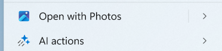
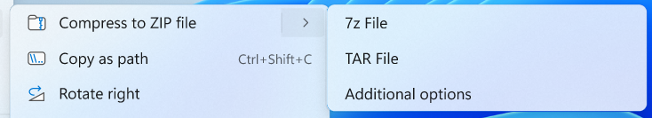

SplitMenuFlyoutItem
===

# Background

The `SplitMenuFlyoutItem` control is a new addition to the WinUI library, designed to provide 
a split button experience within a menu flyout. This control derives from `MenuFlyoutItem` and 
introduces a dual-button interface consisting of a primary button and a flyout button.



The primary button behaves like a standard `MenuFlyoutItem`, raising a click event and 
executing a command when clicked. The flyout button operates similarly to `MenuFlyoutSubItem` 
and opens a submenu when hovered over. The flyout button does not support click operations.

This control addresses scenarios where you need to provide both a default action and 
additional options in a submenu, offering a more efficient use of menu space while 
maintaining discoverability of related actions.



# Conceptual pages (How To)

## How to use SplitMenuFlyoutItem

The `SplitMenuFlyoutItem` control enables you to create menu items that combine both immediate 
actions and additional options. The control consists of two distinct interactive areas: 
a primary button for the main action and a flyout button for accessing additional options.

### Basic Usage

***Invocation without Selection*** 
You can use `SplitMenuFlyoutItem` in any `MenuFlyout` to provide both a default action and 
additional choices:

```xaml
<Button Content="File">
    <Button.Flyout>
        <MenuFlyout>
            <SplitMenuFlyoutItem Text="Save" Command="{Binding SaveCommand}">
                <SplitMenuFlyoutItem.Items>
                    <MenuFlyoutItem Text="Save As..." Command="{Binding SaveAsCommand}" />
                    <MenuFlyoutItem Text="Save All" Command="{Binding SaveAllCommand}" />
                    <MenuFlyoutSeparator />
                    <MenuFlyoutItem Text="Export..." Command="{Binding ExportCommand}" />
                </SplitMenuFlyoutItem.Items>
            </SplitMenuFlyoutItem>
        </MenuFlyout>
    </Button.Flyout>
</Button>
```

In this example, clicking the primary button executes the `SaveCommand`, while hovering over 
the flyout button reveals additional save-related options.

### Reflecting Current Selection

***Selection (with and without Invocation)***
Selection and reflection of the selected submenu item can be implemented by attaching Click handlers 
to the submenu items. Once, a submenu item will be clicked, the click handler will be called, 
which will then update the main control's text, icon, etc.

In case, if you want invocation along with selection we will set the `Command` property on the 
sub menu items as well, which will get invoked when the submenu item is clikced.

```xaml
<SplitMenuFlyoutItem x:Name="PasteMenuItem"
                     Text="Paste" 
                     Command="{Binding PasteCommand}"
                     CommandParameter="{Binding PasteCommandParameter}">
    <SplitMenuFlyoutItem.Items>
        <MenuFlyoutItem Text="Paste (Merge Formatting)" Click="PasteSubMenuClickHandler"/>
        <MenuFlyoutItem Text="Paste (Only Text)" Click="PasteSubMenuClickHandler"/>
    </SplitMenuFlyoutItem.Items>
</SplitMenuFlyoutItem>
```

```c#
    private void PasteSubMenuClickHandler(object sender, RoutedEventArgs e)
    {
        if(sender is MenuFlyoutItem item)
        {
            PasteMenuItem.Text = item.Text;
            PasteMenuItem.Icon = item.Icon;

            // The method wil set the command based on the item,
            // which allows selection without invocation.
            // If Command property is already set on the submenu
            // item, we can directly set that here, but it will
            // invoke the command as well.
            PasteMenuItem.Command = SetSelectedCommand(item)
        }
    }
```

### Styling the Submenu

You can customize the appearance of the submenu using the styling properties:

```xaml
<SplitMenuFlyoutItem Text="Format">
    <SplitMenuFlyoutItem.SubMenuPresenterStyle>
        <Style TargetType="FlyoutPresenter">
            <Setter Property="Background" Value="LightGray" />
        </Style>
    </SplitMenuFlyoutItem.SubMenuPresenterStyle>
    <SplitMenuFlyoutItem.SubMenuItemStyle>
        <Style TargetType="MenuFlyoutItem">
            <Setter Property="FontWeight" Value="Bold" />
        </Style>
    </SplitMenuFlyoutItem.SubMenuItemStyle>
    <SplitMenuFlyoutItem.Items>
        <MenuFlyoutItem Text="Bold" />
        <MenuFlyoutItem Text="Italic" />
        <MenuFlyoutItem Text="Underline" />
    </SplitMenuFlyoutItem.Items>
</SplitMenuFlyoutItem>
```

Here is one example of a customized submenu (this is a reference from the SplitButton control).


# API Pages

## SplitMenuFlyoutItem class

A menu flyout item that provides both a primary action and additional options through a 
split button interface.

The `SplitMenuFlyoutItem` derives from `MenuFlyoutItem` and extends it with a dual-button design:

```c#
public class SplitMenuFlyoutItem : MenuFlyoutItem
{
    public IList<MenuFlyoutItemBase> Items { get; set; }
    public Style SubMenuPresenterStyle { get; set; }
    public Style SubMenuItemStyle { get; set; }
}
```

### Example Usage

```xaml
<MenuFlyout>
    <SplitMenuFlyoutItem Text="New Document" Command="{Binding NewDocumentCommand}">
        <SplitMenuFlyoutItem.Items>
            <MenuFlyoutItem Text="Blank Document" Command="{Binding NewBlankCommand}" />
            <MenuFlyoutItem Text="From Template..." Command="{Binding NewFromTemplateCommand}" />
        </SplitMenuFlyoutItem.Items>
    </SplitMenuFlyoutItem>
</MenuFlyout>
```

## SplitMenuFlyoutItem.Items property

Gets or sets the collection of menu items to display in the submenu.

The `Items` property contains the collection of `MenuFlyoutItemBase` objects that appear 
in the submenu when the flyout button is hovered over. This collection can contain any 
type of menu flyout item, including separators and sub-items.

```xaml
<SplitMenuFlyoutItem Text="Compress to zip">
    <SplitMenuFlyoutItem.Items>
        <MenuFlyoutItem Text="7z file" />
        <MenuFlyoutItem Text="TAR file" />
        <MenuFlyoutSeparator />
        <MenuFlyoutItem Text="Additional Options" />
    </SplitMenuFlyoutItem.Items>
</SplitMenuFlyoutItem>
```


## SplitMenuFlyoutItem.SubMenuPresenterStyle property

Gets or sets the style applied to the submenu's flyout presenter.

This property allows you to customize the appearance of the submenu container 
itself, such as background color, border, and padding.

```xaml
<SplitMenuFlyoutItem.SubMenuPresenterStyle>
    <Style TargetType="FlyoutPresenter">
        <Setter Property="Background" Value="LightBlue" />
        <Setter Property="BorderBrush" Value="DarkBlue" />
        <Setter Property="BorderThickness" Value="2" />
    </Style>
</SplitMenuFlyoutItem.SubMenuPresenterStyle>
```

## SplitMenuFlyoutItem.SubMenuItemStyle property

Gets or sets the style applied to individual items within the submenu.

This property allows you to customize the appearance of all menu items within the submenu.

```xaml
<SplitMenuFlyoutItem.SubMenuItemStyle>
    <Style TargetType="MenuFlyoutItem">
        <Setter Property="FontSize" Value="14" />
        <Setter Property="Foreground" Value="DarkRed" />
    </Style>
</SplitMenuFlyoutItem.SubMenuItemStyle>
```

## SplitMenuFlyoutItemAutomationPeer class

Provides automation peer support for the `SplitMenuFlyoutItem` control, enabling assistive technologies like screen readers and Narrator to interact with the control.

The `SplitMenuFlyoutItemAutomationPeer` class derives from `FrameworkElementAutomationPeer` and implements `IInvokeProvider` and `IExpandCollapseProvider` interfaces to provide comprehensive automation support.

- **IInvokeProvider**: Enables assistive technologies to invoke the primary action of the `SplitMenuFlyoutItem`
- **IExpandCollapseProvider**: Provides information about the expand/collapse state of the submenu and allows assistive technologies to expand or collapse it

This class is used internally by the automation framework and is not instantiable from XAML. It comes into play when assistive technologies query the control for its state, properties, and available actions.


# API Details

```c# (but really MIDL3)
namespace Microsoft.UI.Xaml.Controls
{
    runtimeclass SplitMenuFlyoutItem : MenuFlyoutItem
    {
        IVector<MenuFlyoutItemBase> Items { get; };
        Style SubMenuPresenterStyle;
        Style SubMenuItemStyle;

        /// Gets or sets the collection of menu items to display in the submenu.
        static DependencyProperty ItemsProperty { get; };
        /// Gets or sets the style applied to the submenu's flyout presenter.
        static DependencyProperty SubMenuPresenterStyleProperty { get; };
        /// Gets or sets the style applied to individual items within the submenu.
        static DependencyProperty SubMenuItemStyleProperty { get; };
    }
}

namespace Microsoft.UI.Xaml.Automation.Peers
{
    runtimeclass SplitMenuFlyoutItemAutomationPeer : Microsoft.UI.Xaml.Automation.Peers.FrameworkElementAutomationPeer,
        Microsoft.UI.Xaml.Automation.Provider.IInvokeProvider,
        Microsoft.UI.Xaml.Automation.Provider.IExpandCollapseProvider
    {
        SplitMenuFlyoutItemAutomationPeer(Microsoft.UI.Xaml.Controls.SplitMenuFlyoutItem owner);
    }
}
```

# Appendix

## Keyboard Behavior

The `SplitMenuFlyoutItem` provides comprehensive keyboard navigation support to ensure 
accessibility and ease of use:

### Navigation Flow
- **Tab Navigation**: Tab navigation is not supported within the MenuFlyout by default. The same behaviour will continue.
- **Arrow Key Navigation**: 
  - Within a menu, the Up/Down arrow keys can navigate between menu items, 
    including the `SplitMenuFlyoutItem`.
  - When focus is coming from a menu item above the current menu item i.e. focus is coming as a result of Down Arrow Key,
    the focus will move to primary button. Similarly, when the focus is coming from below, 
    i.e. focus is coming to this control as a result of Up Arrow Key, focus first moves to secondary button.

### Primary Button Interaction
*When focus is on primary button*
- **Right\Down Arrow Key**: Moves the focus to secondary button.
- **Enter\Space Key**: When the focus is on the primary button, pressing `Enter` executes the 
    primary action.
- **Up Arrow Key**: Moves the focus to previous menu item.

### Secondary Button Interaction  
- **Enter Key**: When the focus is on the flyout button, pressing `Enter` opens the submenu 
    and shifts the focus to the first item in the submenu.
- **Right Arrow Key**: Pressing the right arrow key when focused on the flyout button also 
    opens the submenu and moves focus to the first submenu item.
- **Up\Left Arrow Key**: Moves the focus to primary button.
- **Down Arrow Key**: Moves the focus to next menu item.

### Submenu Navigation
- **Up/Down Arrow Keys**: Navigate between items within the opened submenu.
- **Escape\Left Key**: Closes the submenu and returns focus to the flyout\secondary button.

This keyboard behavior ensures that users can efficiently navigate and interact with the 
`SplitMenuFlyoutItem` using only the keyboard, maintaining accessibility standards and providing 
a consistent user experience across the application.
