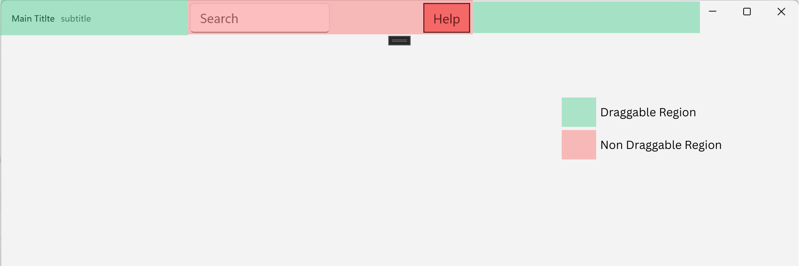
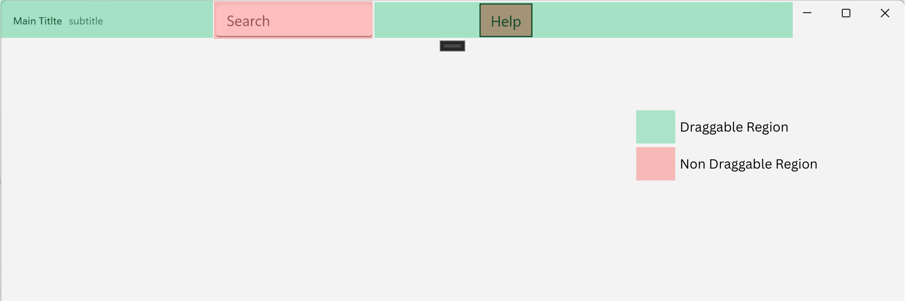

TitleBar Drag Region API Specification
===

# Background

Custom title bar layouts often combine **interactive controls** and **non‑interactive visual elements** using containers such as `Grid`, `StackPanel`, or deeper nested structures. While this flexibility enables rich and branded title bar designs, it also introduces ambiguity when determining **which parts of the title bar should behave as draggable regions** for moving the window.

Under the **current default behavior**, the framework treats the entire `TitleBar.Content` area as the primary drag surface and then subtracts (or *"punches holes"* from) regions that should not initiate window dragging. This approach works reasonably well for dense, predictable layouts. However, it **fails in scenarios with empty gaps, uneven spacing, nested templates, or dynamically generated UI**, where the system cannot reliably infer developer intent. These situations can lead to **unexpected non‑draggable gaps**, creating inconsistent or unintuitive window‑drag behavior for users.

This problem has been raised and discussed by developers in the WinUI community, for example in: **[#10421](https://github.com/microsoft/microsoft-ui-xaml/issues/10421)**.

This specification introduces **two changes** to address these issues:

1. **Changing the default behavior** for deciding which parts of the TitleBar can be used to drag. The framework now recursively walks the visual tree and automatically excludes interactive controls from the drag region, making empty gaps and non‑interactive areas draggable by default.
2. **Giving developers the ability to override the default behavior** on a per‑element basis using the `TitleBar.IsDragRegion` attached property, and control when drag regions are recomputed via `AutoRefreshDragRegions` and `RecomputeDragRegions()`.

---

# Conceptual pages (How To)

## Change 1: Changes to default behavior

```xml
<TitleBar Title="Main Title" Subtitle="subtitle" x:Name="titleBar">
    <TitleBar.Content>
        <Grid>
            <Grid.ColumnDefinitions>
                <ColumnDefinition Width="150" />
                <ColumnDefinition Width="200" />
                <ColumnDefinition Width="50" />
            </Grid.ColumnDefinitions>
            <Border Grid.Column="0" Background="LightBlue" BorderBrush="Black" BorderThickness="1">
                <AutoSuggestBox PlaceholderText="Search"/>
            </Border>
            <Border Grid.Column="1" />
            <Border Grid.Column="2" Background="LightCoral" BorderBrush="Black" BorderThickness="1">
                <TextBlock Text="Help" VerticalAlignment="Center" HorizontalAlignment="Center" />
            </Border>
        </Grid>
    </TitleBar.Content>
</TitleBar>
```

#### Output:


In this simple layout:
- Column 0 contains **Sample Search Box**
- Column 2 contains **Help**
- Column 1 is **empty visual space** that becomes a non-draggable gap under the previous behavior

Even in simple cases, it is non-trivial for the framework to automatically classify such gaps as draggable or non-draggable. More complex layouts—nested controls, templated UI, and dynamic content—make automatic detection even harder.

**With the new default behavior**, the framework recursively traverses the visual tree and **excludes only interactive controls from drag**. Empty visual space (such as Column 1 above) and non‑interactive elements are now **draggable by default**, without any markup changes. The same XAML above now produces the correct result:

#### Output (with new defaults):


---

## Change 2: Per‑element overrides with `TitleBar.IsDragRegion`

Developers can **override** the default behavior on any element using the `TitleBar.IsDragRegion` attached property:
- Set `IsDragRegion="True"` to **include** an element in the drag region even if it is an interactive control (e.g., ribbon areas that should drag).
- Set `IsDragRegion="False"` to **exclude** an element from drag even if the framework would not auto‑detect it as interactive.
- If the property is **not set** (remains `null`), the framework uses the default behavior: interactive controls are excluded from drag, non‑interactive visuals are draggable.

> **Implementation note:** `IsDragRegion` is a **nullable boolean** (`IReference<Boolean>`). The getter returns `null` when the property has not been set, `true` when explicitly set to `True`, and `false` when explicitly set to `False`.

**Advantages**
- **Low developer effort** (good defaults).
- **High flexibility** (simple overrides where needed).
- **Consistent, accessible behavior** aligned with product expectations.

#### IsDragRegion tri-state behavior

| State | How it's set | Getter returns | Meaning |
|---|---|---|---|
| **Not set** | Developer doesn't set it | `null` | "No opinion" — framework auto-detects based on control type |
| **`False`** | `TitleBar.IsDragRegion="False"` | `false` | "Explicitly clickable" — always a passthrough hole |
| **`True`** | `TitleBar.IsDragRegion="True"` | `true` | "Explicitly draggable" — never a passthrough, even if auto-detected as interactive |

---

## Drag Region Refresh Behavior

By default, the TitleBar refreshes drag regions in response to:
- Content changes (the `Content` property is set or replaced)
- Content loaded events (the content's visual tree becomes ready)
- Size changes (the TitleBar is resized)
- `IsDragRegion` attached property changes (at runtime, including hot reload)

For scenarios where content is dynamically modified at runtime (controls added/removed/resized after initial load), there are two options:

### Option 1: Manual refresh with `RecomputeDragRegions()`

Call `RecomputeDragRegions()` in code-behind after making dynamic changes:

```csharp
// After dynamically adding a button to the title bar content
myStackPanel.Children.Add(new Button { Content = "New" });
titleBar.RecomputeDragRegions();
```

### Option 2: Automatic refresh with `AutoRefreshDragRegions`

Set `AutoRefreshDragRegions="True"` to subscribe to `LayoutUpdated` events for continuous automatic refresh. This is convenient but has a performance cost since it triggers a visual tree walk on every layout pass.

```xml
<TitleBar AutoRefreshDragRegions="True">
    <TitleBar.Content>
        <!-- Dynamic content that changes at runtime -->
    </TitleBar.Content>
</TitleBar>
```

| `AutoRefreshDragRegions` | Behavior |
|---|---|
| `False` (default) | Refreshes on Content/Size/Loaded/IsDragRegion changes. Call `RecomputeDragRegions()` for edge cases. |
| `True` | All of the above **plus** every `LayoutUpdated` event (continuous automatic refresh). |

---

## Additional How‑To Topics

### Styling and Containers
You can apply `IsDragRegion` to containers to include/exclude large UI areas (e.g., toolbars). Use it sparingly to avoid accidentally disabling drag for entire subtrees; prefer marking the minimum necessary element.

```xml
<StackPanel Orientation="Horizontal" TitleBar.IsDragRegion="False">
  <ComboBox PlaceholderText="Font"/>
  <ComboBox PlaceholderText="Size"/>
  <ToggleButton Content="Bold"/>
</StackPanel>
```

### Nested Layouts with Overrides
A container can be marked as draggable, while a specific child overrides that to remain interactive. The two cases below show the difference side‑by‑side.

**Case A — Entire StackPanel is draggable (no overrides):**
```xml
<!-- The entire StackPanel and all its children are part of the drag region -->
<StackPanel Orientation="Horizontal" TitleBar.IsDragRegion="True">
  <ComboBox PlaceholderText="Font"/>
  <ComboBox PlaceholderText="Size"/>
  <ToggleButton Content="Bold"/>
</StackPanel>
```

**Case B — StackPanel is draggable, but one child overrides to remain clickable:**
```xml
<!-- StackPanel is draggable, but the ComboBox overrides to stay interactive -->
<StackPanel Orientation="Horizontal" TitleBar.IsDragRegion="True">
  <ComboBox PlaceholderText="Font" TitleBar.IsDragRegion="False"/>
  <ComboBox PlaceholderText="Size"/>
  <ToggleButton Content="Bold"/>
</StackPanel>
```
In **Case B**, the "Font" `ComboBox` is explicitly excluded from drag (`IsDragRegion="False"`), so it remains clickable. The other children inherit the parent's `IsDragRegion="True"` and become part of the drag region.


### Using in XAML, C#, and C++/WinRT

<table>
  <tr>
    <th>Language</th>
    <th>Code Sample</th>
    <th>Notes</th>
  </tr>
  <tr>
    <td><b>XAML</b></td>
    <td>
<pre lang="xml">&lt;TitleBar AutoRefreshDragRegions="True"&gt;
  &lt;TitleBar.Content&gt;
    &lt;StackPanel Orientation="Horizontal"&gt;
      &lt;TextBlock Text="My App" VerticalAlignment="Center" /&gt;
      &lt;AutoSuggestBox TitleBar.IsDragRegion="True" /&gt;
    &lt;/StackPanel&gt;
  &lt;/TitleBar.Content&gt;
&lt;/TitleBar&gt;</pre>
    </td>
    <td>Enable automatic drag region refresh and opt a control into drag.</td>
  </tr>
  <tr>
    <td><b>C#</b></td>
    <td>
<pre lang="csharp">// Per-element override (nullable bool)
var search = new AutoSuggestBox();
TitleBar.SetIsDragRegion(search, true);
// Manual refresh after dynamic changes
titleBar.RecomputeDragRegions();</pre>
    </td>
    <td>Override an element in code-behind and manually refresh.</td>
  </tr>
  <tr>
    <td><b>C++/WinRT</b></td>
    <td>
<pre lang="cpp">using namespace winrt::Microsoft::UI::Xaml::Controls;
AutoSuggestBox search{};
TitleBar::SetIsDragRegion(search, true);
// Manual refresh after dynamic changes
titleBar.RecomputeDragRegions();</pre>
    </td>
    <td>Equivalent usage in C++/WinRT.</td>
  </tr>
</table>

---

# API Pages

## TitleBar.IsDragRegion attached property
A **nullable boolean** (`IReference<Boolean>`) that marks an element as **included** in the window drag region (`True`) or **excluded** (`False`), overriding the framework default. When not set (`null`), the framework auto-detects based on control type.

| Value | Meaning |
|---|---|
| **Not set** (`null`) | Framework decides: interactive controls are excluded from drag, non-interactive visuals are draggable. |
| **`False`** | Explicitly clickable — always a passthrough hole, even if non-interactive. |
| **`True`** | Explicitly draggable — never a passthrough, even if interactive. |

```xml
<ComboBox PlaceholderText="Font" TitleBar.IsDragRegion="False"/>
```

### Example Usage
```xml
<TitleBar>
  <TitleBar.Content>
    <StackPanel Orientation="Horizontal" TitleBar.IsDragRegion="True">
      <ComboBox PlaceholderText="Font" TitleBar.IsDragRegion="False"/>
      <ComboBox PlaceholderText="Size"/>
      <ToggleButton Content="Bold"/>
    </StackPanel>
  </TitleBar.Content>
</TitleBar>
```

## TitleBar.AutoRefreshDragRegions property
When `True`, the TitleBar subscribes to `LayoutUpdated` events on the content and automatically refreshes drag regions on every layout pass. Default is `False`.

```xml
<TitleBar AutoRefreshDragRegions="True"/>
```

## TitleBar.RecomputeDragRegions method
Manually triggers a full recomputation of drag regions by walking the visual tree and updating passthrough rects. Use this when `AutoRefreshDragRegions` is `False` and content has been dynamically modified.

```csharp
titleBar.RecomputeDragRegions();
```

---

# API Details

```c# (but really midl3)
namespace Microsoft.UI.Xaml.Controls
{
    unsealed runtimeclass TitleBar : Microsoft.UI.Xaml.Controls.Control
    {
        // ... existing properties ...

        // New in V10:
        // When true, drag regions are automatically refreshed on every layout update.
        // When false (default), drag regions are refreshed on Content/Size changes only;
        // call RecomputeDragRegions() for manual refresh.
        [MUX_PUBLIC_V10]
        {
            [MUX_DEFAULT_VALUE("false")]
            Boolean AutoRefreshDragRegions{ get; set; };
            static Microsoft.UI.Xaml.DependencyProperty AutoRefreshDragRegionsProperty{ get; };

            // Manually triggers a full recomputation of drag regions.
            void RecomputeDragRegions();
        }

        // Attached property: nullable boolean for per-element drag region overrides.
        // null = unset (framework decides), false = clickable, true = draggable.
        [MUX_PUBLIC_V10]
        {
            [MUX_PROPERTY_CHANGED_CALLBACK_METHODNAME("OnIsDragRegionPropertyChanged")]
            static Microsoft.UI.Xaml.DependencyProperty IsDragRegionProperty{ get; };
            static Windows.Foundation.IReference<Boolean> GetIsDragRegion(Microsoft.UI.Xaml.UIElement element);
            static void SetIsDragRegion(Microsoft.UI.Xaml.UIElement element, Windows.Foundation.IReference<Boolean> value);
        }
    }
}
```

---

## Appendix

### Keyboard Behaviour
This API affects **pointer hit‑testing** for window drag only; it does not change keyboard interaction. Ensure that interactive controls in `TitleBar.Content` remain fully focusable and operable. Keep a logical tab order in the title bar.

### Automation Behaviour
`IsDragRegion` **does not alter** UIA patterns or names of elements. Interactability for screen readers remains unchanged. Developers should verify that drag affordances are communicated visually and do not conflict with UIA expectations.

### Backward Compatibility
- The updated drag‑region model introduces a new global default: interactive controls are not draggable, and non‑interactive visuals are draggable, unless explicitly overridden.
- `IsDragRegion` is a new nullable boolean (`IReference<Boolean>`) attached property introduced in V10. The getter returns `null` when not set, `true` when explicitly set to `True`, and `false` when explicitly set to `False`.
- `AutoRefreshDragRegions` defaults to `False`, preserving the existing performance characteristics. Developers who need continuous automatic refresh for highly dynamic content should set `AutoRefreshDragRegions="True"` or call `RecomputeDragRegions()` after dynamic changes.
