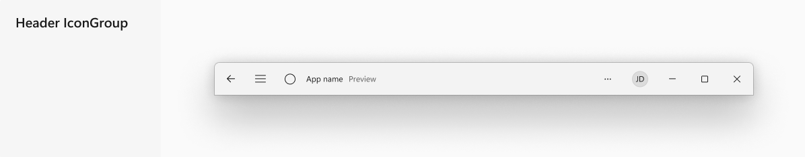
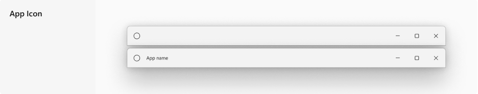
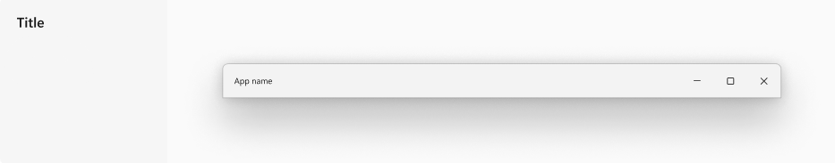
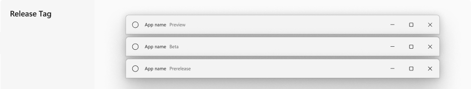
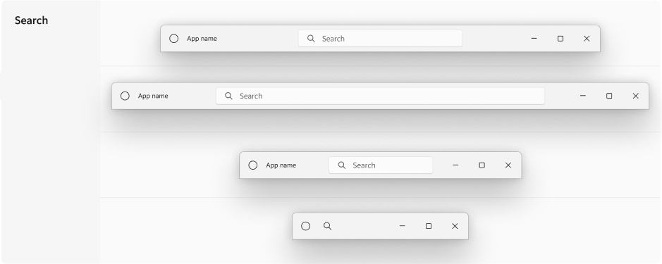

<!-- The purpose of this document is to describe the design and implementation of a new WinUI control.
     This document contains architectural and implementation details that do not appear in the functional spec. -->

<!-- 
Author: Karen
Audiences: Github community contributors to learn about the control, provide feedback 

This PR will be open for feedback for a month, 10/11-11/11
For more info on the public api review process: https://aka.ms/winappsdk/api-specs-review 
-->

# Description

<!-- Use this section to provide a brief description of the control. -->
The WinUI TitleBar is a title bar control that allows easy additions of WinUI components such as AutoSuggestBox, PersonPicture, and Mica theming. 
It is to be used in lieu of the Shell title bar for when developers want more than the basic shell title bar functionalities. 

Current implementations of a custom titlebar involves the developer to fully create a user component from scratch. A notable painpoint in this process is 
to manually calculate drag regions for when there are elements in the title bar (ie. AutoSuggestBox - refer to WinUI-Gallery sample). WinUI titleBar is meant 
to encapsulate the most common design scenarios and streamline this process. 

# Design considerations

## AppWindow TitleBar (IXP) vs. WinUI TitleBar

### AppWindow.TitleBar (IXP)
The AppWindow TitleBar is the default title bar, and downlevels to Win32.

AppWindow drawn title bar covers the basic functionalities:
- AppWindow.SetIcon
- AppWindow.Title
- Show Max/Min/Close caption buttons
- Respects theme

 

### WinUI TitleBar
Developers will 'opt-in' to the WinUI TitleBar for updated styling and extended functionalities.

**Functionalities:**
- HeaderArea (ie. BackButton, PaneToggleButton)  

- Icon  

- Title  

- Subtitle  

- ContentArea (ie. AutoSuggestBox)  

- FooterArea (ie. PersonPicture)

- Transparency for Mica
- Custom Height - 32px as default / 48px if content != null  

## Considerations

- Punch hole through Header / Content / Footer for drag regions. Calculations needs to be updated on SizeChanged.
     - Regions with hole punched through are non-draggable.

- Currently TitleBar treats all custom content as interactable and punches a hole through the drag region. 
How can we allow such customizations? 
     - If we add an `IsInteractive` attached property, that means TitleBar will have to walk through the 
     entire visual tree to calculate the rects every time. 
     - Can we call it `InteractiveContent` instead? But this limits the customizability of the control.
     - Reference Teams forward / backward button. It is draggable when disabled.

- Interactive content in TitleBar must also be capable of keyboard navigation. 
They should be treated as normal elements in the app's visual tree.

- CoreApplicationViewTitleBar.LayoutMetricsChanged and IsVisibleChanged events from the UWP world is 
missing in WinUI3:
     - LayoutMetricsChanged: Update Left and Right Inset for on DPI changes. 
     Right Inset is used to give placeholder space for the caption buttons in WinUI TitleBar.
     - IsVisibleChanged: This is used for when a Window is in full screen mode, 
     and WinUI TitleBar needs to know when to collapse itself.
     - Needs exposed events or dependency property so values can be updated dynamically.

- Minimum drag region for accessibility (ie. Gap between PersonPicture and CaptionButton for Store)  

- TitleBar behaviour with smoke layer with ContentDialog. Should TitleBar still be draggable 
when content dialog is visible? If so, a disable drag bool API is needed.
https://github.com/microsoft/microsoft-ui-xaml/issues/6534 for reference.

- Flyout needs to be aware of TitleBar dimensions so it can calculate whether it should expand up / down.

  

- AutoSuggestBox to collapse as an icon when in minimal mode.
     - Argument for having search as part of titleBar
- MinSize for the apps itself:
     - Store has set a MinSize which negates the need to fully collapse its AutoSuggestBox
     - Design does give window sizing guidance, but should test for worst case scenario
- Which elements collapses on re-size
     - Store collapses Title and Subtitle in minimal mode

  

- Handling of BackButton and PaneToggleButton for NavView
     - Collapsing and moving pane toggle button to titlebar in Minimal Mode

  

- Ability to add non standard elements such as "<", ">" in content, and other buttons in footer

  

- Ability to toggle Header content before or after TitleBar icon? 
- _Currently not implemented_

# Implementation Details

## Hole-punching through Non-Client Area
Once TitleBar control is set as the Window titlebar in developer codebehind, the entire region's input is marked as non-client
and becomes non-interactable. We need to punch out a "hole" for each interactable region in TitleBar.
Eg. Header, body, and footer content areas.

`m_interactableElementsList`
- A list of interactable elements is tracked in the lifetime of the TitleBar.
- The list is updated everytime the specified elements' visibility changes.
     - eg. `BackButton`, `PaleToggleButton`, `Header`, `Content`, `Footer`.

`UpdateDragRegion()`
- Called everytime `SizeChanged` and `LayoutUpdated` events are fired.
- Checks if `m_interactableElementsList` has children, and if so gets the rects of each element.
- Accesses the `InputNonClientPointerSource` at the IXP layer and set rects as pass through regions.

_Note: a custom "LayoutUpdated" event needs to be written._
_The Default LayoutUpdated event fires for every little (non-relevant) events._

# Functional spec link

[Functional Spec](images/titleBar-functional-spec.md)

# Architectural overview

## Key public components

TitleBar class
  
## Key internal components

TitleBar TemplateSettings 
     - Calculate DragRegions

TitleBarAutomationPeer

## Gesture recognizer handling

TitleBar must handle mouse, touch, and keyboard scenarios.

# Appendix

## Non-considerations

TitleBar is not needed for TabView scenarios - it may be considered as a separate `TabbedTitleBar` control. 

Below scenarios demonstrate that when Tabview occupies the entire width when extending into title bar. 
Header icons, buttons, and drag regions can be handled with TabView Header, and FooterArea.

- No backbutton, no other elements, just tabView
- TabView extends into titlebar takes up the whole window
- TabView needs a property to make space for icon or other elements 
- TabView also needs to make space for drag region on right.
     - FileExplorer currently has their own implement by setting a drag region and CaptionControl placeholder in TabView.FooterArea
