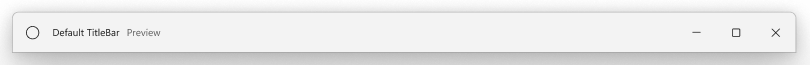

<!-- The purpose of this document is to describe the design and implementation of a new WinUI control.
This document contains architectural and implementation details that do not appear in the functional spec. -->

<!-- 
Author: Karen
Audiences: Github community contributors to learn about the control, provide feedback 

This PR will be open for feedback for a month, 10/11-11/11
For more info on the public api review process: https://aka.ms/winappsdk/api-specs-review 
-->

TitleBar Functional Spec
===
_Control category: Basic Input_

# Background
Motivations for the TitleBar control include:

- Achieve parity with Fluent Windows Visual Design Library.
- Bridge the gap between Shell / Win32 title bar and a fully custom Xaml titlebar.
- Simplify the developer experience for implementing the modern title bar.

# Description

The title bar is a fundamental component of a Windows app’s user interface. Here are its key features and functionalities:

1. Display Information:
    - The title bar prominently displays the name of the app or document currently open. Users can quickly identify which app they are interacting with.
    - Additionally, the title bar may include other relevant information, such as the document title or the current state (e.g., “Editing,” “Viewing,” etc.).
2. Window Controls:
    - Minimize Button: Clicking the minimize button (usually represented by an underscore icon) reduces the app window to the taskbar or system tray.
    - Maximize Button: Clicking the maximize button (usually represented by a square icon) expands the app window to fill the screen.
    - Close Button: Clicking the close button (usually represented by an “X” icon) closes the app window.
3. Drag and Move:
    - Users can click and drag the title bar to move the app window around the screen. This allows them to position the window wherever they prefer.
4. Theming and Integration:
    - The title bar can be customized to match the app’s visual style using Mica theming.
    - It also integrates with other WinUI controls, such as NavigationView, AutoSuggestBox, and PersonPicture, providing a cohesive user experience.


# Is this the right control?

A title bar is a core component of a Windows app, and the shell version of the title bar is shipped with the basic WinUI app template by default. 

Use the WinUI TitleBar when you want further customizations such as subtitles, Mica theming, and integrations with WinUI Controls.

_Note: WinUI TitleBar does not handle Caption Buttons - it simply allocates space where the caption buttons appear, depending on RTL or LTR settings. 
Caption Buttons and its customizations are handled by the AppWindow TitleBar._

# Sample scenarios

## Scenario: Default TitleBar


**XAML**
```xml
<Window
    x:Class="App1.MainWindow"
    xmlns:local="using:App1"
    mc:Ignorable="d">

    <Grid>
        <Grid.RowDefinitions>
            <RowDefinition Height="Auto" /> <!-- Title Bar -->
            <RowDefinition Height="*" /> <!-- App Content -->
        </Grid.RowDefinitions>
        <TitleBar x:Name="DefaultTitleBar" Title="Default TitleBar" Subtitle="Preview">
            <TitleBar.IconSource>
                <SymbolIconSource Symbol="Home"/>
            </TitleBar.IconSource>
        </TitleBar>

        <!-- App content -->
    </Grid>
</Window>
```

**C#**
```cs
public MainWindow()
{
    this.InitializeComponent();

    // C# code to set AppTitleBar UIElement as Titlebar
    Window window = this; 
    window.ExtendsContentIntoTitleBar = true;  // Hides the default system titlebar.
    window.SetTitleBar(this.DefaultTitleBar); // Replace system titlebar with the WinUI Titlebar.
    
    // Note: If not title bar is specified, the default system titlebar will be rendered, regardles of the ExtendsContentIntoTitleBar property.
} 
```

_Note: TitleBar currently needs to be set explicitly in the grid.row and referenced_
_by Window in codebehind as shown above._
_Improvements to Window are being considered to avoid this extra grid layout and codebehind._

## Scenario: TitleBar with WinUI Controls Integration
TitleBar with common WinUI Controls: `AutoSuggestBox`, `PersonPicture`, `AppBarButton`.


**XAML**
```xml
<TitleBar 
    x:Name="ControlsTitleBar" 
    Title="ControlsTitleBar" 
    Subtitle="Preview" 
    Background="Transparent" 
    IsBackButtonVisible="True"
    IsPaneToggleButtonVisible="True">
    <TitleBar.IconSource>
        <SymbolIconSource Symbol="Home"/>
    </TitleBar.IconSource>
    <TitleBar.Content>
        <AutoSuggestBox PlaceholderText="Search" QueryIcon="Find" />
    <TitleBar.Content>
    <TitleBar.Footer>
        <StackPanel Orientation="Horizontal">
            <AppBarButton Icon="More" Label="MoreSymbolIcon" />
            <PersonPicture DisplayName="Jane Doe" />
        </StackPanel>
    </TitleBar.Footer>
</TitleBar>
```

## Scenario: TitleBar with NavigationView L-Pattern Integration

<!-- TODO: Update image to have NavPane Button inline with TitleBar -->
Titlebar and NavigationView in an L-Pattern.


TitleBar and NavigationView is in Minimal DisplayMode.
Note that TitleBar IconSource is collapsed in minimal mode.  


**XAML**
```xml
<Grid>
    <Grid.RowDefinitions>
        <RowDefinition Height="Auto" />
        <RowDefinition Height="*" />
    </Grid.RowDefinitions>
    <TitleBar 
        x:Name="NavViewTitleBar" 
        Title="NavView TitleBar"
        Background="Transparent" 
        IsBackButtonVisible="True"
        IsBackButtonEnabled="{x:Bind NavFrame.CanGoBack}"
        BackRequested="NavViewTitleBar_BackRequested"
        PaneToggleRequested="NavViewTitleBar_PaneToggleRequested">
        <TitleBar.IconSource>
            <SymbolIconSource Symbol="Home"/>
        </TitleBar.IconSource>
    </TitleBar>

    <NavigationView
        x:Name="NavView"
        Grid.Column="1">

        <!-- TitleBar with NavigationView L-Pattern Overwriting resources -->
        <NavigationView.Resources>
            <!-- This is the border between NavView and NavView Content -->
            <Thickness x:Key="NavigationViewContentGridBorderThickness">1,1,0,0</Thickness>
            <!-- This is the rounded corner on the Top left of the L Pattern -->
            <CornerRadius x:Key="NavigationViewContentGridCornerRadius">8,0,0,0</CornerRadius>
        </NavigationView.Resources>

        <Frame x:Name="NavFrame" />

        <NavigationView.MenuItems>
            ...
        </NavigationView.Menuitems>
    </NavigationView>
</Grid>
```

_Note: Should the NavView resources be the default to avoid needing the extra code?_
_This will be a question of what pattern will be shipped in WinUI Templates by default._

**C#**
```cs
public MainWindow()
{
    this.InitializeComponent();

    Window window = this; 
    window.ExtendsContentIntoTitleBar = true;
    window.SetTitleBar(this.DefaultTitleBar);
}

private void NavViewTitleBar_BackRequested(TitleBar sender, object args)
{
    if (NavFrame.CanGoBack)
    {
        NavFrame.GoBack();
    }
}

private void NavViewTitleBar_PaneToggleRequested(TitleBar sender, object args)
{
    NavView.IsPaneOpen = !NavView.IsPaneOpen;
}
```

_Note: How can we avoid this extra code-behind?_

# API Pages

## TitleBar class

Represents a control that provides the title and system buttons for a window or application. It typically appears at the top of the window and 
includes core functionalities such as drag, minimize, maximize, and close buttons.

Namespace: Microsoft.UI.Xaml.Controls

```cs
public class TitleBar : Control
```

## TitleBar.Header property

Gets and sets elements within the TitleBar's Header column.

```cs
public UIElement Header { get; set; }
```

### Property Value
Represents the Header content property of the `TitleBar` control which can be populated in both XAML markup and code. The default is `null`.

### Remarks
The content property of `Header` can only be set once. Elements are left aligned by default.

If `IsBackButtonVisible` or `IsPaneToggleButtonVisisble` is true, custom content set in the `Header` property 
will automatically be appended to the Header column in TitleBar layout.


## TitleBar.Title property

Gets or sets the Title text to be displayed on the TitleBar.

```cs
public String Title { get; set; }
```

### Property Value
Represents the title string to be displayed on the `TitleBar`. The default is `null`.

### Remarks
If TitleBar is in minimal display mode, Title textbox will automatically be collapsed.
If Title string is empty, Title textbox will be collapsed. 

## TitleBar.Subtitle property

Gets or sets the Subtitle text to be displayed on the TitleBar. This is generally used for versioning, such as "Preview", "Beta", etc.

```cs
public String Subtitle { get; set; }
```

### Property Value
Represents the subtitle string to be displayed on the `TitleBar`. The default is `null`.

### Remarks
If TitleBar is in minimal display mode, `Subtitle` textbox will automatically be collapsed.
If `Subtitle` string is empty, `Subtitle` textbox will be collapsed. 


## TitleBar.IconSource property

Gets or sets the TitleBar's icon.

```cs
public IconSource IconSource { get; set; }
```

### Property Value
Represents the icon associated with the `TitleBar`. The default is `null`.


## TitleBar.Content property

Gets and sets elements within the TitleBar's Content column.

```cs
public UIElement Content { get; set; }
```

### Property Value
Represents the Content property of the `TitleBar` control which can be populated in both XAML markup and code. 

This is typically used to populate controls such as `AutoSuggestBox`. The default is `null`.

### Remarks
The content property of `Content` can only be set once. Elements are center aligned by default.


## TitleBar.Footer property

Gets and sets elements within the TitleBar's Footer column.

```cs
public UIElement Footer { get; set; }
```

### Property Value
Represents the Footer property of the `TitleBar` control which can be populated in both XAML markup and code. 

This is typically used to populate controls such as `PersonPicture` and the "More" `AppBarButton`. The default is `null`.

### Remarks
The content property of `Footer` can only be set once. Elements are right aligned by default.


## TitleBar.IsBackButtonVisible property

Gets and sets TitleBar's BackButton visiblity.

```cs
public Boolean IsBackButtonVisible { get; set; }
```

### Property Value
Represents the visiblity of TitleBar's BackButton. The default is `false`.


## TitleBar.IsBackButtonEnabled property

Gets and sets BackButton's IsEnabled property.

```cs
public Boolean IsBackButtonEnabled { get; set; }
```

### Property Value
Represents the IsEnabled property of TitleBar's BackButton. The default is `true`.

### Remarks
This property is typically bound to an accompanying NavFrame's `CanGoBack` property:
`IsBackButtonEnabled="{x:Bind NavFrame.CanGoBack}"`

## TitleBar.IsPaneToggleButtonVisible property

Gets and sets TitleBar's PaneToggleButton visiblity.

```cs
public Boolean IsPaneToggleButtonVisible { get; set; }
```

### Property Value
Represents the visiblity of TitleBar's PaneToggleButton. The default is `false`.

### Remarks
TitleBar's PaneToggleButton is only used with NavigationView and when NavigationView is in `Minimal` DisplayMode. 
In other display mode scenarios, the PaneToggleButton is owned and handled by NavigationView. 


## TitleBar.BackRequested event

Occurs whenever BackButton is clicked.

C#
```cs
public event TypedEventHandler<TitleBar, Object> BackRequested;
```

### Remark
This event is raised when internal BackButton raises a Click event.


## TitleBar.PaneToggleRequested event

Occurs whenever PaneToggleButton is clicked.

C#
```cs
public event TypedEventHandler<TitleBar, Object> PaneToggleRequested;
```

### Remark
This event is raised when internal PaneToggleButton raises a Click event.

## TitleBarTemplateSettings Class
<!-- TODO -->

## TitleBarAutomationPeer Class

Exposes `TitleBar` types to Microsoft UI Automation.

Namespace: Microsoft.UI.Xaml.Automation.Peers

```cs
public class TitleBarAutomationPeer :  Microsoft.UI.Xaml.Automation.Peers.ItemContainerAutomationPeer
```

TitleBarAutomationPeer implements ...

# API Details

```cs (but really MIDL3)
[MUX_EXPERIMENTAL]
[webhosthidden]
unsealed runtimeclass TitleBar : Microsoft.UI.Xaml.Controls.Control
{
    TitleBar();

    [MUX_PROPERTY_CHANGED_CALLBACK(TRUE)]
    UIElement Header{ get; set; };

    [MUX_PROPERTY_CHANGED_CALLBACK(TRUE)]
    String Title{ get; set; };

    [MUX_PROPERTY_CHANGED_CALLBACK(TRUE)]
    String Subtitle{ get; set; };

    [MUX_PROPERTY_CHANGED_CALLBACK(TRUE)]
    Microsoft.UI.Xaml.Controls.IconSource IconSource{ get; set; };

    [MUX_PROPERTY_CHANGED_CALLBACK(TRUE)]
    UIElement Content{ get; set; };

    [MUX_PROPERTY_CHANGED_CALLBACK(TRUE)]
    UIElement Footer{ get; set; };

    [MUX_PROPERTY_CHANGED_CALLBACK(TRUE)]
    Boolean IsBackButtonVisible{ get; set; };

    Boolean IsBackButtonEnabled{ get; set; };

    [MUX_PROPERTY_CHANGED_CALLBACK(TRUE)]
    Boolean IsPaneToggleButtonVisible{ get; set; };

    TitleBarTemplateSettings TemplateSettings{ get; };

    event Windows.Foundation.TypedEventHandler<TitleBar, Object> BackRequested;
    event Windows.Foundation.TypedEventHandler<TitleBar, Object> PaneToggleRequested;

    static Microsoft.UI.Xaml.DependencyProperty HeaderProperty{ get; };
    static Microsoft.UI.Xaml.DependencyProperty TitleProperty{ get; };
    static Microsoft.UI.Xaml.DependencyProperty SubtitleProperty{ get; };
    static Microsoft.UI.Xaml.DependencyProperty IconSourceProperty{ get; };
    static Microsoft.UI.Xaml.DependencyProperty ContentProperty{ get; };
    static Microsoft.UI.Xaml.DependencyProperty FooterProperty{ get; };
    static Microsoft.UI.Xaml.DependencyProperty IsBackButtonVisibleProperty{ get; };
    static Microsoft.UI.Xaml.DependencyProperty IsBackButtonEnabledProperty{ get; };

    static Microsoft.UI.Xaml.DependencyProperty TemplateSettingsProperty{ get; };
}

[MUX_EXPERIMENTAL]
[webhosthidden]
unsealed runtimeclass TitleBarTemplateSettings : Microsoft.UI.Xaml.DependencyObject
{
    TitleBarTemplateSettings();

    Microsoft.UI.Xaml.Controls.IconElement IconElement;

    static Microsoft.UI.Xaml.DependencyProperty IconElementProperty{ get; };
}

[MUX_EXPERIMENTAL]
[webhosthidden]
unsealed runtimeclass TitleBarAutomationPeer : Microsoft.UI.Xaml.Automation.Peers.FrameworkElementAutomationPeer
{
    TitleBarAutomationPeer(MEU_XC_NAMESPACE.TitleBar owner);
}
```

# Figma link

[Figma link](https://www.figma.com/file/sxPR9uvUNg6XQKSKOmlbK8/Fluent-Windows-Visual-Library?type=design&node-id=30201-110568&mode=design&t=ke7CzN5LvKzNA8LR-4)

# Appendix

Reference:
- Tammy's TitleBar [WIP](https://dev.azure.com/microsoft/WinUI/_git/microsoft-ui-xaml-lift/?path=%2Fcontrols%2Fdev%2FTitleBar%2FTitleBar.idl&version=GBmain&_a=contents)
- Niels Laute's TitleBar in CommunityToolkit: [PR](https://github.com/CommunityToolkit/Labs-Windows/pull/459/files), [Spec](https://github.com/CommunityToolkit/Labs-Windows/discussions/454)