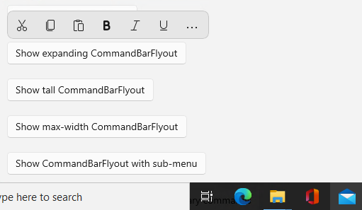
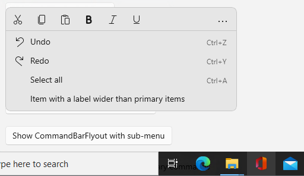
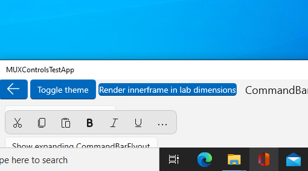
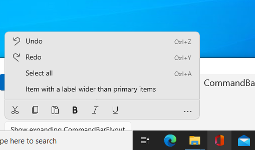

<!-- The purpose of this spec is to describe a new feature and
its APIs that make up a new feature in WinUI. -->

<!-- There are two audiences for the spec. The first are people
that want to evaluate and give feedback on the API, as part of
the submission process.  When it's complete
it will be incorporated into the public documentation at
docs.microsoft.com (http://docs.microsoft.com/uwp/toolkits/winui/).
Hopefully we'll be able to copy it mostly verbatim.
So the second audience is everyone that reads there to learn how
and why to use this API. -->

# Background
<!-- Use this section to provide background context for the new API(s) 
in this spec. -->

<!-- This section and the appendix are the only sections that likely
do not get copied to docs.microsoft.com; they're just an aid to reading this spec. -->

<!-- If you're modifying an existing API, included a link here to the
existing page(s) -->

<!-- For example, this section is a place to explain why you're adding this API rather than
modifying an existing API. -->

<!-- For example, this is a place to provide a brief explanation of some dependent
area, just explanation enough to understand this new API, rather than telling
the reader "go read 100 pages of background information posted at ...". -->

Flyouts in XAML are given two modes of display: they can either appear as part of the rest of XAML,
in which case they're confined to the bounds of the XAML root, or they can appear in their own HWND, which
allows them to escape the bounds of the XAML root.  This is common for elements such as context menus.

CommandBarFlyout is one such element, but since it's defined in WinUI 2 rather than in the OS, it does not
have access to the HWND used to allow it to escape the XAML root's bounds.  As such, it has no way to
determine which monitor it's being displayed in, which makes it unable to know whether it has enough visual space
to open its secondary commands below its primary commands or whether it should open them above instead.

This proposed API adds a method to UIElement that allows any UIElement to return the bounds for the monitor
it's being primarily drawn within, as well as its screen coordinates within that monitor, which it can use
to determine how much space it has available within that monitor.

# Visual Examples
<!-- Use this section to provide a brief description of the feature.
For an example, see the introduction to the PasswordBox control 
(http://docs.microsoft.com/windows/uwp/design/controls-and-patterns/password-box). -->

When CommandBarFlyout has enough space below its primary commands, we want it to open down:





When CommandBarFlyout does *not* have enough space below its primary commands, we want it to be able to open up:





# API Notes
<!-- Option 1: Give a one or two line description of each API (type
and member), or at least the ones that aren't obvious
from their name.  These descriptions are what show up
in IntelliSense. For properties, specify the default value of the property if it
isn't the type's default (for example an int-typed property that doesn't default to zero.) -->

<!-- Option 2: Put these descriptions in the below API Details section,
with a "///" comment above the member or type. -->

## New APIs

```csharp
void UIElement.GetMonitorInformation(out Windows.Foundation.Rect monitorBounds, out Windows.Foundation.Point screenPosition);
```

Returns the bounds for the monitor where the UIElement is primarily drawn to,
plus the UIElement's screen position within that monitor.

# API Details
<!-- The exact API, in MIDL3 format (https://docs.microsoft.com/en-us/uwp/midl-3/) -->

```csharp
namespace Microsoft.UI.Xaml.Controls
{
[webhosthidden]
interface IUIElement11
{
    void GetMonitorInformation(out Windows.Foundation.Rect monitorBounds, out Windows.Foundation.Point screenPosition);
};
}
```

# Examples
The example below shows how the new `GetMonitorInformation` API can be used to determine whether to open a CommandBarFlyout
up or down.

```csharp
    double availableHeight = -1;
    Rect controlBounds = this.TransformToVisual(null).TransformBounds(new Rect(0, 0, ActualWidth(), ActualHeight()));

    if (this.IsConstrainedToRootBounds)
    {
        // non-windowed handling
    }
    else
    {
        this.GetMonitorInformation(out Rect monitorBounds, out Point screenOffset);
        availableHeight = monitorBounds.Height;
        controlBounds.X += screenOffset.X;
        controlBounds.Y += screenOffset.Y;
    }
    
    m_secondaryItemsRoot.Measure({ float.Infinity, float.Infinity });
    Size overflowPopupSize = m_secondaryItemsRoot.DesiredSize;

    bool shouldExpandUp =
        controlBounds.Y + controlBounds.Height + overflowPopupSize.Height > availableHeight &&
        controlBounds.Y - overflowPopupSize.Height >= 0;
```