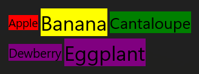

<!-- From: https://github.com/microsoft/WindowsAppSDK/blob/main/specs/spec_template.md -->

<!-- TEMPLATE
    Style guide:
    * Use second person; speak to the developer who will be learning/using this API.
    (For example "you use this to..." rather than "the developer uses this to...")
    * Use hard returns to keep the page width within ~100 columns.
    (Otherwise it's more difficult to leave comments in a GitHub PR.)
    * Talk about an API's behavior, not its implementation.
    (Speak to the developer using this API, not to the team implementing it.)
    * A picture is worth a thousand words.
    * An example is worth a million words.
    * Keep examples realistic but simple; don't add unrelated complications.
    (An example that passes a stream needn't show the process of launching the File-Open dialog.)
-->

WrapPanel
===

# Background

_This spec brings WrapPanel from the Windows Community Toolkit (as WPF Polyfill) to WinUI._

WrapPanel has been a staple of XAML development since its inception, originally included in WPF 
[WrapPanel](https://learn.microsoft.com/dotnet/desktop/wpf/controls/wrappanel). It was originally added 
to the Windows Community Toolkit (WCT) in v1.3 on 2/10/2017 
([see WCT history here](https://github.com/CommunityToolkit/Windows/discussions/722)) and used in a 
multitude of applications since.

`WrapPanel` is a simple and versatile panel that positions child controls vertically or horizontally 
based on the orientation in sequence and when max width / max height is reached a new virtual row (in 
case of horizontal) or column (in case of vertical) is automatically created to fit new controls.

This differs importantly from `StackPanel` where all children must be in a single row/column and aids in 
responsive UI flow.

> [!IMPORTANT]
> About WPF Compatibility: This spec aligns to the WCT implementation for compatibility for existing 
WinUI users. WrapPanel in the WCT was modernized and updated as part of general Panel modernization for 
responsive layouts done for UWP and simplified for developer's ease-of-use. It is the goal to bring this 
to WinUI for this same fundamental experience and allow easy migration from WCT developers and existing 
usage in WinUI apps vs. direct migration for WPF developers.

Reference Docs:
- [WCT WrapPanel Conceptual](https://learn.microsoft.com/dotnet/communitytoolkit/windows/primitives/wrappanel)
- [WCT WrapPanel API](https://learn.microsoft.com/dotnet/api/communitytoolkit.winui.controls.wrappanel)
- [WinUI StackPanel Conceptual](https://learn.microsoft.com/windows/apps/design/layout/layout-panels#stackpanel)
- [WinUI StackPanel API Comparison](https://learn.microsoft.com/windows/windows-app-sdk/api/winrt/microsoft.ui.xaml.controls.stackpanel)
- [WPF WrapPanel Conceptual](https://learn.microsoft.com/dotnet/desktop/wpf/controls/wrappanel)
- [WPF WrapPanel API](https://learn.microsoft.com/dotnet/api/system.windows.controls.wrappanel)
- [WPF StackPanel API Comparison](https://learn.microsoft.com/dotnet/api/system.windows.controls.stackpanel)


# Conceptual pages (How To)

<!-- _(This is conceptual documentation that will go to docs.microsoft.com "how to" page)_ -->

<!-- See: https://learn.microsoft.com/windows/apps/design/layout/layout-panels -->

The WrapPanel is a layout panel that arranges child elements in a sequential position from left to right, 
items overflowing the line will break to the next line automatically at the edge of the containing panel. 

You can set the `Orientation` property to specify the direction of child elements. The default 
orientation is **Horizontal**.

The following XAML shows how to create a WrapPanel of items:

```xml
    <WrapPanel Width="132">
        <Rectangle Fill="Red" Width="44" Height="44"/>
        <Rectangle Fill="Blue" Width="44" Height="44"/>
        <Rectangle Fill="Green" Width="44" Height="44"/>
        <Rectangle Fill="Orange" Width="44" Height="44"/>
    </WrapPanel>
```

The result looks like this:


In a WrapPanel, if a child element's size is not set explicitly, it will be given the minimal/natural 
amount of space for layout, like the "Auto" size of a Grid's Row or ColumnDefinition. In the example 
above, the size of the rectangles are explicitly set, if the **Width** or **Height** were not provided, 
the rectangle would not appear (as it would be given a **0** size in either dimension). This is a key 
contrast to a standard `StackPanel` control in terms of default behavior.

# API Pages

<!-- _(Each of the following L2 sections correspond to a page that will be on docs.microsoft.com)_ -->

## WrapPanel class

The WrapPanel is a layout panel that arranges child elements in a sequential position from left to right, 
items overflowing the line will break to the next line automatically at the edge of the containing panel. 


By default, WrapPanel stacks items from left to right in the order they are declared. You can set the 
`Orientation` property to **Vertical** to stack items from top to bottom instead, overflowing to the 
right.

Spacing can be automatically added between items using the `HorizontalSpacing` and `VerticalSpacing` 
properties. When the `Orientation` is **Horizontal**, `HorizontalSpacing` adds uniform horizontal spacing 
between each individual item, and `VerticalSpacing` adds uniform spacing between each row of items.

When the `Orientation` is **Vertical**, `HorizontalSpacing` adds uniform spacing between each column of 
items, and `VerticalSpacing` adds uniform vertical spacing between individual items.

The following example image shows another example of `WrapPanel` usage where elements may be of varying sizes:



## WrapPanel.HorizontalSpacing property

Gets or sets a uniform Horizontal distance (in pixels) between items when Orientation is set to 
Horizontal, or between columns of items when Orientation is set to Vertical.

In the following example, HorizontalSpacing has been added to space out items, though in this case that 
then wraps the Green box around to the next line due to the Width constraint on the WrapPanel:

```xml
    <controls:WrapPanel Width="132" HorizontalSpacing="16">
        <Rectangle Fill="Red" Width="44" Height="44"/>
        <Rectangle Fill="Blue" Width="44" Height="44"/>
        <Rectangle Fill="Green" Width="44" Height="44"/>
        <Rectangle Fill="Orange" Width="44" Height="44"/>
    </controls:WrapPanel>
```

The result looks like this:


## WrapPanel.Orientation property

Gets or sets the orientation of the WrapPanel. **Horizontal** means that child controls will be added 
horizontally until the width of the panel is reached, then a new row is added to add new child controls.
**Vertical** means that children will be added vertically until the height of the panel is reached, then 
a new column is added. Default is **Horizontal**.

## WrapPanel.Padding property

Gets or sets the distance between the border and its child object.

## WrapPanel.StretchChildren property

Gets or sets how the last child item in the WrapPanel is laid out. When set to **Last**, the final child 
can stretch and be given all the rest of the available space for the row (when Orientation is 
**Horizontal**) or column (when Orientation is **Vertical**). Defaults to **None** where no changes to 
default behavior layout are provided.

In the following example, the last Orange rectangle will be constrained and pushed to the 2nd row. 
Normally if given the same Width/Height as the others, it'd sit just below the Red rectangle to the left. 
Instead, we can remove it's Width and have it fill the rest of the row by setting `StretchChildren` to **Last**:

```xml
    <controls:WrapPanel Width="132" StretchChildren="Last">
        <Rectangle Fill="Red" Width="44" Height="44"/>
        <Rectangle Fill="Blue" Width="44" Height="44"/>
        <Rectangle Fill="Green" Width="44" Height="44"/>
        <Rectangle Fill="Orange" Height="44" />
    </controls:WrapPanel>
```

The result looks like this:


## Other WrapPanel members

| Name | Description |
|-|-|
| VerticalSpacing | Gets or sets a uniform Vertical distance (in pixels) between items when Orientation is set to Vertical, or between rows of items when Orientation is set to Horizontal. (defaults to 0) |

# API Details

```c# (but really MIDL3)
[contract(Microsoft.UI.Xaml.WinUIContract, )]
[webhosthidden]
namespace Microsoft.UI.Xaml.Controls
{
  unsealed runtimeclass WrapPanel
      : Microsoft.UI.Xaml.Controls.Panel
  {
      [method_name("CreateInstance")] WrapPanel();

      Double HorizontalSpacing;
      Orientation Orientation;
      Thickness Padding;
      StretchChildren StretchChildren;
      Double VerticalSpacing;

      static Microsoft.UI.Xaml.DependencyProperty HorizontalSpacingProperty { get; };
      static Microsoft.UI.Xaml.DependencyProperty OrientationProperty { get; };
      static Microsoft.UI.Xaml.DependencyProperty PaddingProperty { get; };
      static Microsoft.UI.Xaml.DependencyProperty StretchChildrenProperty { get; };
      static Microsoft.UI.Xaml.DependencyProperty VerticalSpacingProperty { get; };
  }

  enum StretchChildren
  {
    None = 0,
    Last
  }
}
```

# Appendix

<!-- TEMPLATE
  Anything else that you want to write down about implementation notes and for posterity,
  but that isn't necessary to understand the purpose and usage of the API.

  This or the Background section are a good place to describe alternative designs
  and why they were rejected.
-->

API Review Note: Renamed `StretchChild` to `StretchChildren` to better describe action on items (children) of
panel, as well as leave more room for additional flags/modes in the future (Equal, Proportional, etc...).
