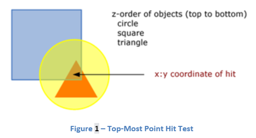
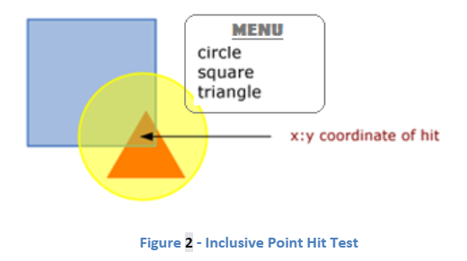
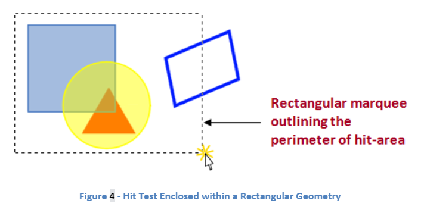
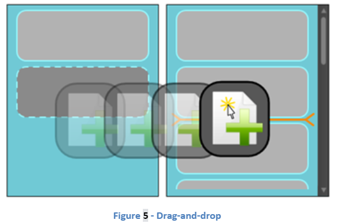
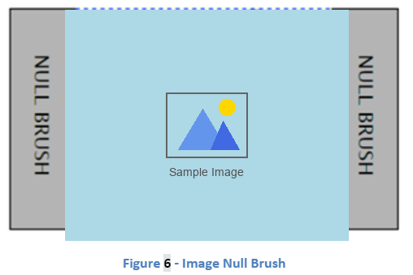
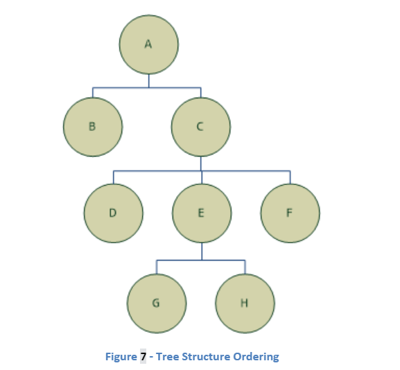

# Hit Testing

> NOTE: This doc is very old and needs updating

## Table of Contents

- [Introduction](#introduction)
- [Scenarios](#scenarios)
  - [Top-Most Point Selection Hit Test](#top-most-point-selection-hit-test)
  - [Inclusive Point Selection Hit Test](#inclusive-point-selection-hit-test)
  - [Skip Children on a Hit Test](#skip-children-on-a-hit-test)
  - [Hit Test Enclosed within a Rectangular Geometry](#hit-test-enclosed-within-a-rectangular-geometry)
  - [Drag-and-Drop](#drag-and-drop)
- [Closed issues](#closed-issues)
  - [Null brush](#null-brush)
  - [Unfilled/Partially Filled Image Object](#unfilledpartially-filled-image-object)
  - [Text and Glyph](#text-and-glyph)
  - [Callbacks](#callbacks)
  - [Return Type](#return-type)
  - [Option Flags](#option-flags)
  - [Performance](#performance)
  - [Tree Traversal](#tree-traversal)
  - [Managed API Only](#managed-api-only)
- [API](#api)
- [Final API](#final-api)
  - [Point Hit Test](#point-hit-test)
  - [Rect Hit Test](#rect-hit-test)
- [Order of results](#order-of-results)
- [Competing Technologies](#competing-technologies)
  - [Adobe Flex and Flash Player](#adobe-flex-and-flash-player)

## Introduction

* Every `UIElement` and all classes derived from `UIElement` have an associated hit-testable region.
  * This equips the UIElements with the capability to detect whether they reside underneath a specified region within the Silverlight plug-in.
* The hit test API offers great flexibility in various points of interest.
  * For example, it will allow hit tests against one-dimensional (1D) single-point selections as well as two-dimensional (2D) rectangular perimeters.
* The hit-testing functionality provides the end-user with the tool to be able to create richer drag-and-drop applications. It also enables the user the ability to select a single desired object by clicking on it. This feature can be extended into selecting an array of objects by highlighting the range that they partially or fully contained within, using a rectangular marquee.

## Scenarios

### Top-Most Point Selection Hit Test


* The top-most point selection hit test is useful for selecting single objects that reside immediately underneath the mouse pointer. Please refer to Figure 1 that illustrates this scenario.
* In this particular scenario, the top-most object that resides under the mouse pointer is given focus. As a visual cue for this action, the activated object is highlighted. The following C# code snippet can be used in conjunction with the UIElements that can yield the expected results. The `myCanvas` object in the code sample below is the canvas (`UIElement`) that contains the hit element.

``` cpp
// Respond to the left mouse button down event by initiating the hit test
public void OnMouseLeftButtonDown(Object sender, MouseWheelEventArgs event)
{
    // Retrieve the coordinate of the mouse position
    Point pt = e.GetPosition((UIElement)sender);

    // Perform the hit test against a given point
    IEnumerable enumerable = myCanvas.HitTest(pt);
    IEnumerator hitElements = enumerable.GetEnumerator();

    // Perform actions on the hit test results list
    if(hitElements.MoveNext())
    {
        hitElements.Current.Focus();
        // Perform action on hitElement for visual cue, in this case, highlight element
    }
}
```

### Inclusive Point Selection Hit Test


* The point selection hit test is useful for selecting all objects that reside underneath the mouse pointer regardless of the objects’ z-index positioning. Please refer to Figure 2 for an illustration of this scenario.
* In this particular scenario, every single object that resides under the mouse pointer is returned in a collection and placed in a menu. As a visual cue for this action, the smallest bounding box to enclose the activated objects is highlighted. The end-user then has the ability to select a specific element from that list which is of concern. The following C# code snippet can be used in conjunction with the UIElements that can yield the results as shown in the figure above. The `myCanvas` object in the code sample below is the canvas (UIElement) that contains all elements shown above.

``` cpp
// Respond to the left mouse button down event by initiating the hit test
public void OnMouseLeftButtonDown(Object sender, MouseWheelEventArgs event)
{
    // Retrieve the coordinate of the mouse position
    Point pt = e.GetPosition((UIElement)sender);

    // Create the point hit test parameter
    HitTestParameters pointParam = new PointHitTestParameters(pt);

    // Perform actions on the hit test results list
    foreach(UIElement elem in myCanvas.HitTest(pointParam))
    {
        /*
         * put all elem elements inside the custom menu
         */
    }
}
```

### Skip Children on a Hit Test

* For this scenario let’s consider a button created in XAML markup that is composed of several elementary components. The button can be made of several ellipses, images, and text-blocks. In a hit test operation, the end-user might want to select the button as a whole rather than having to deal with all the individual elementary components. The end-user can handle this scenario by using the point selection hit test.
* Using the single point hit test method can potentially return a collection that includes every single object that resides under the mouse pointer. However, we want to focus on the composite button element as a whole. As a visual cue for clicking the element, the activated button would be highlighted. The following C# code snippet can be used in conjunction with the UIElements that can yield the expected results. The `myCanvas` object in the code sample below is the canvas (UIElement) that contains the composite button object. We look for the button by searching for the object name, which in this case is `infoButton`.

``` cpp
// Respond to the left mouse button down event by initiating the hit test
public void OnMouseLeftButtonDown(Object sender, MouseWheelEventArgs event)
{
    // Retrieve the coordinate of the mouse position
    Point pt = e.GetPosition((UIElement)sender);

    // Create the point hit test parameter
    HitTestParameters pointParam = new PointHitTestParameters(pt);

    // Perform the hit test against a given portion of the visual object tree
    IEnumerable enumerable = myCanvas.HitTest(pointParam);
    IEnumerator hitElements = enumerable.GetEnumerator();

    // Gather only needed elements
    Collection<UIElement> collection = gatherAllElementsHitTest(myCanvas, hitElements);
}

// Recursively collect and concat all hit children elements to the base list
private Collection<UIElement> gatherAllElementsHitTest(UIElement element, IEnumerator hitElements)
{
    Collection<UIElement> collection = new Collection<UIElement>();
    Collection<UIElement> children = new Collection<UIElement>();

    // Reset placement in order to go through all elements in hit test
    hitElements.reset();

    // Check for null or empty collection
    while(hitElements.MoveNext())
    {
        // Check for the next level children in the hitElements
        for(int i = 0; i < element.Children.Count; i++)
        {
            if(hitElements.Current == element.Children[i] && ShouldBeHitTestable(element.Children[i]))
            {
                // Keep track of all children involved in the hit test
                children.add(hitElements.Current);
            }
        }
    }

    for(int i = 0; i < children.Count; i++)
    {
        // Add child to finalized hit test results
        hitElements.add(children[i]);

        // Check for any subtrees to exclude from the hit test
        if(ShouldChildrenHitTest(children[i]))
        {
            // Note that the += operator is not the way to concat two collections, this is only pseudo code
            hitElements += gatherAllElementsHitTest(children[i], hitElements);
        }
    }

    return hitElements;
}

// The function determines if a UIElement should be hit-testable
private bool ShouldChildrenHitTest(UIElement element)
{
    if(element.Name.Equals(“infoButton”))
    {
        return false;
    }
    return true;
}

// The function determines if a UIElement should be hit-testable
private bool ShouldBeHitTestable(UIElement element)
{
    return true;
}

````

* In this scenario all elements that have their `IsHitTestVisible` property set to false are excluded. Also, all children of elements with name `infoButton` are excluded as well.

### Hit Test Enclosed within a Rectangular Geometry


  * In this situation, instead of the single point selection, the end-user can select a rectangular region for the execution of the hit test. All objects that are either partially or fully covered by the rectangular marquee are all activated together as a group. Any action performed on the activated set of objects manipulates the entire set as a whole. This scenario is illustrated in Figure 2 below.
* The end-user is responsible for creating and manipulating the rectangular marquee accordingly. An example of a rectangle with a dashed stroke, such as the one above, can be created using the following XAML markup:

``` cpp
<Rectangle x:Name="RectangleMarquee" Stroke="#FF000000" StrokeDashArray="4" StrokeEndLineCapStrokeThickness="1" IsHitTestVisible="False"/>
```

* The `Width`, `Height`, `Canvas.Left`, and `Canvas.Top` attributes are not specified in the XAML markup above, because they have to be specified according to the initial and final mouse position at the time of the hit test operation. The rectangle marquee object must only be visible at the time of the hit test, and must not be included in the hit test result; hence, setting its `IsHitTestVisible` property to false.

``` cpp
// Initiate local variables
Point startPoint, endPoint;

// Initiate the hit test process
public void OnMouseLeftButtonDown(Object sender, MouseEventArgs e)
{
    // Set the starting coordinate of hit test
    startPoint = e.GetPosition((UIElement)myRootElement);

    // Initiate the rectangular marquee object
    rectMarquee.setValue(Rectangle.LeftProperty, startPoint.X);
    rectMarquee.setValue(Rectangle.TopProperty, startPoint.Y);
    rectMarquee.Width = 0;
    rectMarquee.Height = 0;
    rectMarquee.Opacity = 1;

    // Register mouse move event
    this.MouseMove += new MouseEventHandler(OnMouseMove);
}

// Track the mouse position and resize the hit test region accordingly
public void OnMouseMove(Object sender, MouseEventArgs e)
{
    // Set the ending coordinate of hit test
    endPoint = e.GetPosition((UIElement)myRootElement);

    // Resize the rectangular marquee according to the new moust position
    rectMarquee.Width = endPoint.X - startPoint.X;
    rectMarquee.Height = endPoint.Y - startPoint.Y;
}

// Respond to the mouse button event and finalize the hit test process
public void OnMouseLeftButtonUp(Object sender, EventArgs e)
{
    // Remove the mouse move event handler
    this.MouseMove -= new MouseEventHandler(OnMouseMove);

    // Create the rectangular geometry hit test parameter
    Rect hitRectangle = new Rect(startPoint, endPoint);

    // Perform actions on the hit test results list
    foreach(UIElement elem in myCanvas.HitTest(hitRectangle))
    {
        elem.Focus();
        /*
         * Perform action on elem for visual cue, in this case, highlight element
         */
    }
}
```

* In the example provided, all objects that are either partially or fully contained in the hit test area are included in the collection.

### Drag-and-Drop


* The drag-and-drop action is useful for enhancing the richness of the user-interaction in Silverlight web applications. Drag-and-drop is a complicated operation to develop and is highly error-prone.  As a result it has recently become a benchmark for rich web applications. This scenario is illustrated with the following example.
* The semi-transparent breadcrumbs effect on the draggable object is for demonstration purposes only. One of the features in Silverlight is the ability to capture the mouse on a specified `UIElement` in order to enhance the mouse input experience. One of the problems this feature adds to the drag-and-drop operation is that no other `UIElement` can receive mouse events thereof.  As a result, the `UIElement` that should be receiving the drag object would have no knowledge of the hovering element. The hit test feature helps solve this problem. The single selection point hit test (discussed in section 3.2 of this document) can offer the ability to detect if a particular `UIElement` falls under the mouse pointer at the time that the drag object is dropped. The end-user has the ability to choose the drop location as a single point (mouse pointer) or as a geometry region (rectangular drag image) as illustrated in figure 4. The end-user might want to know about all the elements that fall under the mouse pointer, not just the top-most element. As a result, the flexibility this API offers can be useful in scenarios such as the one illustrated above. The hit test feature also allows the end-user to add placement markers as shown in figure 4.

## Closed issues

### Null brush

* At first there was a request by Kurt Jacob to include elements in the hit test that were hit on a null brush corresponding to those elements. In WPF elements are discarded from the hit test results if they are hit on a region that has a null brush. For example, if the visual has a non-null stroke brush then the element would only be included in the results if the hit test region is partially or fully included the surrounding stroke brush.
* We’ve concluded that it is best to stay compatible with WPF on this decision and exclude elements from the hit test result that are hit on a null brush of those elements.

### Unfilled/Partially Filled Image Object


* The image object has a stretch property that can transform the image to make it fit to the bounds of the image object. One of the stretch properties is the uniform stretch. As shown in figure 5, the actual picture of the couple is stretched to fit the smaller of the width and height of the bounds of the image object. The image is uniformly stretched only enough to fill the height but not to distort the image. As a result the image object is left with regions with a null-brush background. WPF handles the hit test scenario on the null region in a different manner that Silverlight should.
* We would not like hit testing on the null-brush regions to incorporate the image element in the result set. This behavior is consistent with that of WPF’s API.

### Text and Glyph

* Text and glyph are hit testable within their bounding box. This bounding box is the smallest rectangle (with right angles relative to the element’s coordinate space) that all rendering of the text/glyphs fits inside of. By definition the element does not draw outside this box. Unlike other types of elements, a null-brush(ex. On text Foreground) does not change the hit test region for texts and glyphs. This behavior is consistent with that of WPF’s API.

### Callbacks

* We’re not supporting synchronous callbacks for the hit test API because of the additional complexity and the some issues regarding security, such as reentrancy issues.

### Return Type

* The return type of the hit test methods will now be `IEnumerable<UIElement>`, this is further discussed in section 5.1.5.

### Option Flags
* There have been several suggestions to add option flags in the hit test API in order to improve performance of this operation. These flags could potentially improve performance on hit test selection within a rectangular geometry. For example, one of the options could be `SkipControlSubtrees`, to stop the hit test from going inside and retrieving elements from within a custom control. The enhanced API could potentially look like the following:

``` cpp
IEnumerable<UIElement> UIElement.HitTest(Rect rect, HitTestOptions options);
```

* The option of having such flags in the hit test API is an issue for future enhancements. It is best to implement and test the current proposed API first in order to see to what degree such flags could improve performance. So these flags will not be included in the current hit test API until we have performance data on how the hit test functions in practice.

### Performance

* The two hit test API’s are point hit test, rectangle hit test. The point hit test is used quite often so it needs to be as fast as possible. Typically, there aren’t as many elements returned in the point hit test as there would be with the rectangular hit region. The Blend team has mentioned that the point hit test is expected to perform at <30ms overall, which means <10ms at runtime.
* The two hit test API’s are point hit test, rectangle hit test. The point hit test is used quite often so it needs to be as fast as possible.  Typically, there aren’t as many elements returned in the point hit test as there would be with the rectangular hit region. The Blend team has mentioned that the point hit test is expected to perform at \<30ms overall, which means \<10ms at runtime.
* The rectangular region hit test is performed at specific times, such as mouse up. In the worst case scenario, a very large number of elements may be hit by the rectangle hit test. For Blend the performance for this operation is expected to be \<200ms overall.

### Tree Traversal
* The hit test API will traverse the visual tree and not the logical tree. Mouse events are propagated through the visual tree as well.

### Managed API Only
* The hit test will only be programmatically available on managed code. It will not be supported in JavaScript.

## API

* Namespace: System.Windows
* The hit test function is placed in the `UIElement` object as a public method. It may be called on any `UIElement` that has been instantiated. In the WPF API, the hit test function is a static method that is placed in the `VisualHelperTree` object. However, it is best that the hit test function be a local public method in the `UIElement` class. The `UIElement` class has an `IsHitTestVisible` Boolean property that denotes whether or not the element should be included in the hit test results. The WPF hit test API however does not automatically exclude any element from the result set even if their `IsHitTestVisible` property is set to false. For added flexibility, this check is left up to the end-user to incorporate into the logic of the web application. On the other hand, the proposed API for the Silverlight hit test respects the `IsHitTestVisible` property.

## Final API

* The API in XAML is `VisualTreeHelper.FindElementsInHostCoordinates` Method (Windows.UI.Xaml.Media)
  * It has a point overload and a rect overload for the two scenarios mentioned above
  * It returns a list of all elements under the point/rect, so if you want the topmost one you would just look at the first one
  * It also lets you restrict the hit test to a particular subtree

### Point Hit Test

* `IEnumerable<UIElement> UIElement.HitTest(Point point)`
* This hit test function returns all elements that fall under the given point. The elements that were hit can be accessed by the `IEnumerable` that can be traversed to access all elements returned by the function. The elements in this set are z-index ordered. The top-most element is determined by its visual placement in the hierarchy. If the z-index of all sibling elements is set to the same value, then the element returned is the right-most lowest object in the `UIElement` tree, this is illustrated in section 5.4. Only objects in the `UIElement` root are included in the hit test, the elements that are not in the `UIElement` tree will not appear in the result set. If no element was hit within the `UIElement` root then a null value is returned. Elements with their `IsHitTestVisible` property set to false are excluded from the hit test thus excluded from the resulting set. The coordinates of the point passed as the parameter are global, which means that they are relative to the root element which is performing the hit test function.

### Rect Hit Test

* `IEnumerable<UIElement> UIElement.HitTest(Rect rect)`
This hit test function returns all elements that are fully or partially contained within the given rectangular region. The elements that were hit can be accessed by the `IEnumerable` that can be traversed to access all elements returned by the function. The elements in this result set are z-index ordered. The top-most element is determined by its visual placement in the hierarchy. If the z-index of all sibling elements is set to the same value, then the element returned is the right-most lowest object in the `UIElement` tree, this is illustrated in section 5.4. Only objects in the `UIElement` root are included in the hit test, the elements that are not in the `UIElement` tree are ignored. If no element was hit within the `UIElement` root then a null value is returned. Elements with their `IsHitTestVisible` property set to false are excluded from the hit test thus excluded from the resulting set. The coordinates of the rectangle passed as the parameter are global, which means that they are relative to the root element which is performing the hit test function.

## Order of results


* The z-index property of elements only makes a difference on the visual appearance of elements only if they are siblings. The element with the highest z-index would visually sit on top of all other siblings.  The z-index value of each parent will have an effect on the visual depth of its children as well. For example, the sibling with the highest z-index is the top-most visual element amongst all the siblings. If that element has children, then the children of that element also sit on top of all other siblings of that parent. So the children of any parent always sit on top of the parent element. If the z-index of all items is set to equal values or they are all set to default, then the only way to determine their visual depth is by the tree structures.


* Let’s consider the tree structure above with all the elements at each depth level having identical z-index values. Let’s also assume that all the elements in the tree above were hit with the exception of element B. The hit test would return a collection in the following order:
* The figure above shows the order of the returned collection. A non-empty tree is traversed using the following rules:
  * Traverse the right-most node
  * Traverse each siblings one-by-one until the left-most is reached
  * Visit the root